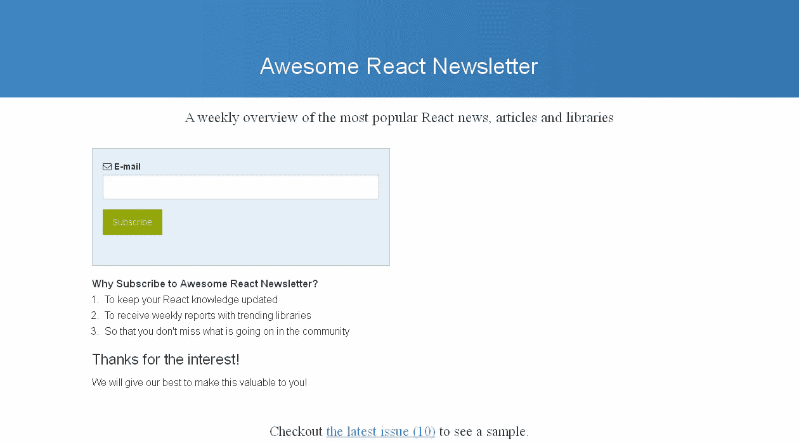
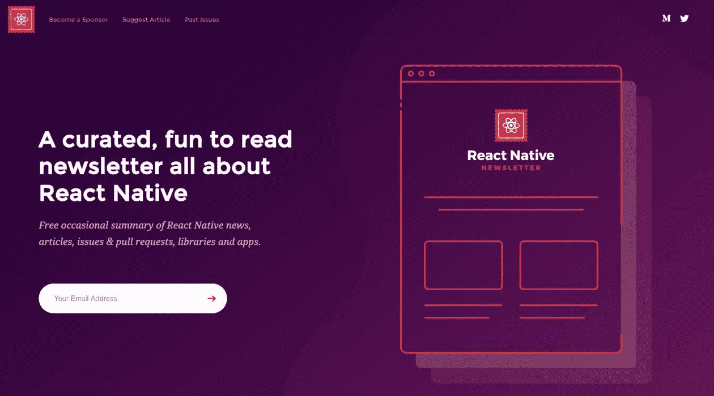
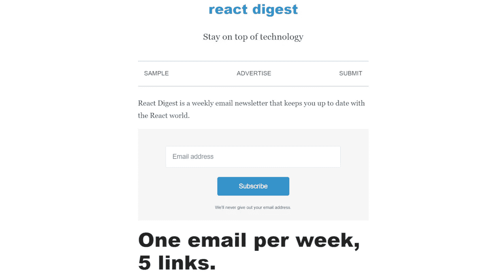
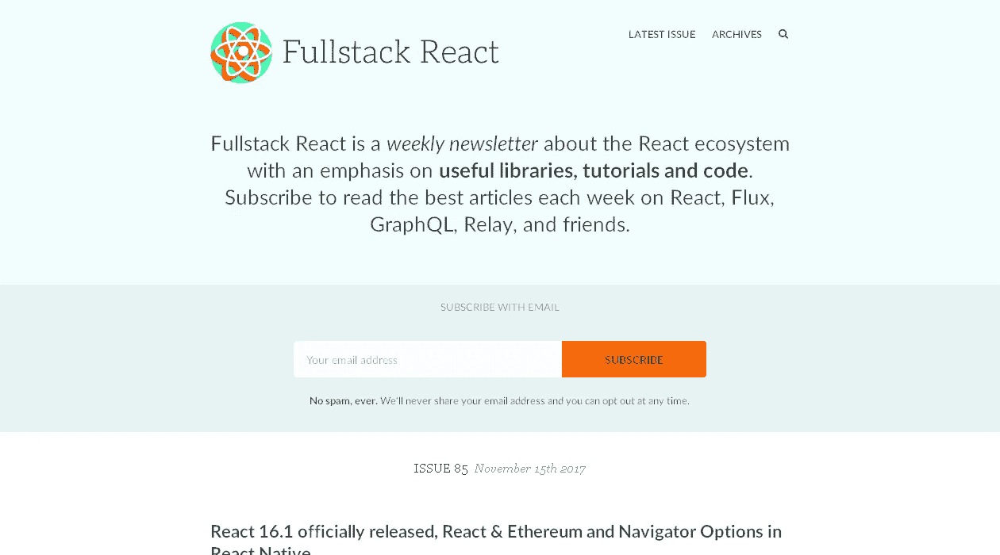
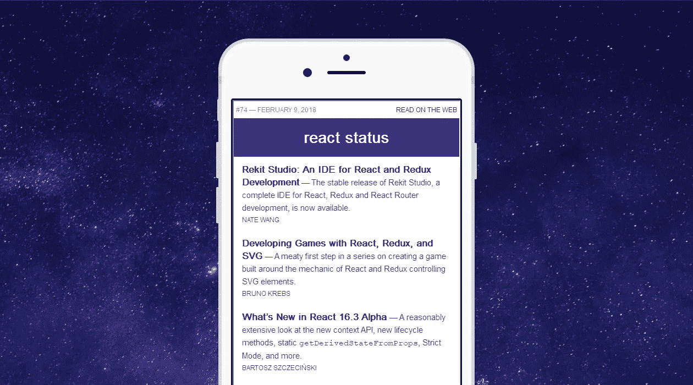

# 5 份必读的 React 简讯

> 原文：<https://medium.com/hackernoon/5-must-read-react-newsletters-8092926fb298>

React 是当今 javascript 中最流行的框架之一。每周都会发布新的更新、库和工具来改进您的工作流程和技能。这 5 份简讯是了解这一切的好方法。

# [牛逼 React 简讯](http://inboxreads.co/n/Awesome-React-Newsletter)

如果你正在寻找 React 世界中所有事情的全面报道，这是给你的时事通讯。每周它都以最受欢迎的 React 新闻、文章和最近发布的库为特色。

# [React Native 简讯](http://inboxreads.co/n/React-Native-Newsletter)

React Native 允许您使用 React 构建跨平台的移动应用程序。这份时事通讯涵盖了 React native 本身的更新以及针对它的流行库和应用程序。

# [反应消化](http://inboxreads.co/n/React-Digest)

React Digest 每周只关注 5 个有趣的链接。它涵盖了所有与 React 相关的内容，包括 Flux、Redux、MobX 和 React Native。

# [全栈反应](http://inboxreads.co/n/Fullstack-React)

Fullstack React 的每一期都专注于有见地的教程、库和 React 代码。它们涵盖了 React 本身、Flux、GraphQL、Relay 等等。

# [反应状态](http://inboxreads.co/n/React-Status)

React Status 每周收集 React 和 React 本地新闻、教程和库以及新的 React 作业。

## 想要更多吗？

你可以在[InboxReads.co](https://inboxreads.co)找到更多精彩的 [React](http://inboxreads.co/best-react-newsletters) 和 [Javascript](http://inboxreads.co/best-javascript-newsletters) 时事通讯，以及你可能感兴趣的其他主题的时事通讯。