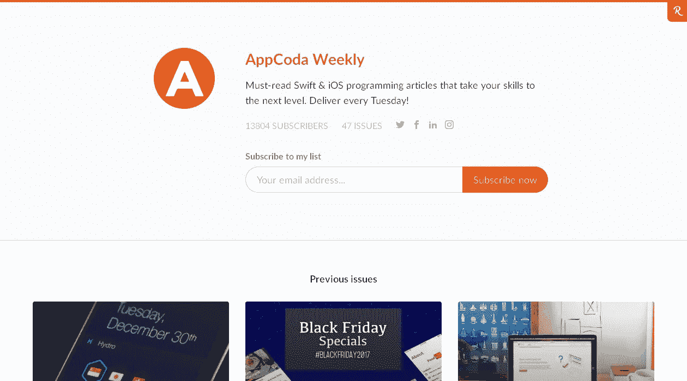
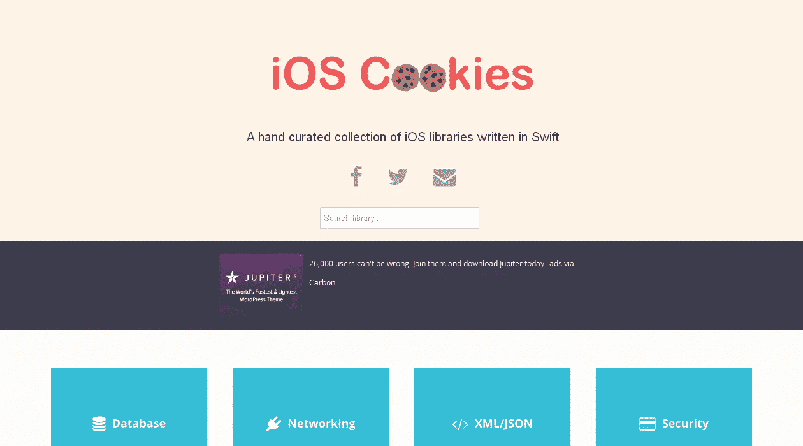
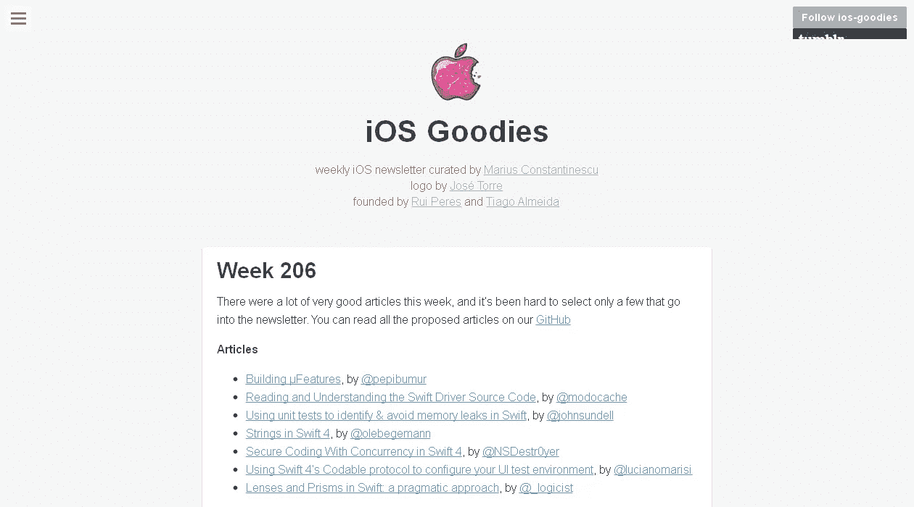
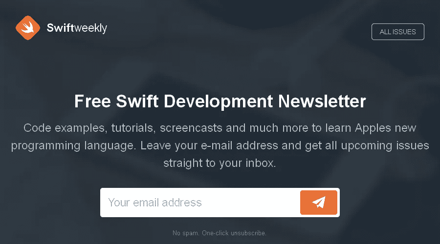
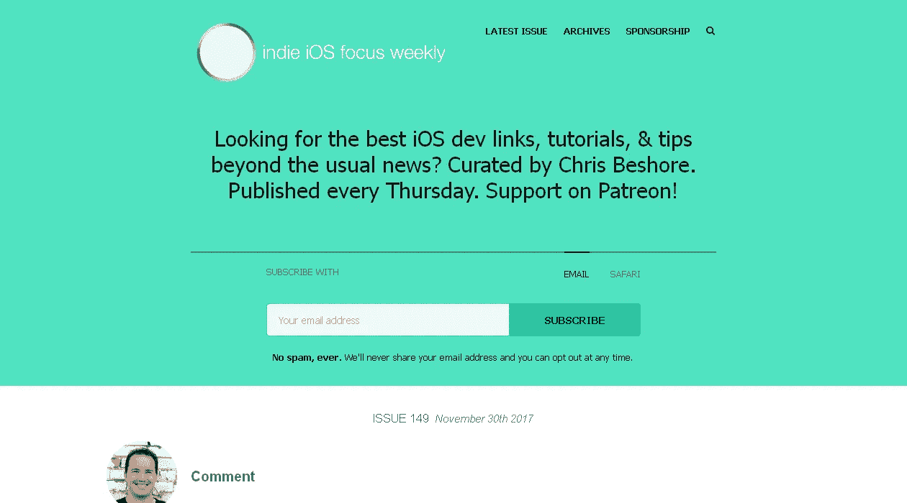

# 每个 iOS 开发人员都应该阅读的 5 份简讯

> 原文：<https://medium.com/hackernoon/5-newsletters-every-ios-dev-should-subscribe-to-f12322186636>

时事通讯是一种很好的方式，可以让你按照自己的节奏了解任何话题的最新消息。无论你的兴趣是什么，都有大量的时事通讯，iOS 开发也不例外。这 5 份时事通讯是每个 iOS 开发者的必读之作。

# [AppCoda 周刊](http://inboxreads.co/n/AppCoda-Weekly)

每周你都会收到 Swift 和 iOS 相关的教程、图书馆和关于 UI/UX 趋势和实践的文章。作为一名 iOS 开发者，这是一个保持学习的好方法。

# [iOS cookie](http://inboxreads.co/n/iOS-Cookies)

iOS Cookies 每周向您发送精选的新 Swift 库，涵盖各种类别。你一定会找到一个新的工具来增加你的武器库。

# [iOS Goodies](http://inboxreads.co/n/iOS-Goodies)

iOS Goodies 管理关于开发、工具、商业和 UI/UX 的 iOS 新闻和文章。

# [Swift 周刊](http://inboxreads.co/n/Swift-Weekly)

Swift 是一种不断变化的语言，每年都有新的东西需要了解。这份每周时事通讯会让你了解最新的变化。

# [独立 iOS 焦点周刊](http://inboxreads.co/n/Indie-iOS-Focus-Weekly)

克里斯·贝肖尔出版了一份精心策划的每周时事通讯，涵盖了你能找到的所有与 iOS 相关的内容。链接、教程、播客、工具等等。

## **想要更多？**

你可以在[InboxReads.co](http://inboxreads.co/tags/ios)找到更多优秀的 iOS 开发简讯，以及你可能感兴趣的其他主题的简讯。