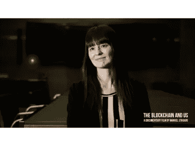

# 区块链和密码行业的 5 位杰出女性！

> 原文：<https://medium.com/hackernoon/5-notable-women-in-the-blockchain-and-crypto-industry-6dd5981c0e7d>

假设区块链科技和密码行业是男性主导的领域，这是情有可原的。总的来说，亚洲和高加索男性似乎一直在技术领域占据着明显的主导地位。女人几乎没有机会。这一假设涵盖了行业内的所有组织级别，从董事会一直到挤在多个显示器和处理器后面的技术开发人员。看看区块链地区的一些大型会议、研讨会和各种各样的思想聚会，就会发现女性少得惊人。

然而，说没有妇女在区块链世界做出显著贡献是错误的。许多知名女性积极参与主导区块链和加密货币行业的主要项目。这些女性并不局限于行业的任何特定子领域，因为她们分散在许多职能部门。一些最大的 ico、数字货币支付平台，甚至区块链的科技开发公司都是由女性创立的。除了作为行业演进和发展的一部分，他们中的许多人在促进加密货币在主流商业中的采用方面发挥着积极的作用。以下是区块链和密码行业中一些著名女性的简要介绍。

# 1.[伊莉莎白·史塔克](https://medium.com/u/5fa14985671?source=post_page-----6dd5981c0e7d--------------------------------)(闪电实验室)

# 教育和早期职业生涯

*伊莉莎白·史塔克毕业于著名的哈佛法学院。她也是哈佛自由文化组织的创始人和哈佛伯克曼互联网与社会中心的成员。她职业生涯的相当一部分时间是在斯坦福大学和耶鲁大学担任教授。在耶鲁大学期间，她建立了一个项目，帮助学生提出项目，改善现有的互联网技术。*

# 区块链和加密领域的漏洞

伊丽莎白与奥劳卢瓦·奥苏托昆(Olaoluwa Osuntokun)一起，是闪电的联合创始人；一家正在开发协议以显著提高加密交易速度的初创公司。她担任公司的首席执行官。该公司的重点主要是比特币网络，但也欢迎贡献者为其他区块链开发协议层。

除了与 Lightning 的合作，Elizabeth 在区块链领域也相当活跃。她为比特币社区做出了巨大贡献，同时也是 Coin Center 的研究员。

# 2.[熔融分离器](https://medium.com/u/6cf31b9735f9?source=post_page-----6dd5981c0e7d--------------------------------) (DCG)

# 教育和早期职业生涯

Meltem Demirors 是威廉·马什·赖斯大学的毕业生，她毕业于该校，获得了数理经济学学位。在获得第一个学位后，她又进一步获得了麻省理工学院的工商管理硕士学位。

# 区块链和加密领域的漏洞

现在，Meltem Demirors 是数字货币集团(DCG)的高级主管。该公司专门从事创建和部署区块链技术协议。该公司还管理加密货币投资组合。她在总部位于纽约的 DCG 的许多同事用热情洋溢的语言描述了 Meltem。在公司网站的团队页面上，她被描述为 DCG 核心运营区域之间的桥梁。

除了担任 DCG 开发总监之外，Meltem 还积极反对集中式加密货币挖掘池的趋势，特别是在比特币网络中。作为一个在加密领域公平分配财富的信徒，她利用她在 DCG 的职位制定投资策略，帮助传播加密行业的财富。

# 3.[加利亚·贝纳齐](https://medium.com/u/afbdab99ef6f?source=post_page-----6dd5981c0e7d--------------------------------)

# 教育和早期职业生涯

*加利亚·贝纳齐 2005 年毕业于约翰·霍普金斯大学。大学毕业后，她积极投身于软件初创企业，包括 Mytopia、Founders Fund 和 Particle Code Inc .等。在 Particle Code 于 2011 年被 Appcelerator 收购之前，她是 Particle Code 的联合创始人兼首席执行官。*

# 区块链和加密领域的漏洞

Galia 是一个技术天才，也是商业和经济领域的完美专家。她是 Bancor 的联合创始人，也是这家加密公司的业务发展主管。班科尔 ICO 是有史以来票房最高的 ICO 之一。该运动筹集了 1.53 亿美元的资金，并已进入高级开发阶段。

Bancor 专注于加密货币交易市场，并正在构建一个平台，以显著简化加密货币交易的流程。该平台还允许用户创建自己的代币，然后可以将其货币化，并与其他已有的代币进行交易，如 BTC、ETH 和 LTC 等。

# 4.瑞恩·刘易斯(比特币中的伦敦女人)

# 教育和早期职业生涯

瑞恩·刘易斯在伦敦大学学院学习。她以经济学二级荣誉(优等)毕业。她是工程和技术领域的完美专家，职业生涯跨越许多不同的组织。她曾在 DigitasLBi、AKQA 和 Beamly 等公司工作过。她目前是 Salvia Media Services 的董事，是 SDET 和区块链的技术顾问。

# 区块链和加密领域的漏洞

Rhian 一直积极参与改善女性参与区块链和加密货币的情况。她和一群朋友一起创立了比特币女性组织的伦敦分会。该组织已经发展到包括 100 名成员，其中许多人是科技公司的首席执行官和首席运营官。Rhian 继续倡导女性参与区块链领域，定期参加各种会议、研讨会和讨论会并发言。

# 5.[伊丽莎白·麦考利](https://medium.com/u/1d67fd68f3b2?source=post_page-----6dd5981c0e7d--------------------------------)(比特币基金会)

# 教育和早期职业生涯

*Elizabeth Ploshay McCauley 于 2011 年毕业于惠顿学院。她拥有政治学学位。她早期的职业生涯是在华盛顿度过的，在那里她担任美国国会议员的实习生和助理。*

# 区块链和加密领域的漏洞

在她为国会议员服务期间，她为比特币在美国的采用做出了贡献。她的热情如此之高，以至于她被称为“比特币传道者”。她利用自己在草根激进主义方面的丰富专业知识，支持比特币在美国的采用。

她目前是比特币基金会的董事会成员。她是比特币基金会和硬币大会的顾问。她之前在 BitPay Inc .担任过一段时间的客户经理。

这绝不是对区块链世界中所有主要女性人物的详尽描述。还有像 Kathleen Breitman(te zos 的联合创始人)、Maxine Ryan(Bitspark 的联合创始人和首席运营官)、Tavonia Evans(＄Guap 的首席执行官)和 Elizabeth Rossiello(BitPesa 的联合创始人和首席执行官)这样的人。这些女性在区块链空间的许多领域树立了高标准，为行业的增长和发展做出了巨大贡献。

*渴望了解更多关于 FundYourselfNow 的信息吗？在我们的* [*电报*](https://t.me/fundyourselfnow) *群上加入我们的众筹革命对话，或者在* [*推特上关注我们。*](https://twitter.com/fundyourselfnow)