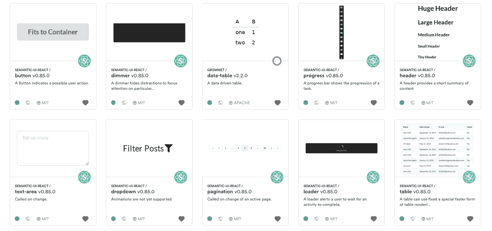
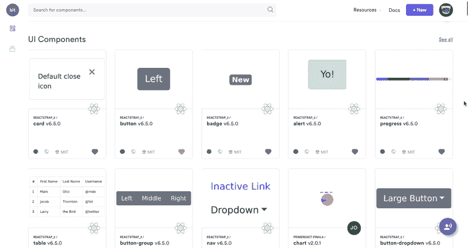
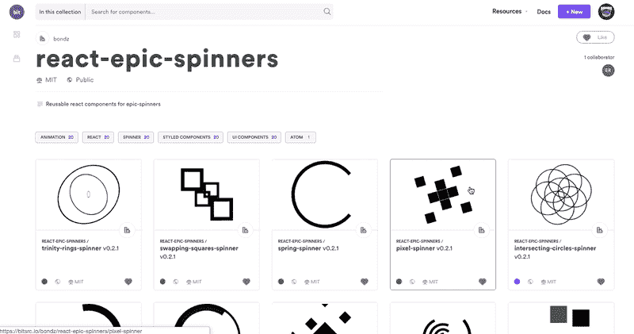
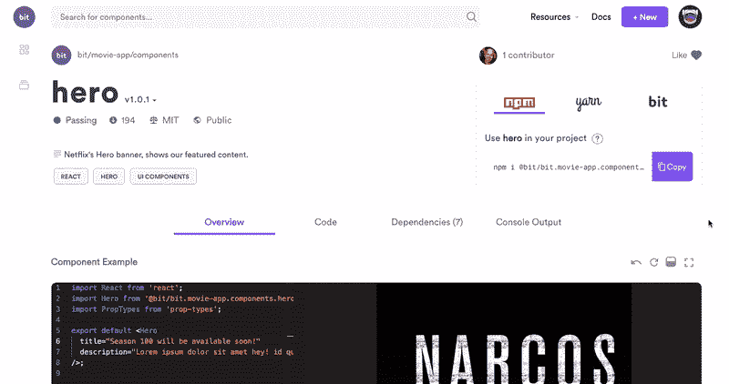
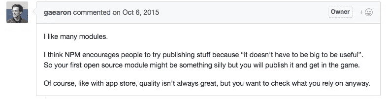
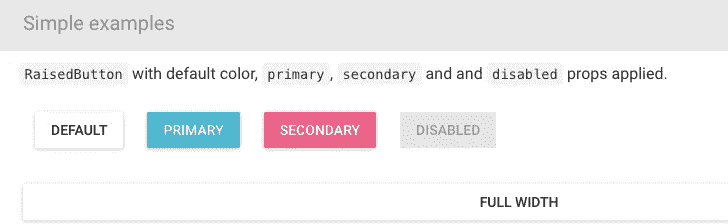
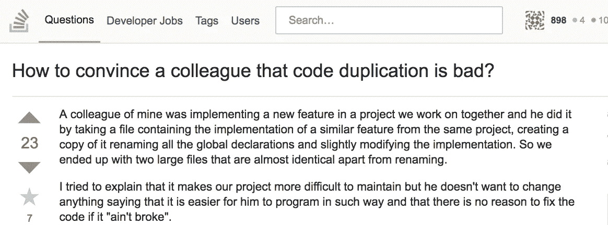

# 5 种实用的代码共享方式:从 NPM 到 Lerna、Git 子模块和 Bit

> 原文：<https://medium.com/hackernoon/5-practical-ways-to-share-code-from-npm-to-lerna-and-bit-732f2a4db512>

在多个存储库、monorepos 和微服务之间，关于在项目之间共享公共[代码](https://hackernoon.com/tagged/code)的讨论越来越激烈。

在项目和存储库之间共享公共代码是更好的模块化和更快开发的关键因素，但这也是[复杂的](/@jeffwhelpley/the-problem-with-shared-code-124a20fc3d3b)。我已经在之前[写过了，分享了我们作为一个团队的经验。](https://medium.com/p/85c51b2d0049/edit)

以下是 2018 年在这些回购和项目之间共享代码的 5 种方法的实用概述。请记住，归根结底，这真的是关于人与人之间的交流、文化以及将[模块化牢记在心](https://addyosmani.com/first/)。

# 1.少量

Bit 5 min demo: share and manage code modules anywhere

[**Bit**](https://bit.dev)**(**[**GitHub**](https://github.com/teambit/bit)**)**是一个流行的 JS 工具，管理**源代码变更和共享组件的依赖性。这是一个强大的团队共享代码的方式，并保持不同应用程序和项目之间的同步。**

**Bit 能够从一个回购到另一个回购隔离和共享代码，同时保持对变更和更新的普遍控制，这使它成为一种非常可扩展的方式，以增加团队的代码共享，并减少开销。**

**Bit 让你无缝地隔离和共享来自任何 repo 的模块，同时它会自动定义它们的环境和依赖树。结果几乎是即时发布来自任何 repo 的组件，没有任何重构。**

**

UI components as Bit modules: instantly share and reuse anywhere** 

**然后，您可以使用 NPM/Yarn 在其他项目中安装组件，或者使用 Bit 从消费项目本身导入和开发代码。当进行更改时，Bit 会帮助您更新版本并合并更改。**

**这是一个[开源项目](https://github.com/teambit/bit)和一个[组件平台](https://bit.dev)，它们一起帮助团队将可重用的代码单元转化为共享组件。**

****

**Bit 的平台( [bit.dev](https://bit.dev) )还为您共享的组件提供可发现性和协作，这些组件被组织在平台中的可视集合中，具有每个组件的测试、构建、可视渲染等功能。**

****

**这里有一个示例 [React 项目](https://github.com/itaymendel/movie-app)和一个[匹配组件集合](https://bitsrc.io/bit/movie-app)。**

****** [## 将可重用的代码组件作为团队成员共享

### 轻松地在项目和应用程序之间共享可重用组件，以更快地作为一个团队进行构建。合作开发…

bit.dev](https://bit.dev)  [## 团队位/位

### 与您的团队轻松共享项目间的代码。-团队位/位

github.com](https://github.com/teambit/bit) 

# 2.有/没有 Lerna 的 NPM

Sindre Sorhus with 1000 NPM packages

[NPM](https://www.npmjs.com/) 是发生在 [JavaScript](https://hackernoon.com/tagged/javascript) 身上的一件神奇的事情，为围绕可重用模块和库的代码重用和协作打开了大门。尽管对这个生态系统有诸多抱怨，但我们无法想象没有它的生活。

你可能对 NPM 了如指掌，让我们来关注一些限制以及如何克服它们。一开始就做出明智的选择可以节省以后的时间。

[Dan Abramov](https://medium.com/u/a3a8af6addc1?source=post_page-----732f2a4db512--------------------------------) favors many modules

首先，很难为许多包建立和维护许多存储库。由于这个原因，一些项目被构建为多包存储库，也称为“monorepos”。像 Bit 和 Lerna(见下文)这样的工具可以帮助你把项目变成多包回购，你可以在这里了解更多。

这也导致许多团队选择共享库作为共享许多小组件的解决方案(见下文)，因为很难为每个组件都准备一个包。

第二，当其他人发布一个包时，您开发它的能力受到限制，这通常会导致对包的回购的拉式请求。像 [Bit](https://bit.dev) 这样的工具有助于缓解这个问题，因为它让您可以将组件直接带入任何回购，进行更改并共享新版本。

第三，随着您的扩展，会出现一个可发现性问题。很难从许多小软件包中找到和选择，这导致了 wiki 网站和冗长的文档。Rollup 的作者 [Rich Harris](https://medium.com/u/a11f7c00cbbe?source=post_page-----732f2a4db512--------------------------------) [写道](/@Rich_Harris/small-modules-it-s-not-quite-that-simple-3ca532d65de4):

> “许多博客帖子——不要说了，整个网站——都是为了减少在 npm 上找到所需内容的难度而创建的……”
> 
> *"* 由你来评价这个库:它有测试吗？你能理解源代码吗？是否积极维护？文档是否易于查找和查阅？

## *莱尔纳*

**

*The Hydra from Lerna: Looking at its tail, I think it’s about to fall down*

*将不同的包保存在不同的存储库中会很快失去控制，并且使得跨项目更新变更变得非常困难。*

*[**Lerna**](https://github.com/lerna/lerna) 帮助你在一个库中保存和配置多个包。它可以帮助减轻不同包的不同回购协议的痛苦，并帮助从整体上构建和测试项目。这样，您就不必为不同的包保存和维护单独的 repos。*

*要了解更多关于 monorepo 的信息，请查看:*

* [## Monorepos 变得更简单

### 如何利用位+ NPM 简化 monorepo 架构，有和没有 Lerna 和朋友。

blog.bitsrc.io](https://blog.bitsrc.io/monorepo-architecture-simplified-with-bit-and-npm-b1354be62870) 

# 3.共享和公共库

[共享库](https://blog.bitsrc.io/11-react-component-libraries-you-should-know-178eb1dd6aa4)的优势在于你将所有的共享代码保存在一个 repo 中，这比多个微包更容易维护和分发。然而，与 Lerna monorepos 不同，它们将作为一个包装被消费。

将所有共享代码保存在一个 repo 中会迫使用户将整个库添加到他们的项目中，这些库具有冗余代码、依赖性、复杂性和重量，所有这些都使用单个组件。

A React MaterialUI button component — do I really need a whole library?

这也使得更新和修改的过程变得非常麻烦，因为每次更改都需要项目的所有者更新包。这可能[损害这些库在组织内的采用](https://hackernoon.com/how-we-started-sharing-components-as-a-team-d863657afaca)。库内不同组件的可发现性也是一个问题。

这些问题导致 Lodash 等社区长期努力工作，以便将他们的组件作为单独的包发布到 NPM。谷歌的[聚合物项目](https://www.webcomponents.org/)(由 [Eric Bidelman](https://medium.com/u/443b43fab64?source=post_page-----732f2a4db512--------------------------------) 和其他 OSS 向导)也在超过 100 个不同的存储库中保存了超过 100 个网络元素。

Lerna 可用于将库中的组件分离到 repo 中的包中。位可用于共享现有库中的组件。

 [## 我们如何真正使用可重用组件？

### 我和 30 个团队讨论过他们的可重用组件。以下是我学到的东西。

blog.bitsrc.io](https://blog.bitsrc.io/do-we-really-use-reusable-components-959a252a0a98)  [## 2019 年共享组件最佳实践

### 与 Bit 和 friends 一起开发和管理团队和项目之间共享组件的成功实践。

blog.bitsrc.io](https://blog.bitsrc.io/shared-components-best-practices-for-2019-c259cdc3b623) 

# 4.Git 子模块

Lessons learned in the trenches?

子模块实际上是其父存储库目录树中的独立存储库。父模块与子模块之间的唯一联系是子模块检出 SHA 的记录值，它存储在父模块的提交中。记录的 SHA 中的变化不会自动反映在子模块中。

但是，子模块有很多很多问题。只要在谷歌上运行一个快速的“git 子模块”搜索，你不会喜欢结果的。在主要问题中，您可以发现一个简单的事实，即子模块不管理模块之间的依赖关系。较小的问题包括这样的事实，即git 子模块不能很好地与父目录一起工作，因为对父目录的“拉”不会自动反映在子模块中。

此外，git 在解决冲突时不会保存指向子模块的指针。这意味着如果您不手动更新指针，您将在合并更改时丢失已解决的冲突。当您提交子模块时，git 将在父模块中为您留下一个分离的头，因为它引用的是一个旧的“头”,而不是当前的“头”。你猜怎么着？当您推送父模块或子模块时，其他父模块不会被导出。

有各种工具围绕子模块特性提供额外的自动化，例如 [git-subtree、gitslave、braid 和 giternal](https://codeburst.io/4-git-submodules-alternatives-you-should-know-592095859b0) 。但是到今天为止，管理跨项目和 repos 的源代码变更和模块依赖性的唯一工具是 JS 中的[位](https://bit.dev)。

# 5.复制粘贴代码

> 因为让我们面对现实吧，未来的我曾经为我做过什么？

When your teammate yells YOLO and goes rouge

老实说，这可能是地球上代码“重用”最常用的实践。我倾向于认为，在大多数情况下，这是由于缺乏“廉价”的有效替代方案和有些混乱的交付周期。

问题是，代码复制一点也不便宜。远非如此。

A classic problem for future me.

重复是您代码库中不断增长的债务。您将很快失去控制，使维护成为一场噩梦，交付周期变得更长。很多问题只有交付生产后才会发现。

最近的一项研究发现，GitHub [上一半的代码是重复的](https://www.theregister.co.uk/2017/11/21/github_duplicate_code/)。我们的研究发现，像`is-string`这样的 Javascript 函数仅在 10k GitHub repos 中就被复制了超过 1000 次，重复了 100 个不同的实现。

想想如果更多的人共享代码，而不是复制或重新实现代码，会有什么样的新特性。想想您的组织的维护成本和长交付周期。

# 共享代码是关于人的

每个项目和每个开发人员都有自己的一套关注点、工具和工作流程。然而，共享代码是真正模块化的关键，这在今天的生态系统中越来越受欢迎，并提供了巨大的优势。

我们选择构建[位](https://github.com/teambit/bit)。无论您选择什么方法和工具，重要的是鼓励培养共享和协作的文化。

毕竟项目之间的分享是从人与人之间的分享开始的。

# 了解更多信息

 [## 在 React 中加快开发的 5 个工具

### 加速 React 应用程序开发的 5 个工具，侧重于组件。

blog.bitsrc.io](https://blog.bitsrc.io/5-tools-for-faster-development-in-react-676f134050f2)  [## 比特和 NPM 让 Monorepos 变得更简单

### 如何利用比特+ NPM 去单一回购没有开销？

blog.bitsrc.io](https://blog.bitsrc.io/monorepo-architecture-simplified-with-bit-and-npm-b1354be62870)  [## 使用 React 和 Bit 的原子设计:简化复杂的 UI

### 使用带有 React + Bit 的原子设计来简化复杂的 UI。

blog.bitsrc.io](https://blog.bitsrc.io/simplify-complex-ui-by-implementing-the-atomic-design-in-react-with-bit-f4ad116ec8db)***