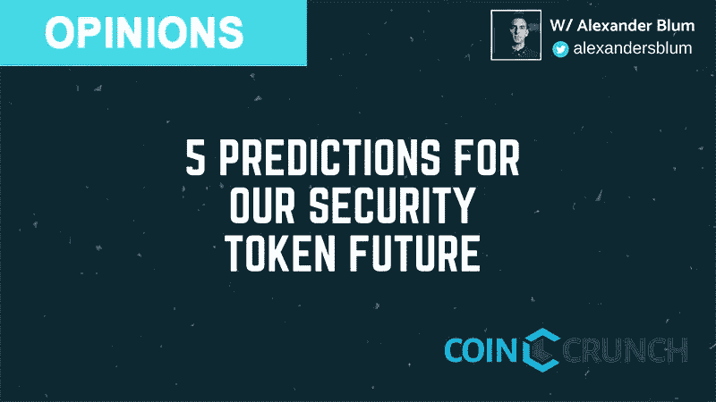

# 对我们安全令牌未来的 5 个预测

> 原文：<https://medium.com/hackernoon/5-predictions-for-our-security-token-futur-57ce9cf01256>

安全代币将迎来区块链资本的下一波浪潮。

随着区块链成熟为更具可伸缩性的企业级解决方案，金融业的几乎所有部分都可能随之转移。考虑到这一点，我们的安全令牌未来会是什么样子呢？

以下是五个预测:

# 1.IPO 夭折

凭借更广泛的筹资基础、早期流动性、简化的监管要求和低得多的发行成本，令牌化证券提供了 IPO 根本无法提供的好处。

随着主流投资者和金融机构对这种新融资机制的表面风险越来越熟悉，该行业将迅速和集体地采用证券代币发行(sto)。需要资金的现有公司将开始认真考虑将 STOs 作为一种融资选择。发行的复杂性和投资者也将继续增加。

# 2.STO 生态系统的出现

安全令牌市场的一系列服务提供商将很快出现。STO 投资顾问、保险公司、托管人、网上银行、贷款人，所有这些领域都将成长为价值数十亿美元的机会，其复杂程度至少与今天的传统证券市场相同。

一开始，这些服务提供商的利润看起来会很高，然后随着竞争的加剧而逐渐降低。向这种新兴的生态系统出售“镐和铲”虽然并不性感，但却代表着一个重要的机会。

# 3.sto 将实现新颖、个性化的衍生产品

细分证券投资的能力将允许企业提供适合投资组合、个人偏好和当前趋势的独特衍生品。获得更多机会和更多个人投资选择将有利于普通投资者。

一个人可以持有当今只有私人股本公司才能获得的国际优质投资组合。安全令牌将允许机器人顾问继续蓬勃发展，并将加速他们的增长。

# 4.可视化机会、风险、回报和影响的新方法

企业将找到以更有意义的方式可视化和表示令牌及其功能的解决方案。随着安全令牌引入主流机构资本，探索交易历史、访问功能和日常使用令牌的能力将会提高。

与此同时，目前由二级交易所提供的跨证券代币交易的能力将变得足够简单，可供主流投资者使用。一个由设计师和战略家组成的行业将出现，以支持未来安全令牌的 UI/UX。

# 5.证券监管者将很难跟上

当然，这些工具将赋予投资者和发行者的新能力，对传统的证券监管机构来说将是相当具有挑战性的。令牌化证券的数字特性也使得它们难以分类。

安全令牌最终是软件，可以提供与任何其他软件公司相同的功能和灵活性。创建混合型投资工具的能力将使监管分类中的严格类别无法充分解释出现的证券和准证券产品的类型。能够成功平衡新监管和金融保护的国家将获益匪浅。

随着围绕安全令牌生态系统组织的公司和投资者联盟放大网络效应，这一领域的能量和机会将吸引更多的资本、竞争和客户。

能够抢占市场份额并建立强大网络的先行者将会胜出，而不是 IP。有能力采用敏捷开发方法和智能冒险的公司将会超越那些没有这种能力的公司。这些变化不仅会发生，而且会比你想象的要快得多。

# 关于作者

过去 5 年多来，Alexander S. Blum 一直在区块链工作，为风投、私募股权投资集团、财富 500 强企业和区块链初创企业提供财务和技术战略及发展方面的建议。他开发了一个加密货币挖掘业务，一个人工智能加密对冲基金，并领导了多个 ico，包括 Science Inc .和 Sweetbridge。

在此之前，他在巴拿马的和平队(Peace Corps)服役，在那里他以经济发展顾问的身份创办了一个土著手工艺合作社。在两年没有电话和互联网的生活后，他开始发展一项覆盖拉丁美洲农村地区的电信服务。他就读于塔夫茨大学和麻省理工学院。他也是[原子之都](http://: www.atomiccapital.io)的创始人。你可以在@ alexandersblum 和@Atomic_Capital 上关注 Alex 的作品

# 想要了解区块链和加密货币的最佳新闻、评论和信息，请访问 [coincrunch.io](https://coincrunch.io) 或查看我们的网站:[Youtube](https://www.youtube.com/channel/UCXyrBCWaRJzHfOtnWaR47Qw)|[Twitter](https://twitter.com/coincrunchio)|[脸书](https://www.facebook.com/realcoincrunch/) | [Reddit](https://www.reddit.com/user/coincrunchio)