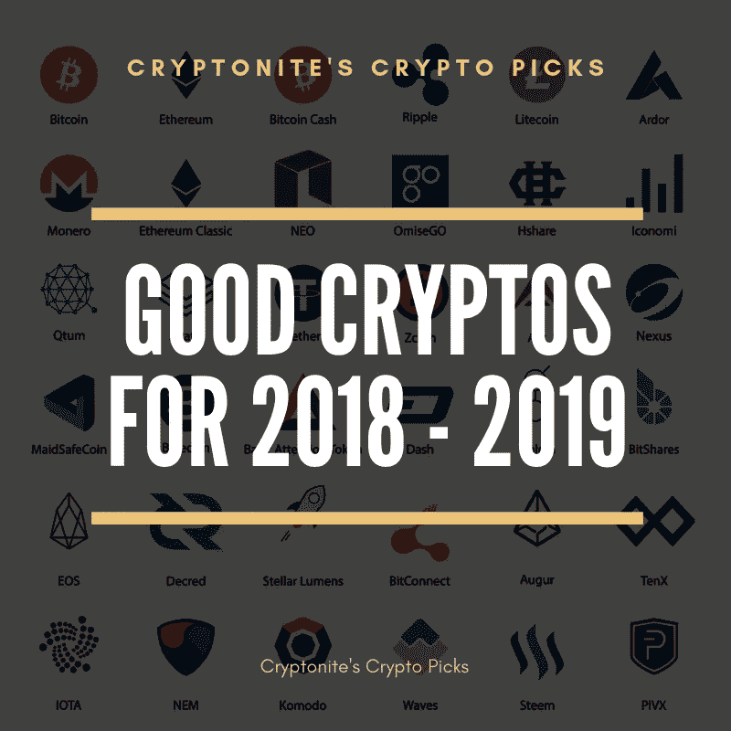

# 2018-2019 年投资 10 美元以下的 5 种有前途的加密货币

> 原文：<https://medium.com/hackernoon/5-promising-cryptocurrencies-under-10-to-invest-in-for-2018-2019-207759546388>

## 从零交易费到帮助内容创作者。这些加密货币能一直表现到 2019 年吗？

未来两年投资“最佳”加密货币的问题并不简单，这个市场上有很多优秀的加密货币。

我们可以看到一些看起来非常有前景的加密货币。

**前景看好的加密货币:**

**NANO(纳米)** — Nano 的交易费用为零，交易时间为 2 秒，整个网络建立在一个独特的“区块网格”上，而不是区块链或 Tangle。

使用 Block Lattice，每个用户都有自己的区块链，通过减少单个区块链必须进行的交易数量来加快交易速度。

事实上，网络上的用户越多，处理事务的速度就越快，这解决了 cryptos 最大的问题之一，可伸缩性。

**基本注意力令牌(BAT)——**基本注意力令牌(Basic Attention Token)是由 Javascript 创始人、Mozilla Firefox 联合创始人布伦丹·艾希(Brendan Eich)创立的一种加密货币。

BAT 可以被内容创作者、广告商和观众/用户在一个新的生态系统中使用，这个新的生态系统将发生在 Brave Browser 上。

Brave 是一款已经发布的网页浏览器，可以自动拦截广告，BAT 旨在以多种方式在该浏览器上使用，包括:

*   通过捐赠或 Patreon 式订阅服务支持您最喜爱的内容创作者。
*   应用内购买
*   看完广告后收到球棒
*   BAT 可以由 Chrome 或 Firefox 等流行浏览器实现，以补偿受 AdBlock 软件和 YouTube 去货币化影响的广告商和创作者。

英美烟草可以帮助内容创作者继续他们的在线业务，同时让广告商和观众满意，让观众因观看广告而在英美烟草获得奖励，广告商继续推广他们的产品。

**Stellar Lumens(XLM)**—Stellar Lumens 有 2 秒钟的交易时间，交易费用只需几分之一美分，除此之外，Stellar 还可以像以太坊一样用作基于区块链的开发平台。

由于 Stellar 的区块链比以太坊更快更便宜，一些公司已经将他们的项目从以太坊区块链转移。

XLM 是结合了 Ripple 的超低费用和快速交易速度/XRP 以太坊的 dApp 开发技术。

这使得 XLM 成为区块链发展和汇款的更具可扩展性的选择，因为 XLM 不太可能经历区块链的拥堵。

区块链拥塞导致比特币和以太坊一旦看到用户快速增加，就会面临交易速度缓慢和交易成本增加的问题。对 XLM 来说，这不成问题。

由于 XLM 可以快速、廉价地转账，像 IBM 这样的公司以及一些银行一直在使用 XLM 转账。

**z cash(ZEC)——**z cash 是一种注重隐私的加密货币，它使用零知识证明来保护个人和跨国数据的秘密。这种技术允许在没有关于发送者、接收者和交易金额的任何信息的情况下验证交易。

Zcash 用户仍然可以选择使用“查看密钥”和“支付披露”等 Zcash 功能来披露交易数据。通过这种方式，使用 Zcash 的交易仍然符合法规，并且 ZEC 可以用于商业目的。

ZEC 有 4 种交易类型:

*   私有交易-从一个 Z 地址(私有地址)到另一个 Z 地址的交易。
*   解除屏蔽—从 Z 地址(私有地址)到 T 地址(公有地址)的交易。发件人的信息是保密的。
*   屏蔽—从 T 地址(公共地址)到 Z 地址的交易。发送者信息是公开的，但接收者信息是秘密的。
*   公共—从一个 T 型地址(公共地址)到另一个 T 型地址的交易。所有信息都是公开的。

ZEC 是一种多功能的加密货币，允许基于个人用户使用隐私，这使这种加密货币领先于许多其他基于隐私的硬币。绝对是 2019 年要进入的一个。

**EOS****【EOS】**—EOS 计划将自己定位为以太坊的竞争对手，能够实现商业规模的分散应用(dApps)的开发、托管和部署。

EOS 的开发者声称，它将解决加密货币的可扩展性和可用性问题。

EOS 计划通过并行处理、需要一致同意才能批准的规则、5%的通胀率和去中心化的操作系统来实现这一目标。

他们有着大胆的野心，在早期被传言为“以太坊黑仔”。

现在我不太确定以太坊黑仔的事情，但如果他们能实现他们的计划，我相信他们会在 crypocurrency 的未来有一席之地。

可以用 [**CEX**](https://cex.io/r/0/up106280379/0/) 用现金直接投资 ZEC 和 XLM。

你可以使用 [**币安**](https://www.binance.com/?ref=11282713) 用比特币或以太坊购买纳诺、蝙蝠、XLM、ZEC 和 EOS，这些都可以从 [CEX](https://goo.gl/5PLnV9) 得到。

我希望我的故事对你有用，欢迎随时关注我的[媒体](/@cryptonitecj900)和[推特](https://twitter.com/cryptonitetweet)以获取更多故事。