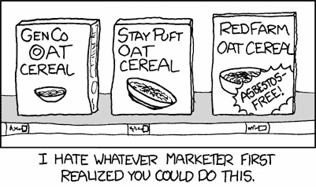

# 你需要知道的 5 个有前途的 ico

> 原文：<https://medium.com/hackernoon/5-promising-icos-you-need-to-know-648990d84dd>

**This post was sponsored by an affiliate of Cartel,** Photo by [Graeme Nicholl](https://unsplash.com/photos/3KEJMfoHoMY?utm_source=unsplash&utm_medium=referral&utm_content=creditCopyText) on [Unsplash](https://unsplash.com/search/photos/trust?utm_source=unsplash&utm_medium=referral&utm_content=creditCopyText)

你知道吗，每年我们辛辛苦苦挣来的数万亿美元都浪费在支付零售上了？你支付的价格比制造成本高 10 倍。你的钱被中间商(经销商、批发商、零售商)吃掉了。我们能通过取消中间商而使产品更便宜吗？

# 卡特尔

[卡特尔](http://www.cartelcoin.io/)将世界各地的买家与制造商联系起来。制造商可以在卡特尔中列出他们的产品。一旦他们为产品找到足够的买家。[卡特尔](http://www.cartelcoin.io/)集体将单个订单汇集成一个大批量价格。然后要求制造商批量生产该产品。一旦制造商发货，他就能得到报酬。这将消除中间人。

这项创新降低了运输成本。因此，通过大幅减少二氧化碳排放，有助于让世界变得更美好。卡特尔利用智能合约为买家提供保护。此功能消除了欺诈。卡特尔给交易增加的成本不到 3%。一辆售价约为 15 万美元的路虎揽胜在卡特尔[上只卖 8 万美元左右。他们会通过大幅降低产品价格来扰乱零售业。他们现在开始接受](http://www.cartelcoin.io/)[早鸟 ICO 注册](http://www.cartelcoin.io/registration/)。

Credits : [xkcd](https://xkcd.com/360/)

马克是一名体育作家。他的新雇主付给他大笔工资。他不是技术人员。他设法创造了一个加密钱包，并收到了他的第一笔付款。但是，他担心它的安全性，因为他朋友的钱包最近被黑了。 ***他能干什么？***

# 吉萨。亦称 EL GIZA

[吉萨](https://www.gizadevice.com/)想解决马克的问题。它们提供了一个易于使用的安全硬件钱包，支持比特币、以太坊、比特币现金、DASH、莱特币、Ripple、Stratis、Zcash 等货币。

你甚至可以在被入侵的电脑上使用钱包。这是因为你需要在钱包的屏幕上确认交易。远程工作的黑客无法从你的钱包里取钱。Giza 设备不仅仅是一个安全的硬件钱包。它还有一个密码管理器和一个 16GB 的安全数字存储器。

DDOS 攻击通过淹没目标系统的带宽来实施。即使是不熟练的黑客也能轻易发动 DDOS 攻击。虽然有几个服务可以过滤掉这样的请求，但效率仍然很低。

# 格拉迪乌斯

矿工出租他们的电脑赚取比特币。同样，人们可以把他们的电脑租给 Gladius。那些出租他们的计算能力的人得到了[格拉迪斯](http://gladius.io/)硬币的补偿。现在，这些请求被分发到世界各地分散的计算机系统中。他们会把好的请求从坏的请求中筛选出来。这通过大幅降低成本来提高效率。

Credits : [xkcd](https://www.explainxkcd.com/wiki/index.php/641:_Free)

原生视频广告是有效的。但是，发起大规模的广告活动是很费时间的。因为这个过程需要与相关的博主协商。监控需求是否得到满足需要大量的手动工作。几乎无法验证。

# AdHive

[AdHive](https://adhive.tv/?utm_source=topicolist&utm_medium=listing&utm_campaign=ico) 基于以太坊智能合约。广告商可以通过购买 ADH 代币来配置活动和预留预算。AdHive 的 AI 承担了重任。它将活动发送给相关的影响者。一旦广告被投放，AdHive 的人工智能将对内容进行标记，以检查广告要求是否得到满足。如果满足要求，那么影响者将获得 ADH 代币。

约翰是一名计算机科学家。他每年写两本书。他无法专注于写作和营销。因此，他与出版商(中间商)合作营销和发行他的书。出版商拿走了他收入的很大一部分。

# 吉尔伽美什

区块链解决的基本问题是消除中间商。吉尔伽美什是一个区块链平台，它消除了中间人，直接连接读者、作家、服务提供商和评论家。一旦作者出版了他的书，评论家们就会收到吉尔伽美什奖。

追随评论家的读者会直接从作者那里购买这本书。服务提供商可以使用 API 来构建服务，这将使读者、作者或评论家受益。当有人使用他们的服务时，他们会得到代币。由于平台是分散的，基础设施成本将是最小的。

 [## 如何验证你的想法是否需要区块链

medium.com](/wethinkideas/how-to-validate-if-your-ideas-need-a-blockchain-e1a4846d16fd) 

***鼓掌请*** 👏，*谢谢*😊。*关注我们，*[*hacker noon*](https://hackernoon.com)*和我(*[*Febin John James*](https://medium.com/u/75a616711f4e?source=post_page-----648990d84dd--------------------------------)*)了解更多故事。我想向您介绍两项令人惊叹的服务。* [*赚*](https://earn.com/febin/referral/?a=rzjbj73qc4dhiv6y) *付给你读邮件的比特币。*[*Mentorbox*](https://mentorbox.com/partners?affiliate_id=898086&aff_sub=&aff_sub2=&nopopup=true&noautoplay=false&cookiepreview=false)*总结热门书籍，提供可操作的见解。*

