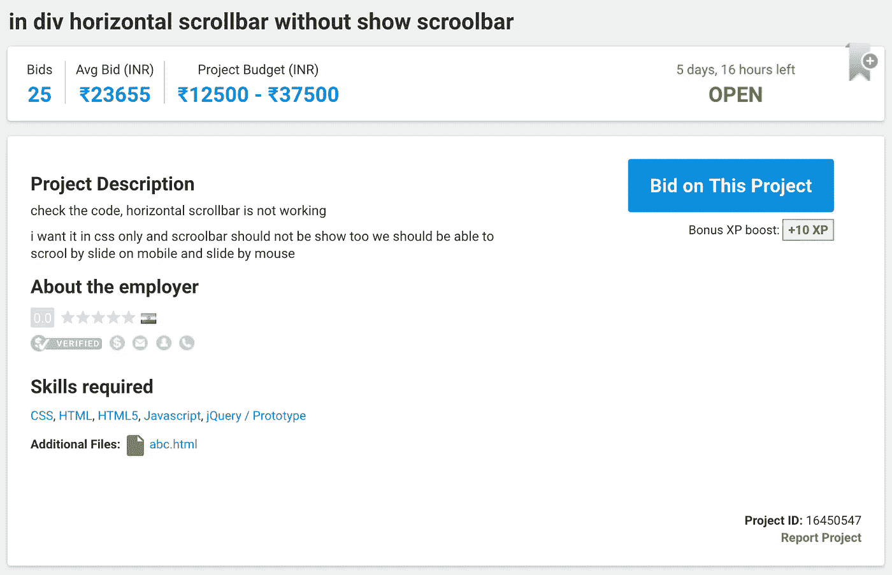
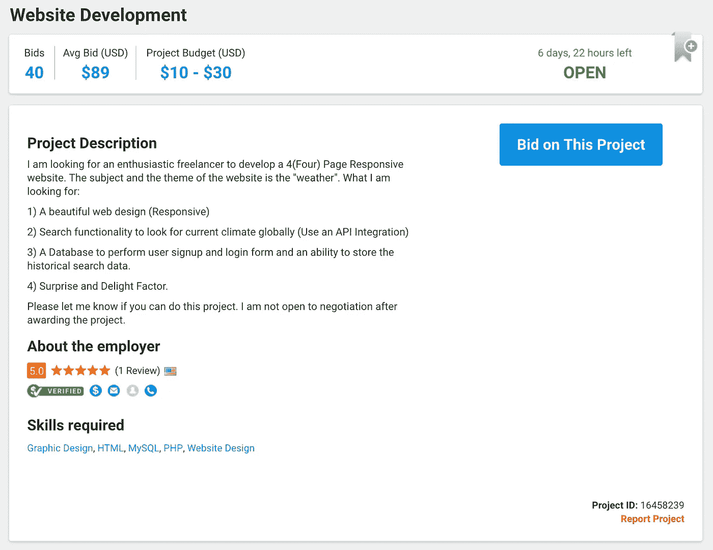
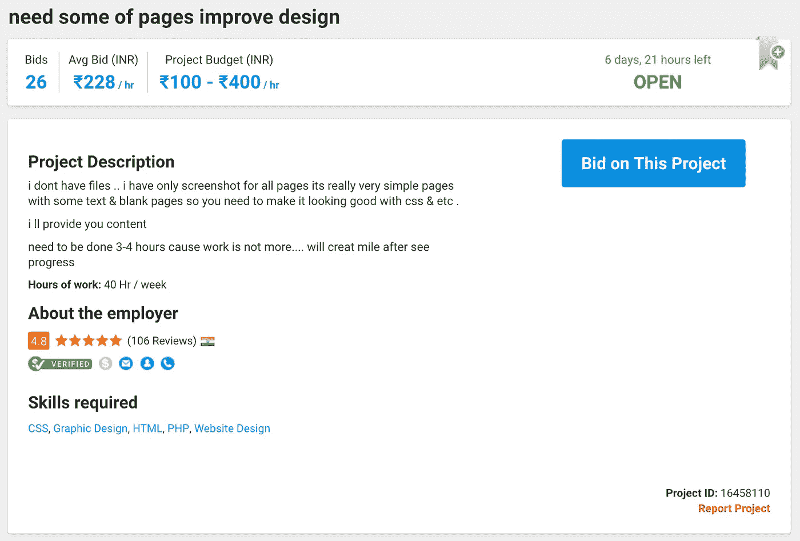
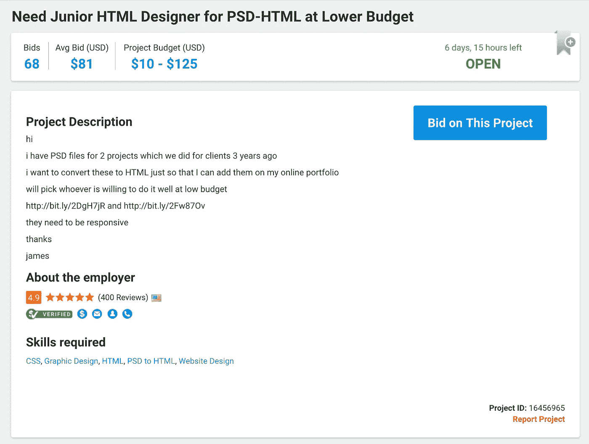
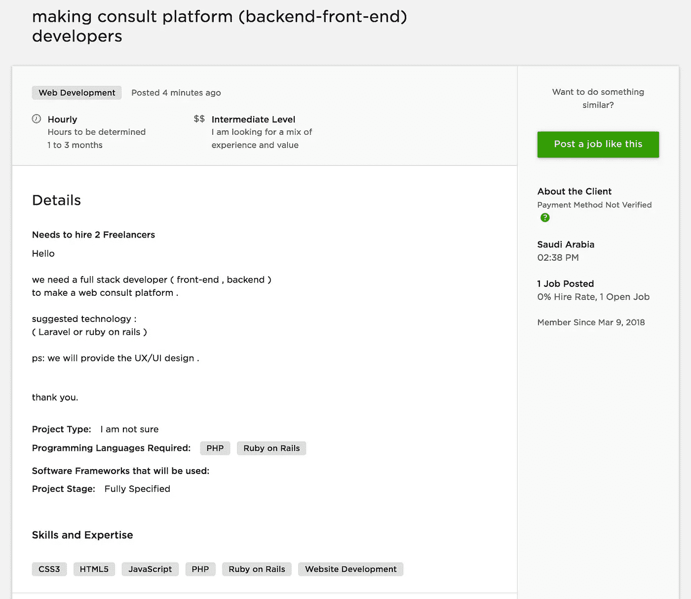
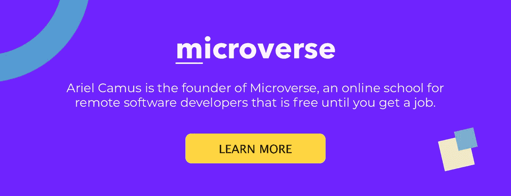

# 初级开发人员应该申请的自由职业项目的 5 个真实例子

> 原文：<https://medium.com/hackernoon/5-real-examples-of-freelance-projects-junior-developers-should-apply-to-9e67f7bdfd5e>

“A man wearing a black backpack and baseball cap, staring at work related documents on the office wall” by [rawpixel.com](https://unsplash.com/@rawpixel?utm_source=medium&utm_medium=referral) on [Unsplash](https://unsplash.com?utm_source=medium&utm_medium=referral)

自由职业是获得初级开发经验的好方法，尤其是在你居住的地方没有好的全职工作或实习机会的情况下。

然而，你需要申请正确类型的项目，否则你可能会把时间浪费在一些项目上，这些项目要么**太复杂**、**太简单**，要么**与你真正想掌握的东西完全不相关**。

首先，你需要明确你的目标是什么:

1.  你想掌握哪些技术？
2.  **对于你目前的经验水平，什么样的项目复杂度是合适的？**

我们用 Freelancer.com 和 Upwork.com 来寻找你应该申请的项目的真实例子。然而，类似的项目几乎可以在任何其他自由职业者平台上找到，无论平台如何，“推理”都是相同的。

对了，如果你想看一个你应该避免 的 [**项目的真实例子列表，我们还发表了另一篇文章，里面有一些例子和每个推荐背后的原因。**](/microverseinc/5-real-examples-of-freelance-projects-junior-developers-should-avoid-1185b974561d)

这个例子列表假设你是一个熟悉 CSS、HTML 和 JavaScript 的入门级 web 开发人员，你已经建立了一些基本的网站，你正在寻找一些更具挑战性的机会来提高你的前端技能。这是大多数学生开始我们的[远程软件开发人员培训项目](https://www.microverse.org/)时的情况。

最后，我们假设您已经为您的个人资料选择了正确的技能，因此您可以在 Freelancer.com 使用“我的技能项目”选项。

我们建议你同时寻找“固定价格项目”和“小时项目”尽管每种模式都有其优点和缺点，但只要你知道如何合理地估计项目的范围，这两种模式都将为你工作，这样你就可以确定“固定价格”是否公平。

# 项目#1

## 为什么你应该申请

要解决的问题似乎是**真的具体**而**范围小**。即使他们没有告诉你这段代码在哪里(大的 web 应用还是简单的网站？)，这看起来像是一个小问题，你可以在几个小时内调试并**修复。即使你花的时间比那更长，你可能会在调试和使用现有应用程序方面做得更好(如果你在某个时候加入了一家大公司，这是你必须做的)。另外最低**预算一点都不差:192** 。如果你能在几个小时内解决这个问题，你将会每小时赚 100 美元。**

# 项目#2

## 为什么你应该申请

这是一个棘手的问题。**的范围被很好地定义了**并且它实际上非常有趣:你将需要构建一些**响应页面**，**集成一个 API** ，并且，正如客户所说的，致力于“惊喜”因素，这似乎表明**客户关心用户体验**。但是，也有一个要求，允许用户注册和登录，以便您可以存储历史搜索数据。这最后一点最有可能需要后端开发。如果你喜欢使用一些后端语言/框架，那么这应该不是问题。如果你不是，你仍然可以使用一些无服务器服务(如 Firebase)。

然而，这是这个项目唯一的缺点，**预算低得离谱:** $10 — $30，真的吗？你应该申请这一个，但你一定要出价超出建议的预算。我看了看竞标者名单，许多人出价在 200-300 美元之间。不要害怕出价更高。如果你出价，比如说 200 美元，这样你的出价就有竞争力，客户最终会接受你的提议，确保你和他/她谈论后端开发的范围。建议**为此创建一个单独的里程碑**，并专注于构建不需要后端的 MVP(最低可行产品)并从中获得报酬。

# 项目#3

## 为什么你应该申请

当然，报酬很糟糕(大约 4 美元/小时)，但是如果你只是在寻找一些简单的项目来开始**在你的投资组合**中获得一些积极的评价和项目，这似乎是一个容易的事情。雇主有 106 条评论，平均评分为 4.8。他们可能是**通情达理的，容易与**共事，如果你不会得到很多报酬，这是一个非常重要的考虑因素。请记住，你是在最大限度地学习和投资，以获得一个强大的投资组合，这样你就可以在以后增加你的收入。

# 项目#4

## 为什么你应该申请

预算很低，但如果你正在寻找**建设响应网站**的经验，并与 HTML 和 CSS 合作，这是你应该开始的项目类型。在 Freelancer.com 找到这类项目的方法非常简单:只需**过滤贴有“PSD to HTML”**标签的项目。

# 项目#5

## 为什么你应该申请

如果你已经熟练掌握了后端语言或框架，你应该开始申请需要前端和后端开发的更复杂的 web 项目。这一具体项目在 Upwork.com 的提议中没有明确说明。然而，它说它是“完全指定的”，他们对使用 Laravel (PHP)或 **Ruby on Rails** 持开放态度。

我们在 Microverse 的学生在项目中途学习 Ruby on Rails，所以这是我们建议他们参加的项目类型。

有趣的是，客户指定他/她需要雇佣 2 名自由开发人员。这似乎表明**他们能够理解项目的复杂性**并且愿意投资于项目的开发。

你需要帮助寻找、选择和管理自由职业项目吗？我们为远程软件开发人员开办了一个培训项目，在那里你可以[从事自由职业者和开源项目，同时与来自世界各地的其他学生一起进行结对编程](https://www.microverse.org/)。

