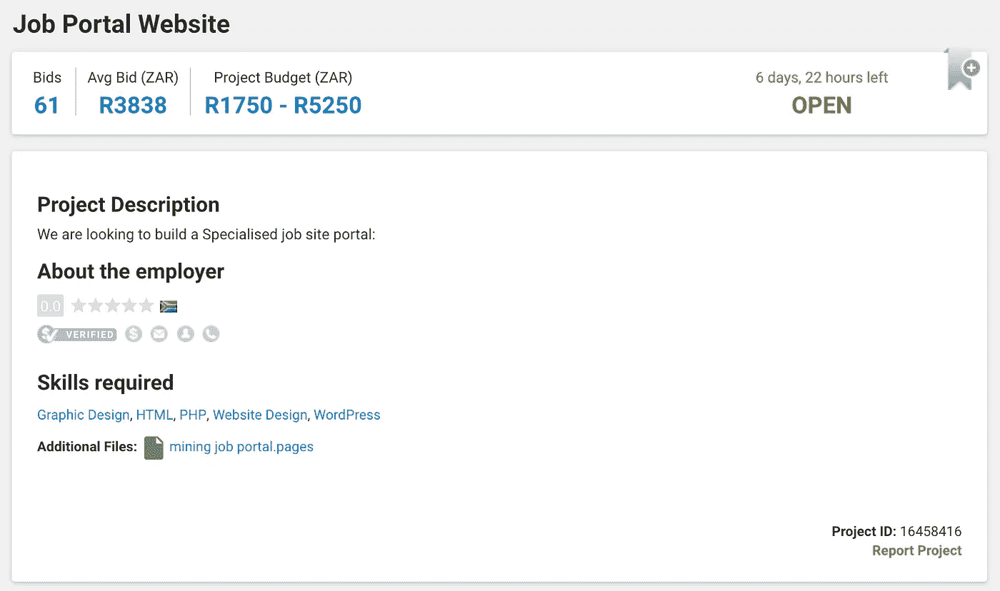
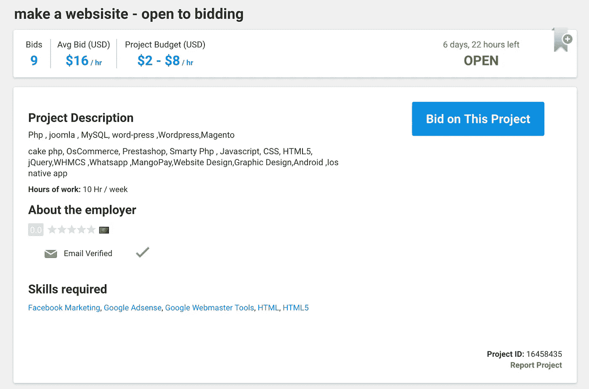
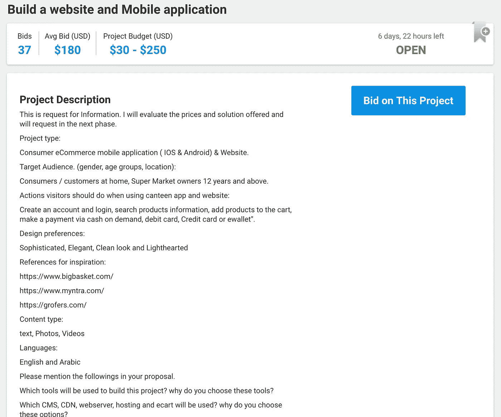
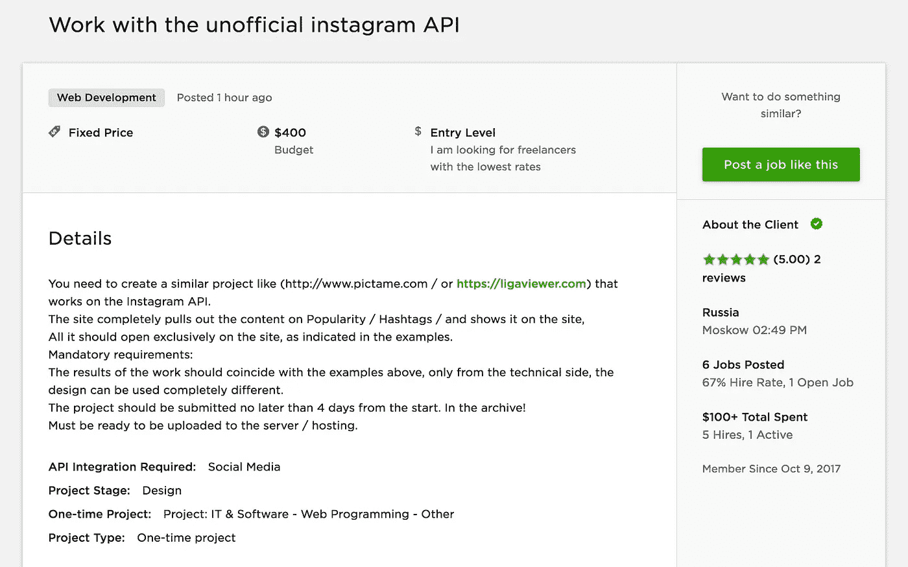

# 初级开发人员绝对应该避免的自由职业项目的 5 个真实例子

> 原文：<https://medium.com/hackernoon/5-real-examples-of-freelance-projects-junior-developers-should-definitely-avoid-1185b974561d>

Photo by [Michael Mroczek](https://unsplash.com/@michaelmroczek?utm_source=medium&utm_medium=referral) on [Unsplash](https://unsplash.com?utm_source=medium&utm_medium=referral)

在之前的一篇文章中，我们谈到了你应该申请 的 5 个自由职业项目的真实例子。我们谈到了选择正确项目类型的重要性，如果你是一名入门级的开发人员，试图在申请全职远程工作之前，将自由职业作为获得足够经验的垫脚石。

做出错误的选择可能意味着做那些对你目前的水平来说太简单的项目，或者太复杂的项目。你也可能最终从事与你真正想掌握的语言和框架完全不相关的事情(例如 Wordpress)。

我们访问了 Freelancer.com 和 Upwork.com，使用一些简单的过滤器，我们发现了几个项目，这些项目似乎都具备典型的入门级 web 开发人员的正确技能。然而，我们选择了你绝对应该避免的 5 个项目，并且对每一个项目我们都写了一个解释，告诉你为什么应该避免它。

# 项目#1

## 为什么你应该避免它

因为**要求完全不清楚**，而且因为它要求 PHP 和 WordPress 技能，如果你的目标是最大限度地学习 JavaScript 和 Ruby(或者无论你喜欢的后端语言是什么，除非你对掌握 PHP 感兴趣)，这两件事你不会感兴趣。

# 项目#2

## 为什么你应该避免它

同样，它似乎非常专注于 PHP 开发和用 PHP 构建的工具。然而，这里的主要问题是这个项目中涉及的大量技能和技术。尽管这个项目是按小时付费的，但它很难帮助你专注于让自己在你的领域变得更强。我们之前已经讨论过选择利基市场的重要性。

# 项目#3

## 为什么你应该避免它

客户已经努力编写了项目的更详细的描述，包括项目的一些一般要求。然而，**工程范围巨大**。它不仅包括建立一个网站，还包括建立一个 iOS 和一个 Android 应用程序。除此之外，你还应该建立认证系统，购物车等。然而，这是一个典型的例子，说明重新发明轮子并不是最好的选择。这个**客户可能需要一个网络开发人员，他是电子商务专家**，并且可以利用一个**现有的电子商务解决方案**(例如 Shopify)。客户愿意接受吗？也许吧，但是安装和定制现有的应用程序并不能让你成为一名优秀的开发者。

# 项目#4

## 为什么你应该避免它

范围似乎很简单，即使预算真的很低，如果你正在寻找经验，这可能是有趣的。然而，你有没有注意到上面写着“*给我一个现代 HTML 设计的例子*”，并且在技能列表中列出了“图形设计”？这似乎表明，客户实际上是在寻找能够设计页面的人，而不仅仅是构建页面。你也是一个天才设计师吗？很可能不会，所以避免这个项目。

# 项目#5

## 为什么你应该避免它

这个项目很有趣。任何需要你与来自 API 的数据进行交流和**整合的事情都会是你简历和作品集的好经历。但是，您是否注意到客户在说“*项目应在开始后的 4 天内提交*”？你确定你能在 4 天内完成吗？鉴于客户没有提供明确的要求和设计清单，这一点似乎不清楚。你熟悉 Instagram API 吗？确保你不要过度承诺。**

你需要帮助寻找、选择和管理自由职业项目吗？我们为远程软件开发人员开办了一个培训项目，在那里你可以[从事自由职业者和开源项目，同时与来自世界各地的其他学生进行结对编程](https://www.microverse.org/)。

