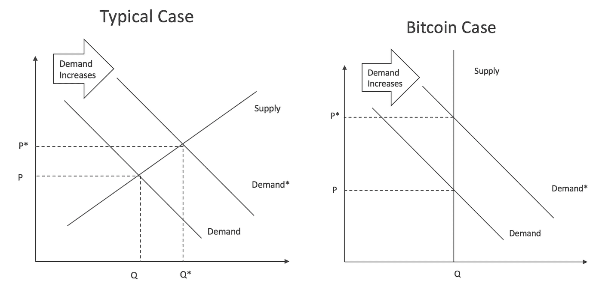
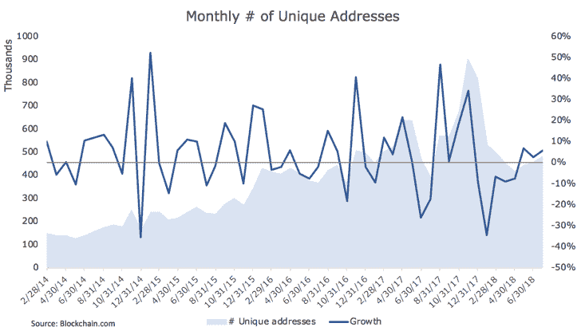
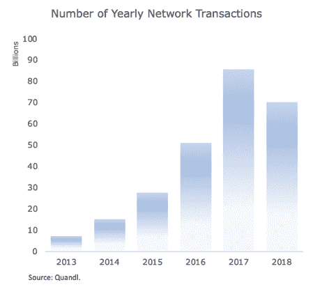
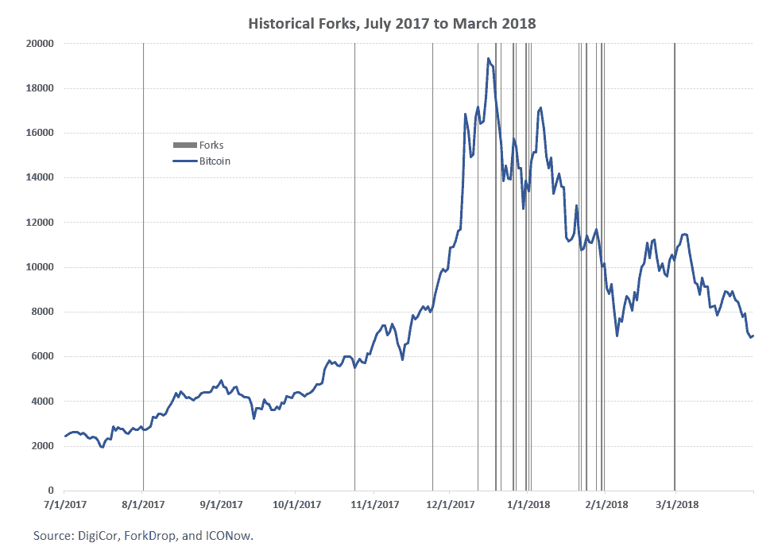

# 比特币大幅波动背后的 5 个原因

> 原文：<https://medium.com/hackernoon/5-reasons-behind-bitcoins-towering-volatility-1029364ba037>

短短 9 年时间，比特币已经从 0 美元增长到 1100 亿美元。然而，这一路绝非一帆风顺。自 2009 年以来，比特币经历了五次大崩盘，每次大反弹都将价格推高至前所未有的高点。这相当于高达 110%的年化波动率。就背景而言，股票的年波动率往往在 20% — 30%之间。这意味着，比特币是大多数投资组合中风险最高的资产类别的五倍。

尽管比特币的波动性迄今为止一直由投机需求主导，但真正的需求正在慢慢形成。**这意味着比特币的波动性将经历一场进化，它将随着时间的推移有机地降低**。了解这些驱动因素的成熟度对于确定投资组合中加密资产的适当权重至关重要。本说明确定了五个来源:

*   比特币的固定供应量
*   投资者的投机需求
*   用户的真实需求
*   来自竞争加密货币的需求侵蚀
*   投资组合流动

# 固定供应的后果

比特币的终端供应量是已知的。从现在到永远。在经济学中，这被称为完全无弹性供给(见下图)。这一特点使得价格对需求的微小变化非常敏感。我们可以在下面的面板中看到，同样的需求增长导致价格大幅上涨。这意味着更高的价格波动。

因此，**比特币的固定供给是其波动性背后的结构性原因之一**，需求的微小变化会导致价格的大幅波动。

# 这完全是因为需求

根据上面的结论，我们可能会同意比特币价格背后的**主要驱动力是需求**。因此，理解是什么触发了它的运动是形成长期资产观的关键。

# 投机

投机的本质是善变、不可预测和贪婪。目前，投机是比特币价格波动背后的主要驱动力。我们认为这一驱动因素将在中短期内继续占据主导地位。

这个驱动程序具有前述特征的原因很简单。第一，投机完全是前瞻性的。投资者唯一关心的是明天的价格。今天完全无关紧要。其次，由于投机是前瞻性的，任何新的信息都会转移投机需求。为什么？因为随着新信息的出现，对未来的潜在结果有了更好的理解。因此，价格必须调整以反映这一新的现实。最后，只有当投资者认为前瞻性回报更高时，他们才会配置资本。

这种效应解释了为什么新消息会对价格产生如此强烈的影响。例如，美国证券交易委员会一直在推迟和拒绝创建比特币交易所交易基金。就背景而言，这就是数万亿美元能否接触到比特币的区别。这种结果的二元性导致了预期以及价格如此剧烈地变动。另一个例子是比特币现金加入比特币基地。加密货币在他们的交易所上市后，[的价格从](https://hackernoon.com/tagged/cryptocurrency)[的 3200 美元飙升至 8500 美元](http://www.slate.com/blogs/future_tense/2017/12/20/bitcoin_cash_s_dazzling_debut_on_coinbase_leads_to_an_investigation_into.html)(不久后急剧下跌)。不稳定且难以预测。这是投机野兽的本性。

值得注意的是，投机和固定供应的结合是 110%波动性的主要成分。如果您有兴趣了解更多关于加密资产的波动性和其他风险指标，请访问我们的[市场仪表板](https://market.digicor.io/)。

[**注册 DigiCor 简讯**](https://digicor.io/pages/newsletter) 以了解 DigiCor 研究和加密市场的最新动态。

# 真实需求

真正的需求驱动因素是随着时间的推移赋予任何对象价值的因素。简单来说，如果有两个以上的人想要一个对象，而这个对象是稀缺的，那么它的价值一定大于零。对这一驱动因素的理解不能夸大，因为**它是所有资产类别**中最重要的驱动因素。以房地产投资为例。目前的供应量很大程度上是固定的，产量也是众所周知的。因此，你买公寓的唯一原因是，如果你相信居住在附近的真实需求会增长。因为这是实际价格(即剔除通胀后的价格)上涨的唯一途径。

通常说比特币没有真正的需求驱动力。我们不同意。它们很小，但成长迅速。过去四年，唯一地址一直在稳步增长，而通过比特币网络进行的交易数量也在不断增加。值得强调的是，尽管 2018 年价格下降了 66%，但网络交易并没有放缓。截至 2018 年 8 月，比特币网络交易数量已经是去年交易量的 80%。虽然很难确定，但我们认为需求来自加密交易所、少数零售商之间的交易，以及货币陷入困境的国家。委内瑞拉是后者的一个很好的例子，而 T2 很容易效仿。

**在可预见的未来，我们认为有明显的迹象表明真正的需求驱动因素正在形成和加强。看一看 ico 的数量和筹集的资金额，这一点再清楚不过了。2017 年是创纪录的一年，525 个项目总共筹集了 65 亿美元。尽管 2018 年出现抛售，但这一纪录已经被 334 个项目总共筹集了 82 亿美元打破。这些融资中的绝大多数都将比特币作为筹集资本的首选加密货币之一。此外，比特币交易配对市场(例如 DASH/BTC vs DASH/美元)是小型加密资产的最大流动性来源。**该职位** [**比特币作为基础货币**](https://blog.digicor.io/the-role-bitcoin-plays/) **用于迅速扩张的加密经济**因为交易和集资活动主要使用比特币。**

此外，金融和银行业的一些大公司已经开始进入这一领域。最显著的例子是最近洲际交易所(ICE)的加入，它是金融基础设施背后最重要的实体之一，也是纽约证券交易所的所有者。ICE 与星巴克、微软和 BCG 合作，让消费者和机构能够购买、销售和存储加密货币。这是为比特币交易和投资建立急需的金融基础设施的重要一步。

缺少基础设施的几个重要例子是:1)缺少进行加密交易的注册经纪交易商(到目前为止，没有主要的加密交易所已经注册，也没有被 SEC 认可)，以及 2)缺少集成到区块链基础设施中的信誉良好的加密资产托管解决方案。

但故事并没有就此结束，在比特币协议的基础上还有许多项目正在建设，试图解决其许多可扩展性问题。最著名的例子是闪电网络。这一进步实现了实时比特币交易结算。当你将这些技术进步与金融基础设施建设相结合时，你就获得了起飞的秘诀。我们认为这一过程相对缓慢，需要 12-24 个月才能完成(基础设施需要时间来建设)。在此之后，随着主流参与者能够轻松使用加密货币，采用速度应该会迅速加快。

# 可替代性和需求侵蚀

比特币并不是加密经济中唯一的加密货币。事实上，它的许多竞争对手都是比特币代码(如比特币现金)的[副本(即叉子)](https://www.investopedia.com/terms/h/hard-fork.asp)。这就回避了问题，比特币的需求会被这些分叉侵蚀吗？我们认为不太可能。

原因是**你可以复制比特币的代码，但你不能立即复制社区**。这个由网络效应打造的防御护城河不可小觑。这是因为买家想去卖家所在的地方，反之亦然。建立这样一个社区需要时间，不能简单地在一夜之间或用叉子创建。例如，比特币在过去一年中被硬分叉了 15 次以上。这些副本中没有一个能够接近废黜加密货币之王。比特币仍然是加密经济的核心。此外，增强比特币功能的众多改进(如闪电网络)将使推翻加密货币之王变得更加困难。这就是为什么我们认为**任何比特币复制品都不太可能以有意义的方式侵蚀加密货币**背后的需求驱动力。

[**注册 DigiCor 简讯**](https://digicor.io/pages/newsletter) 以了解 DigiCor 研究和加密市场的最新动态。

# 资产分配者视角

然而，我们认为还有另一个最终需求驱动因素值得关注。**投资者投资组合定位导致的加密资产需求变化**。让我们来解开这个谜团。

一般来说，投资者会在他们的投资组合中持有多样化的资产组合。例如，典型的长期投资者通常会将 60%投资于股票，其余 40%投资于债券。这两种资产之间的最佳组合将随着市场条件的变化而变化。投资者在最优权重之间的转换将直接影响基础资产的价格。例如，由于宏观经济的高速增长，当资产所有者将投资组合中的股票比重提高时，他们就会卖出债券。这给债券价格带来了下行压力，并为股市反弹提供了动力。

加密资产也不例外。全球家族理财室、捐赠基金和高净值个人的资产加起来约为 5.3 万亿美元。让我们假设这些投资者决定将他们投资组合的 2%配置给比特币。这意味着出于投资目的的总需求为 1140 亿美元。鉴于比特币目前的市值为 1240 亿美元，这一需求的任何变化都必然会转化为比特币价格的重大变化。然而，至少就我们所知，**目前没有专门针对比特币的结构性资产配置**。因此，我们认为这个驱动因素在短期内不会发挥很大作用。尽管如此，随着加密金融格局的成熟，我们预计这将成为比特币短期波动背后越来越重要的驱动力。

# 把所有的放在一起

长话短说，**比特币 110%的波动性是由于固定供应下投机需求的涨落**。缺乏真正的需求驱动因素导致了非常大范围的潜在结果。这也是比特币价格对几乎任何消息都高度敏感的部分原因。只有结构性需求驱动因素的形成才会减少结果的范围，从而降低加密货币的整体波动性。

鉴于比特币表现背后疲软的实际需求驱动力，我们认为**应该采取谨慎的方式**。因为，尽管整个故事都指向增长，但这一结果的实现存在诸多风险(如监管)。因此，投资组合的定位规模应该综合这些风险。我们的研究表明，鉴于比特币目前的风险/回报特性，1%至 3%的投资组合权重是合适的。

在高波动性的背景下，建立头寸最好是跨时间进行。高投机成分加上 110%的年化波动率意味着回报对进场点高度敏感。因此，一个简单的策略，如每月购买固定数量(即[美元平均成本](https://www.investopedia.com/terms/d/dollarcostaveraging.asp))将大大降低市场时机风险，并实现更平稳、更一致的回报。

[**注册 DigiCor 简讯**](https://digicor.io/pages/newsletter) 了解 DigiCor 研究和加密市场的最新动态。

以前的出版物:

[DigiCor 论文——投资加密的理由](https://blog.digicor.io/the-digicor-thesis/)

[猜猜看？比特币不是去中心化的](https://blog.digicor.io/the-miners-dilemma/)

[共识之战——有时你不得不放弃](https://blog.digicor.io/the-battle-of-consensus-a-tale-of-bitcoin-forks/)

在你的投资组合中加入一些密码怎么样？

*原载于 2018 年 9 月 7 日*[*blog . digicor . io*](https://blog.digicor.io/5-reasons-behind-bitcoins-towering-volatility/)*。*