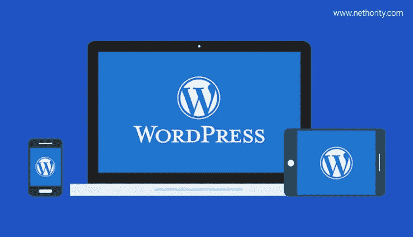
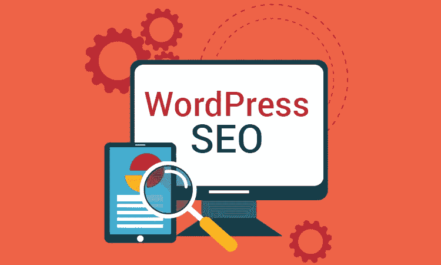

# 为什么每个小企业都需要 WordPress 网站的 5 个原因

> 原文：<https://medium.com/hackernoon/5-reasons-why-every-small-business-needs-a-wordpress-website-2dbd5179fa4a>

[Nethority.com](http://www.nethority.com)

这是一个一切都数字化的时代。除了线下存在，每个企业都需要在 WWW 上在线存在。如果你有一个小企业，你必须把它拖到网络世界。即使你的企业在本地提供服务，你也必须能够在线访问。世界正在快速变化，你不应该是最后一个加入这场竞赛的人，对吗？

要在网上出现，你的企业需要有一个网站。最好的和负担得起的方法是开发一个 WordPress 网站。让我们来看看为什么你的小企业需要一个[WordPress](https://wordpress.com/) 网站。

# 1)创建和维护一个 WordPress 网站是没有麻烦的。

对于小企业来说，创建一个网站是行走在网络世界的第一步。如果你有计算机语言的基础知识，WordPress 网站是很容易开发的。有了编码的基础知识，就可以学习 WordPress 开发，创建自己的网站。

每个网站都需要定期维护和更新。你不能年复一年地使用同样的网站设计和结构，因为它可能会过时。

如果你没有编码方面的技术知识，可以聘请专业人士来帮你做。在 Nethority，我们是专家，将帮助您实现在线业务，并帮助您取得成功。查看我们的 [**网站设计与开发**](http://www.nethority.com/services/web-design-development/)

[Nethority.com](http://www.nethority.com)

# 2) WordPress 网站开发不会花你很多钱

WordPress 提供了大量免费的主题和插件。如果你希望有一个基本的网站，那么就用免费的主题。也有付费主题允许你定制你的网站。WordPress 让你免费编辑设计，因此，网站维护不会花你一分钱。

如果你是外行，愿意聘请设计师做网站开发，那么同样，WordPress 网站也不会花你多少钱。

# 3) WordPress 是搜索引擎友好的

SEO，搜索引擎优化，是一个网站必须要做的。优化你的网站，使其对搜索引擎友好，会让它在搜索结果中排名靠前。我无法强调 SEO 对一个网站的重要性。你有一个网站，但如果人们无法在谷歌的第一页看到它，那么就没有人会访问你的网站。当你浏览的时候，你会看谷歌的第一页吗？

好消息是——WordPress 是 SEO 友好的。因此，你不需要太担心你的网站排名。它为你提供了许多插件，使得网站优化变得非常容易。然而，你可能仍然需要在 SEO 上努力。聘请 [**SEO 专家**](http://www.nethority.com/services/seo-services/) 总是被推荐的。

[Nethority.com](http://www.nethority.com)

# 4) WordPress 提供多种媒体风格

一去不复返的日子，网站看起来很无聊，只有内容填充在里面。当网站包含图片、横幅和视频时，它看起来非常有吸引力。图片和视频让网站更吸引人，更吸引眼球。WordPress 支持多种媒体风格和格式。因此，WordPress 给了你通过添加各种媒体使你的网站吸引人的自由。利用 WordPress 的这个功能，在你的网站上以更好的方式传达你的商业组合。

# 5) WordPress 不断更新其主题和功能。

如前所述，你不能多年保持相同的网站设计。随着时间的推移，你需要改变一些功能，特性或添加新的页面，使它看起来新鲜。网站维护和重新设计是一个需要定期进行的过程，以使网站焕然一新。

WordPress 不断更新它的主题、功能和插件。因此，随着 WordPress 的更新，你也可以更新和发展你的业务。

**注:** WordPress 搭建一个电子商务网站并不是很有效。因此，如果你拥有一家店铺，并且愿意从事电子商务，那么就去 Woocommerce 电子商务网站这样的平台。

不要拘泥于线下业务。让它接触到全球的广大客户。开始使用 WordPress 网站，并看到您的业务增长。