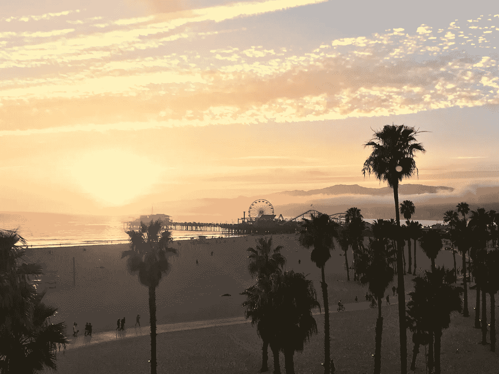

# 我“看好”洛杉矶创业生态系统的 6 个理由

> 原文：<https://medium.com/hackernoon/5-reasons-why-im-long-the-la-startup-ecosystem-c6b79c4c3466>

最近我经常被问到这个问题:一个小小的达拉斯种子基金是如何如此频繁地来到洛杉矶的？我们在洛杉矶发现的初创公司有什么吸引人的地方？洛杉矶的生态系统是其他有抱负的[初创企业](https://hackernoon.com/tagged/startup)社区的蓝图吗？

**我们在洛杉矶生态系统中如此活跃有几个原因:**
1)电子竞技(娱乐业基于此)
2)获得后期资本的渠道丰富
3)来自其他大型成功科技公司的科技人才和创始人
4)大学系统培养出工程师和其他科技员工
5)市场上的早期机构资本远远不够
6)相对便宜，而且天气也不错

以下是对其中每一个问题的扩展思考:

# 电子竞技——娱乐业(特定于美国)

我们在洛杉矶的第一笔交易是 [Mobalytics](https://mobalytics.gg/) 的[种子轮](https://www.crunchbase.com/funding_round/mobalytics-2-seed--c00f219f)(2016 年 10 月)。我们很幸运地与[创始人基金](https://foundersfund.com/)、[通用催化剂](https://www.generalcatalyst.com/)、 [GGV](http://www.ggvc.com/) 、[阿尔马兹资本](https://www.almazcapital.com/)和其他公司一起进入了那一轮。这也是我们的第一笔电子竞技交易。当我们开始更多地关注电子竞技时，洛杉矶是一个自然的选择，因为圣莫尼卡/威尼斯海滩附近确实是美国的电子竞技中心

为什么它是一个电子竞技中心？洛杉矶是全球娱乐业的领导者之一。关于电子竞技我总是怎么说的？它本质上是一个内容生产和分发平台。电子竞技是一项娱乐事业，它在像洛杉矶这样的娱乐中心蓬勃发展。

# “本地”获得后期资本

许多生态系统都有天使和一些种子资金。然而，这并不是最难的部分，这是大多数创业生态系统仍然难以捉摸的 A 轮和 B 轮资金。虽然许多初创公司成功地从湾区投资者那里筹集了这些资金，但这种情况并不多见。

洛杉矶生态系统有一点是其他生态系统没有的，那就是赢得了从种子阶段毕业的基金经理，并筹集了大量 A 轮和成长期基金。

此外，湾区的投资者似乎并不像在其他地区那样，对乘飞机去洛杉矶有太大的问题。我不认为我们洛杉矶的公司在湾区的所有一级基金面前有任何问题。然而，我们位于达拉斯和奥斯汀的公司很难获得更多湾区的喜爱。在某种程度上，我认为许多湾区基金仍然认为洛杉矶是“本地的”或“足够本地的”

# 大型本地科技公司培养的人才

在过去十年左右的时间里，有许多大型科技公司在洛杉矶生态系统中达到了独角兽的地位。这些公司中的许多已经培养出了一些优秀的工程人才，他们已经收购了一些较小的初创公司，并且他们鼓励当地的大学继续培养计算机专业的毕业生，这些毕业生将会在大学毕业后找到很好的工作。这使得生态系统中人才泛滥，公司可以在此基础上发展壮大。

这些工程师中的许多人后来都成为了伟大的创始人，他们见证了公司从无到有的发展，他们向顶尖的创始人学习，他们在世界上一些最知名的科技公司发展了自己的产品设计和工程能力。所有这些，就在洛杉矶。

# 地方大学培养工程人才

没有工程人才，你无法建立伟大的科技公司。如果没有优秀的大学来滋养生态系统，就不可能有本地的入门级工程人才。这是洛杉矶生态系统的一个重要组成部分，而全国各地的许多初创企业生态系统都没有、也不会有，只是不理解其重要性。

# 机构早期资金短缺

洛杉矶有很多钱。它只是在某些方面没有专注于技术。有很多天使投资者，也有一些种子前期和种子期基金专注于这个领域，但没有你想象的那么多。肯定不足以资助当地独角兽和大学创造的伟大创始人、想法和技术人才的高流量。

你几乎可以在威尼斯海滩扔一个排球，击中一个有好想法的创始人，他实际上有能力围绕这个想法建立一个企业(以及建立这个企业的能力)。

# 它很便宜，天气也很好

相对于湾区，LA(包括圣莫尼卡和威尼斯)要便宜很多(住，吃，工作，一切)。

哦，还有天气…

So beautiful that even I can take good photos there…..

# 最后

关于“第二层”或“飞越”创业市场以及它们如何“成为下一个海湾地区”的文章很多。

洛杉矶的生态系统感觉不像是在试图成为海湾地区。然而，洛杉矶确实感觉像是所有这些非旧金山、非纽约、非洛杉矶市场应该如何从“飞越式”发展到一级市场的蓝图。洛杉矶以几个大的胜利开始，一个巨大的工业中心(娱乐)和当地大学顶尖的计算机科学课程。随着独角兽的退出，想法开始流动，资本也开始流动，资本与来自许多优秀的当地大学的工程人才的稳定流动相结合。与此同时，早期投资者成长为后期投资者。那是蓝图。许多城市都在努力成为那样的人，但他们失败了，因为他们有错误的人关注错误的事情。

如果你读到这里，并对我们的洛杉矶投资组合(全部自 2016 年 10 月起)感到好奇，这里是:
[Ateyo](https://ateyo.com/)
[filter pop](https://www.filterpop.com/)
[FanAI](http://fanai.io/)
[Mobalytics](https://mobalytics.gg/)
[PlayVS](https://www.playvs.com/)
[四分卫](http://www.quarterback.gg/)
[后起之秀](https://www.upcomer.com/)

[斯蒂芬·海斯](https://www.linkedin.com/in/stephen-hays-71b571101/)是一位[风险资本](https://hackernoon.com/tagged/venture-capital)投资者，已经投资了许多电子竞技团队和创业公司。

[点击这里，在 Twitter 上关注斯蒂芬](https://twitter.com/hazesyah)