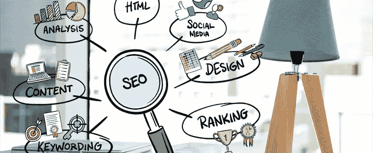

# 我们重新设计网站的 5 个原因(以及您应该重新设计的原因)

> 原文：<https://medium.com/hackernoon/5-reasons-why-we-redesigned-our-website-and-why-you-should-fe015ce870e>

网站是你在网上出现的一根金毛。它复制了你的品牌价值，并在潜在客户中创造了第一印象。然而，仅仅有一个网站是不行的。

你的网站必须给用户提供愉快的体验。一个过时而复杂的网站是你最不想给他们的东西。重新设计网站是根据最新趋势更新你的在线形象的最好方法。我们中的许多人都避免考虑瓶颈问题。但是拥有一份清单对于成功执行网站重新设计计划非常有用。

在成为网站重新设计马拉松的一员后，我们决定在这个博客里分享我的经历。

# 重新设计我们现有网站的理由

> **提高用户参与度和转化率**

我们很少面临网站用户减少的问题。事实上，我们的网站每天都有近 250 名新用户。好消息是，大多数游客都属于我们的最佳位置。

看看下面的截图:

如果当时情况不错，那我们为什么要考虑重新设计网站呢？好吧，这就是答案。当这一切发生的时候，我们有很多期望。一个每月有 808 个访问者的联系页面每周肯定会收到至少 10 个业务查询。

但可悲的事实是，这并没有发生。

有几个月，尽管网站流量很大，但我们收到的入境业务查询却很少或没有。此外，我们发现网站的跳出率很高，这表明大多数访问者在访问一个页面后就离开了。

这些数据点表明，我们的网站存在一些重大差距。我们知道这不能通过重新设计单个页面或单独优化联系页面来解决。相反，用户的旅程必须从头开始进行定制，以实现有效的转化。

> **提高 SEO 和网站性能**

我们期待奇迹会自己发生。这种情况确实发生了很长时间。
我们高质量的内容材料做得很好，出现在搜索结果的第一页。我们的博客[使用 JMeter](https://www.sayonetech.com/blog/parameterization-using-jmeter/) 参数化仍然是访问量最大的页面之一。

我们做了大约 1-2 年的好事。然后，魔力开始逐渐消退。

随着谷歌推出更多更新，我们看到有机搜索结果显著减少。最近的搜索引擎优化审计表明，我们的一些网页不符合新的搜索引擎优化更新。

页面结构的根本改变是必要的。在代码层面上，我们发现很难实现新的 SEO 策略，如结构化数据标记、开放图协议标签和移动优化增强。

这促使我们结合我们的数字营销计划，阐述无缝网站之旅。

> **成为我们客户的代言人**

你的网站应该反映你的品牌价值。网站加强了我们的在线形象，并与我们的潜在客户沟通。因此，确保你的网站和业务代表在任何地方都表达相同的信息是至关重要的。

在这个联盟中，我们希望成为我们的客户愿意倾听的声音。积极倾听的过程可以很容易地告诉我们顾客的问题和需求。

随着他们的要求和需求不断变化，我们迫切需要调整我们的信息，以便我们以他们理解和喜欢的方式进行沟通。为了实现这一目标，我们制定了一个新的内容战略，以满足我们的商业价值观和客户需求。

这一新的内容战略需要在网站上添加一些元素，并对内容流进行重大修改。

> **适应不断变化的设计和用户界面趋势**

我们的旧网站结构是几年前设计和开发的。从那以后，我们对现有布局进行了一些小的设计修改，而没有进行太多的改造。

大约 2 年后，我们觉得它看起来过时了。我们的新网站必须看起来更受欢迎，在视觉上更令人愉悦。我们已经有内部资源来创建一个很棒的网站布局，然后使用利基技术来开发它。他们在这一领域的经验和专业知识增强了我们的信心。

> **为我们的用户创造无缝和愉快的体验**

用户体验是在线成功的关键。网站的目的主要是吸引访问者，并将他们转化为潜在客户。

如果用户觉得你的在线门户网站直观易用，那么你一定会获得更多的忠实用户，并产生更多的来电咨询。

我们以前的网站结构有点复杂。有机会让它变得更好，更吸引人，我们抓住了这个机会。我们最终选定了一个视觉上赏心悦目且易于浏览的网站。

我们的目标是为用户创造愉快的体验。

# 我们如何设计一个 SEO 友好的网站？

重新设计你的网站可能是一个搜索引擎优化的噩梦。那么，我们是如何完成这项任务的呢？

*   **明确的网站重新设计策略**

我们对自己的需求有明确的想法。新网站必须维持现有的流量，降低跳出率，并提高转换率。

改版后的网站内容经过精心准备和讨论，以符合我们的品牌价值。此外，我们将网站重新设计计划分为两个阶段:第一阶段和第二阶段。

在第一阶段，我们计划实现所有的必需品，从技术和搜索引擎优化的角度来看，使网站防呆。第二阶段包括所有提高性能的细节。

*   **右套队**

改造一个现有的网站是搜索引擎优化友好的，需要一个团队谁有各种搜索引擎优化元素的公平知识。一个坚实的团队与 SEO 的理解可以很容易地节省时间和触发的进展。

我们的团队由设计师、开发人员、数字营销专家和经验丰富的项目经理组成。从构思到实施，我们所有人通力合作，集思广益，共同实现目标。

每一分钟的更新都传达给了整个团队。这确保了参与项目的每个人都在页面上。

*   **敏捷项目管理**

一个内部项目通常会被放在不重要的位置。由于新网站标志着一个重要里程碑的开始，我们遵循最佳敏捷实践来跟上步伐。

数字营销世界是不断发展的。不时会有更新。这意味着我们必须睁大眼睛，竖起耳朵，捕捉任何可能影响或有利于我们计划的新东西。

在项目执行的任何阶段都可能产生新的想法。我们的并行 sprint 执行模型帮助我们适应了随着我们的发展而来的新需求。交互式规划和反馈循环加快了流程，加快了上市时间。

*   **SEO 改进**

在过去的几年里，SEO 已经走过了漫长的道路。因此，我们不想使用同样的老技术。事实上，我们的重点是在网站的每一个元素的改善，无论是设计，内容，功能或搜索引擎优化元素。

我们带来了某些代码修改，如 CSS 和 JavaScript 缩小，以提高页面速度。HTML 代码中引入了结构化数据标记，以便在搜索结果中创建更多的可见性。

[谷歌的移动优先索引](https://webmasters.googleblog.com/2016/11/mobile-first-indexing.html)更新是我们的首要任务之一。为此，我们认为手机版是我们的主要网站版本。在开发阶段，我们优先考虑了移动页面速度、加载时间和响应能力。

*   **预发布 SEO 步骤**

没有什么比手边有一份清单更好的了。我们准备了一份预发布清单，详细列出了关键的 SEO 待办事项，以确保我们不会遗漏任何内容。

在这方面，还获取并保存了旧网站的审计报告，以便进行比较分析。另一个重要因素是在试运行模式下对网站进行全面的启动前审计。

从搜索引擎优化的角度来看，丢失网址和 404 页面可能是灾难性的。同样，我们不能冒任何影响我们网站现有排名的风险。

因此，在发布之前，我们对网站的分析、技术元素、链接、内容和性能方面进行了全面审查。这有助于我们发现差距并及时解决。

*   **发布后 SEO 步骤**

一旦你的改版网站上线，它不会就此结束。对我们来说，新网站的目的很明确——提高转化率。每个数据点都很重要。

从重新设计的网站推出的那一刻起，我们就一直在密切关注网站流量的差异。流量、用户或跳出率等的任何变化都可以告诉我们到底哪里出了问题。同时，我们正在进行网站的第二阶段更新。

# 结果呢

终于，我们的新 [SayOne](https://www.sayonetech.com/) 网站准备好了！所有这些个月的计划和辛勤工作现在都公之于众了。我们太高兴了，无法抑制我们的兴奋。

那么，这样的努力真的值得吗？尽管我们仍处于得出结论的初期阶段，但我们已经看到了一些重大改进。见下面截图:

我们的用户和会话数量显著增加了 10%。与上个月的数据相比，结果如下:

经过初步分析，我们可以自信地说，我们重新设计网站的决定是正确的。理想情况下，每家企业应该每隔 2-3 年更新一次网站。我不能向你保证这将是一发子弹。然而，通过正确的计划和方法，你一定能及时赢得胜利。

如果您想进一步了解我们网站重新设计策略的细微差别，或者需要一些网站重新设计的帮助，请随时与我们联系。我们知道这些坑坑洼洼，也经历过。所以，我们比任何人都更能帮助你！

*原载于*[*https://www . sayone tech . com/blog/5-reasons-why-we-designed-our-website/*](https://www.sayonetech.com/blog/5-reasons-why-we-redesigned-our-website/)*。*