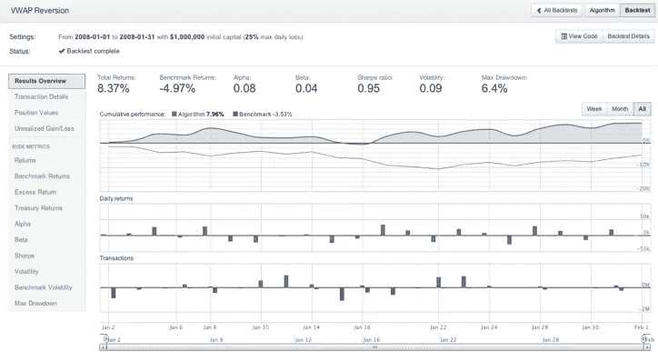
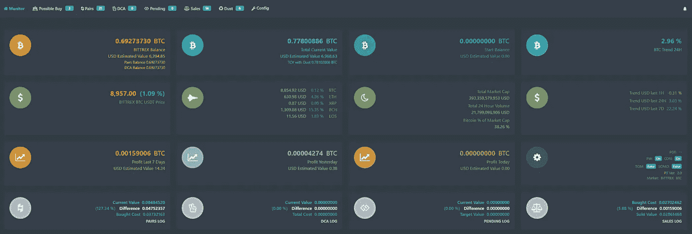

# 你应该自动化你的加密交易策略的 5 个理由

> 原文：<https://medium.com/hackernoon/5-reasons-why-you-should-automate-your-crypto-trading-strategy-5df105b9230f>

想在睡梦中赚钱？自动化交易可能是最适合你的！交易的原则包括用技术指标和实时市场数据把你的策略分解成一系列的进场和出场规则。一旦完成，一个程序将监控来自加密交易所的实时价格数据，并根据您定义的规则进行交易。幸运的是，有许多专业工具使整个过程比听起来容易得多！

在这篇文章中，我们探讨了为什么你应该考虑自动化你的加密交易策略的五大理由。

# 1.加密交易机器人消除了你交易中的情绪

不管你是否意识到，你的情绪在你的交易决策中起着巨大的作用。有多少次你决定降低止损，因为你“知道”资产会反弹。或者有多少次你持有的仓位超过了你的利润目标，结果却亏得更少了？

有了自动交易系统，你可以预先定义你的买入信号、止损和利润目标。交易机器人会为你执行这些规则，把你的情绪完全带走。这样做可以防止你在连胜时过于骄傲，防止你在连败时试图过度补偿你的交易。随着时间的推移，这种一致性可以大大增加你的底线。

# 2.您可以根据历史数据测试策略的盈利能力

几乎所有的交易机器人和自动交易系统都有一个回溯测试器。回溯测试是一种工具，它将根据多年的历史数据模拟策略的性能，以确定其盈利能力和风险。运行回溯测试后，该程序将输出有用的统计数据，以确定您的策略的盈利能力和有效性。

你的交易策略需要考虑的一些最重要的指标:

*   **交易数量**
*   **利润 vs 基准(比如买入持有比特币)**
*   **赢/赔率**
*   **最大连续亏损**
*   **最大提款(投资组合价值的单次最大跌幅)**

当回测你的策略时，最好是在交易前尽可能地降低风险和损失。如果不这样做，可能会导致 ***意想不到的损失*** ，即使你的回溯测试结果确定这是一个有利可图的交易策略。

# 3.交易机器人可以不间断地在许多市场运行

使用加密交易机器人最明显的好处之一是它能够 24/7/365 运行*。由于加密交换不会关闭，你的潜在利润大大增加！除此之外，大多数交易机器人允许你在多个交易对中配置和执行你的策略。*

# *4.提高交易速度和订单执行*

*使用加密交易机器人可以让你比手工交易更有效地计算和执行你的进场/出场点。无需经常登录多个交易所，您可以更快下单，并从每笔交易中获得更多利润。*

# *5.详细的交易报告和实时通知*

**

*手工记录交易和计算收益是非常痛苦的。几乎所有的[加密](https://hackernoon.com/tagged/crypto)交易机器人都有一个有用的交易仪表盘，可以总结你每项策略的盈利/亏损。大多数[工具](https://hackernoon.com/tagged/tools)也能很好地与流行的消息平台(如 Telegram)集成，并且每当你的交易机器人决定下单时，就会 ping 更新。*

*加密交易机器人可以非常有利可图，当他们配置得当，并由交易员回测。在开始之前，重要的是你要知道一个策略在牛市、熊市和横盘时的预期表现。回溯测试你的策略是最好的方法之一，应该在投入使用之前完成。如果你想开始自动化你的交易策略，看看一些专门为密码交易员打造的[专业交易机器人](https://www.cryptotrader.tax/trading/crypto-trading-bots/)。*

**用*[***CryptoTrader***](https://www.cryptotrader.tax)***轻松申报你的加密货币资金收益。*税收**。*

**原载于 2018 年 4 月 23 日*[*www . cryptotrader . tax*](https://www.cryptotrader.tax/trading/5-reasons-why-you-should-automate-your-crypto-trading-strategy/)*。**