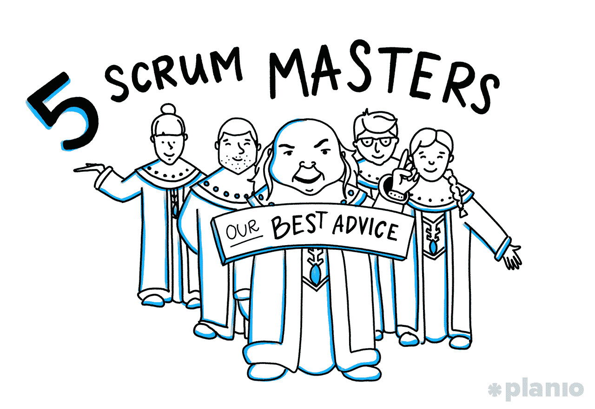
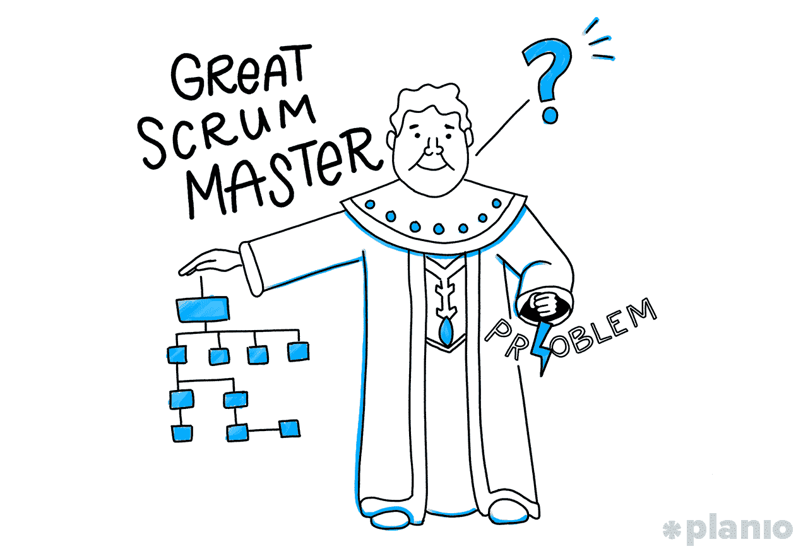
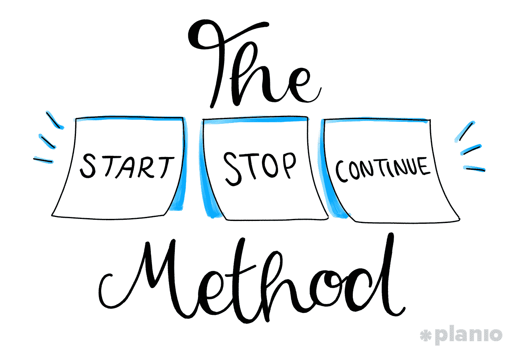

# 5 位 Scrum 大师给领导高绩效团队的最佳建议

> 原文：<https://medium.com/hackernoon/5-scrum-masters-on-their-best-advice-for-leading-high-performing-teams-5b6db1165ab>

## 让您的敏捷团队走上正轨需要一套特定的技能

如果你正在做一个复杂的项目，无论是移动应用、网站重新设计还是产品，没有比使用 Scrum 的 T2 更好的方法来管理你的团队和时间了。

因其与橄榄球“scrum”相似而得名，在“Scrum”中，队友们聚在一起计划他们的行动，Scrum 是一个敏捷的项目管理框架，涉及高绩效、跨职能团队一起计划、构建和迭代，直到项目完成。

Scrum 的核心是一个被称为 Scrum Master 的特殊角色。

是的，这听起来像是《龙与地下城》里的东西，但事实是，如果你[使用 Scrum](https://plan.io/blog/how-software-ag-implements-scrum-using-planio/) 构建一个项目，你*需要*某个人来指导并保持你的团队在正轨上。但是一个 Scrum 大师到底在做什么呢？一个简单的谷歌搜索将会显示出数百个教授你 Scrum 大师之道的课程，但不幸的是，这仅仅是个开始。

我们想从实际做这件事的人那里了解领导一个高性能的 Scrum 团队是什么感觉。所以今天，我们采访了来自世界各地的 5 位顶级 Scrum 大师，他们曾在美国运通、思科和戴尔等公司工作过，来帮助揭示成为 Scrum 大师的现实——他们的角色、职责，以及他们如何管理一个有效和高效的敏捷团队。

如果你曾经好奇成为一名 Scrum 大师需要什么，这将带你去那里。

***在我们进入…*** *之前，技术是让伟大的 Scrum Master 保持正轨的支柱。如果你正在寻找一个专门为敏捷和 Scrum 设计的强大的项目管理工具，看看*[*Planio*](https://plan.io/)*。你甚至可以在这里注册* [*获得 30 天的免费试用。*](https://accounts.plan.io/signup/Diamond)

# 什么是 Scrum 大师？

> “如果你能看到你的路一步一步地展现在你面前，你就知道那不是你的路。你走的每一步都是你自己的路，”

美国神话学家坎贝尔·约瑟夫写道。

Scrum 遵循同样的观点。你知道你工作的方向，但也清楚地意识到通往那里的道路可能会改变。如果我们这样看待 Scrum，那么 Scrum Master 就是确保团队朝着最终目的地前进的人，不管他们采取什么步骤。

更具体地说，Scrum Master 有一套特定的技能，允许他们从他们的团队中得到最好的，同时也让团队对他们自己和他们做出的承诺负责。

这可能意味着任何事情，从促进每天的 Scrum 会议(称为站立会议)，到保护团队免受可能想要扩大项目范围的外部利益相关者的影响，到指导[敏捷项目管理原则](https://plan.io/agile-project-management/)并确保没有任何事情妨碍团队做好他们的工作。

正如[敏捷教练和](https://www.linkedin.com/in/andysio/)[战略象限](https://www.strategicquadrant.com/)创始人安迪·西奥所说，Scrum 大师就像你的敏捷团队的医生:

> “就像医生一样，Scrum master 需要监控“*生命体征*”，以确定团队是否在进步，是否尽了最大努力。如果没有，Scrum 大师需要诊断根本原因，并与团队合作，确定可行的解决方案来克服这些问题。”

由于 Scrum Masters 将大部分时间花在与内部和外部团队交流状态、目标和问题上，Sio 还表示，他们专注于发展软技能也很重要，比如有效的沟通、促进，甚至是提高他们的魅力。

“你希望人们在离开会议后感觉良好，”他解释道。“有效的会议促进技能将在产生更高的团队讨论和参与度的同时做到这一点。”

这听起来像是一个管理职位，但是理解 Scrum Master 不是一个经理是很重要的。在 Scrum 中，团队是自我管理的，这意味着 Scrum Master 更像是一个教练和向导。事实上，我们采访过的大多数 Scrum Masters 都把自己描述为——一个为人民服务的领导者，而不是相反。

> “作为一个仆人式的领导者，一个具有高魅力的 Scrum 大师更有可能有效地领导、影响、吸引和激励团队和他们周围的人。”

“这些属性是改变文化的关键，而文化是任何敏捷转型工作的一部分，”Sio 解释道。

# Scrum Master 的角色和职责是什么？

如果 Scrum 的角色是指导和训练 Scrum 方法论，他们具体是怎么做的？他们对团队的确切职责是什么？

得克萨斯州奥斯汀 [Jackrabbit Mobile](https://www.jackrabbitmobile.com/) 的产品经理兼 scrum 大师 Grayson Smith 解释道:“在我看来，一个优秀的 Scrum 大师拥有这三种能力:她有条理，问正确的问题，并且善于解决问题。

> “作为一名 scrum 大师，你有责任确保流程得到遵循，每个人的时间都得到合理的重视。不过，这个过程是什么，要由你的团队来定义。”

如果你不确定从哪里开始，Smith 建议[从一些 Scrum 基础知识](https://plan.io/blog/ultimate-guide-to-implementing-agile-project-management-and-scrum/)开始，然后采用一个基于最适合你的团队的结构。所有 Scrum 大师的一些基本职责包括:

*   组织和细化积压工作
*   规划冲刺
*   促进日常 Scrum 会议或“站立”
*   运行 sprint 回顾会议
*   测量并跟踪敏捷指标，以确保您有望达到目标

然而，最重要的是，Smith 说一个好的 Scrum 大师为团队服务，充当团队和涉众之间的门户，知道什么时候竖起墙来允许工作，什么时候把它们推倒:

> “一个好的 scrum 大师也知道如何平衡自己解决问题，以及何时让产品经理或产品负责人参与进来。”

# 成功的 Scrum 大师如何支持高绩效团队

Scrum 大师和他们团队中的人一样优秀。尤其是考虑到 Scrum 团队是自我管理的。按照 Sio 的说法，这意味着“一个优秀的 Scrum 团队需要有自我激励的、跨职能的、以客户为中心的团队成员。更重要的是，和体育团队一样，Scrum 团队需要关注团队的成功，而不是个人的成功。”

作为一名 Scrum 大师，你的角色是始终关注最终产品，为你的高绩效团队指明正确的方向，并让他们去做。让我们看一下 Scrum 大师的每一项主要职责，听听这些大师是如何高效地处理这些职责的。

# 产品积压细化和评估

敏捷项目始于了解为用户构建功能软件所需的清晰步骤。这意味着把你的大的最终目标分解成小的增量来实现。

这被称为产品 backlog，在 Scrum 中，Scrum Master 通过与产品所有者一起“整理”它来帮助这个过程。梳理包括浏览每一部分，或“用户故事”,并估计完成它所需要的时间和精力。

在这些修饰会议中，Scrum Master 有很多方法可以提供帮助，例如:

*   **如果用户故事还没有完成，就编写用户故事**(可以通过一系列的一次或多次整理会议“从头开始”构建产品积压)
*   **将太大的用户故事**(恰当地称为“史诗”)分解成更易管理的片段
*   **改进或澄清写得不好的用户故事**
*   **估计处理积压项目所需的时间**
*   **增加验收标准**并保持某件事完成时间的清晰定义
*   **深入调查积压工作**进行更长远的规划

敏捷的好处在于团队在开始开发之前不必有一个完整的、完善的产品积压。相反，人们理解积压会在整个过程中发生变化并得到改进。

> “我通常做的是帮助 scrum 团队专注于产品目标和愿景，以交付客户的价值，”

Sio 解释道。“然后，scrum 团队应该开发并排列一个高级路线图来实现这些目标。话虽如此，scrum 团队需要花时间将高层次的工作分解成更小更独立的用户故事，这样团队才能更快地为客户提供价值。”

为了将更大的目标分解成更小的用户故事，[资深 scrum 大师、第 3 区创业孵化器](https://www.linkedin.com/in/shaungamboa/)前创新经理肖恩·甘博亚建议遵循 S.M.A.R.T 框架。这意味着确保每个独立用户的故事是:

*   **特异**(简单、合理、显著)
*   **可测量**(有意义，激励)
*   **可实现**(同意，可实现)
*   **相关**(合理、现实、有资源、注重实效)
*   **时限**(有时间基础、有时间限制、有时间/成本限制、及时、有时间敏感性)

一旦积压得到了适当的整理，用户故事得到了明确的定义，就该开始构建了。

# 冲刺计划

敏捷和 Scrum 的开发周期都是基于短期的 Sprints，其中来自产品积压的项目被构建到工作产品中。典型的 sprint 持续 1-4 周，并且在整个项目中应该保持相同的长度，因为这使得团队能够根据他们过去的表现更准确地计划未来的工作。

在 sprint 周期的开始，Scrum Master 与产品负责人和团队一起工作，帮助评估和计划在 sprint 结束时能够和应该完成什么。虽然产品负责人会决定此时最重要的是关注什么用户故事，但是 Scrum Master 有责任促进开放的对话和讨论，以确保团队不会承担太多。

> “虽然我通常会根据与我一起工作的团队来改变我的方法，但两个不变的是，我总是留出时间来整理自己的积压工作，并且我总是有一个基于讨论的 sprint 规划会议，”

史密斯解释道。这种基于讨论的计划可以采取多种形式。但是对甘博亚来说，如何计划你的冲刺最好的类比是把它想象成建立一个科学实验:

“当我计划冲刺时，我会 100%地考虑我们认为‘完成’会是什么样子，并按增量分解它。那么，冲刺是一个每个人都同意的假设，将是“完成”的 1/n 增量。在我们工作的过程中，我们通过构建、测量和学习来测试我们的假设，这样我们就可以在下次调整我们的方法。”

值得注意的一点是，Scrum 主管在这些 sprint 计划会议上没有任何决策权。他们只是在那里帮助指导和估计每次冲刺需要的时间。

# 单口站立

在 sprint 的整个过程中，Scrum Master 扮演着重要的角色，每天检查团队，确保任何障碍都被迅速处理。在这些每天 15 分钟的“站立”中，Scrum 大师通常会问一系列标准问题:

*   自从我们上次谈话以来，你完成了什么？
*   你现在在做什么？
*   有什么阻碍了我们的工作？

甘博亚将这一点分解成一个更简单的陈述，他说站立都是关于“交流我们今天如何获胜，以及我们今天和明天如何互相帮助。”

虽然看起来很简单，但这些简短的问题可以很快变成长时间的对话。所以，Scrum 大师掌握沟通的方法是很重要的。

“如果团队成员没有遵循你建立的站立更新结构，来自 scrum master 的机智提醒可以保持站立的相关性和效率，”Smith 解释道。

> “当讨论出现时，最好由团队中的几个人来解决，而不是整个团队，这是你的工作，提出这个事实，并要求这些团队成员在站立后进行停车场讨论。”

此外，Scrum Master 有责任确保每个人都对正在进行的工作感到满意。日常站立经常违背我们大多数人习惯的工作方式。在冲刺阶段，团队成员会对共同的目标产生内在的兴趣，并学会互相管理以实现目标。对大多数习惯于等级森严的环境的员工来说，对同事负责是一个陌生的领域。然而，这正是 Scrum 大师的观察和说服技巧派上用场的地方。

为了帮助克服这种不适，Smith 说 Scrum Master 在站立时要求工程师澄清问题是至关重要的。这有两个目的:

1.  这有助于团队更好地理解你认为这个人可能没有明确陈述，但想说的一些事情
2.  它允许团队作为一个整体，在更多的上下文和信息的帮助下，潜在地当场解决问题

最后，重要的是，Scrum Master 将每日站立限制在工程团队，即使有外部利益相关者想要参加:

“如果管理不当，这些人可能会使站立对团队本身毫无用处，因为这往往会将会议变成对高层的姿态，而不是快速召开会议来帮助团队解决内部问题，”Smith 解释道。“向利益相关者解释他们反馈的适当渠道，以及他们参加站立会议的方式会影响团队的坦诚，这有助于避免这种情况。”

# 冲刺回顾

每个 Sprint 都以回顾结束——团队聚在一起反思他们自己的过程，检查他们的行为，并找到适应未来的方法。不是每个人都喜欢这种对他们如何工作的审查，所以 Scrum 大师创造一个心理安全和支持的环境是很重要的。

Sio 将 Scrum 回顾的主要目标描述为两个方面:

1.  确定团队可以在下一次或不久的将来的冲刺中实施和改进的具体领域
2.  庆祝团队成功并保持士气

“我喜欢使用开始、停止和继续的方法，”Sio 说。

“我给团队成员发便利贴，写下他们在下一次冲刺中要开始、停止和继续做的事情。然后，我通过将相似的想法组合成亲和图来收集便利贴。我还使用多重投票的方法，让团队成员就团队希望在下一次 sprint 中解决的最紧迫的问题进行投票。”

便利贴系统工作得特别好，因为它允许 Scrum Master 听到更多内向的团队成员的声音，这些成员可能不喜欢在团队中发言。

这一点尤其重要，因为回顾的目标总是帮助团队在下一次冲刺中看到他们可以做得更好的地方，即使很难听到。

正如甘博亚解释的那样:“一次成功的回顾意味着某人的感情可能受到了伤害，但他们从中吸取了教训，成为了一个更好的团队成员和个人。不成功的人意味着没人有话可说。”

# 衡量指标和定义成功

Scrum 很大程度上依赖于衡量你的结果，并相应地调整你的方法。一个成功的 Scrum 大师可以通过成为团队的眼睛和耳朵来提供帮助——关注你是否达到了你需要达到的指标。如果没有，帮助寻找改变的方法。

但是 Scrum 大师应该关注什么指标呢？

根据[敏捷促进发展](http://agileforgrowth.com/)的认证 scrum 大师和教练 Kamlesh Ravlani 的说法，敏捷团队使用了几十种度量标准，包括:

*   团队速度或故事数量
*   交换流
*   燃尽/燃尽图表
*   周期
*   投资收益率
*   产生的影响
*   客户满意度，NPS
*   员工幸福感
*   缺陷计数
*   代码覆盖率
*   -%自动化等。

然而，围绕所有这些指标进行优化是不可能的。因此，Ravlani 说，重要的是你要确定 2-3 个你想要优化的关键指标。

“我有一个经验法则，我用它来指导领导者和团队，”他解释道。

> “领导者、利益相关者和团队成员想要衡量和跟踪的任何指标都应该具有:A)定义的目标，以及 b)结束日期，在该日期之后，衡量该指标可能不会给组织带来太多好处，因此将被停止。”

例如，假设您的团队领导想要度量周期时间——大多数敏捷组织使用的最基本的度量之一。周期时间越短，你就能越快地挑选新想法，实施它们，并发布给你的客户。

理论上，听起来不错。但是 Ravlani 解释说，仅仅优化这一个指标而没有明确的目标和结束日期，并不能让你真正了解你的团队是否成功。

“大多数敏捷人员忘记了更快地发布特性可能不会反映出对客户和组织的真正好处，”他解释道。

> “只有当组织朝着正确的方向前进时，更快的发展才是有益的。如果不是这样，它实际上会伤害组织。它就像一只无头鸡，跑得快还是更快有关系吗？”

在你的目标之外设定一个结束日期也有助于你停下来，看看你从改进这个指标中得到的好处。如果在你的实验结束时，你没有看到你想要的结果，那么你知道是时候停下来，选择另一个来衡量和改进了。

# 成为一名有效的 Scrum 大师的最后想法

scrum 大师的角色既是领导者又是追随者，这并不容易做到。能够专心倾听你的团队，而不是试图管理，而是帮助他们自助，这需要一定的个性。

如果你对敏捷产品开发更感兴趣，看看我们的 [**敏捷终极指南**](https://plan.io/blog/ultimate-guide-to-implementing-agile-project-management-and-scrum/) **和** [**免费试用 Planio**](https://accounts.plan.io/signup/Diamond)**—**[**敏捷团队的最佳项目管理工具**](https://plan.io/blog/best-project-management-tools-used-by-top-technical-teams/) **。**

# 嘿，我是乔里！

我帮助公司和有趣的人通过巧妙而集中的写作讲述他们的故事。想一起工作吗？给我发邮件到 hello@jorymackay.com