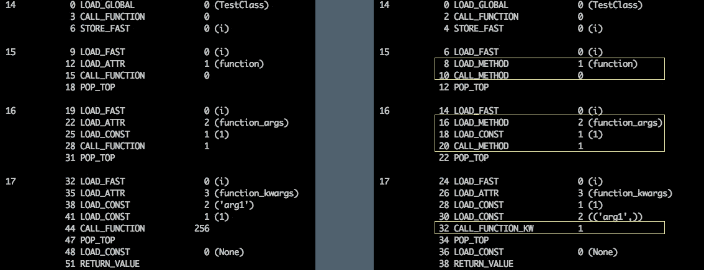
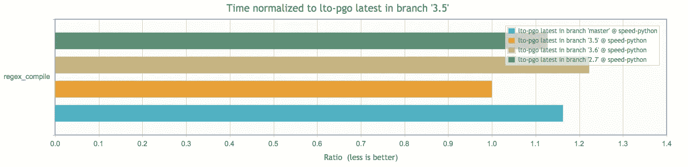

# Python 3.7 中的 5 项速度改进

> 原文：<https://medium.com/hackernoon/5-speed-improvements-in-python-3-7-1b39d1581d86>

> Python 3.7 处于测试阶段！是时候做测试了…有没有快一点？

以下是 Python 3.7 相对于 3.6 的主要速度提升

> 警告:这篇文章中的一些主题非常详细，超出了我通常写博客的水平。如果您不知道其中的一些术语或含义，只需下载并探究示例即可——继续阅读和体验！


Time for some go faster stripes..

# 1.调用方法更快(也许)

[这个改动](https://bugs.python.org/issue26110)的标题是“加速方法调用 1.2x”，有点误导..

有很多方法可以改变 CPython，要么修改操作码的**执行**，要么添加新的**操作码**。添加新的操作码需要大量的讨论和测试，这一变化引入了新的操作码。操作码由 CPython 中的*编译*过程选择。一旦你的代码被转换成一个抽象语法树，编译器会探索每一个分支并把它转换成操作码。代码的执行会在一个循环中遍历大量 switch 语句中的操作码，并为每个操作码调用不同的 C 函数。

供参考， **Python 3.6** 有 3 个调用函数的操作码。所有这些都是在 Python 3.6 中添加或修改的。

*   用于调用只有位置参数的函数:`CALL_FUNCTION`，
*   用于调用位置和关键字函数:`CALL_FUNCTION_KW`，
*   用于调用变量位置或关键字函数:`CALL_FUNCTION_EX`

Python 3.7 增加了两个新的操作码，`[LOAD_METHOD](https://github.com/python/cpython/blob/master/Python/ceval.c#L3021-L3105)` [和](https://github.com/python/cpython/blob/master/Python/ceval.c#L3021-L3105) `[CALL_METHOD](https://github.com/python/cpython/blob/master/Python/ceval.c#L3021-L3105)`，当编译器看到`x.method(...)`时，就会使用这些新的操作码。

举个例子，用不同的签名调用 3 个函数:

在 Python 3.6 和 Python 3.7 上运行，我们可以看到结果代码或性能没有变化。

另一个使用**绑定**方法的例子(即那些属于一个类的实例的方法)，

这一结果表明:

*   新的`LOAD_METHOD`操作码取代了将绑定方法作为属性加载，并作为普通函数调用它们。记住，对于实例方法来说，`LOAD_METHOD`和`CALL_METHOD`比`CALL_FUNCTION`要快。
*   带有关键字参数的绑定方法与 Python 3.6 中的相同，不会有任何性能变化。
*   没有参数的绑定方法现在更快了



`LOAD_METHOD`取代了`LOAD_ATTR`，本质上是获取对象实例上的 BoundMethod 实例。`[LOAD_METHOD](https://github.com/python/cpython/blob/master/Objects/object.c#L1074-L1155)` [是`LOAD_ATTR`中](https://github.com/python/cpython/blob/master/Objects/object.c#L1074-L1155)逻辑的一个副本，但是当方法没有被覆盖并且它有位置参数时会得到更好的优化。

从这里出来，你可能会有一些问题

## 所以如果我把我的函数放到一个类里，会不会让它们更快？

不会，因为这种速度提升是为了消除与物体相关的减速

## 关键字和变量参数为什么会得到特殊对待？

关键字参数需要在执行循环中进行特殊处理，因为在 C(编写 CPython 的语言)中没有对应的参数，一些额外的代码必须编译 2 个元组才能传递给方法。

可变参数，无论是位置参数还是关键字参数，都需要特殊处理。

## 这么多的警告，我喜欢关键字参数，我会看到任何不同吗？

这种改变应该鼓励你在类设计中遵循 DRY(不要重复自己)原则，并添加私有方法来减少多个公共方法之间的逻辑重复。在 3.7 之前，对性能的影响是一个很重要的考虑因素，在需要速度的地方，复制+粘贴代码是一种公认的做法。

将来，我们可能会看到更多的[场景经历类似的处理](https://bugs.python.org/issue26110#msg258211)。

# 2.对于某些字符，str.find()更快

当使用`str.find(x)`扫描字符串时，一些 unicode 字符出现了一个不幸的问题，看到了高达**25 倍的速度下降。**

```
$ ./python -m perf timeit -s 's = "一丁丂七丄丅丆万丈三上下丌不与丏丐丑丒专且丕世丗丘丙业丛东丝丞丟丠両丢丣两严並丧丨丩个丫丬中丮丯丰丱串丳临丵丶丷丸丹为主丼丽举丿乀乁乂乃乄久乆乇么义乊之乌乍乐乑乒乓乔乕乖乗乘乙乚乛乜九乞也习乡乢乣乤乥书乧乨乩乪乫乬乭乮乯买乱乲乳乴乵乶乷乸乹乺乻乼乽乾乿亀亁亂亃亄亅了亇予争 亊事二亍于亏亐云互亓五井亖亗亘亙亚些亜亝亞亟亠亡亢亣交亥亦产亨亩亪享京亭亮亯亰亱亲亳亴亵亶亷亸亹人亻亼亽亾亿什仁仂仃仄仅仆仇仈仉今介仌仍从仏仐仑仒仓仔仕他仗付仙仚仛仜 仝仞仟仠仡仢代令以仦仧仨仩仪仫们仭仮仯仰仱仲仳仴仵件价仸仹仺任仼份仾仿"*100' -- 's.find("乎")'

Unpatched:  Median +- std dev: 761 us +- 108 us
Patched:    Median +- std dev: 117 us +- 9 us
```

在 Python 3.7 中，预期的 Unicode 码位大小不再是硬编码的，方法是优化的长字符(大多数是不常见的)。

这些仍然较慢，但现在比 ASCII 字符慢 3 倍，而不是 25 倍！

# 3.os.fwalk 快 2 倍

`os`模块中的`fwalk`函数(仅在 Python 3 中)是一个目录树生成器。

它的行为和 walk()完全一样，除了它产生一个 4 元组响应`(dirpath, dirnames, filenames, dirfd)`

[的变化是修改](https://github.com/python/cpython/commit/ea720fe7e99d68924deab38de955fe97f87e2b29)的实现来使用`scandir`方法而不是`listdir`，后者是操作系统优化的，速度更快。

# 4.正则表达式更快*

在正则表达式模块(`re`)中有一个方法`compile`，它编译一个正则表达式字符串和一组可选的标志。这些标志可以是传递给正则表达式库的正则表达式标志。

Python 3.6 中做了一个改变，当传递整数标志时，这个调用会变慢。Python 3.7“修复”了速度变慢的问题，但仍然没有 Python 3.5 快



* Faster than 3.6

# 5.对于不区分大小写的匹配，正则表达式更快

每次更改更改日志

> 匹配和搜索不区分大小写的正则表达式比匹配和搜索区分大小写的正则表达式慢得多。不区分大小写要求将输入字符串中的每个字符都转换成小写，并禁用一些优化。但是只有 2669 个大小写字符(ASCII 模式下 52 个)。对于模式中的所有其他字符，我们可以使用区分大小写的匹配。

速度的提高是显著的，如果你在匹配 ASCII 字符，你可以看到匹配时间提高了 20 倍，因为它现在在查找而不是在每个字符上运行`lower()`。

## 还卡在 Python 2 上？

[查看我在 Pluralsight 上关于从 Python 2 迁移到 3 的新课程。](https://www.pluralsight.com/courses/python-2-to-python-3)