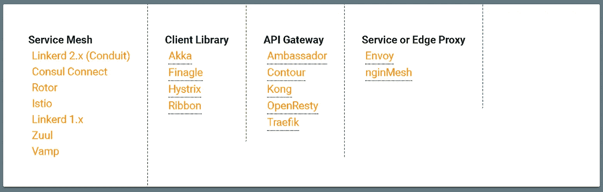
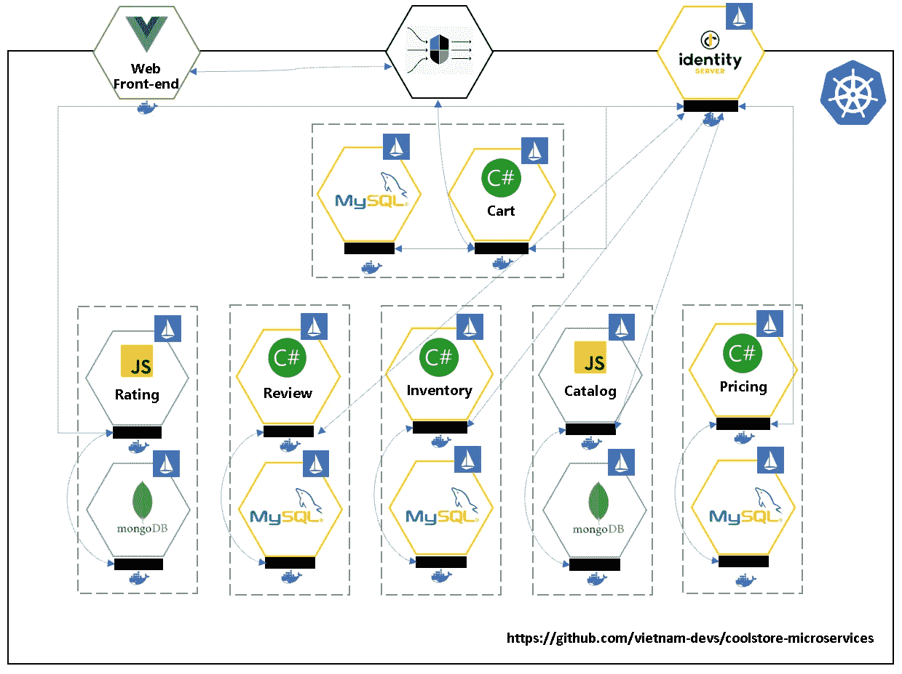
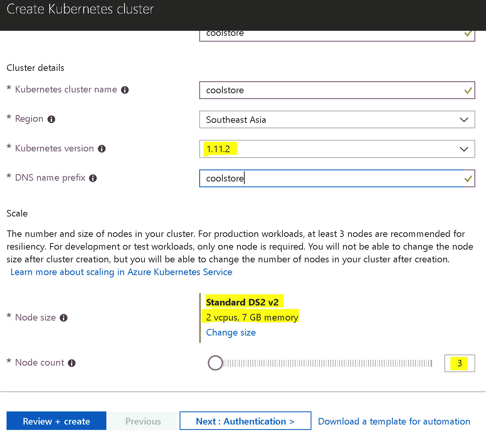
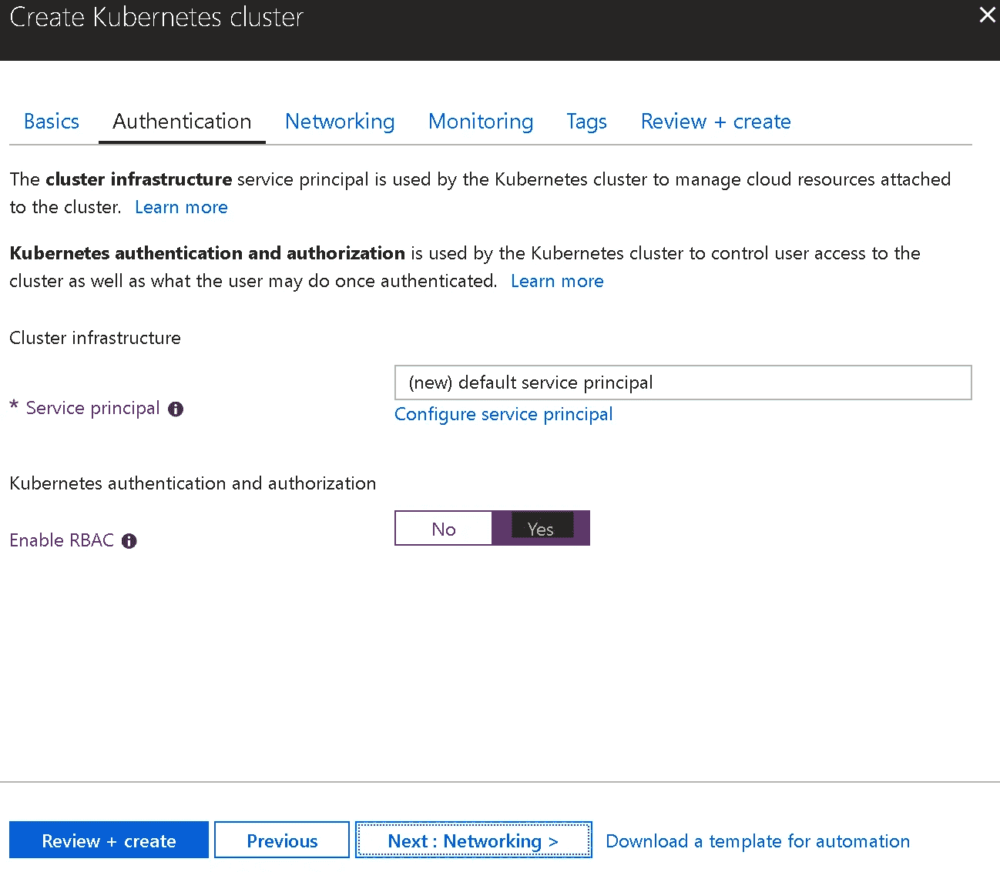
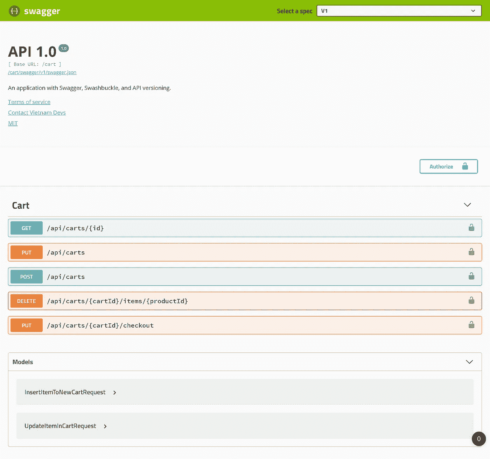

# 将 CoolStore 的服务网格引入 Azure Kubernetes 服务(AKS)的 5 个步骤

> 原文：<https://medium.com/hackernoon/5-steps-to-bring-coolstores-service-mesh-to-azure-kubernetes-service-aks-9cd1a5aa008a>


[Source](https://pixabay.com/en/sailboats-race-yachts-yacht-racing-1375064/)

# 第一句话

如今，服务网格是一个前沿术语。我看到世界各地有很多人开始谈论这个话题。大约 4 个月前，我第一次开始看它，真的很惊讶。它能帮助我们构建一个复杂的微服务堆栈，让我继续关注它，这有多美好？

据我们所知，为了用微服务方法来构建系统，伴随着许多令人头痛的问题，主要的事情是我们需要注意分布式计算的许多概念。每个人都知道分布式计算。在我个人看来，分布式系统在很多年前被创造出来后，在很长一段时间内都很难被采用。许多大公司，如推特、网飞、谷歌、亚马逊、微软……花费了大量的金钱和精力来寻找和构建简洁的解决方案。从那以后，出现了大量的库和工具。您可以搜索许多主题来讨论我们如何构建和使用这些解决方案和工具来避免微服务方法中的陷阱。只要谷歌一下微服务关键词，你就会相信我。

复杂的问题是通信、流量控制(路由)、安全和观察服务，即使你对如何实现它们了如指掌，也很难采用。“[不要优化图层，删除图层](https://istio.io/blog/2018/delayering-istio/delayering-istio/#don-t-optimize-layers-remove-them)”是我们现在听到很多的一个术语。但是如果我们不需要优化，而不是删除它，那又怎么样呢？这句话是相当时髦的话，但实际上，它是真实的，如果你跟进到这篇文章的结尾，你自己会发现它是多么容易。相信我！

2017 年，我们将推出许多工具和编排器，这在管理软件开发(基础设施即软件)的动态和灵活变化方面对我们有很大帮助。其中一些是 Docker、Kubernetes、Istio……就在几天前，Istio 发布了 1.0.0 版本，并承诺它们将成为服务网格世界中的重要工具，帮助我们轻松构建微服务堆栈。



[http://layer5.io/service-meshes](http://layer5.io/service-meshes/)

要从大的东西开始，我们需要先设置并运行小的东西，我从 JBoss 演示中心和 Redhat 演示中心选择了 CoolStore 项目来演示我所说的内容。这个项目完全是在 Java 栈中实现的。我借用这些想法，从零开始建立。NET Core 2.x 和 NodeJS 因为的流行。NET 在我的公司和一般在我的国家。

在本文的剩余部分，我们将把下面的 Coolstore 项目部署到 AKS



# 先决条件

*   Windows 10
*   Windows 子系统 Linux (WSL — Ubuntu OS)
*   Windows docker(启用 Kubernetes)
*   具有有效订阅的 Azure 帐户
*   库贝特尔
*   舵
*   istioctl
*   Azure CLI 2.0 (az)

## **第一步:**安装 Docker for Windows，启用 Kubernetes、Ubuntu WSL、kubectl、istioctl、helm 和 az

**第二步:**创建 coolstore AKS，启用 RBAC。最少应有 3 个节点(istio 试运行需要)



并确保检查启用 RBAC 如下



按照后续步骤完成集群的创建。它通常需要大约 20 到 30 分钟。

完成后，我们应该能够通过以下步骤访问仪表板

```
> az aks get-credentials --resource-group coolstore --name coolstore
> kubectl proxy
```

但是现在，您将无法访问 Kubernetes 仪表板。那么我们需要增加几个步骤

```
> kubectl create clusterrolebinding kubernetes-dashboard -n kube-system --clusterrole=cluster-admin --serviceaccount=kube-system:kubernetes-dashboard
```

随后获取令牌

```
> kubectl get secret $(kubectl get serviceaccount kubernetes-dashboard -n kube-system -o jsonpath="{.secrets[0].name}") -n kube-system -o jsonpath="{.data.token}" | base64 --decode
```

将令牌粘贴到登录页面作为[http://localhost:8001/API/v1/namespaces/kube-system/services/kubernetes-dashboard/proxy/#！/登录](http://localhost:8001/api/v1/namespaces/kube-system/services/kubernetes-dashboard/proxy/#!/login)

**第三步:**在 AKS 上安装 Istio

由于现在 helm 的一些超时问题，所以我不能使用 helm 来安装，而是将其导出到 yaml 文件，然后使用 kubectl 在 AKS 上创建它。下载 istio 1.0.0，然后压缩到机器上的某个地方。按照命令将其导出并部署到 AKS

```
> helm template install/kubernetes/helm/istio --namespace istio-system > istio-dump.yaml
kubectl create -f istio-dump.yaml> kubectl create -f istio-dump.yaml
```

**步骤 4:** 在 AKS 上安装 Coolstore

使用以下命令获取内部 istio-ingress IP

```
> kubectl get services istio-ingressgateway -n istio-system -o=jsonpath={.spec.clusterIP}
```

创建内容如下的`values.aks.yaml`

```
gateway: ip: 10.0.106.82
```

然后运行舵命令

```
> helm template deploys/charts/coolstore -f deploys/charts/coolstore/values.aks.yaml > deploys/k8s/dev-all-in-one.aks.yaml
```

最后，我们用这个命令注入 sidecar

```
> istioctl kube-inject -f deploys/k8s/dev-all-in-one.aks.yaml | kubectl apply -f -
```

**步骤 5:** 放置主机文件的映射

使用以下命令获取 istio 入口上的外部 IP

```
> kubectl get svc -n istio-system
```

它应该打印出类似这样的内容

```
...
istio-ingressgateway       LoadBalancer   10.106.52.19     localhost     80:31380/TCP,443:31390/TCP,31400:31400/TCP,15011:32131/TCP,8060:30958/TCP,15030:31983/TCP,15031:30365/TCP   8d
...
```

然后，我们只需要将 10.106.52.19 复制到 C:\ Windows \ System32 \ drivers \ etc \ hosts 文件，如下所示

```
10.106.52.19 id.coolstore.aks
10.106.52.19 api.coolstore.aks
10.106.52.19 coolstore.aks
```

从现在开始，我们可以通过 [http://coolstore.aks](http://coolstore.aks) 访问网站，通过[http://id . cool store . aks](http://id.coolstore.aks)访问身份提供者，通过[http://api . cool store . aks](http://api.coolstore.aks)访问 API 网关

假设我们访问 http://API . cool store . aks/cart/swagger，那么我们应该看到



以及[网站 http://coolstore.aks](http://coolstore.aks)


你好。我们结束了。让我们探索并享受服务网格的世界。

# 最后的想法

2018 年，我们有足够的工具来实现我们的梦想。我们有 Docker 来打包你的应用程序，这样我们就不用担心用哪种编程语言来实现应用程序了。这意味着我们在软件开发中具有可移植性。从现在开始，我们可以带来这个映像，并开始在任何平台上随时随地运行它(云原生应用)。但是，我们需要一些工具来控制和编排云原生平台中的容器。这就是库伯内特公司发挥作用的地方。我们有工具来控制和帮助我们编排我们的容器，以正确的方式扮演正确的角色，并根据我们在清单文件中定义的正确策略。最终是什么让它与众不同？服务网格将帮助您控制您的流量，保护通信，定义服务连接的方式，并从本质上观察您的活动。

我们将在未来几年看到服务网格的出现。还有我今年接下来的几篇关于这个话题的文章。

> *本文的源代码可以在 https://github.com/vietnam-devs/coolstore-microservices*找到

感谢阅读！如果你喜欢这篇文章，请点击👏符号，以便其他人可以看到它。