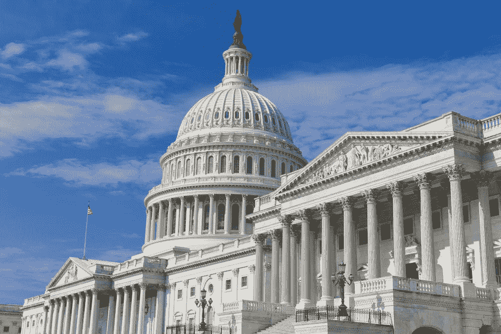

# 区块链技术国会听证会的 5 点收获

> 原文：<https://medium.com/hackernoon/5-takeaways-from-the-congressional-hearing-on-blockchain-technology-cc8d6132b0f4>

美国东部时间 2 月 14 日上午 10 点，国会举行了一场关于区块链技术的联合听证会，主题是“超越比特币:区块链技术的新兴应用”听证会期间，5 名区块链申请专家在国会发言。以下是听证会的主要收获:

**1。区块链可以在 2.2 秒内追踪到芒果。**

听证会上反复出现的一个主题是区块链可能如何改变供应链的运作方式，最能说明问题的例子是沃尔玛食品安全副总裁 Frank Yiannas 关于食品供应链的演讲。“人们经常谈论线性食物链，而实际上它是一个复杂的网络，”Yiannis 说。2017 年，沃尔玛和 IBM 为区块链在食品供应链中的应用完成了两项概念验证。在其中一个项目中，他们通过区块链追踪芒果的生长、收获、运输和销售。

以前，追踪一个芒果从销售点一直到原产地总共需要 7 天时间。使用区块链技术，这个过程只需要 2.2 秒。

随后，在问答环节，Yiannas 阐述了这种新的效率是多么重要。如果一种食品使人生病，公司有两种选择，直到他们发现问题:他们停止所有可能使人生病的食品，或者他们继续让人们生病。后者显然不是一个真正的选择，前者造成了严重的浪费，因为许多非常好的食物不得不从商店里拿出来。

使用区块链，食品公司可以立即识别不良成分的来源，消除 7 天的销售损失和食品浪费。Yiannas 将这一目标最终描述为“食品透明”，这将使食品系统更安全、更可持续，沃尔玛正在继续用几十种食品测试区块链。

**2。听证会上笼罩着一个量子幽灵。**

令人惊讶的是，尽管这场听证会的目的是讨论区块链技术，但感觉上几乎同样多的时间都花在了讨论量子计算机以及它们将如何影响区块链技术上。NIST 国家标准和技术研究所信息技术实验室主任 Charles Romine 博士在开场白中指出，“量子计算机对区块链是一种威胁，因为它们可以破解区块链密钥的代码”，这是区块链安全所依赖的非对称加密密钥。

这个话题在问答中出现了几次，清楚地表明国会对量子计算及其网络黑客能力感到担忧。Romine 博士表示，NIST 正致力于开发后量子密码术，即可以击败量子计算机的新算法，但没有完成或量子计算机到来的时间表。在后来的提问中，Romine 博士说他不知道我们什么时候会进入量子世界，并指出公众的估计在“15 到 30 年后”不等，但没有提供他自己的意见。然而，他自信地表示，这些新算法将在量子黑客对区块链构成威胁之前“很久”就存在。

**3。唐·拜尔对区块链感到兴奋。**

这场听证会的真正乐趣在于看到来自弗吉尼亚州的代表唐·拜尔(Don Beyer)对区块链技术的了解和兴奋。他在听证会上说的第一句话是，“在过去的一周里，我要求每个人向我解释区块链。没人能。希望有人也能给我解释一下量子力学。”

随着听证会的进行，拜尔了解到更多，他开始深入挖掘，提出真正的问题，如“区块链是无限的吗”和“区块链只能被电磁脉冲扰乱吗？”对于后者，Romine 博士解释了分布式账本是如何工作的，而且要确定每一份区块链账本都存放在哪里是极其困难的。这引发了以下关于区块链稳定的交流:

拜尔:“所以只要我们有电，我们可能就没事了？”

罗明博士(微笑):“我想我们可能没事。”

不久后，拜尔问量子计算是否可以集成到区块链中，使其更加安全。罗明博士向他介绍了 NIST 正在研究的后量子密码术，这让拜尔评论道，“非常酷。”的确很酷，拜尔先生。

**4。区块链将创造一个个人控制的生态系统。**

在听证会上，似乎没有人能说出 Chris Jaikaran 的名字，这在问答过程中变得非常清晰，但他有很多关于新区块链生态系统的话要说。在医疗保健区块链应用的主题上，国会研究服务中心的分析师 Jaikaran 指出，区块链可以“管理电子医疗记录”。随着越来越多的身份加入区块链，个人可以更好地控制谁可以获得什么样的健康信息。”

这种个人控制的生态系统得到了 IBM 区块链技术副总裁 Gennaro Cuomo 的回应，他阐述了区块链如何使用三盲属性处理医疗记录等敏感数据。这意味着信息提供者不知道接收者是谁，反之亦然，网络提供者也不知道这两方是谁。与其将区块链视为私有信息环境中的信息存储系统，不如将区块链视为访问管理系统。

专攻技术法的法学教授亚伦·赖特认为，区块链技术也将使个人在融资过程中有更多的控制权。Wright 指出，区块链“保护了被称为代币的稀缺数字资产，为新形式的众筹提供了动力”，并且“代币的销售可以通过让每个人都可以使用代币来实现资本获取的民主化”。

**5。气氛激动人心，充满希望。**

除了讨论具体的区块链应用程序之外，谈话主要是对整个区块链应用程序充满希望，房间里有明显的兴奋感。所有 5 位发言人都认为，区块链将大大提高各行业的效率，尽管他们表达了对该技术作为一个增长平台的担忧。这些问题包括用户共谋、数据可移植性、可扩展性和用户安全等，但这些是新技术的常见问题，尤其是那些不受监管的问题。

所有 5 位发言人都希望政府介入区块链，强调保护用户，同时警告不要“撤销监管”他们的愿望很明确:区块链需要向前发展的法规来引导技术和保护用户，同时仍然鼓励企业创新。目前政府在技术上的不确定性限制了区块链的发展。

就他们而言，出席听证会的国会小组委员会提出了尖锐的问题，但他们似乎也对这项技术感到兴奋。开场白之后，监督小组委员会主席拉尔夫·亚伯拉罕说，“如果我理解[区块链]的技术，它将是变革性的。”问答快结束时，国会议员埃德·佩尔穆特(Ed Perlmutter)笑着说，“我有一百万个关于加密货币的问题，但这真的是一个出色的小组。”