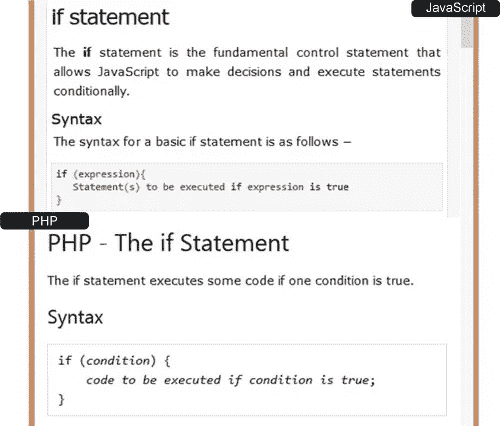
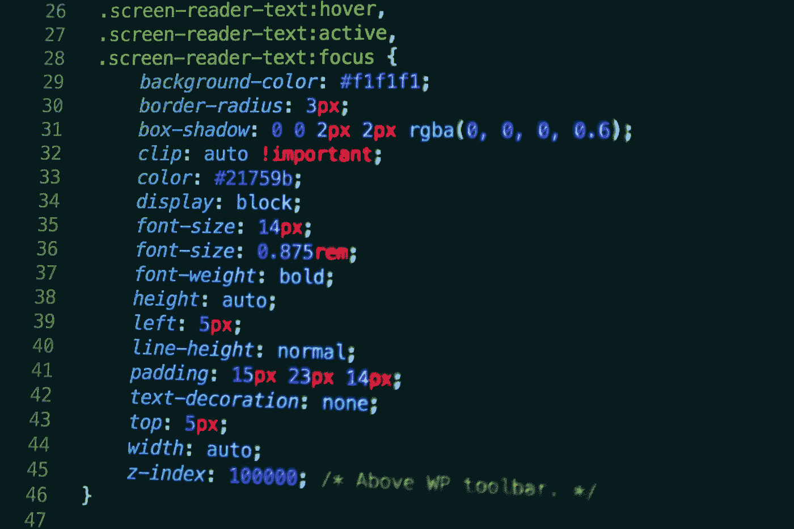

# 如果你正在自学如何编码，你应该做的 5 件事

> 原文：<https://medium.com/hackernoon/5-things-you-should-do-if-you-are-self-learning-how-to-code-536452f9d008>

今天，大多数程序员都是从自学如何编码开始他们的旅程的。由于互联网上有丰富的材料和教程，新手有一系列的资源可供选择。

我是一名自学成才的 web 开发人员。当我对编程和 web 开发感兴趣的时候，我已经是一名大学生了。我开始上网，从 W3schools 开始。然后我就跟着巴基·罗伯特的 NewBoston Youtube 教程。最后，我支付了 Udemy 上的 Web 开发人员训练营课程，在那里我学习了 Nodejs、ExpressJs 和 MongoDB。目前，我正在学习 Python 和 Django Web 开发人员训练营课程。

我学到了一些东西，我很乐意与大家分享

## **1。在头脑中有一个迷你项目来处理**

我的第一个也是最大的错误是，当我刚开始学习 HTML5 和 CSS3 时，头脑中没有任何项目。两年多来，我自学了 HTML、CSS、Bootstrap 和 JavaScript。我尽我所能地学习，并编写代码片段。做那件事很容易。

为了我在学校的最后一年项目，我必须设计一个网络论坛的前端。我确切地知道我想要什么，但是把所有的代码放在一起，像导航、菜单、页眉、页脚、侧边栏代码，形成一个页面和一系列页面，这是一个噩梦。我有标记标签互相冲突和争夺屏幕控制权的问题。这些代码以前表现良好，并且完全符合我的要求。

最后我掌握了窍门，但是如果我在学习的时候设计了一个再俗气的小网站，对我来说也不会这么难。设计一个迷你项目帮助我理解事物是如何单独和一起工作的。它还帮助我提高了我的 UI/UX 技能。

柯尔特·斯蒂尔在 Udemy 上的网络开发课上给学生们提供了一个 Yelpcamp 网站，让他们利用在课上学到的所有知识进行开发。这是结束一堂精彩的学习课的好方法，它教会了学生 web 开发的现实。

## **2。除了你最感兴趣的语言之外，再学一门语言**

HTML 和 CSS 对我来说很容易理解和掌握，但是我讨厌 JavaScript。我很难完全理解，我认为这是因为 JavaScript 与 HTML 和 CSS 完全不同。JavaScript 是一种合适的编程语言，而不是 HTML 那样的标记标签或 CSS 那样的样式表。有了 JavaScript，我被引入了函数、变量、循环和 IF 语句的世界；一些我以前不知道的事情。

我真的很想学 JavaScript。它是一种核心的网络语言，我知道我真的离不开它，但在挣扎了一会儿后，我离开了它，并决定学习一些关于后端的知识。我钻研了 PHP。我没有认真对待 PHP，但我很喜欢它，回头看，它为我理解 JavaScript 铺平了道路。JavaScript 和 PHP 共享相似的函数语法，IF 语句语法和数组语法。

Javascript and PHP IF statement syntax

通过学习 PHP，我理解了 JavaScript。

## 3.用你自己的方式重写代码

自学如何编写代码大多数时候都需要完全按照别人的方式编写代码，这样你就可以看到它是如何工作的。但是更好的方法是用你自己的方式重写代码来达到同样的结果。

教练的代码可能更轻，更快，更先进，但这不是你的重点。你的目标是知道什么可行，什么不可行，为什么。用你自己的方式重写代码可以拓展你和你所知道和不知道的极限。它也显示了你对一个主题的理解和提高的程度。所以重写，犯错，改正，提高，成长。

## 4.不要试图一下子理解所有的事情

我确实提到过发现 JavaScript 很难。嗯，我想我的部分问题是太过努力去一次理解所有的事情。我只有标记标签和样式表的基础，没有时间去适应 JavaScript 语言和语法。

太努力会让你沮丧和烦恼。按照你自己的节奏学习，习惯这门语言，不要为你不懂的小事烦恼。不要停留在一个地方。在课程上更进一步。有时候学习高级的东西可以帮助你真正理解中级的东西。

Photo credit: unsplash

## 5.承诺

自学是一个漫长、缓慢而乏味的旅程。你必须长期坚持下去。保持忠诚。保持专注。给自己一个目标，并朝着这个目标努力。建造一些东西，并以此为荣。这是真正学习的唯一途径。

**最后，练习！练习！练习！**

这应该是第六点，但我不认为有必要再加一个数字。无论你是自学者还是在教室里学习的传统系统，没有练习你做不了什么。