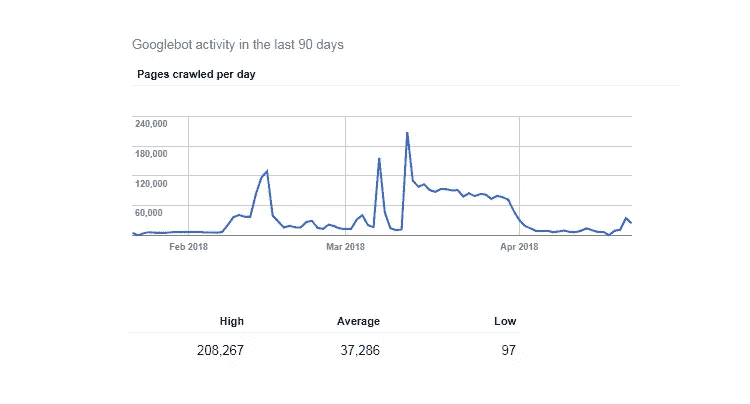
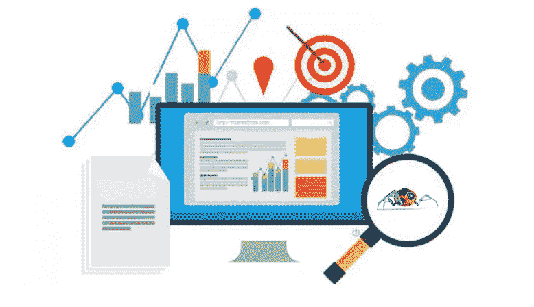

# 优化抓取预算以提高排名的 5 个技巧

> 原文：<https://medium.com/hackernoon/5-tips-to-optimize-crawl-budget-to-increase-ranking-c2f1a2304ad2>

如果你的网站有大量的网页，并且每天都有更多的网页被添加进来，那么抓取预算就是一个重要的 SEO 因素。爬虫预算在站长中是一个有点冷清的话题。最常见的爬行预算是一个被忽视的概念。抓取预算优化可以为你的网站流量带来显著的不同。

在我们开始这个话题之前，让我们先来看看与爬行预算相关的一些要点。

## 什么是爬网预算？

考虑到一个网站的抓取速度和抓取需求，我们可以[将抓取预算](https://www.nethority.com/what-is-crawl-budget-and-how-it-will-affect-your-website-ranking/)定义为 Googlebot 能够或者想要抓取的网页或者 URL 的数量’。

## 什么是爬行率？

Googelbot 在抓取网站时每秒发出的请求数称为抓取速率。

## 什么是抓取需求？

抓取需求可以被描述为为网站索引网页的需求。热门网站抓取需求较高。

## 为什么需要提高网站的抓取率？

增加的抓取率意味着更多的页面被搜索引擎机器人抓取，因此，更多的页面将被 SERP 索引。

现在您已经熟悉了术语爬网预算，是时候了解为什么需要优化爬网预算了。

让我们开始吧。

谷歌不会一次抓取你所有的网页。原因是爬行速率限制。

是的，搜索引擎对网页的抓取有一个限制，称为“抓取速度限制”。

搜索引擎需要这样做是有原因的。

如果爬虫一次开始爬行太多的网页，服务器上的负载将增加，使服务器耗尽。因此，为了避免这种情况，在您的网站上设置了爬网率限制。对于网页多的网站，尤其是电子商务网站，抓取预算是一个需要担心的因素。因为如果搜索引擎不索引你所有的网页，你就永远不会有访客访问那些被留下的网页。这个问题可以通过优化爬网预算来解决。

以下是优化爬网预算的 5 个技巧

**1)网站地图应该是最新的**

首先，如果你没有站点地图，那么使用各种站点地图生成器工具创建一个。网站地图是。帮助爬虫或蜘蛛轻松访问所有网站内容的 xml 文件。基本上，网站地图包含了你网站的所有页面，这样搜索引擎机器人就可以理解你网站内容的组织。因此，保持网站地图干净整洁。确保站点地图文件不包含任何断开的链接、规范的链接或被阻止索引的链接。

保持网站地图的更新。确保所有新添加的网页都被添加到站点地图中。将您的站点地图包含到 robots.txt 文件中，这样爬虫就能很好地了解您的网页。

**2)有一个易于导航的网站结构**

一个好的网站结构是当所有的网页都很容易从网站的每一页到达。一般来说，每一个重要的网页应该最多 3 次点击。你的网站应该有一个菜单显示在顶部，应该包括所有重要的网页。此外，您可以包括一个页脚链接指向联系我们，关于我们和其他与您的公司相关的网页。

内部链接也是 SEO 的一个主要因素。你网站的所有重要页面都必须有内部链接。难道你不希望你的用户从他们登陆的页面开始浏览其他页面吗？

确保你的网页没有多次重定向

当网页被多次重定向以到达目标页面时，网络爬虫在它到达目标页面之前就离开了。因此，这样的网页永远不会被索引。此外，每个重定向浪费你的爬行预算。

确保对目标页面的重定向次数尽可能少(最好是一次)。

**4)提高网站速度**

事实表明，如果一个网站的加载时间超过 3 秒，用户更有可能点击后退按钮。一个缓慢加载的网站不仅让用户讨厌，也让网络爬虫讨厌。网站速度对抓取预算有直接影响。你可以在[的 Pagespeed Insights](https://developers.google.com/speed/pagespeed/insights/) 上查看你的网站速度。

确保你的网站托管在一个有足够空间的服务器上，因为当爬虫爬你的网站时，服务器的负载会增加。总之，我们可以说保持网站的高加载速度，并且不占用服务器空间。如果你不知道如何完成以上事情，你可以随时向 SEO 机构寻求帮助。

**5)不断更新网站内容**

通过在你的网站上添加新的新鲜内容，你给了网络爬虫一个继续访问的理由。确保在你的网站上添加和更新页面内容。内容应该定期更新，这样你的用户也能及时了解最新情况。

避免网站上的重复内容。原创的新鲜内容总是更受搜索引擎青睐。

**判决:**

为了增加你网站的抓取预算，你必须注意你的网站速度。

网站地图应该是没有错误和更新的。

定期更新网站内容。网页内容应该是新鲜和独特的。

避免 404 错误页面，重复页面和长重定向链。

抓取预算是有很多网页的网站的一个问题，因为 Googlebot 不会抓取所有网页。遵循上面给出的建议，优化抓取预算，增加网站的索引。