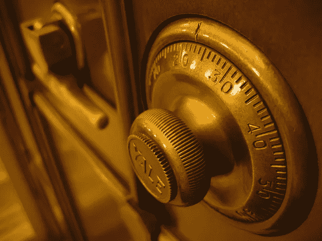
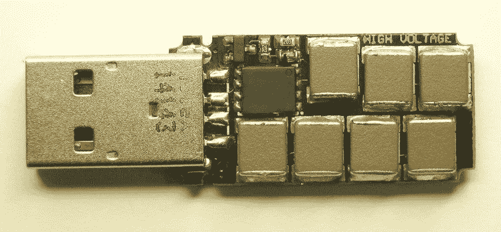
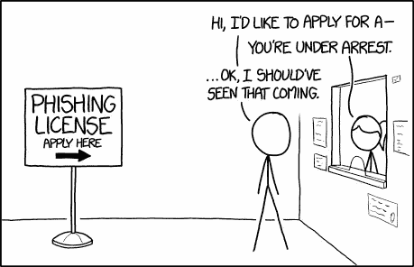
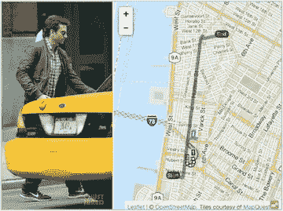
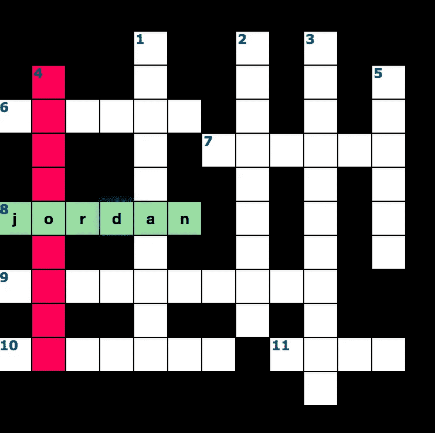
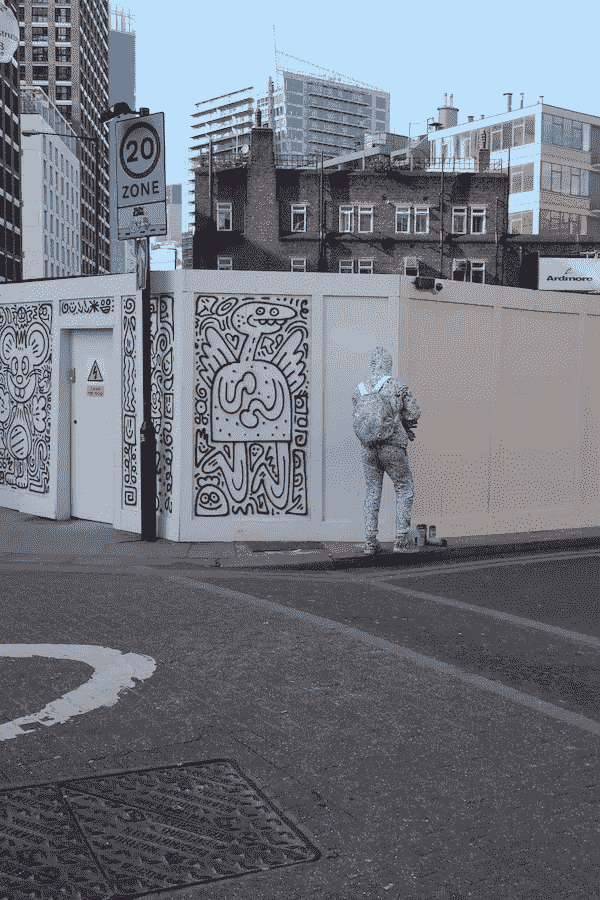

# 明智地谈论安全性的 5 个技巧

> 原文：<https://medium.com/hackernoon/5-tips-to-talk-about-security-86c7b4bb6b2>

Safe in Boston Public Library (Credits: [Rob Pongsajapan](https://www.flickr.com/photos/pong/288491653))

我意识到“安全”这个词并不耀眼。这是一个很难接近的话题，因为许多人认为它很无聊或太复杂，他们并不关心。那是一个错误。安全关系到每个人，不仅仅是软件工程师。我曾多次尝试让更多的人了解信息安全，我意识到这是多么具有挑战性。多年后，我开始注意到有几件事让事情变得简单了。以下是帮助您让安全性对每个人都更有吸引力的 5 大技巧。因为攻击者总是瞄准薄弱环节。我有个坏消息，薄弱环节，可能是你。

# 1.从社会工程开始

我参加的大多数安全讲座通常以一个恐怖故事开始。通常情况下，安全漏洞会变得非常糟糕，比如 2014 年的 [Heartbleed](http://heartbleed.com/) 或 2016 年的[Dyn 攻击](https://en.wikipedia.org/wiki/2016_Dyn_cyberattack)。但是那些例子很难掌握，尤其是非技术人员。观众们认为他们对此无能为力，所以他们不应该担心。

这就是为什么我总是从一个社会工程的例子开始。它们很容易得到。例如，这里有一个有趣的“特权提升”

[Mark David Christenson](https://www.youtube.com/watch?v=XpIqfzYN4yM) with his fake Oscar

[马克·大卫·克里斯滕森](https://www.youtube.com/watch?v=XpIqfzYN4yM)，设法溜进好莱坞的奥斯卡颁奖典礼，只穿了一件燕尾服和一个假奥斯卡小金人。他骗过了保安，他们什么也没问就让他进去了。他还设法得到了一顿免费餐，因为店主以为他在为一位贵宾服务。这就是我们所说的社会工程攻击。

在这种情况下，马克是攻击者，仪式是资产，安全警卫是漏洞。现在你可以把这个故事移植到计算机上。假设攻击者(Mark)想要使用银行网站(漏洞)访问其他人的银行帐户(资产)。如果攻击者看起来足够像其他人，他就可以冒充他的受害者并访问他的帐户，这就是所谓的欺骗。你甚至可以做得更简单来得到一顿免费的饭。

(Credits: [Kyle Baldinger](https://twitter.com/kylesareus/status/424711496514289665/photo/1))

社会工程攻击极其频繁和强大。就像黑客利用漏洞一样，攻击者利用人类的认知偏见。想想诱饵或更复杂的电话来获取个人信息。如果你在一家声称提供技术支持的公司里给足够多的人打电话，你最终会找到一个真正有问题的员工。这些例子有助于听众理解，因为我们都至少收到过一次网络钓鱼电子邮件。

# 2.提供免费糖果

你会使用在会议期间作为赠品提供的免费 USB 记忆棒吗？你会给你的电子邮件来获得免费服务吗？你会使用咖啡馆的免费无线网络吗？

没有什么是免费的！所有这些行为都是潜在的威胁。我们现在都知道，许多免费在线服务私下出售个人数据。免费闪存盘也一样。研究发现，至少 45%的用户会将一个未知的闪存盘插入他们的电脑。问题是，闪存驱动器可能包含恶意软件，或者更糟的是可能会摧毁你的电脑。一个叫做 usb- [杀手](http://kukuruku.co/hub/diy/usb-killer)的设备，看起来就像任何一个闪存盘，但是它将高电压转化为电能，直到它烧坏你的主板。你可以自己制作或者花 15 美元在网上买一个。

USB killer (Credits: [dark purple](https://kukuruku.co/post/usb-killer/))

免费糖果是攻击者用来吸引潜在受害者进入陷阱的一种技巧。当您提供电子邮件地址时，它可能会被用来向您发送网络钓鱼电子邮件。当您连接到不安全的 WiFi 时，攻击者可以拦截您发送的所有数据，其中包括身份验证令牌，然后可以用来冒充您并访问您的帐户。

免费糖果是黑客使用的一种成功技术。那么，为什么不用它来吸引无辜同事参加安全会议呢？

(Credits: [https://xkcd.com/1694/](https://xkcd.com/1694/))

# 3.有创造力

安全漏洞如此频繁，以至于很容易找到例子。只要看看[北欧地图](http://map.norsecorp.com/#/)就能实时看到所有发生的攻击。找到一个有趣或好玩的例子更难。这里有几个我喜欢用的例子，因为它们展示了黑客是多么有创造力。

2018 年 1 月，发布了一张地图，显示了使用 Fitbit 等健身设备的人的行踪。一些美国军人在慢跑时佩戴了这些设备，暴露了一个敏感的美国陆军设施的位置。 [(2)](https://www.washingtonpost.com/world/a-map-showing-the-users-of-fitness-devices-lets-the-world-see-where-us-soldiers-are-and-what-they-are-doing/2018/01/28/86915662-0441-11e8-aa61-f3391373867e_story.html)

在 2013 年，一个[箔](http://www.nysed.gov/foil)请求(信息自由法)被提出来发布黄色出租车数据 [(3)](https://research.neustar.biz/2014/09/15/riding-with-the-stars-passenger-privacy-in-the-nyc-taxicab-dataset/) 。该数据集包含了 2013 年纽约每一次出租车出行的详细信息，包括接送时间、地点、费用、小费金额，以及出租车的牌照和车牌号码。

Bradley Copper taxi trip in 2013 (Credit: [neustar](https://research.neustar.biz/2014/09/15/riding-with-the-stars-passenger-privacy-in-the-nyc-taxicab-dataset/))

从这些数据中，研究人员能够获得有价值的信息。例如跟踪名人。在一名游客发布在 Twitter 上的这张图片上，他可以读取出租车车牌号码，结合图片时间戳，他查询数据集，找到相应的行程，以获得目的地。

仅仅通过查看下车地址，他也能够识别出在地狱厨房中一个相当孤立的地方的一个绅士俱乐部呆了一夜的人。

# 4.让它成为一个游戏

[https://zed0.co.uk/crossword/](https://zed0.co.uk/crossword/)

2013 年，很多 Adobe password 的 hash 泄露了它们所有的提示。如果我给你一系列提示，你能找到相应的密码吗？受一本 xkcd 漫画的启发，有人把它变成了一个纵横字谜游戏，以显示破解它是多么容易。

根据下列提示，你能找到数字 4 吗？

4

8 *姓名-女儿-狗-孙子- 23 -篮球-迈克尔-男孩-bball；mj -篮筐-孙女-公牛-姓氏-国家-太阳-鞋子-麦克*

如果你喜欢这个游戏，你可以在这里找到更多的字谜格子[(4)](https://zed0.co.uk/crossword/):

游戏真的会让人上瘾，游戏的互动有助于记住内容。有一次，我想证明获取有用的信息是多么容易。所以我组织了一个小游戏，我称之为“速配游戏”。

我会把观众分成两组。对于 A 组，我只是说他们将参加一个速配活动。他们将在 5 分钟内会见不同的人，他们只需要介绍和闲聊。

但对于 B 组来说，简报是不同的——我给他们分配了一个秘密目标:获得这些信息中的一个:他们面前的人的地址，他们宠物的名字，他们父母的名字或者他们上的高中。这些信息非常有价值。一个昵称是一个常见的密码，高中的名字是经常的问题，以恢复一个丢失的密码。

Play your opponent (Credits: [mamooli](https://www.flickr.com/photos/babairan/7104487239/in/photolist-bPNmxi-9eX2wd-HMTUVY-bPNkuV-22EFqse-GJ1Li-BP4W6W-frypah-8x9Uu8-d7LN6Y-254mz7H-dwabEd-6czRg3-dR1BCm-23nV5tj-9eLirM-9fcLMW-cwJf55-6P2cS4-9eG3is-9eV2io-9eLi7Z-6czRgf-9eG6pQ-6cxhNv-9eV1kW-ebTtJ-cpLAJL-7bxnB8-6P6oUA-9eUXsQ-8jh6Nh-RPQBap-MTyC-9eBBki-9fgGu8-9fgGpt-9fjPVN-5F31yC-9h6YkY-ebUaF-6BchQj-9AXpxu-3986VE-9eRWip-9eRUx6-7fUeRa-9fgEQp-9eTyvi-6gGKKL))

如果你只是问“你的地址是什么？”你永远得不到答案，更糟糕的是，你前面的人可能会感到不安或怀疑，可能会离开。对于服务器来说也是一样，一个愚蠢的暴力方法可能会引发警告和警报，你可能会被列入黑名单，并且不会再有机会了。

你需要变得微妙，了解你的目标，并利用他们所说的来对付他们。安全真的比你想象的要容易，你甚至可以尝试更多的动手操作，玩键盘记录器或参加为初学者举办的夺旗比赛，如 [InfoSecInstitute](http://resources.infosecinstitute.com/n00bs-ctf-labs-infosec-institute/#gref.) one、 [Hack this Site](https://www.hackthissite.org/) 或 [WarGame](http://overthewire.org/wargames) 。只要确保你是在一个安全合法的空间里做的。

# 5.像黑客一样思考

我知道这很难消化。安全概念错综复杂。所以这是我给你的最后一条建议。

像黑客一样思考！

聪明点，跳出框框思考，找到日常生活中的漏洞。迈克尔·拉森因记住电视节目《碰运气》中使用的图案而赢得 110，237 美元。他还发现一家银行为每一笔新的支票基金发放 500 美元。他用假名开了几十个账户，等待必要的最短时间，然后取出钱。还有一次，他用一个家庭成员的名字注册了一家企业，雇佣自己为员工，然后解雇自己去领取失业救济金。(提醒两者都是诈骗，不要做)。

[Mr Doodle](http://mrdoodle.com/) in a London Street

我与许多安全专家共事过，但我从与几个黑客的会面中学到了更多。他们不遵守同样的规则。出于同样的原因，我开始沉浸式探索伦敦的街头艺术。街头艺术家在某种程度上是黑客。在你看到木栅栏的地方，街头艺术家嘟嘟先生看到了一张白纸。我在清晨拍了这张照片，伦敦的街道空无一人。显然永远不要做违法的事情，我只是说你应该尝试感知不同的机会，并保持开放的心态。

安全威胁瞬息万变，黑客通常会走在你的前面，因为他们打破常规。黑客花时间试图攻击，工程师试图防御。但是你必须了解攻击是如何进行的，才能正确地防御它。就像下棋一样，你需要预测对手的棋步。

很容易理解，盗取信用卡号可以用来取钱。但这不是唯一的方法。你有没有想过[数十亿英镑的忠诚度积分被盗用【5】](https://www.thememo.com/2016/08/10/how-fraudsters-are-exploiting-britains-billion-pound-loyalty-point-market/)，航空公司里程被盗[【6】](https://media.ccc.de/v/33c3-7964-where_in_the_world_is_carmen_sandiego)，或者关于公司 IPO 的私人信息。

最后，这不全是钱的问题。这也是关于权力，想想假新闻，关于未来选民的信息来影响选举等等…

# 最后的话

同样，安全是每个人的责任。工程师可以构建最安全的网站，即使您的用户将密码写在办公桌上的便利贴上也没关系。欺诈者很少真正侵入人们的账户或从他们的卡里偷钱，相反，他们只是骗我们把钱送出去。他们依赖于银行安全中最薄弱的一环，不幸的是，这一环往往是客户自己。

*   *免责声明:这是我个人的反映，与我现在或以前的雇主无关。*

(1) [IEEE 安全与隐私研讨会](https://www.youtube.com/channel/UC6pXMS7qre9GZW7A7FVM90Q)—Matthew Tischer
(2)U[. s .士兵泄露敏感信息](https://www.washingtonpost.com/world/a-map-showing-the-users-of-fitness-devices-lets-the-world-see-where-us-soldiers-are-and-what-they-are-doing/2018/01/28/86915662-0441-11e8-aa61-f3391373867e_story.html)—Washington Post
(3)[与星同行:纽约出租车数据集中的乘客隐私](https://research.neustar.biz/2014/09/15/riding-with-the-stars-passenger-privacy-in-the-nyc-taxicab-dataset/) — atockar
(4) [Adobe 填字游戏](https://zed0.co.uk/crossword/)
(5) [欺诈者正在利用英国价值数十亿英镑的忠诚度积分市场](http://Fraudsters are exploiting Britain’s billion-pound loyalty point market) —卡斯滕·诺尔