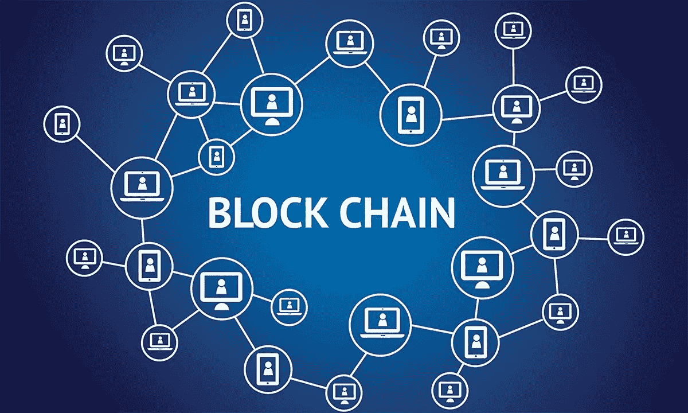
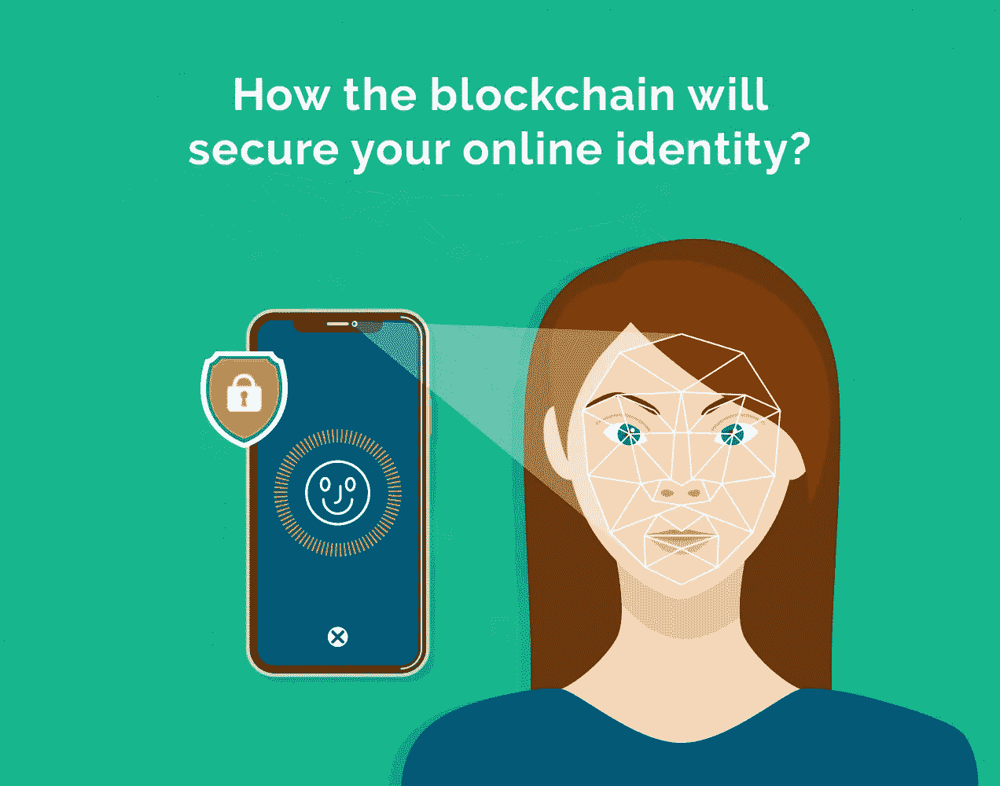
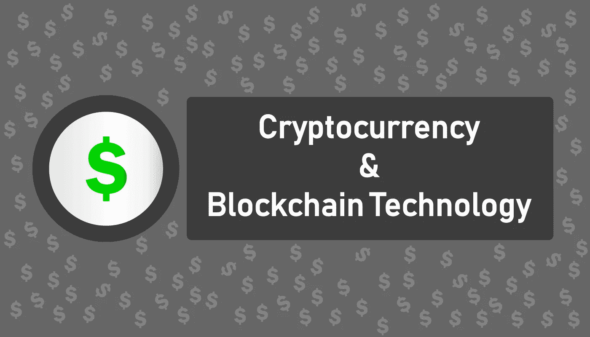

# 5 趋势显示区块链如何改变社交媒体

> 原文：<https://medium.com/hackernoon/5-trends-shows-how-blockchain-is-changing-social-media-ba50c975c041>

不管你是专门从事社交媒体的网上营销人员还是利用社交媒体接触消费者的企业主，了解社交媒体目前正在经历巨大转变是至关重要的。

区块链技术目前正在颠覆各种行业，社交媒体很可能会经历这种颠覆的后果。使用社交媒体建立品牌的企业，如 Twitter 和脸书，很快就会意识到所有的投资可能都是徒劳的。当[区块链科技](https://hackernoon.com/the-blockchain-technology-of-2018-or-not-c375eab5d46a)改变时，消费者和公司使用的平台以及网络手段将经历不可否认的剧变。

如果你想让你的公司为未来的区块链社交网络营销做好准备，有些趋势你需要密切关注。这些趋势将在下面的文章中讨论。

# 趋势 1:对验证在线身份越来越感兴趣

随着社交媒体平台行业(如 Twitter 和脸书)中“bot 问题”的增加，公司现在正在寻找客户拓展平台，以提高营销投资回报或 ROI。对于不想在**社交媒体**的“黑洞”中营销的公司所有者来说，与使用[区块链技术](/@investauk/the-opportunity-to-change-lives-using-blockchain-technology-b81b94d4f6a3)和智能合同验证身份的客户互动的能力很有吸引力；从而容易受到欺骗性的每次点击付费或 PPC 广告展示的攻击。

# 趋势 2:市场验证

类似于身份验证及其对区块链社交平台的影响，市场验证也是一个热门话题。虚拟市场是用于发展特定公司需求和与志同道合的公司或供应商互动的领域。随着**区块链技术**变得更加突出和主流，市场验证将增加公司的增长潜力。向经过验证的供应商或公司营销的能力将使营销更简单，因为他们知道你在卖什么；因此，减少了所有营销工作，同时缩短了**投资回报时间**。

# 趋势 3:加密货币和区块链技术的诱人结合

区块链技术和加密货币在社交媒体网络平台上是一个令人兴奋的组合，因为这是这些平台的未来, [ClickFirst](https://clickfirstmarketing.com/) 的 April Gilmore 建议。当分散式平台成为主流时，社交媒体用户可以选择平台来建立关系网。为在线活动赚取少量加密货币的能力可以将用户吸引到平台，在这些平台上，对平台增长的贡献会得到回报。例如，如果你考虑你在当前社交媒体平台上花费的时间，那么想象一下，如果你发布的每个帖子都能为你赚取少量的比特币。这种类型的编码社交媒体网络很有趣。

# 趋势 4:加密货币和区块链收藏品影响社交媒体的未来

第四个趋势是**加密货币收藏品**和区块链技术的结合，以及它如何影响未来的社交媒体使用。人们对加密货币收藏品行业的兴趣越来越大，包括 [CryptoKitties](https://www.cryptokitties.co/) 在内的早期影响者筹集了数百万美元的投资资金。虽然某些人可能会将这笔初始投资视为一些手机游戏，但事实是，加密货币收藏品公司计划将游戏实现到平台上，如 Android 或 iOS。一旦次级市场建立在**加密收集游戏**之上，这种创新的诱惑就变得更加明确。

# 趋势 5:区块链技术影响虚假内容的存在

**区块链技术**及其**智能合约**可以影响虚假内容的使用。在当今的社交媒体平台上，帖子很容易被垃圾邮件机器人的虚假内容淹没。使用区块链技术，未来的社交媒体网络将根据经过验证的信息和可追踪的数据传播来分发当前内容。这种与贡献者一起阻止虚假内容的能力对于品牌建设者和营销者来说是非常令人兴奋的。