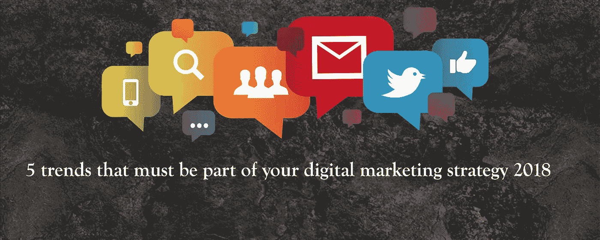

# 2018 年数字营销战略中必须包含的 5 个趋势

> 原文：<https://medium.com/hackernoon/5-trends-that-must-be-part-of-your-digital-marketing-strategy-2018-3b536f9e5790>

2018 年伊始，马克·扎克伯格(Mark Zuckerberg)宣布改变脸书的算法，以及新的新闻馈送将如何工作。当然，[脸书](https://hackernoon.com/tagged/facebook)“页面喜欢”这类指标在几秒钟内就失效了。你可能有 2 个赞或 200 万个赞，很快**不会**在任何人的 feed 页面上显示帖子。2018 年必将是人们对个性化过度热衷的一年。

 [## 你在脸书页面上的赞已经不算数了——不是开玩笑！！

### 扎克伯格可能刚刚用一个意想不到的脸书击中了营销人员和社交媒体经理的太阳穴…

medium.com](/productivity-revolution/your-facebook-page-likes-dont-really-count-anymore-not-kidding-eb6fdb43b643) 

尽管令人沮丧，2018 年数字[营销](https://hackernoon.com/tagged/marketing)的未来还是很有趣的。

以下是我们从与专家的交谈中发现的最佳选择。

**1。影响者营销的下降**

我们认为影响者主要有两种:

1.  那些让你获得品牌知名度的人，他们可能会有上百人与你合作。
2.  第二，那些让你转化并让人们购买你的产品的人。

随着品牌开始尝试如何营销，这也意味着与有影响力的人打交道的预算可能会减少。预算有限且需要在投资回报率和认知活动之间做出选择的品牌，需要从与 100 名普通影响者或 10 名特定影响者合作中做出选择。

**2。移动活动**

谷歌早些时候表示，60%的搜索来自移动设备。如果这都不能让你清醒，那我不知道还有什么能。设计师、开发人员、作家——每个人都需要首先考虑移动设备，然后才是桌面设备。

**3。视频.视频.视频.**

你可能已经从一百个人那里听说过这个，我们不介意成为第 101 个告诉你这个的人。视频会有什么规则。如果你还没有专注于一个视频策略，那么我建议你大声喊一声“啊啊啊”，然后开始行动！！有了更智能的设备、更快的网络和更好的缓冲，这就是你的竞争对手此刻正在计划的。

正如 LLMedia 的创始人兼首席执行官 Lisa Lubin 所说——“无论好坏，视频给人们提供信息和娱乐，今天大多数人更喜欢看视频而不是阅读一页文字”

**4。语音营销:**

谷歌在 2016 年表示，20%的搜索是基于语音的。这个数字一直在增长，现在营销社区正在积极讨论它。营销人员如何迎合这样的搜索，并更好地准备排名更高？

eg [Voysis](http://voysis.com/) 正在利用 AI 为电子商务提供语音 AI 平台。多酷啊！！这就像让你的手机把意大利面放进你的购物车并开账单一样简单。

今年和接下来的几年将会是关于如何让 SIRI 和 Alexa 成为你最好的朋友。把这个问题留给你。

**5。AI 和机器学习**

你可能想知道这些和数字营销有什么关系。嗯，很多！MarTech——这是一种营销技术，它将见证聊天机器人、虚拟助理、个性化以及电子邮件活动中基于触发的自动化等的指数级增长。

很想听听你们对未来数字营销的最好看法。