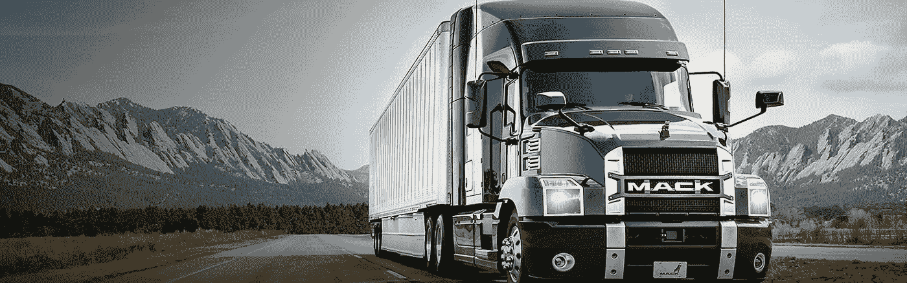
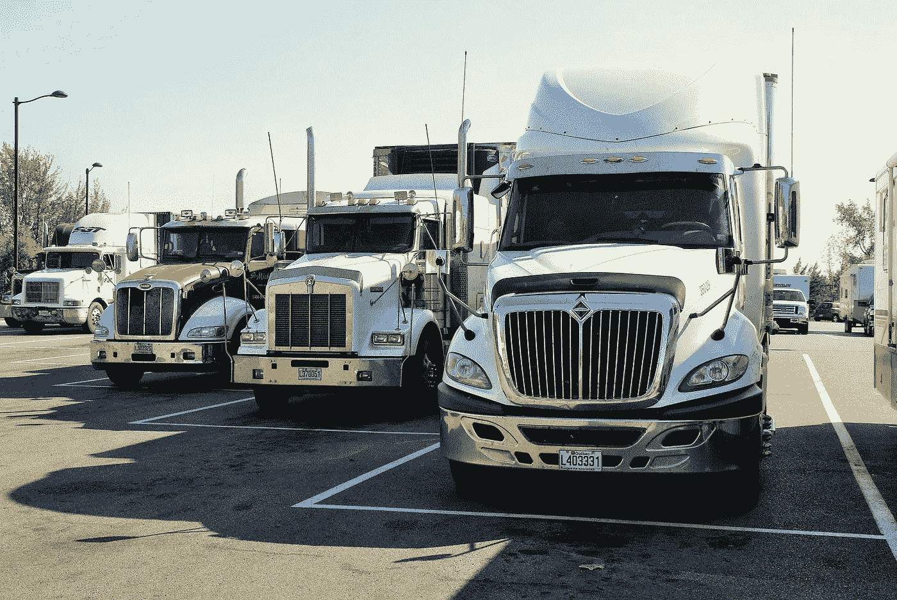

# 货运运营商的 5 大难题以及技术如何解决它们

> 原文：<https://medium.com/hackernoon/5-troubles-of-freight-operators-and-how-technologies-solve-them-5c6812b2d0ad>

如今，大多数货运运营商都不需要被说服技术的重要性。与此同时，货运在自动化的道路上仍然萎靡不振。原因既在于行业的复杂性，也在于缺乏数字化意识。

当谈到物流的数字化时，常见的想法大多位于两极:一方面，技术化被视为减少文书工作和电话的机会。另一个极端是最新的装置，如无人驾驶卡车和货运无人机。

而对于大多数货运运营商来说，他们的紧迫问题介于两者之间，其业务的 IT 解决方案也是如此。为了帮助这两者的结合，我们分析了大量的物流网站，并找出了货运代理人最常遇到的 5 个问题。我们还整理了一些技术工具[T1 】,可以立即应用来简化运输过程。](https://hackernoon.com/tagged/tools)

# 1.供应链管理

路由是一项复杂的决策。找到最优惠的价格和服务水平也是如此。成本结构和向客户提供准确报价的需要是另一个可能引起麻烦的问题。但是在[技术](https://hackernoon.com/tagged/technology)的支持下，复杂的问题变得简单了。

简化规划、路线和成本估算的最佳方式是实施[运输管理系统](https://stfalcon.com/en/blog/post/transport-logistics-automation-what-is-tms) (TMS)。InMotion Global 公司进行的一项调查显示，TMS 软件正在成为大型托运人、经纪人、第三方物流和货运运营商的关键技术。2018 年，运营 20 辆或以上卡车的约 91%的货代使用 TMS，而 2005 年为 62%。

尽管如此，这种情况对小型船队来说仍有许多不足之处。如今，10 辆卡车以下的汽车承运商中只有 33%在使用 TMS。在这方面，应该考虑 InMotion 的另一个统计结果。他们超过 12 年的研究表明抵制 TMS 的公司是那些最有可能倒闭的公司。

TMS 有助于收集和分析大数据，并将其转化为可操作的增值信息。它增加了可见性和规划的形状。如今，许多运营商使用电子数据交换(EDI)和应用编程接口(API)。EDI 是一种标准电子格式的计算机到计算机的商务文件交换。它允许最大限度地减少人工文档交付，从而节省大量时间。

# 2.透明度

透明度是当今货运公司最大的客户需求。客户希望随时了解他们的送货地点。跟踪货物的重新定位对车队经理也很重要:这是提供准确的到达时间和必要时重新安排路线信息的基础。

存在两种类型的车辆位置跟踪:蜂窝和卫星。手机追踪系统根据手机信号塔的数据来确定司机的手机位置。GPS 跟踪是通过全球定位系统检查位置。该技术可以识别车辆的经度、纬度、地速和行驶方向。

这两种类型的跟踪都可以集成到您的软件中，以便您可以在地理信息系统(GIS)的帮助下在地图上看到货物的位置。司机和调度员都可以通过移动应用程序访问存储在服务器上的数据。

# 3.速度

速度不再是奖励。越来越多的货运公司客户认为它是必备的，并希望他们的运输在几天内提供。尽管 cargo hyperloop 仍然是一个白日梦，但物流的数字化已经带来了某些增强。

按时交货不仅意味着全面的路线开发，还意味着在出现不可预见的情况时有快速反应的能力。确保更快决策的技术为运输提供了重要价值。

基于网络的物流服务可以快速分析可用车辆的基数，提高调度效率，并最大限度地减少运输停工时间。嵌入式 GPS 通过谷歌或 Yandex 地图警告交通堵塞和道路维修。像 Trucker Path 这样的应用程序也可以通过提供车站、加油站、导航等信息来简化运输过程。

# 4.安全性

多年来，安全和保障一直是货运代理人关注的问题，但最近，安全已成为压倒一切的问题。借助 TMS 和监控设备，您可以在运输过程中密切关注货物。这里有用的选项包括电子封条和地理围栏。电子封条是一种高度警戒设备，如果集装箱或运输车辆封条被破坏，它会向安全小组发送即时警报。

地理围栏是一种软件功能，它使用 GPS 或无线电频率识别在特定地理位置周围设置一个不可见的周界。可以在车辆打算遵循的路线周围放置地理围栏。如果它偏离，则移动设备生成无线警报，并在相应的软件应用程序中触发警报。

货代也可以从使用移动应用程序中受益，如围绕驾驶社区构建的 Trucker App 或 CoPilot Live Truck。它们会警告驾驶员意外情况，根据车辆大小、重量和负载类型建议安全可靠的卡车合法路线，并帮助创建自定义路线配置文件，以便在车辆之间轻松切换。

# 5.人为因素

除非你幸运地拥有一支自主舰队，否则人际交往对你来说永远是个问题。事实上，这些司机是你在旅途中信任的人。经理在这里遇到的三个要点包括司机短缺和保留，工作表现和会议合规性，安全，责任法规。它们的共同点是[司机-调度员通信](https://stfalcon.com/en/blog/post/logistics-automatization)及其分析。

重型车辆的司机必须进行必要的休息，不要驾驶太长时间。在欧盟、美国和俄罗斯，违反规定的工作和休息时间会受到处罚。为了满足这种需求，使用了电子记录应用程序和设备。

电子记录项目通过无线网络服务和电子邮件传输数据，如果行车日志中有违规或错误，则发出警报，并在车辆发生任何损坏时生成车辆检查报告。

车辆远程信息处理，即位于车辆各处的传感器，也向后台系统传送大量数据，如发动机诊断、车内温度、车门开启、空闲时间和驾驶员换档模式。操作员使用这些信息来制定高效的车辆维护计划、确保驾驶员辅助、为驾驶员介绍最佳实践、提高速度和改善安全性。

# 实施案例

提到所有的技术创新，问题是如何将它们应用到你作为货运运营商的工作中——特别是如果你不是拥有内部软件开发中心的 UPS、DHL 或 FedEx。你没有义务遵循[劳拉·伯伦斯](https://stfalcon.com/en/blog/post/women-in-IT)的道路，自己发明新的七宝。你当然不需要成为多面手来保持现代货运的优势。把你的痛苦托付给其他专家，利用现成的产品。

例如，让我们来看看 IT 公司 Stfalcon.com 如何在 [SmartSeeds](https://stfalcon.com/en/portfolio/smartseeds-ru) 服务中实现上述大部分功能。该服务在一个谷物和油籽运输系统中连接货主和运输商。它允许货主发布他们的请求，如果有可用的卡车，货运代理会做出响应。几个货代可以合作完成一个订单。

除了基于网络的 TMS 之外，它还包括针对货主、运输商和司机的移动应用，并允许用户验证、请求管理、费率设置、统计数据审查、消息传递和通知。

为了监控车辆的重新定位，每辆卡车上都安装了一个 GPS 传感器。因此，货主和货运经营者都遵循运输过程。GPS 坐标会定期发送到 GIS 并进行分析。因此，任何路线偏差、地理区域之间的切换、信号丢失或停机都会被立即检测到。为此项目开发了单独的 GIS，以确保独立于外部代理。移动应用程序允许司机跟踪进度，并在出现意外情况时与支持服务交换信息。

# *最初发表于*[*【stfalcon.com】*](https://stfalcon.com/en/blog/post/digitization-of-freight-transportation)*。*