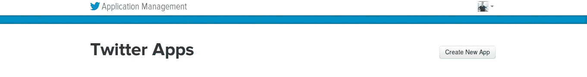

# 用几行 Javascript 实现 5 个 Twitter 批处理操作

> 原文：<https://medium.com/hackernoon/5-twitter-batch-operations-with-a-few-lines-of-javascript-5412846cd1aa>

Twitter 是一个创造社交存在的伟大工具。然而，使用 twitter 应用程序 GUI 进行批量操作是乏味且耗时的。API 使得编写批量操作数据的程序成为可能。。[dswitter 模块](https://www.npmjs.com/package/dstwitter)是一个 [dstools](https://www.npmjs.com/package/dstools) 扩展，它使得在 twitter 用户或 tweets 等数据元素集合上执行 twitter API 变得容易。它很大程度上依赖于方法链模式，类似于 jQuery。在本教程中，我们将展示如何:

*   获取关注者和朋友的列表(朋友是你关注的用户)
*   显示带有关注者计数、朋友计数、您没有关注的关注者以及您关注但没有关注您的用户的报告
*   关注所有关注您的用户(您尚未关注的用户)
*   取消关注所有你关注但没有关注你的用户
*   为您的关注者 bios 获取 word cloud(个人资料的描述部分)
*   搜索在推特上谈论特定话题的用户


# 奠定基础——创建 twitter 应用程序

为了使用 twitter API，您首先需要创建一个 twitter 应用程序。一旦有了 twitter 应用程序，就可以使用它的凭证来访问 twitter API。

前往 apps.twitter.com，点击“创建新应用”按钮。



填写名称、描述和网站(如果愿意，您可以只键入一个占位符)。在本例中，我们只是将应用程序用于自己的用途。如果你正在创建一个处理其他用户的 twitter 应用，确保你的用户可以在某个地方了解这个应用。别忘了网站网址以 http 或 https 开头。点击按钮创建应用程序，瞧，你已经有了自己的应用程序。

现在我们需要获得激活 twitter API 所需的凭证。选择“密钥和访问令牌”选项卡。这将显示您的应用程序**消费者密钥**和**消费者秘密**。您将需要它们来连接 twitter API。我们将代表您访问 API，因此我们需要一个用户访问令牌。获取用户令牌最简单的方法是在应用程序页面上，使用“创建我的访问令牌”按钮。只需点击它，您将获得一个用户**访问令牌**和**访问令牌秘密**。这些也是执行 API 请求所必需的。

# NPM 图书馆

在本教程中，我们将使用两个 npm 模块: [dstools](http://Function reference and jsdoc based documentation can be found at https://elshor.github.io/dstools/) 和[dswitter](https://www.npmjs.com/package/dstwitter)。 [dstools](https://www.npmjs.com/package/dstools) 是一个 npm 模块，用于轻松操作 twitter 用户和推文等数据集合。它依赖于方法链接，我发现这个特性在处理需要分几个步骤操作的数据时非常有用。这个库与 Jupyter 笔记本很好地集成在一起。我的[上一篇文章](https://hackernoon.com/data-science-for-javascript-developers-2cc3fb1fbefc)解释了如何使用带有 Javascript 的 Jupyter 笔记本。但是，可以将这个包与普通的 Javascript 文件或 REPL 一起使用。

[dswitter 包](https://www.npmjs.com/package/dstwitter)是一个插件，以一种方便的方式提供 twitter API 功能。该库的一个重要特性是它能够处理 twitter 的 API 限制，比如每页最大结果数和速率限制。使用 twitter API，每个 API 端点都受到每个特定 API 调用可以返回的项目数量以及应用程序每 15 分钟可以执行的 API 调用数量的限制。dstwitter 模块可以将对许多项目的请求分成几个 API 调用，如果应用程序达到了配额，它会等待 15 分钟。

# 这是代码

程序员喜欢看代码。事不宜迟，下面是代码(带有一些注释)。代码经过编辑，可以复制/粘贴到节点 REPL 中。因此后面的点。

## 初始化环境

首先，您需要加载这个库，并用 twitter API 所需的凭证初始化它

```
require('dstwitter');//initialize dstwitter module
let start = require('dstools').Collection().
context('twitter',{//load twitter API credentials to context
 access_token_key:'ACCESS_TOKEN_KEY',
 access_token_secret : 'ACCESS_TOKEN_SECRET',
 consumer_key: 'CONSUMER_KEY',
 consumer_secret: 'CONSUMER_TOKEN'
});
```

## 显示带有关注者计数、朋友计数、您没有关注的关注者以及您关注但没有关注您的用户的报告

twitter 应用程序向我们显示了关注者数量和您关注的用户数量。有趣的是，你追随的用户中有多少人没有追随你，你的追随者中有多少人你没有追随。

```
let followers, following;
start.followersIDs(ME).//load followers
do((output)=>followers=output).//set followers variable
followingIDs(ME).//load following
do((output)=>following=output).//set following variable
do(()=>{
 console.log(‘followers:’,followers.length);
 console.log(‘I follow:’,following.length);
 console.log(“Follow me that I don’t follow back:”, Collection(followers).drop(following).count());//use Collection function to create dstools collection and use its functions such as `drop`
 console.log(“Don’t follow me back:”, Collection(following).drop(followers).count());
});
```

## 关注所有关注您的用户(您尚未关注的用户)

一些推特用户相信互惠追随，你追随任何追随你的人。下面的代码实现了这一点。

```
start.collection(followers). 
 drop(following).  //ignore users I am already following
 follow(); //follow them
```

## 取消关注所有你关注但没有关注你的用户

这与互惠友谊正好相反，在互惠友谊中，你不想追随任何不追随你的人。例外列表是您仍想关注的用户。这些可能是重要的 twitter 用户，即使他们没有关注你，你也要确保关注他们。

```
exceptions = ['hackernoon','JavaScriptDaily'];
following. //start with all users I follow
 drop(followers).  //drop users that follow me
 twitterUser(). //translate ids to user objects
 column('screen_name').//translate user objects to screen_names
 drop(exceptions).//remove exception screen names
 unfollow(); //unfollow whatever is left
```

## 为您的关注者简历获取 word cloud(个人资料的描述部分)

了解你的受众是沟通的首要原则。当你有成千上万的追随者时，了解你的观众是一个挑战。一个可能的捷径是查看他们的 bios 的单词云，总结所有用户的 bios。

```
start.followers(ME,10000).
column('description').toLowerCase().
terms().dropStopwords('term').
sortDesc('count').head(50).wordCloud('term','count').save('word-cloud.html');
```

## 搜索在推特上谈论特定话题的用户

“追随谁”是任何 twitter 用户都会遇到的问题。如果你对“vue”感兴趣，你应该关注哪些 twitter 用户？使用下面的代码，我们搜索关于“vue”的推文，找到哪些用户写了推文，加载他们的用户配置文件，并显示亮点，以便我们可以选择关注谁:

```
start.searchTweets('javascript react',10000,{result_type:'mixed'}).
filter((tweet)=>!tweet.text.startsWith('RT @')). //filter out retweets
map((tweet)=>tweet.user). //get users of the tweets
groupBy('screen_name').
sortDesc((item)=>item.data[0].followers_count).//order by followers
head(20).
do((users)=>{
 console.log('screen_name, tweets in search, followers, following, statuses, description');
 users.forEach((user)=>console.log(
  user.key + ':', //screen_name
  user.data.length,
  user.data[0].followers_count,
  user.data[0].favourites_count,
  user.data[0].statuses_count,
  user.data[0].description));
});
```

# 最后的话

Twitter 是一个无尽的数据桶。使用 twitter API 并将其与数据分析工具结合可以产生重要的洞察力。这篇文章描述了在 dstwitter 包中使用 API 的基础知识。在以后的文章中，我将演示如何使用数据工具来分析 twitter 数据。同时，你可以看看我关于使用 Javascript 进行数据分析的帖子

[](https://hackernoon.com/data-science-for-javascript-developers-2cc3fb1fbefc) [## Javascript 开发人员的数据科学

### 使用 Javascript 进行数据分析的教程

hackernoon.com](https://hackernoon.com/data-science-for-javascript-developers-2cc3fb1fbefc)