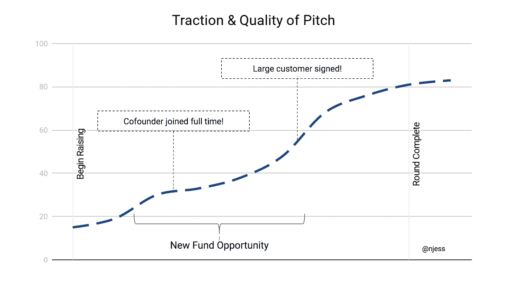

# 关于风险投资交易流程的 5 个未解问题

> 原文：<https://medium.com/hackernoon/5-unanswered-questions-about-vc-deal-flow-68ff19441599>

*由*[诺亚杰索普 ](https://twitter.com/njess)

作为一名企业家，我参与并获得了与许多大公司合作的机会。但当我来到风险投资领域时，有一个我以前从未真正考虑过的全新元素正在悄悄地塑造整个生态系统:投资者的交易流程。

现在，当我与其他投资者交谈时，对交易流程的担忧相当直接:

> 我如何获得更多的好交易流量？越多越好。
> 在哪里培养才能获得未来的好交易流量？

这通常是谈话停止的地方。

运营公司中不断变化的新客户来源有一个术语:*媒体组合*。

作为一名经营者，当潜在客户或潜在新客户来自不同的来源时，我怎么能指望以同样的方式经营我的业务呢？我们预计在一个重要的关键字上的额外竞争会改变一个运营公司的投资回报率。但当应用于风险投资时，媒体组合问题很快就被遗忘了。与运营公司不同，运营公司必须说服每个客户支付他们的价格，在某些情况下，投资者*实际上控制着转换事件*。(也就是说，如果他们以优惠条件提供资金，就会被接受。)

所以看转换率很难触及表面。接下来是我还没有答案的问题。

# **问题 1:大交易流量是风险企业的优势吗？**

为了开始考虑这个问题，我发现使用查理·芒格的[反转](https://25iq.com/2015/09/12/a-dozen-things-ive-learned-from-charlie-munger-about-inversion-including-the-importance-of-being-consistently-not-stupid-2/)心理模型更容易:

> *作为一只新基金，你会怎么做才能拥有优势？*

我认为这很简单(也不完全是直觉):更仔细地看看你能接触到的投资。

有时候，新的创业公司很快就完成了融资——要么与他们已经认识很长时间的公司合作，要么通过严格的竞争过程。但更多的时候，他们通过他们的天使和顾问遇到一些有声望的人，甚至可能在他们开始尽可能地讲述他们的故事之前。(或者甚至在他们决定加注之前。)

这些最早的推介——不清楚公司是否正在融资——经常被拥有大量高质量交易流的公司错过。我之前已经详细写过如何让回合需要[打包](https://hackernoon.com/packaging-your-seed-round-d1888116b7b5)才能快速移动。无论团队有多高的质量，市场有多好，这些早期的宣传可能会被淹没在噪音中。不一定是更好的投资——但是团队已经有了一个条款清单，已经解锁了一个重要的牵引里程碑，或者仅仅是作为一项业务继续发展了几年。

大多数回合需要几周或几个月的时间来凝聚——因为团队达到了新的里程碑，在讲述他们的故事方面变得更好:

Time on X-axis, Traction & Quality of team’s pitch on Y-axis

在任何给定的交易中，新公司什么时候有优势？在对其他潜在投资者而言，它显然是一家成功的公司(至少在现阶段)之前。

他们如何利用这一优势？抛开他们的行业专长和现有的关系不谈，新基金经理只需要*更多的时间来培养对交易的信心*。他们很少参加新的会议，也没有什么业绩记录可以让他们赢得迟到的交易。

因此，当他们看到自己了解的企业时(或者他们遇到自己特别喜欢的创始人时)，他们有更多的时间去规避故事中尚不完全清晰的部分。换句话说:一些被忽视的异常值会变成难以置信的投资。但更多的交易流让投资者将这些机会放在“太难”的一堆中，并将时间集中在其他更安全的押注上。

# **问题 2:越早看到交易真的越好吗？**

对大多数投资者来说，只看到交易，为时已晚是没有帮助的。但是考虑一下最好公司的一个常见案例:

1.  在加薪开始时会见一个有前途的团队(前 5 次会议)
2.  几个月后，当团队已经有了一两个条款清单时，再与这个团队联系

交易最终往往进展得太慢，然后又太快。当事情进展得非常快时，风投很难开始考虑交易。对于一个考虑领投一轮融资的新投资者来说，无论他们有多喜欢这家企业和创始人，通常都很难做必要的工作，在这个压缩的时间表内达成投资的信念。

对于创始人来说，在过程的后期考虑新的追求者，当他们是否愿意和有能力投资仍然存在不确定性时，该公司必须非常重视，以阻止创始人接受现有的“手中之鸟”条款清单。

大多数风投*说*他们希望尽早见到公司，并在公司发展过程中建立一些数据点。只有当公司没有加速到超出给定公司能够开出支票的阶段时，这种进展才有帮助。

很少有人会这么说，但有时，在一家公司即将开始适当的融资过程时，与这家公司见面只是少做了一些工作——动作要快得足以知道交易会发生，但动作要慢得足以做公司想做的尽职调查。缺乏勤奋或关系将很快被证明是合理的合作关系，说:“这成为一个非常竞争的过程，我们想赢得这个机会。”

作为一名创始人，我总是把一轮谈判的合并称为“创造一个 FOMO 的离散时刻”——我现在的建议是，当事情开始提前发展时……但只有在交易进展非常确定的时候。

# **问题 3:“好的”交易流能看到所有的“热门”交易吗？**

风险投资是一个充满例外和异类的行业。通常情况下，我们可能需要几年时间才能了解哪些投资实际上是“好的”——即使这样，在实现有意义的流动性之前，任何特定公司的实际投资成功都是不可靠的。

所以我们寻找捷径。我们寻找我们作为投资者表现良好的代理。我们看到的是未来 5-10 年内举足轻重的公司。

不幸的是,“热门”交易是一种容易获得且被过度使用的捷径。筹款阶段的竞争是最终成功的廉价代表。通常，当每个人都想做一笔交易时，可能是因为这是共识*听起来是对的，但不是。*

更糟糕的是，在构建投资组合周期的早期，投资者可能会因追逐热门交易而偏离最终回报。这些风险投资者面临的短期激励使得做一些热门和一致的事情变得很重要，希望在他们需要为下一只基金筹集更多资金时，它已经升值。

类似的挑战也存在于更老、更成熟(也可能更政治化)的公司——有时“热门”交易更容易通过合作关系达成。从其他追求者那里赢得一笔交易可能足以成为投资的理由。

这整个过程为初创公司创造了一场凯恩斯式的选美比赛——投资者猜测哪些公司看起来最符合未来投资者的信念，即他们之后的其他投资者可能会喜欢什么。(在原著中，凯恩斯提出了一个竞赛，其中的“正确”答案是猜测其余人群中哪张脸可能最受欢迎。)

从定义上看，这种做法是另一种伪装:回归均值。

对于在风险型例外的对数型结果领域寻求异常值表现的投资者几乎没有帮助。打破这种模式的一个方法很简单:投资者可能会为那些很可能是真正的异类并且已经被广泛发现的交易支付最高的价格。

# 问题 4:公司的交易流程是否会随着时间的推移而持续改善？

具有讽刺意味的是，投资者花了大量时间思考一项预期投资将获得新客户并实现增长——看公司的用户获取成本和渠道将如何随着业务规模的扩大而变化。

但正如我们之前提到的，投资者自己的“媒体组合”正在发生变化——他们控制着转换事件，因此很难跟踪到底发生了什么。

再加上风险投资缓慢的反馈周期:投资者真的不知道他们之前交易的结果。展望未来，从结构上来说，他们只能投资属于其交易流程的交易。

所有这一切都是在说:投资者的策略与他们看到的交易紧密相连(并且很容易改变)。

获得大量的推荐交易流需要时间，而且会占用潜在机会的所有时间和空间。例如，有多少高交易流量的风险投资公司选择投资以太坊 ICO？(今天，假设你一路都没有卖出，那将是 1800 倍的回报。)良好的交易流可能会有所帮助，但它可能看起来像“启动 y”(或现在的“加密 y”)，完全不像明天的异常值将如何开始。

除了有更少的时间来评估新的机会和新领域，更多的交易流也有隐藏的一面:投资者将逐渐看到更多的公司处于其阶段的后期阶段。为什么？在选择与哪些公司合作时，商业牵引是一条简单(且相关)的捷径。当你可以看到一家公司在同一个融资阶段获得 20 万美元的收入时，为什么还要去看这家公司每月获得 5 万美元的收入呢？

有人可能会说，公司筹集越来越多的资金并转移到后期阶段不仅仅是为了收取更多的费用——这只是为了利用他们随着时间的推移自然建立的交易流。

# **问题 5:“伟大的”交易来自伟大的推荐来源吗？**

我看到许多投资者寻求投资“高质量”的铅源。尽管创始人以前工作过的地方或以前投资过的人肯定会发出积极的信号，但这是有帮助的，但还不够。否则，顶级投资者可以简单地支持每一位谷歌和脸书的校友，并让他们这样做。

如果投资者建立了所有“好的”潜在客户来源，并看到许多人来自前几名公司，他们怎么能认为他们会有差异化的流量呢？我们在上面建立了，在大多数情况下，最早看到事情并不一定是赢得交易的优势。

根据定义，下一笔异常交易的“伟大”来源是真正不可知的*。*

一个投资者所能争取的最好结果就是建立自己的声誉(并代表一些东西),并远游四方…

如果你读到这里——或者认为这篇文章可能对你认识的企业家或投资者有所帮助——考虑点击“👏“下面来帮忙铺这一块。告诉我[你是如何遇到迄今为止最好的投资的](https://twitter.com/intent/tweet?text=.%20@njess%20I%20invested%20in%20__%20via%20__)。并继续对话 [@njess](https://twitter.com/njess) 。