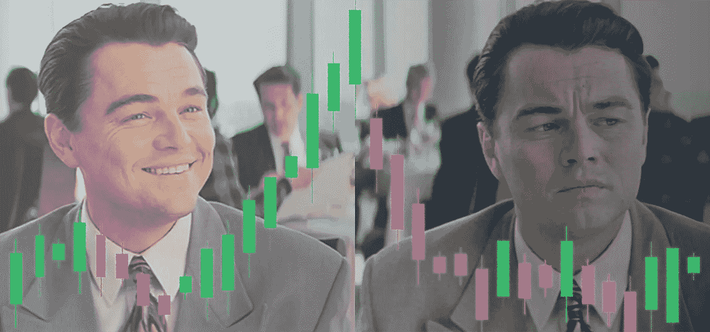
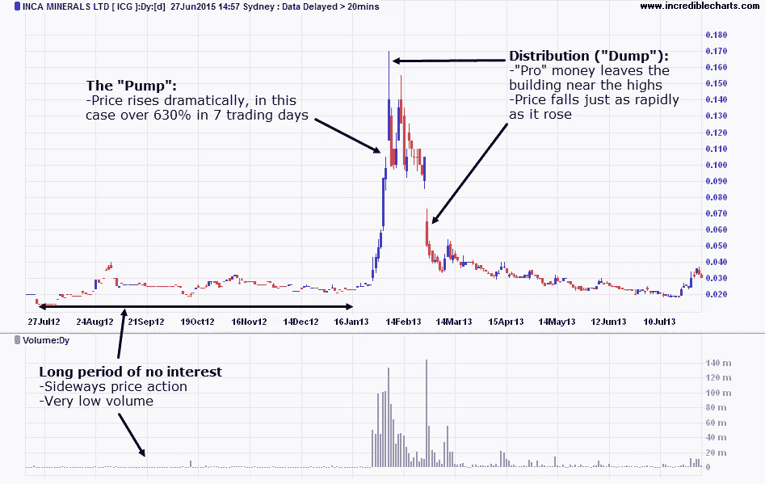

# 比泵送和倾卸小组更聪明的 5 种方法+逐步指南

> 原文：<https://medium.com/hackernoon/5-ways-to-be-smarter-than-pump-dump-groups-a-step-by-step-guide-d97d8415db4d>

当我们集思广益讨论建造 pumpdump.coincheckup.com 时，有一个反复出现的问题:“我们真的应该建这个网站吗？”

就个人而言，我们根本不相信泵&转储方案；我们从不在这上面浪费时间；我们认为这是不道德的，它肯定不会帮助[加密](https://hackernoon.com/tagged/crypto)。

相反，我们认为让加密更加透明是 [CoinCheckup](https://coincheckup.com) 的使命。

“泵和转储是加密的一部分”。这是事实，这是现实，这是密码中发生的事情，不管我们喜欢与否。

必须有人展示在“加密泵和转储场景”中发生了什么。这就是我们建造[coin check Pump&垃圾场的原因。](https://pumpdump.coincheckup.com/)

# 泵和倾卸组如何工作？

有趣的问题。答案没有你想象的那么复杂。

基本上，这些群体通过普通的(社交媒体)营销技术获得知名度。他们在网站上设立了“用户专区”、脸书小组和/或电报小组，并在他们的社交渠道上进行推广。几乎都是信誓旦旦的“你那个前途无量”。就像我爸爸说的:

> 如果听起来好得不像真的，那很可能好得不像真的。

如果你想成为他们“核心圈”的一部分，你可能需要每月支付一笔费用。这让它感觉更排外。

# 该过程

1.  该组织的创始人挑选一枚硬币，他们将泵。这些通常是小盘硬币。他们会在别人知道他们要抽水之前开始购买硬币。
    他们一点一点地购买少量的加密货币，不会把价格抬高太多，但这是他们抢在其他人之前获得尽可能多的加密货币的动机。
    无论如何，因为这些是小盘硬币，在真正的大泵出现之前，你可能已经看到一个小泵出现。让我们称之为前泵阶段。如果你想获利，这个前期阶段是买入的时候。
2.  该集团将这种泵传达给他们的核心圈子，通常是付费用户，他们开始抬高价格。创始人可能已经出售了一些股份，因此他们将一些风险排除在外。
3.  这个群体通过社交媒体向他们的追随者(也包括那些没有付费订阅的人)传达一个硬币正在抽水的信息。人们看到两位数的绿色数字，于是他们开始买入，而创始人和核心圈子慢慢开始卖出更多股份。一旦出现增长停止的迹象，他们就大举抛售，油泵就变成了垃圾场。
4.  ***注意*** 他们的大部分股份已经出售，并获得了几十个百分点的利润。

[https://steemit.com/altcoins/@ashr/q-and-a-pump-and-dumps-illegal](https://steemit.com/altcoins/@ashr/q-and-a-pump-and-dumps-illegal)

# 你为什么会使用我们的 P&D 网站？

有几个用例。

1.  出于普遍的兴趣和好奇，在抽什么。
2.  防止投资硬币；
3.  在下跌时购买频繁的泵币。
4.  对正在跳动的硬币下小赌注；
5.  成为最聪明的！！

> 泵转储方案有效的唯一原因是人们喜欢在数字为绿色时购买！只是感觉好多了。**点击推文**

我们将在下面讨论这 4 种使用情形。

# 如何比泵和倾卸组更聪明！？

***免责声明:*** 本章(下)我所说的一切都是 ***没有投资建议*** ，请进行 ***风险自担！🙂***

# 1.好奇，但是，只是不要投资在泵密码。

这可能是最安全的做法。话虽如此。你可以**使用我们的大众兴趣和好奇心网站**，在不参与的情况下了解正在发生的事情。这是我个人喜欢做的事情。看到正在发生的事情真令人着迷。

# 2.现在你知道什么是“不要投资”。

你也可以使用 **P & D 网站来查看什么是“不要投资的”**如果你正在寻找更稳定的长期加密投资，频繁提取和抛售的加密货币可能不是你最安全的赌注。

# 3.一些硬币一次又一次地跳动。购买泵送加密时，它完全倾倒。

**泵和倾卸组有他们的最爱**。你可以使用泵&到垃圾场看看什么泵得最多。不要在硬币真的在抽的时候买。

当硬币抛出时买入，然后等待几天、几周、几个月，设置你的卖出指令，当它出现时，你是第一个获得可观利润的人。

***注意*** 显然有一个风险，你买的密码将永远不会泵了。你应该 100%意识到这个风险。话虽如此。我们一次又一次地看到一些硬币在跳动。

# 4.对正在抽取的硬币下小注。

当你真的看到一些东西在泵和垃圾场上泵送时，你可以**直接购买，然后以更高的百分比卖出**。

诀窍是不要贪婪，也不要投入太多资本。

仍然有很高的风险，但如果你坚持这些角色，你可能会很快获得一些利润。

# 5.做最聪明的！！但是怎么做呢？

> [3 步流程+如何比泵&倾卸组更聪明的技巧！点击发微博](https://twitter.com/intent/tweet?url=https://coincheckup.com/blog/how-to-be-smarter-than-pump-dump-groups/&text=The%203-step%20process%20%2B%20tips%20on%20how%20to%20be%20smarter%20than%20the%20pump%20%26%20dump%20groups%21&via=coincheckup&related=coincheckup)

再次声明，这不是投资建议，这只是我对正在发生的事情的常识性看法。我没有用真钱测试这个方法，因为我没有时间也没有动机，但是我确实按照示例硬币:[传奇室](https://coincheckup.com/coins/legends-room)并且我可以根据这个方法得到一些不错的两位数百分比。

1.  [检查泵送的是什么](https://pumpdump.coincheckup.com/)

我发现史诗"[传奇室](https://pumpdump.coincheckup.com/crypto-currency/legends-room/)"在我写这篇文章的时候正在抽水。

2.确保它没有疯狂地跳动(还没有)。你可以在 CoinCheckup.com 上查看[图表。在没有尖峰信号的情况下，是否有一些可见的小增长？](https://coincheckup.com/coins/legends-room/charts)

*   如果一枚硬币疯狂地跳动，你可能已经太晚了。
*   如果一枚硬币在过去跳动，这通常是它可能再次跳动的信号。
*   如果硬币现在有一点跳动，继续。

3.前往[CoinCheckup.com](https://coincheckup.com/)，搜索硬币名称并查看硬币概览页面。

比如(我写这篇文章的时候):传奇室在抽。我正在检查 CoinCheckup.com 的传奇室。

*   看看新闻吧，这种增长没有新闻方面的原因吗？
*   检查基本面和算法。分数，这个硬币有增长的理由吗，任何(更大的)投资者有“真正的理由”购买长期持有的密码吗？
*   查看技术分析，是否有强烈的买入信号？
*   如果这些问题的答案是否定的，那么这是一个很大的变化，密码处于预泵阶段,这可能是一个购买它并直接出售订单的好时机。

***温馨提示:*** *再次说明，只是我的看法，没有建议。*

*   如果你设置了卖出指令，设置不同的小额卖出指令，这样当你连续卖出的时候，人们会继续购买真正的密码。
*   不要贪婪，不要忘记 10%是一个疯狂的利润，是的，在加密中你偶尔可以在 1 小时内赚到 100%，但不要太贪婪。
*   投入与当前交易量相当的资金，这样你就可以带着一点利润快速平仓

# 祝你好运，小心点。

是的，你需要一些“好运”。参与抽水和倾倒计划是非常危险的。在投资任何加密货币之前，请做好自己的研究。完全不建议“仅仅因为价格上涨”就(对任何东西)进行任何投资。我们不建议任何人参与泵和转储。此外，CoinCheckup 将不会激励任何泵和转储计划，因为我们认为这是非常不道德的！

*原载于 2018 年 4 月 19 日*[*coincheckup.com*](https://coincheckup.com/blog/how-to-be-smarter-than-pump-dump-groups/)*。*