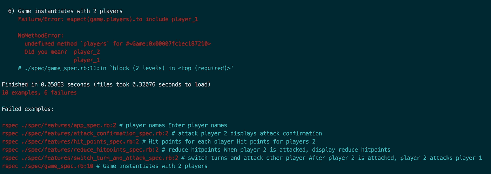
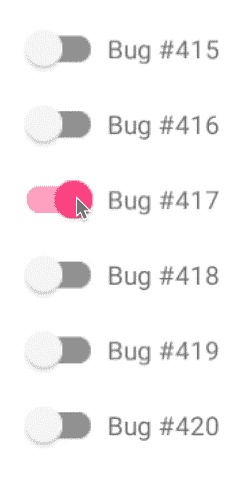

# 摆脱棘手编码问题的 5 种方法(4)

> 原文：<https://medium.com/hackernoon/5-ways-to-unstick-yourself-from-sticky-tricky-coding-problems-4-f65aba51a0ca>

GIFs courtesy of Giphy

当你学习新的东西时，你不知道你不知道什么。擅长某事总有秘诀，学习编码也不例外。这些秘密是元学习，提供了方法、工具集和心态，使你成为一名出色的程序员所需的突破。**我在这里透露我在创客学院** [**编码**](https://hackernoon.com/tagged/coding) **旅程中发现的元知识，这样你就可以加速你的。**

# 在本系列的第四篇博文中，我们将看看当你陷入一个棘手的编码问题时，摆脱困境的可行方法

> “成长是痛苦的。改变是痛苦的。但是没有什么比停滞不前更痛苦的了
> 
> 纳拉亚娜·穆尔蒂

## [1]使用健壮的、消除 bug 的调试方法

**如果你读到第一行并想‘我不知道我*是否有*一个真正的调试过程’；那么让我告诉你，你是在享受。**

有了编码(也可以说是生活)**过程永远是王道**相对于特定问题的解决方案。培养一种可以应用于任何编码问题的健壮的调试方法是粉碎编码错误的最好方法，无论这些错误有多大。

**进入:由** [**玛丽·罗斯·库克**](https://maryrosecook.com/) 开发并与我分享的非常简单的“3 步调试过程”

**第一步:从错误信息**中抽出*所有*有用信息

听起来很简单。实际上，对于新手和有经验的程序员来说，这都是一个典型的陷阱。通常，当我们运行我们的代码(或者对我们的代码运行测试)时，我们试图尽可能快地直接找到解决方案，不顾一切地跳过堆栈跟踪和任何错误消息。这很容易做到，相信我；我自己也经常这么做。

当您看到一个堆栈跟踪(如下例)时，请找出您能找到的所有该死的细节，例如:

*   什么文件？
*   什么线？
*   什么类型的错误？例如，NoMethodError
*   问题的范围是什么？
*   错误消息提供了哪些详细信息？

An example of a stack trace with error messages from an RSpec test on Ruby code

在现代编码语言中，错误信息比以往任何时候都更有用——确保尽可能提取每一点信息。迫使你认真对待这个过程的一个有用的方法是**写下你在阅读过程中发现的错误信息**，以确保你已经找到了最有价值的部分。

**第二步:收紧环&获得可见度**

**收紧回路。**在这里，您可以使用错误消息中的信息，并检查代码的不同来源，以找到错误发生的位置。关键是**找到代码**的*第一个错误行*(这可能是也可能不是你的错误信息提供给你的那一行)。

**获得知名度。**现在你已经收紧了循环，大致知道错误在哪里，获得可见性，即查看/打印/检查该空间中的所有变量和编码逻辑。如果存在引用透明性(对已经提取并存在于其他地方的代码逻辑的引用)，那么就把它分解出来，并计算出代码中的变量是什么样子的。

通过将您的复杂代码分成小块，并查看每个方面的评估结果，您将对您的代码在实践中的作用有更好的理解。继续把你的代码分成块，*获得*所有元素的可见性。您对代码中每一点到底发生了什么的理解将会提高，您将会看到编码逻辑在哪里崩溃或者与您的期望有所不同。

**第三步:修复 bug**

此时，您从堆栈跟踪中知道了是什么导致了错误，您已经缩小了知道错误在哪里的范围，并且您确切地知道代码的每个元素在实际中做了什么。这个过程将揭示为什么你的错误会发生。如果你知道解决方法，就去做吧！或者，您现在将知道问题发生的位置和原因，但是要修复 bug 本身，您可能需要研究解决方案。

编码研究本身就是一种技能和过程，我不会在这里讨论。如果 bug 仍然给你带来问题，在仔细研究问题的同时，不要忘记后退一步，从更高的层面思考问题。提醒自己，编码上下文和逻辑总是解决问题的关键。通过随机键入您认为可能有效的潜在解决方案来修复 bug 本身可能很有诱惑力。然而，这不太可能解决问题，而且，即使你解决了它，你也不知道下次处理类似的 bug 时它为什么会工作。

最后一点:记住最难的问题往往有最简单的解决方案。不要忘记你的错误修复可能是一个简单的拼写/打字/语法问题。

Solving tricky coding bugs: Slimy, yet satisfying

# 除了执行一个可靠的调试过程，你的工具箱里还有 4 个简短而清晰的元学习:

## [2]删除你的代码(等等，什么？！)

仅仅因为你的代码以前工作过(或者你认为它会工作)并不意味着它现在仍然工作。您可能已经陷入困境，因为满足一个新的用户需求已经改变了您需要从代码中得到什么的游戏，并使它的某些方面过时了。然而，我们会发现自己试图将新功能强加到旧代码中，即使它不再有意义。虽然我们都希望构建灵活且可扩展的代码，但这是有限度的(尤其是在有多个开发人员的复杂代码基础上)。因此，摆脱你的最好方法可能就是删除你该死的代码。

> “在毁灭的时代，创造一些东西。”
> 
> **汤亭亭**

通过删除你的代码，你会有一个全新的开始，没有之前代码库的认知负担。你带来了一个轻松、明亮的“初学者思维”，将你的代码再次变成一个新的机会，任何新的、酷的想法都可以成为未来。

Delete your code, or Panda will DELETE IT FOR YOU

幸运的是，不同于用砖块建造，代码很便宜。除了存储空间之外，它几乎不需要任何成本(享受这一点，让它深入人心——屏幕上的代码没有价值，你编写令人敬畏的新代码的能力才是有价值的)。习惯于删除你的代码，然后重写它。很容易对你写的代码感到珍贵——但是有信心知道你能从头开始复制代码是无价的。删除代码并重新开始会有问题，但这可能是你学会做的最有力的事情。

## [3]假设让你和我都成了傻瓜

这是棘手的、顽固的错误中最危险的武器:假设。当我们编码时，我们不断地假设事物是如何工作的。这些假设是心智模型和隐喻，它们简化了我们的编码模型，并使我们能够将它保存在我们的大脑中，以便我们能够以一种可行的方式与它交互和工作。虽然这有助于我们减少认知负荷，但它可能是绝对的失败，并且是停滞不前的主要原因。所有危险假设中最邪恶的:假设你知道为什么你的错误会发生。

当你满脑子都是对代码和错误的假设时，你不知道错误的真正原因。值得庆幸的是，除了意识到假设的可怕力量，还有 3 个实用的方法来对抗这种思维的自然把戏。

Assuming will lead to this — a living bug hell, built just for you :)

(I)每次添加或更改一行代码时，运行您的代码和测试。让玩模型和运行测试成为你的第二天性。如果在两次更改之间间隔太久，您将不知道哪个更改产生了您现在在代码中看到的影响。**在你点击 run 之前:知道，真的知道，你认为这个附加元素应该做什么**(甚至大声说出来)。如果您更改了一个元素和错误消息。然后，当你的改变改变了代码运行的堆栈跟踪时，**内化为什么会发生这种改变，以及这对于帮助你摆脱困境意味着什么。**

(ii)尽早并经常提交你的代码。通过这种方式，你可以很容易地回到你的模型的一个先前的和特定的版本，看看是哪些变化导致了你的停滞。不要假设是什么变化让你停滞不前，你可以很容易地看到哪一个发生了，并回到它发生之前的时间。

**(iii)如果你真的想超水平发挥:通过现场测试的未来力量，完全消除假设。换句话说，建立你的测试基础设施，这样它就可以在你输入的时候运行你的代码并进行实时测试。我知道，什么！？！即时、漂亮的反馈，不需要对你的代码正在做什么进行假设，因为你可以看到正在发生的事情。摆脱困境的终极工具。**举个例子:**如果你正在使用无处不在的 Javascript，一个有用的指针可以帮助你超越: [wallaby.js](https://wallabyjs.com/)**

## [4]先解开，再重构

当您编写代码时，在知道代码是否真的按照您想要的方式运行之前，您可能会忍不住开始重构代码。当你陷入困境时，忙于重构你的代码库会感觉很棒，而不是试图去解决你实际上陷入困境的讨厌的、棘手的、可怕的问题。

抵制这种冲动，只有当你知道你的代码完全按照你想要的方式运行，并且通过了所有的测试之后，才重构你的代码([阅读关于测试驱动开发的世界和第一点的红绿重构循环](https://codeburst.io/5-powerful-yet-underused-ways-to-approach-coding-problems-2-bbae82fb686f))。

如果在这一点之前进行重构，就会进入 red-refactor-red-refactor ad-infinitum 的阴阳魔界循环。重构不工作的代码可能会让你忙个不停，分散你对问题的注意力，但只会让你在工作之后从头开始重构。

## [5]不要陷入精神粘性

A visual representation of a brain, stuck in stickiness

永远不要忘记:你的大脑最终会成为你解决棘手问题的工具。头脑有一种可爱的方式来增加你的粘性，然而好好对待它可能是摆脱困境的关键:意识到陷入困境的精神方面，这样你就可以尽快有所突破。

不要在一个问题上花太长时间。当学习如何编码时，尤其是在旅程的开始，你不应该在一个特定的问题上停留超过 30 分钟。你的问题解决过程应该包括升级，在 30 分钟的时候，你已经升级并点击了核选项来解除对你的束缚。例如:打电话给朋友，和导师谈谈，或者如果有的话:看看解决方案，从中学习。这不是承认失败，这是一个合理的、分层的解决问题的过程，有适当的升级点，而不是一遍又一遍地尝试你头脑中的方法。

> "精神错乱:一遍又一遍地做同样的事情，却期待不同的结果."
> 
> **未知**

**(二)确保休息:给你的大脑一些顿悟的空间**

陷入困境的一个自然的心理陷阱是埋头苦干，因为被一个 bug 弄得如此沮丧，以至于把自己从代码中抽离出来似乎会非常痛苦。休息一下就像承认失败，放弃你的问题。

然而，这种不断争取胜利的自然冲动没有考虑到大脑实际上是如何工作的。人类大脑实现顿悟的方式是通过学习某些东西，然后从直接问题中获得空间来处理这种学习。为什么你认为人们会在最奇怪的时候有奇妙的想法和突破:在健身房，在淋浴，在散步？

远离一个特别棘手的问题可能正是你所需要的，但这是我们最不希望发生的事情。相信科学:进行一次真正的认知休息，让你的潜意识为你解决问题，就像真正的解决问题专家一样。

(三)享受进步，庆祝胜利

当你努力走向解脱涅槃，享受路上的小成功。甚至改变你的错误信息也是值得停下来祝贺自己的事情。通过使用上面的工具和技术，你应该会觉得自己有能力摆脱棘手的编码问题。当你最终摆脱困境时，一定要在精神上奖励自己，休息一下庆祝一下；你应得的。

# 寻找更多的编码秘密？

## 这是我在 Makers Academy 学习编程时收集的秘密元学习系列的第四篇文章:成为一名出色的程序员所需的突破方法、工具和心态。

如果你喜欢这篇博文，并想阅读更多类似的内容，请点击“关注”,并点击下面的“中等掌声”按钮为我鼓掌👏