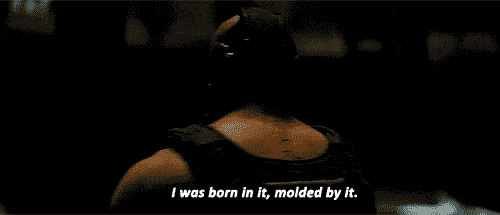

# 大学毕业找工作？选择区块链而不是隔间

> 原文：<https://medium.com/hackernoon/5-ways-to-win-in-cryptocurrency-e952074a14f>

## 当我第一次掉进区块链兔子洞时，我没想到我会掉进这么深。

加密货币和其他区块链项目以**极低的准入门槛**提供了大量机会。

如果你想参与其中，我的意思是，除了你只是想投入一些钱，然后神奇地看到它增长 1000 倍之外，你所要做的就是把自己放在那里。

我在上一篇帖子里提到过，**[**我为什么投资加密货币**](/@RezaJafery/why-i-invest-in-cryptocurrency-76612807458e)**，但是比特币是从 2009 年才出现的。****

****即使是这一领域的专家也不会对新人有太大的优势——8 年左右算什么？****

****那不是*甚至*一个**十年**。****

****除了低准入门槛，我们还处于加密货币发展的一个阶段，这个领域需要新型人才。****

## ****首席工程师不应该主持新闻发布会。****

****本周我将写另一篇关于“*ICO 的*的问题”的文章——所以我暂时不会深究这个话题。****

****随着市场需要新的人才，现在是你走出去抓住任何你能看到的机会的最佳时机。你的选择是无限的。无论你在哪个领域，它都可以应用到这个领域的项目中，谁知道呢——你可能最终会改变世界。****

****你不需要有大量的资金投入就可以参与进来。****

# ****如果你想在这个行业工作****

## ****创造价值****

****我无法向你解释，仅仅是通过网络、写作和帮助他人，让我的名字在这个空间里出现，就让我受益匪浅。****

****过去的几个月给我带来了一些很好的机会，我成为了一个区块链加速器的合伙人，开始着手一个令人兴奋的新项目。****

****我决定要为区块链社区贡献价值的那一刻。****

****我在商界遇到的许多人告诉我，永远不要免费做任何事情，他们告诉我，这会让人们贬低我的工作。我不同意。我愿意免费帮助别人，这给我带来的好处比什么都多。如果有什么区别的话，那就是我有点自私。关键是，联系一些你感兴趣的公司，主动提供帮助。这个行业这么年轻，里面的公司大部分都处于创业模式。他们可能需要一些帮助，如果你提供帮助，他们可能会邀请你加入这个团队。****

## ****致力于你的目标，制定可行的步骤****

****不久前，我在一个笔记本上写下了所有与加密相关的目标；它现在就坐在我旁边。****

****每天，我都会看着这张纸，写下在接下来的 24 小时里我能做些什么来让自己朝着这些目标前进。****

****逆向设计你的目标，一天一天地解决它们，不要超越自己。****

****通过这样做，我在极短的时间内朝着实现我想要的目标迈出了坚实的一步。我希望这不会显得傲慢——如果有的话，我仍然不相信我的进步速度。****

******太疯狂了。******

> ****创业如骑狮。每个人都认为，“哇，看看他，他是如此勇敢和冷静，我希望我能做到这一点”，而企业家认为，“这很酷，但我是什么时候来到这里的，我到底如何才能让它不把我生吞活剥”。****

****不断朝着你的目标前进，无论是增加你的投资组合价值还是开始你自己的加密货币——一步一步来。****

****你可能会惊讶地发现自己抓着狮子的鬃毛的速度有多快，并想知道同样的问题——思考自己已经走了多远。****

## ******在线创建个人品牌******

****这在任何行业都至关重要。你的品牌是人们把你和什么联系在一起。这是你的个性，你的工作，你的幽默感:这是你为自己创造的认知。****

****我不打算深究这个问题，因为老实说，没有人能比尼古拉斯·科尔更好地解释这个问题。他是我的好朋友，也是第一个教会我创建个人品牌重要性的人。如果你没有读过他的作品，我强烈建议你去看看。****

****另外，请帮我一个忙，在他的一篇文章上留言说，“我听说雷扎·贾法里在一次打字测试中打败了你”。****

****这会让我非常开心。****

## ******拼命工作******

****我从没说过这很容易。****

> ****要拥有大多数人没有的东西，你必须做大多数人不会做的事情。****

****你必须投入时间。研究是关键，但比研究更重要的是坚持你的计划。牢记你的目标，无论是与加密货币合作，投资，甚至是成立一个致力于研究区块链如何积极影响第三世界的非营利组织。****

****你只需要去做。这非常简单。如果你愿意聪明地工作——把你的时间花在活动或学习上，要么 A)丰富你与你的目标相关的知识，要么 B)朝着你的目标前进——你可以实现它。****

****只要记住闭着的嘴不会得到食物。****

****你不会相信我从简单的 Twitter DM 或冰冷的电子邮件中获得了多少机会。****

> ****把你自己放在那里，弄清楚你想专攻什么或成为什么的一部分，然后不顾一切地追逐它。****

# ****如果你想成为交易者/投资者****

## ****从你的错误中学习****

****【2017 年过半，我开始了我的加密货币之旅。****

****我不经常谈论我是从什么时候开始的，因为我们处在一个根据人们看图表的天数来衡量他们价值的时代。****

****这有点可笑。****

****不要误解我的意思，我向很多 *O.G'* 致敬——如果不是这个社区的思想领袖，我不会这么快学到这么多。****

****每当一个显然是新来的人问一些只有显然是新来的人才会问的问题时，也会有很多消极。****

****我们应该为好奇者和新投资者照亮道路，而不是羞辱他们。****

****这就是为什么我把最初的调情提到了加密货币。****

******我为自己参与 crypto 的短暂时间感到自豪。在不到一年的时间里，我设法看到了比任何传统投资者梦想的更高的回报。******

****我已经了解了**新技术**，自学了**技术分析**(在导师的帮助下)，甚至通过与我之前提到的公司合作，设法更深层次地参与其中。****

****最棒的是，我觉得我甚至还没有触及表面。一个月前，我决定我想与区块链项目工作，并获得报酬的加密。今天，这是一个现实。****

****因为我不在乎有人这样做了多久。****

****这个行业足够年轻，几年的经验不会让任何人有太多的领先优势。****

****几年的优势可能会被更努力、更聪明的工作以及为社区带来比其他人更大的价值所抵消。****

****我开始投资还不到一年，我会比你做得更好。****

> ****你认为你用来交易密码的时间是你的盟友？****
> 
> ****你只是采用了密码。****
> 
> ****我出生在熊市，被熊市塑造。****
> 
> *****我长大后才看到绿色蜡烛。”*****

********

*****I’ve been waiting for an opportunity to pull this quote out.*****

****我在 2017 年的大熊市中受过洗礼(我想没有人这么称呼过，但我要跟着它滚)。****

****我第一次买硬币，是在 6 月 6 日或 7 日以太币(ETH)创下历史新高时买的，Ether 是以太币网的燃料。当时价格刚好超过 300 美元。几周以来，我一直在研究以太坊，阅读关于它、比特币和其他区块链项目的所有内容。****

****我相信以太坊将会改变世界——但是我也从一个短暂的日内交易中知道，一个人不应该在上涨趋势的末端买入。****

****“不要追逐绿蜡烛”，我想。****

> ****也就是投资者所说的“不要买已经开始的上涨趋势，因为你永远不知道它什么时候会停止”。这是著名投资名言“当街上有血的时候买入”所传达的咒语的一部分。****

****我耐心等待以太坊价格下降。几个星期过去了，价格继续上涨。很快，它就超过了我最初考虑投资的两倍。****

****我慌了。****

****我买了上衣。****

****第二天它就损失了超过 50%的价值。****

****我是 **rekt** 。****

****我太顽固了，没有意识到亏损和套现，我决定在接下来的几个月里研究我能找到的关于**区块链**、**技术分析(TA)** 和**投资策略**的一切。****

## ****研究****

****我开始倒卖以太坊。利用我从学习 TA 中学到的知识，在高点卖出，在低点买入。****

****我沉迷于图表模式，滞后指标，领先指标，斐波那契曲线，艾略特波浪——我深深地陷入矩阵中，我甚至忘记了我已经接通了电源。****

****很快，尽管以太坊仍然是我买入价值的 50%,我回到了我的盈亏平衡投资。我拥有的以太坊的数量已经翻了一倍。****

****我开始投资 ICO。EOS、BAT、Bancor、te zos——我做的研究少得可怜，但这是 ICO 热潮的高潮，我最终做得相当好。在我投入以太币的 ICO 上获得了可观的百分比收益后，我开始买入替代币——这是我的投资组合真正开始爆炸的时候。****

****虽然我可能只有不到一年的时间——我喜欢认为我是被迫进入加速计划的——在那里我要么学得很快，要么失去一切。这不是我最初的策略，但环境迫使我这样做，现在我很高兴。****

****我所学到的大部分知识，那些让我能够弥补损失的知识，都是最初发生的损失的结果。****

******“逆境如狂风**。它从我们所有人身上撕裂，除了那些无法撕裂的东西，所以我们看到了自己真正的样子。”—阿瑟·高顿****

****进入加密货币还不算太晚；这个市场才刚刚起步。****

****此外，你有更好的机会在这个市场上超越你的同行，因为它是全天候的。****

****如果你愿意投入时间，比其他人更努力地工作，你会取得成功。****

****— — — — — — — — — — — — —****

****如果你想了解更多关于交易的知识，你可以在下面找到更多我的加密货币文章****

**** [## 投资加密货币的完全初学者指南

### 如何开始投资加密货币的逐步指南。

hackernoon.com](https://hackernoon.com/beginners-guide-to-investing-in-cryptocurrency-5ec5139c609b)  [## 加密货币市场下跌时要做的两件事

### 除了哭，尖叫，和其他自毁行为。

hackernoon.com](https://hackernoon.com/2-things-to-do-while-the-cryptocurrency-market-falls-2c6cdfbd6809)  [## 十大密码戒律

### 过去一年我学到的昂贵的教训。

hackernoon.com](https://hackernoon.com/the-cryptocurrency-commandments-part-1-investment-best-practices-4ba185258511)****