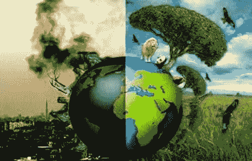
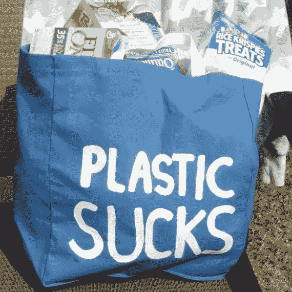
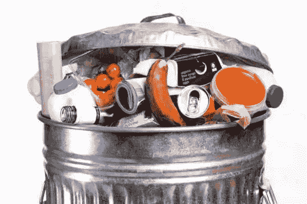

# 2018 年你可以帮助拯救地球的 5 种方式

> 原文：<https://medium.com/hackernoon/5-ways-you-can-help-save-the-planet-in-2018-4f3ed797c8fe>

Credit: Reason.com

谈到世界政治和环境，2017 年有起有落。但是不要再责怪别人，要采取行动。

以下是你在 2018 年可以做的 5 件事，这些事将有助于地球，甚至无需太多努力就能帮你省钱。

**1。运输**

重新考虑上班、上学、交友、购物等出行方式。尽可能步行或骑自行车，乘坐火车或公共汽车而不是汽车或摩托车，尽可能改用电动或混合动力汽车。减少二氧化碳排放量，或许还可以做些自由运动。下一个假期探索你的周围环境，减少坐飞机旅行。

**2。电力**

将家里的灯泡换成 led，连接到智能集线器，根据谁在家、一天中的时间和需求自动调节灯光。安装更智能的气候控制系统(例如 Nest ),以减少不必要的加热和冷却。从长远来看，以稍高的价格购买节能电器会节省很多钱。隔离窗户并密封所有其他漏气处。

**3。塑料**

不要只是回收。根据[塑料污染联盟](http://plasticpollutioncoalition.org)原则，采取行动拒绝、减少和再利用。对吸管、塑料袋、塑料瓶(见第四条)、包装和其他塑料说不。试试 [30 天一次性塑料质](https://tappwater.co/us/pledge-less-plastic-and-share-less-plastic-in-the-oceans/)。

**4。水**

如果你还没有放弃瓶装水，那就放弃吧。喝自来水或使用可生物降解的滤水器，如 [TAPP 2](http://tappwater.co/crowdfunding) 来获得新鲜洁净的水。安装节水淋浴设备。缩短淋浴时间，刷牙时不要让水一直流着，不要把厕所当成废纸篓。清晨或深夜给花园和植物浇水。来自伊甸园的更多好建议。

**5。食物**

在美国，大约 50%的食物被扔掉。只买会被消费的食物。尽可能购买当地生产的季节性产品和包装简单的产品。将肉类消费减少到每周一次(或更少)。使用美国农业部 Foodkeeper 应用程序[避免过早扔掉食物。](https://www.foodsafety.gov/keep/foodkeeperapp/index.html)

还有四个额外的提示以防前五个太容易:

*   回收——清单上遗漏的回收？是的，回收纸张、塑料、电池、电子产品和可堆肥废物(取决于当地的嗜好)，但首先要拒绝和减少。
*   支持一个非营利组织——选择一个你最喜欢的组织来支持拯救地球的努力，无论是绿色和平组织、T2 塑料污染联盟、T4 冲浪协会、海洋协会还是其他组织。
*   分享和影响朋友——改变和改善世界是困难的。与家人和朋友开始多一点当地生活。说服他们从这几点开始。如果需要的话，慢慢来。
*   提醒自己——为自己列出一个清单，列出你想要改变的事情，让生活变得更加可持续，把它放在家里一个显眼的地方作为提醒。

就是这样。

**享受 2018，祝好运！**

*请给这篇文章鼓掌，在下面分享和评论。这是你能为地球母亲做的最起码的事情。*