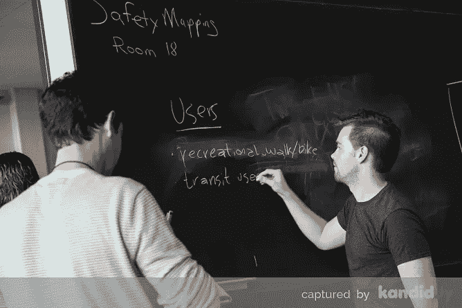
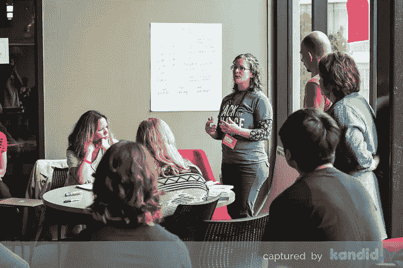
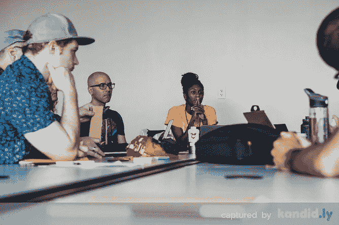
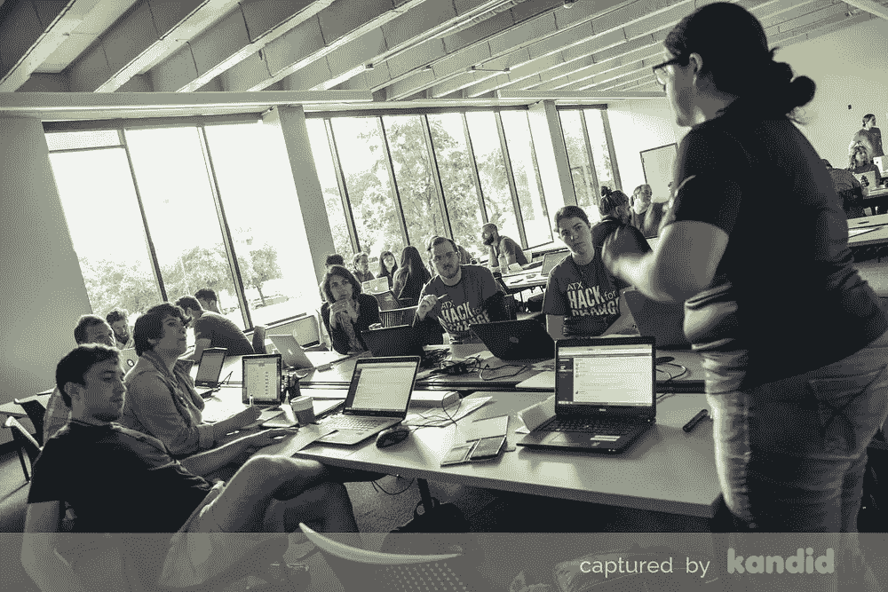
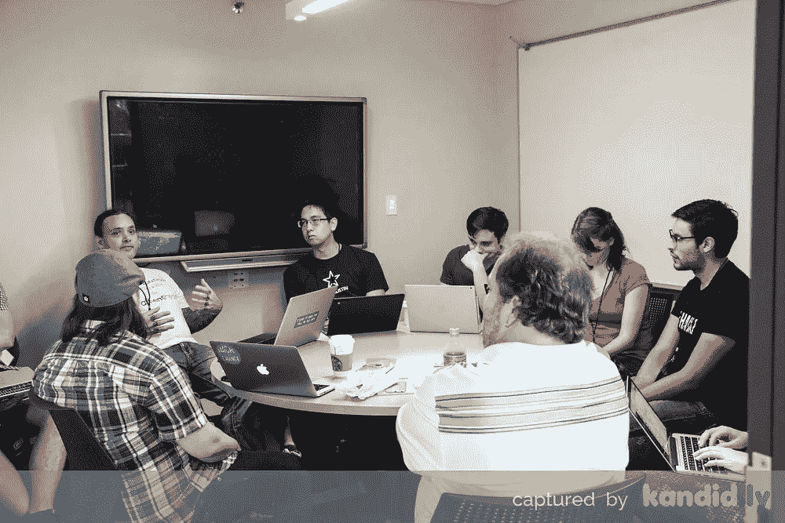
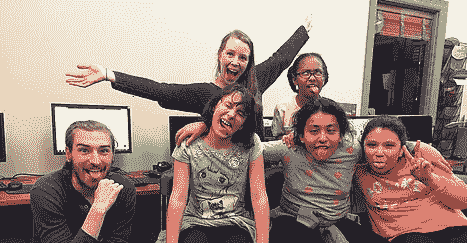

# 利用本地黑客冲刺改变世界的 5 种方式

> 原文：<https://medium.com/hackernoon/5-ways-you-can-use-local-hacking-sprints-to-change-the-world-1ec45283df5c>

## 社会变革是如何发生的？|社会创新博客系列

位于得克萨斯州奥斯汀的[实验公民学](https://www.experimentalcivics.io/)的创始人兼首席执行官 Sarah Sharif(右)和位于荷兰鹿特丹地区的 [Offcourse.io](https://about.offcourse.io/) 的内容战略、设计和管理自由顾问和研究员兼社区开发者 Charlotte van Oostrum(左)在 SXSW 2017 上相遇，并开始讨论这个问题。

Charlotte van Oostrum and Sarah Sharif

# 社会变革是如何发生的？

在我们的 Skype 对话中，我们经常发现自己回到这个问题。这些对话大部分都回到了本地创新的潜力上。毕竟，人们知道他们、他们的家庭和他们的社区需要什么。我们所需要的是一种发现知识并转化它的方法。

根据 Sarah 作为一名公民黑客的经验，像黑客马拉松这样的当地社区活动可以做到这一点…我们相信正是在这些创造力的口袋里，蕴藏着推动进步取得积极成果的力量。

所以这里有 5 种方法可以让你利用本地黑客冲刺来改变世界。

**包括所有人**

社区活动通常免费向公众开放。公民黑客马拉松是社区决定他们想谈论什么的地方。他们想采取什么行动。该活动敦促人们与所有年龄和背景的人交往。

前提是，你们会一起想出解决现实生活中问题的方法和解决方案。包含所有人会导致一群尽可能多样化的人。

当谈到要解决什么问题以及潜在的解决方案是什么时，多样性是必不可少的。让每个人都参与进来是你找到一个活生生的问题并为它创造一个活生生的解决方案的最佳选择。

ATX Hack for Change 2016 — Captured by Kandid.ly (Media Sponsor)

**制定明确的议程**

每个社区都有自己的问题。每个社区都有自己的历史、文化和人口构成。没有一个解决所有这些问题的办法，为了成功地克服这些障碍，我们必须明确我们的议程。无论社区是在世界各地还是相距不到 5 英里，我们都必须分享共同的目标，并有效地合作以实现该目标。

无论是较小的、可行的社区项目还是较大的挑战，每一项努力都应该在解决方案的创建中发挥战略性作用。有一个清晰的议程意味着你的目标是透明的。它可以让你将一群有共同目标的人联合起来。这是你成功的准备。

**只为冲击而做**

我们可以详细地谈论或书写变化。但是改变不能只是一次谈话。世界在发生变化。因此，它必须与某种有形的东西联系起来——无论是产品还是其他成果(试点项目、培训系列、参赛作品)。

黑客马拉松，或另一种互动和沉浸式的社区体验，对于启动一个影响循环至关重要。一个接一个的冲刺是一个重复自己或他人想法的机会。一旦解决方案真正回答了社区的需求，影响就会随之而来。

Courtesy of Kiwi Compute

2017 年的一个很好的例子是:[猕猴桃计算](https://www.kiwicompute.com/)。他们于 2016 年 1 月推出，2017 年参加了 [ATX Hack for Change](http://atxhackforchange.org/) ，申请并赢得了由[美国 Ignite](https://www.us-ignite.org/) 、[国家科学基金会](https://www.nsf.gov/)和[奥斯汀市](http://www.austintexas.gov/)资助的 [GigaTECH 应用程序竞赛](https://herox.com/GigaTECHSATX/community)。

他们举办了一次黑客马拉松来启动他们的扩展工作，现在正在充分利用摆在他们面前的可能性，教更多的孩子编码。就像 Kiwi 所展示的那样，继续前进，用你的想法做些事情。

不要等到想法很完美。相反，经历试错阶段，获得关于你正在解决的问题的真实经验和洞察力。这样，你的下一个想法会比上一个更好。你想不出来。你必须四处走走，做点什么。

**可咬问题**

我们很容易被污染我们当前环境的所有问题淹没，并决定下一步应该尝试解决哪个问题。在最近的一次讨论中，我们意识到很难与那些没有准备好改变的人或那些愿意对主题内容持开放态度的人进行对话。

分解一下，我们可以把这些项目分成几部分来处理。我们不能在一夜之间改变世界，但我们可以采取一切措施确保我们朝着正确的方向前进。如何做到这一点？想想你想去哪里。然后想出你现在能采取的最小的步骤来实现它。迈出这一步。

莎拉:我知道这就是为什么我是联合国可持续发展目标的大力倡导者，也是为什么我推动人们在他们的社会工作中采纳这一重要信息。

它是一种帮助我们更快连接网络的通用语言。此外，更积极的一点是，世界上发生了如此多的好事，这为这些声音和工作提供了空间，让它们得到提升并共同努力。

**体验轻松**

我们已经分享了改变的益处的体验通常是人们理解你与他们分享的改变的唯一、万无一失的方式。尤其是在社会层面。我们知道，这与您在日常环境中与其他社区成员一起从内心感受和看到的影响有关。如果有的话，我们都必须经历改变的好处才能接受它们。

我们一直在讨论这些话题，并继续集思广益，以实现更好的社会创新方法。我们都相信，地方短跑只是走向积极的全球社会变革的更大拼图的另一块。

我们总是欢迎你的想法，随时联系我们，感谢你的阅读。