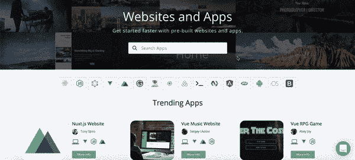
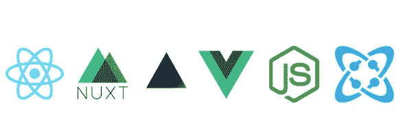
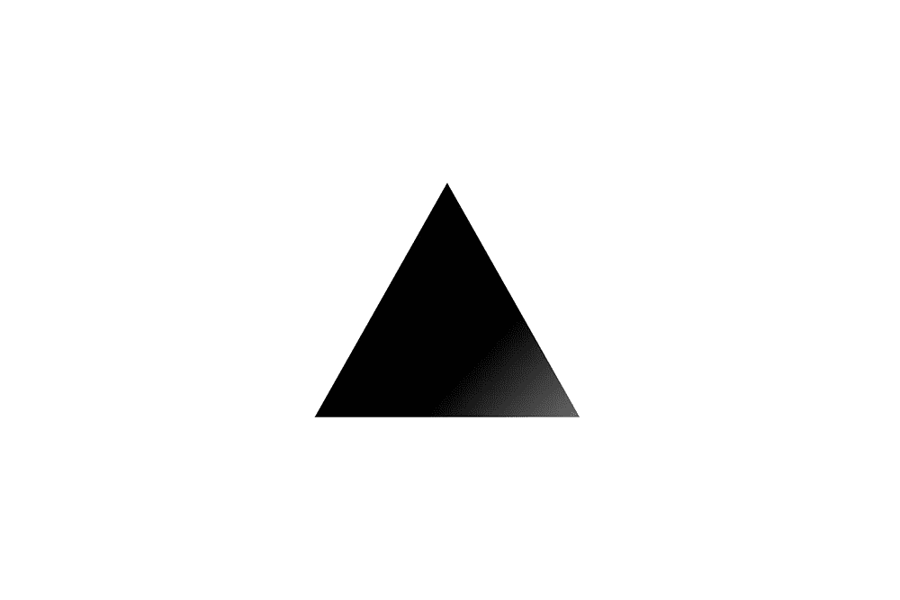
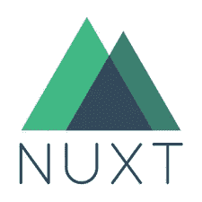
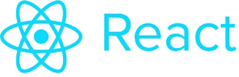
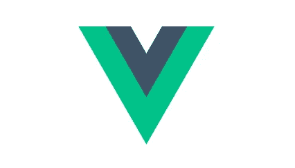
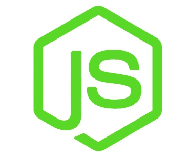

# 为 API 优先的内容管理而构建的 5 个网站样板

> 原文：<https://medium.com/hackernoon/5-website-boilerplates-built-for-api-first-content-management-in-draft-d4b8199cbc06>

Cosmic JS 为您的现代数字项目提供一流的无头 CMS。通过提供直观的管理仪表板、强大的 API 和灵活的用户角色，Cosmic JS 使内容创建者和开发者能够更好地合作。应用程序构建得更快，更轻量级，并且您的整个团队在这个过程中节省了时间。

感谢 Cosmic JS 社区及其所有开源贡献，您可以使用预建的网站和应用程序进行开箱即用，以便轻松安装。我将重点介绍 5 个专门为 zippy API 构建的流行网站样板——首先是使用 Cosmic JS headless CMS API 的动态内容管理。

# TL；博士:

[宇宙 JS 应用市场](https://cosmicjs.com/apps)
[宇宙 JS 开源](https://github.com/cosmicjs)
[宇宙 JS 文档](https://cosmicjs.com/docs)

# 为 API 优先的内容管理而构建的 5 个网站样板

本博客中介绍的所有网站模板都满足一些常见的网站要求，包括:

-动态页面
-博客文章
-作者管理
- SEO 能力
-联系方式
-全球网站搜索

# [Next.js 网站样板](https://github.com/cosmicjs/nextjs-website-boilerplate)

[点击这里查看演示](https://cosmicjs.com/apps/nextjs-website-boilerplate)
[阅读这个应用程序是如何建立的](https://cosmicjs.com/articles/nextjs-website-boilerplate-jeoea8au)

js 是一个用于服务器渲染的 React 应用程序的极简框架。查看更多 [Next.js 应用](https://cosmicjs.com/apps?q=next.js)可轻松安装。

# [Nuxt.js 网站样板](https://github.com/cosmicjs/nuxtjs-website-boilerplate)

[点击这里查看演示](https://cosmicjs.com/apps/nuxtjs-website-boilerplate)
[阅读这款应用是如何打造的](https://cosmicjs.com/articles/nuxtjs-website-boilerplate-jezdxaxb)

js 是创建 Vue.js 应用程序的最小框架，包括服务器端渲染、代码分割、热重载、静态生成等等。查看更多可轻松安装的 [Nuxt.js 应用](https://cosmicjs.com/apps?languages=Nuxt.js)。

# [React 网站样板文件](https://github.com/cosmicjs/react-website-boilerplate)

[点击这里查看演示](https://cosmicjs.com/apps/nextjs-website-boilerplate)
[阅读这个应用程序是如何建立的](https://cosmicjs.com/articles/nextjs-website-boilerplate-jeoea8au)

React 使得创建交互式 ui 变得不那么痛苦。为应用程序中的每个状态设计简单的视图，当数据发生变化时，React 将有效地更新和呈现正确的组件。查看更多可轻松安装的 [React 应用](https://cosmicjs.com/apps?languages=React)。

# [Vue 网站样板](https://github.com/cosmicjs/vue-website-boilerplate)

[点击此处查看演示](https://cosmicjs.com/apps/nuxtjs-website-boilerplate)
[阅读此应用程序是如何构建的](https://cosmicjs.com/articles/nuxtjs-website-boilerplate-jezdxaxb)

Vue 是一个用于构建用户界面的渐进式框架。与其他整体框架不同，Vue 从一开始就被设计成可增量采用的。核心库只关注视图层，很容易获取并与其他库或现有项目集成。查看更多 [Vue.js 应用](https://cosmicjs.com/apps?languages=Vue.js)以方便安装

# [Node.js 网站样板](https://github.com/cosmicjs/nodejs-website-boilerplate)

[点击此处查看演示网站](https://cosmicjs.com/apps/medical-professional)

Node.js 是一个开源的、跨平台的 JavaScript 运行时环境，它在浏览器之外执行 JavaScript 代码。查看更多 [Node.js 应用](https://cosmicjs.com/apps?languages=Node.js)可轻松安装。

抓住一个样板，添加您的内容和用户，并开始管理云中的内容，可通过 API endpoint 在您的任何互联网连接的应用程序中使用。借助可扩展的内容模型，一次编写，随处交付，让您的团队能够更快地构建应用。🚀

# 结论

当抛弃已安装的内容管理系统并采用 API 优先还不够快时，查看来自 Cosmic JS 的 [Starter Apps](https://cosmicjs.com/getting-started) ，让项目在几秒钟内启动并运行。🔥

如果你对用 Cosmic JS 构建应用有任何意见或问题，[在 Twitter 上联系我们](https://twitter.com/cosmic_js)和[在 Slack 上加入对话](https://cosmicjs.com/community)。