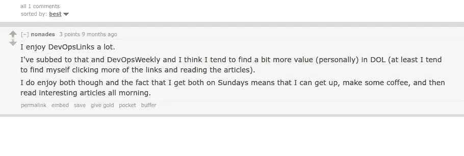

# 2017 年 50 篇最佳 DevOps & SRE 博客文章和教程

> 原文：<https://medium.com/hackernoon/50-best-devops-sre-blog-posts-tutorials-of-2017-451a7d69c4ef>

感谢您对我上一篇博文的积极反馈:[对 Docker 生态系统的总体看法——Containers、莫比、Swarm、Linuxkit、containerd、Kubernetes..](/@eon01/an-overall-view-on-docker-ecosystem-containers-moby-swarm-linuxkit-containerd-kubernetes-5e4972a6a1e8)

在这个故事中，我们将发现 DevOps 和 from 2017 年的必读文章。

每周，我都会整理我在网上找到的关于以下主题的最佳链接:开发运维、SRE、云、安全、质量保证、测试、物联网..并在我的简讯 [DevOpsLinks](http://devopslinks.com) 中分享它们。

我喜欢阅读来自我的订户的电子邮件，我很高兴这份时事通讯对许多人都有帮助！

感谢您在 Reddit 上的反馈:

推特:

还有你所有的邮件！

这个列表列举了我在 2017 年分享的最好的链接。我平均每期分享 50 个链接。

结果不是基于任何个人选择，而是基于成千上万次点击的点击率..

> 订阅 [DevOpsLinks](http://devopslinks.com) ，获取每周必读的文章、新闻和教程

这个列表没有特定的顺序。

Docker、containers、orchestration、DevOps 最佳实践和 AWS 是访问量最大的文章。

 [## 云原生第 1 部分:定义

### 本文最初由 Joe Beda 发表在 Heptio 的博客上。经过他们的许可，我们在这里分享它…

blog.codeship.com](https://blog.codeship.com/cloud-native-part-1-definition/)  [## 应用 DevOps - SD 时间的三步方法

### 每个人似乎都在谈论 DevOps，但是，如果你是新手，这可能会有点让人不知所措。对于一个…

sdtimes.com](https://sdtimes.com/application-pipeline/three-step-approach-applying-devops/)  [## 生产中运行容器所需的 8 个组件

### 注意:下载我们的电子书，里面有这篇文章的完整版本，包括我们自己的战争故事。Docker，Compose，Kubernetes…

blog.cloud66.com](http://blog.cloud66.com/8-components-you-need-to-run-containers-in-production/)  [## 常见 DevOps 错误”管理杂志

### 从行业隐喻，到敏捷过程，再到 DevOps，软件开发正在演变成一个成熟的企业。我们…

www.admin-magazine.com](http://www.admin-magazine.com/Archive/2017/42/Common-DevOps-Mistakes)  [## 非常成功的现场可靠性工程师的 7 个习惯

### 在最近的一篇文章中，我们研究了现代软件组织中站点可靠性工程师的崛起。但它是一个…

blog.newrelic.com](https://blog.newrelic.com/2017/11/13/site-reliability-engineer-sre-habits/)  [## 50 多种有用的 Docker 工具| Caylent

### 容器生态系统正在以前所未有的速度增长和扩展，有了如此多的 Docker 工具和服务，它可以…

caylent.com](http://caylent.com/50-useful-docker-tools/)  [## 一个伟大的 Vim 小抄 Vim 小抄

### 一个伟大的 Vim 小抄注意:如果你是体面的 Vim，并希望你的头脑爆炸，检查出先进的 Vim。我整理了一份…

vimsheet.com](http://vimsheet.com/index.html)  [## 去作弊

### package main import " fmt " func main(){ message:= greet me(" world ")fmt。Println(message) } func greetMe(名称字符串…

devhints.io](https://devhints.io/go)  [## Linux 容器安全性的 10 层

### 容器提供了一种简单的方法来打包应用程序，并从开发到测试到交付它们…

opensource.com](https://opensource.com/article/17/10/10-layers-container-security)  [## 使用本地工具 CrateDB 分析 Docker 容器性能

### 容器化正在改变组织部署和使用软件的方式。您现在可以可靠地部署几乎任何软件…

crate.io](https://crate.io/a/analyzing-docker-container-performance-native-tools/)  [## Python 初学者的 10 个常见错误。Py。CheckiO - python 编码游戏

### Python 是一门容易学习的语言。而且有许多自学成才的程序员并不真的选择最好的…

py.checkio.org](https://py.checkio.org/blog/10-common-beginner-mistakes-in-python/)  [## 你被困在来自地狱的新 DevOps 矩阵里了吗？-标清时代

### 如果你用谷歌搜索“来自地狱的矩阵”，你会看到许多关于 Docker 如何解决来自地狱的矩阵的文章。那么，什么是…

sdtimes.com](https://sdtimes.com/containers/stuck-new-devops-matrix-hell/)  [## HAProxy vs nginx:为什么永远不应该使用 nginx 进行负载均衡！

### 负载平衡器是数据中心的入口。他们正处于访问任何东西的关键路径上，并且…

thehftguy.com](https://thehftguy.com/2016/10/03/haproxy-vs-nginx-why-you-should-never-use-nginx-for-load-balancing/)  [## 2 个超棒的开源应用程序，通过网络共享你的终端

### 想要在网络上共享您的终端用于演示、学习或协作目的吗？尝试这两个应用程序…

www.cyberciti.biz](https://www.cyberciti.biz/open-source/2-apps-to-share-your-terminal-over-the-web/)  [## Linux shell 的 30 个有趣的命令

### 这是我多年来收集的 30 个有趣的 Linux shell 命令和技巧。

www.lopezferrando.com](https://www.lopezferrando.com/30-interesting-shell-commands/)  [## 权威的 Docker 备忘单

### PainlessDocker.com 课程的 Docker 备忘单-加入乐趣

dockercheatsheet.painlessdocker.com](http://dockercheatsheet.painlessdocker.com/)  [## DevOps 清单、Docker、SaltStack、aws、成为 DevOps 专业人员和 DevOps 书籍

### 我最近发表了 Docker，Rancher，EFS，Glusterfs，Minikube，SNS，SQS，微服务，Traefik & Containerd..我的…

medium.com](/devopslinks/the-devops-checkpoint-docker-slatstack-becoming-a-devops-professional-and-devops-books-be3f5ff88694)  [## Docker、Rancher、EFS、Glusterfs、Minikube、SNS、SQS、微服务、Traefik & Containerd..

### 自从我开始在无痛码头项目上工作，我就用博客帖子作为我与我的…

medium.com](/devopslinks/docker-rancher-efs-glusterfs-minikube-sns-sqs-microservices-and-containerd-b4c5c9c7cc0c)  [## 3 个开源项目使 Kubernetes 更容易

### 显然，Kubernetes 是一个重要问题的优雅解决方案。Kubernetes 允许我们运行集装箱化…

www.infoworld.com](https://www.infoworld.com/article/3214627/containers/3-open-source-projects-that-make-kubernetes-easier.html)  [## BinaryAlert:实时无服务器恶意软件检测

medium.com](/airbnb-engineering/binaryalert-real-time-serverless-malware-detection-ca44370c1b90)  [## 每个系统管理员都应该知道的 20 个 Linux 命令

### 在一个充满新工具和多样化开发环境的世界里，这对于任何开发人员来说几乎都是必要的…

opensource.com](https://opensource.com/article/17/7/20-sysadmin-commands)  [## 成为 DevOps 专业人员的路线图—从服务器到无服务器

### DevOps 生态系统自过去 5 年以来发展迅速，但我总是看到同样的问题，不知何故很难…

hackernoon.com](https://hackernoon.com/the-roadmap-to-become-a-devops-dude-from-server-to-serverless-dd97420f640e)  [## 2017 年运营薪酬调查

### 运营专业人员，我们希望听到您的意见！请在此参加明年的运营薪酬调查。操作…

www.oreilly.com](https://www.oreilly.com/ideas/2017-ops-salary-survey)  [## 在 AWS 平台上运行 LinuxKit 变得简单

### 自从 DockerCon 发布以来，大约有 2800 多名 GITHUB 明星，54 名贡献者，28 名外部人员，每周 50 多项提交，LinuxKit…

collabnix.com](http://collabnix.com/running-linuxkitos-on-amazon-web-service-platformaws/)  [## 用 Docker 创建类似 Heroku 的部署解决方案

### 了解如何构建自己的类似 Heroku 的部署解决方案，而无需使用任何特定的云提供商…

semaphoreci.com](https://semaphoreci.com/community/tutorials/creating-a-heroku-like-deployment-solution-with-docker)  [## 我是如何“黑掉”AWS Lambda 来运行 Docker 容器的

### Lambda 为什么不开箱出货 Docker？是因为安全考虑吗？为什么这么麻烦，让我们开始吧…

hackernoon.com](https://hackernoon.com/how-did-i-hack-aws-lambda-to-run-docker-containers-7184dc47c09b)  [## 每个有抱负的 DevOps 工程师都应该知道的 5 条定律

### 有些人会说，“一个好的工程师是一个懒惰的工程师”。在某种程度上，这是真的:懒惰是一个伟大的品质，如果…

opensource.com](https://opensource.com/open-organization/17/5/5-devops-laws)  [## 开发运维面临的 30 个常见挑战及解决方法| TechBeacon

### 开发运维面临的 30 个常见挑战以及如何解决它们随着开发运维成为主流，许多团队都在问自己，…

techbeacon.com](https://techbeacon.com/30-common-challenges-devops-how-resolve-them)  [## 你应该知道的 5 个 Docker 工具

### 你可以在网上找到很多很酷的 Docker 工具。其中大部分都是开源的，可以在 Github 上获得。越过…

blog.xebialabs.com](https://blog.xebialabs.com/2017/05/18/5-docker-utilities-you-should-know/)  [## 我们第一次 Kubernetes 停电

### 这是我们内部 Kubernetes 集群完全关闭的公开事后分析。它与你们所有人分享，所以…

engineering.saltside.se](https://engineering.saltside.se/our-first-kubernetes-outage-c6b9249cfd3a)  [## Kubernetes 网络黑客指南-新堆栈

### 我们在 Iguazio 构建的平台是云原生的，使用基于 Docker 的微服务、etcd 和自主开发的集群…

thenewstack.io](https://thenewstack.io/hackers-guide-kubernetes-networking/)  [## 探索技术领域最有效的产品工作流程

### 我最近在推特上写道:我一遍又一遍地看到这种情况。确定有效的产品工作流程是最大的…

producthabits.com](https://producthabits.com/exploring-the-most-effective-product-workflows-in-tech/)  [## 日志分析的机器学习方法——DZone 大数据

### 在任何给定的时间打开 Kibana 仪表板都会揭示一个简单但可能被夸大的事实——实在是太多了…

dzone.com](https://dzone.com/articles/a-machine-learning-approach-to-log-analytics)  [## 所以你想成为 SRE？

### SRE 的描述，兼容性测试和资源，让你开始。

hackernoon.com](https://hackernoon.com/so-you-want-to-be-an-sre-34e832357a8c)  [## 我最喜欢的命令行工具

### 我是如何不再担心 GUI 并学会爱上终端的

hackernoon.com](https://hackernoon.com/macbook-my-command-line-utilities-f8a121c3b019)  [## 我们从使用 AWS 中学到的 5 个教训

### 多萝西，你已经不在堪萨斯了。

medium.com](/netflix-techblog/5-lessons-weve-learned-using-aws-1f2a28588e4c)  [## 7 个基本的基于云的负载测试工具

### 你知道你的网站可以同时承受多少负载吗？使用这些工具对您的…执行负载测试

geekflare.com](https://geekflare.com/essential-tools-to-perform-stress-test-online/)  [## Linux 容器强化

### 这是一个关注用于制作容器的 Linux 内核原语的项目。

containerhardening.org](https://containerhardening.org/)  [## 关于 Gitlab 数据事件 Xargs.io 的思考

### 2 月 1 日，Gitlab 遭受了 6 小时无法恢复的数据丢失。https://about.gitlab.com/2017/02/01…

blog.xargs.io](https://blog.xargs.io/post/2017-02-01-thoughts-on-gitlab-data-incident/)  [## 谷歌如何构建网络框架

### 众所周知，谷歌使用一个单一的存储库来共享所有 20 亿行代码，并且它使用…

medium.freecodecamp.org](https://medium.freecodecamp.org/how-google-builds-a-web-framework-5eeddd691dea)  [## Shell 脚本通过安全的 web API 运行

### 如果您可以在几秒钟内将一个 shell 脚本转换成一个 web API 会怎么样？

medium.com](/cmd-io/shell-scripts-run-via-secure-web-api-9a59642ee460)  [## 使用 Docker 和不可变容器进行更容易、更好、更快、更安全的部署

### Jerome Petazzoni 详细解释了不可变服务器的优点，然后介绍了如何用

www.infoq.com](https://www.infoq.com/presentations/immutable-servers-docker)  [## 9 面向 Linux 和类 Unix 系统的优秀开源 Web 性能软件——nix craft

### 网页性能只不过是网页下载和显示在用户浏览器上的速度…

www.cyberciti.biz](https://www.cyberciti.biz/open-source/http-web-performance-proxy-load-balancer-accelerator-software/)  [## 开发运营和现场可靠性工程师必备的清单

### 声明:这项工作是由萨希尔·夏尔马和我共同完成的，它是我们正在进行的名为 31 技能的项目的一部分…

hackernoon.com](https://hackernoon.com/the-must-know-checklist-for-devops-system-reliability-engineers-f74c1cbf259d)  [## 你做错事的 7 个迹象

### Devops 是一种变革精神，许多公司都将它作为自己的优势。如同任何依赖于…

www.infoworld.com](https://www.infoworld.com/article/3011631/devops/7-signs-youre-doing-devops-wrong.html) 

# 连接更深

如果您对这篇文章有共鸣，请订阅我们的时事通讯:

*   [DevOpsLinks](http://devopslinks.com) :一个由来自世界各地的数千名 IT 专家& DevOps 爱好者组成的在线社区。
*   [发货](http://joinshipped.com/):关注无服务器、集装箱、FaaS &和其他有趣事物的独立时事通讯
*   [Kaptain](http://kaptain.xyz/):Kubernetes 社区中心，手动策划时事通讯，团队聊天，培训&更多

你可以在 [Twitter](https://twitter.com/eon01) 上找到我，也可以查看我的书籍和课程: [SaltStack For DevOps](http://saltstackfordevops.com) 、 [The Jumpstart Up](http://thejumpstartup.com) 、[无痛码头](http://painlessdocker.com) & [实用 AWS](http://practicalaws.com) 。

别忘了加入 DevOps 的[工作，提交你的简历。](http://jobsfordevops.com)