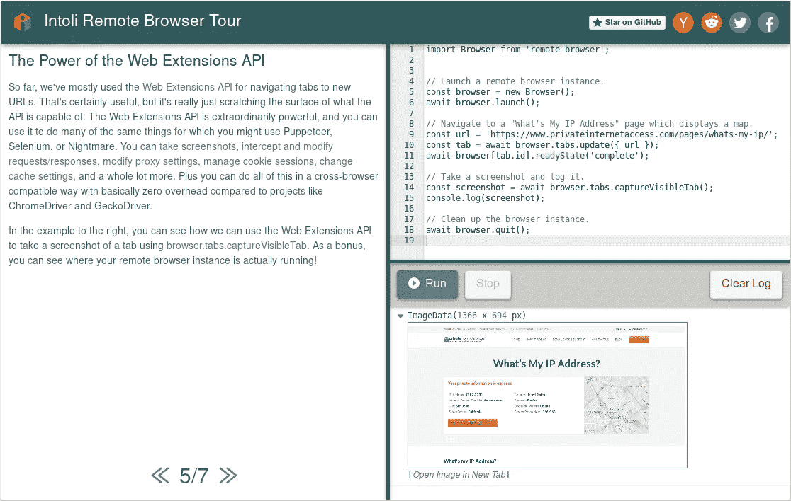

# 2018 年 GitHub 上 50 个热门 JavaScript 开源项目

> 原文：<https://medium.com/hackernoon/50-popular-javascript-open-source-projects-on-github-in-2018-469c11b48b8d>

本帖由[***issue hunt***](https://issuehunt.io/)*策划，是一个开源项目的众筹和采购平台。*

*任何人都可以资助 GitHub 上的任何问题，这些钱将分发给维护者和贡献者。*

* [## 提升你的问题，增加你的快乐

### 一个基于问题的开源项目众筹/采购平台。

issuehunt.io](https://issuehunt.io/)* 

# *1) VuePress*

**

*VuePress 是一个极简的静态站点生成器，带有一个 Vue 驱动的主题系统，以及一个为编写技术文档而优化的默认主题。VuePress 页面有自己的预渲染静态 HTML，这不仅提供了很好的加载性能，而且也是 SEO 友好的。*

*GitHub:[https://github.com/vuejs/vuepress](https://github.com/vuejs/vuepress)*

# *2)做出反应*

**

*React 是脸书用于构建用户界面的 JavaScript 库。
根据 React 的官方文档，以下是 React 的显著特征:*

*   *声明性:React 使得创建交互式 ui 变得轻松。为应用程序中的每个状态设计简单的视图，当数据发生变化时，React 将有效地更新和呈现正确的组件。声明性视图使您的代码更容易预测、更容易理解、更容易调试。*
*   *基于组件:构建管理自身状态的封装组件，然后将它们组合成复杂的 ui。由于组件逻辑是用 JavaScript 而不是模板编写的，所以您可以轻松地通过您的应用程序传递丰富的数据，并将状态保留在 DOM 之外。*
*   *一次学习，随处编写:我们不对您的技术堆栈的其余部分进行假设，因此您可以在 React 中开发新功能，而无需重写现有代码。React 还可以使用节点在服务器上进行渲染，并使用 React Native 为移动应用提供支持。*

*GitHub:[https://github.com/facebook/react](https://github.com/facebook/react)*

# *3) Vue*

**

*Vue 是一个用于构建用户界面的渐进式框架。
它被从头设计为可增量采用，并且可以根据不同的用例在库和框架之间轻松扩展。*

*它由一个只关注视图层的可接近的核心库和一个支持库的生态系统组成，支持库可以帮助您处理大型单页面应用程序中的复杂性。*

*GitHub:[https://github.com/vuejs/vue](https://github.com/vuejs/vue)*

# *4)更漂亮*

**

*Prettier 是一个固执己见的 JavaScript 代码格式化程序。
它通过解析你的代码并根据自己的规则(考虑到最大行长度)重新打印代码，在必要时换行，从而强制执行一致的风格。*

*GitHub:[https://github.com/prettier/prettier](https://github.com/prettier/prettier)*

# *5)包裹*

**

*Parcel 是一个 web 应用程序捆绑器，其与众不同之处在于其开发人员的经验。
它利用多核处理提供极快的性能，并且不需要任何配置。*

*GitHub:[https://github.com/parcel-bundler/parcel](https://github.com/parcel-bundler/parcel)*

# *6)反作用弹簧*

**

*React-spring 是一组简单的、基于 spring 物理学的原语(就像构建块一样),一旦普通的 CSS 不再能满足你的 UI 相关的动画需求，它就能满足你的大部分需求。当您流畅地将数据从一种状态移动到另一种状态时，忘记季节、持续时间、超时等等。
这并不意味着解决所有问题，而是给你足够灵活的工具，让你自信地将想法融入移动界面。*

*GitHub:[https://github.com/drcmda/react-spring](https://github.com/drcmda/react-spring)*

# *7)预包装*

**

*Prepack 是 JavaScript 的部分求值器。Prepack 重写了一个 JavaScript 包，使得 JavaScript 代码的执行效率更高。
对于初始化繁重的代码，Prepack 在 JavaScript 解析被有效缓存的环境中工作得最好。*

*GitHub:[https://github.com/facebook/prepack](https://github.com/facebook/prepack)*

# *8)节点*

*Node.js 是基于 Chrome 的 V8 JavaScript 引擎构建的 JavaScript 运行时。*

*GitHub:[https://github.com/nodejs/node](https://github.com/nodejs/node)*

# *9)光谱*

**

*Spectrum 旨在通过结合最好的 web 2.0 论坛和实时聊天应用程序，成为构建任何类型在线社区的最佳平台。*

*凭借同类最佳的审核工具、面向所有社区的单一平台、默认线程对话、社区健康监控(以及更多功能)，我们认为我们将能够帮助更多人创建和发展最佳在线社区。*

*GitHub:[https://github.com/withspectrum/spectrum](https://github.com/withspectrum/spectrum)*

# *10)流行运动*

**

*Popmotion 是一个功能强大、灵活的 JavaScript 动作库。
几乎所有你可以用 Popmotion 实现的动画。例如:补间、弹簧、衰减、关键帧、物理等。*

*GitHub:[https://github.com/Popmotion/popmotion](https://github.com/Popmotion/popmotion)*

# *11)ar . j*

**

*AR.js 是一个使用 ARToolKit 的高效 web 增强现实。
它在手机上也能像 charm 一样工作(每秒 60 帧)。*

*GitHub:[https://github.com/jeromeetienne/AR.js](https://github.com/jeromeetienne/AR.js)*

# *12) Tone.js*

**

*Tone.js 是一个 Web 音频框架，用于在浏览器中创建交互式音乐。Tone.js 的架构旨在为希望创建基于网络的音频应用的音乐家和音频程序员所熟悉。*

*在高层次上，Tone 提供了通用的 DAW(数字音频工作站)功能，如用于安排事件和预建合成器和效果的全球传输。对于信号处理程序员(来自 Max/MSP 等语言)，Tone 提供了丰富的高性能、低延迟构建模块和 DSP 模块来构建您自己的合成器、效果和复杂的控制信号。*

*GitHub:[https://github.com/Tonejs/Tone.js](https://github.com/Tonejs/Tone.js)*

# *13) TensorFlow.js*

**

*一个 WebGL 加速的、基于浏览器的 JavaScript 库，用于训练和部署 ML 模型。*

*GitHub:[https://github.com/tensorflow/tfjs-core](https://github.com/tensorflow/tfjs-core)*

# *14)标记文本*

**

*Mark Text 是一个用于 Mac、Windows 和 Linux 的 Markdown 编辑器。这是一个简洁的文本编辑器，致力于提高您的编辑效率。
标记文本支持 CommonMark 规范和 GitHub 风味降价规范。它是一个实时预览编辑器，你输入的就是你最终看到的。*

*GitHub:[https://github.com/marktext/marktext](https://github.com/marktext/marktext)*

# *15)纳米 ID*

*一个小巧、安全、URL 友好、唯一的 JavaScript 字符串 ID 生成器。*

*GitHub:[https://github.com/ai/nanoid](https://github.com/ai/nanoid)*

# *16)可拖动*

**

*使用 Draggable 完全控制拖放行为！Draggable 将本机浏览器事件抽象为一个全面的 API，以创建自定义的拖放体验。*

*GitHub:[https://github.com/Shopify/draggable](https://github.com/Shopify/draggable)*

# *17)反应商务*

*Reaction Commerce 是一个事件驱动的实时反应式商务平台，使用 JavaScript (ES6)构建。它与 npm、Docker 和 React 配合得很好。*

*GitHub:[https://github.com/reactioncommerce/reaction](https://github.com/reactioncommerce/reaction)*

# *18) WhatsApp 网站*

*WhatsApp Web 打算提供 WhatsApp Web API 的完整描述和重新实现，最终会产生一个自定义客户端。
WhatsApp Web 内部使用 WebSockets 工作；这个项目也是如此。*

*Whatapp Web 的架构如下所示:*

**

*GitHub:[https://github.com/sigalor/whatsapp-web-reveng](https://github.com/sigalor/whatsapp-web-reveng)*

# *19)G2:JavaScript 中的图形语法*

**

*G2 是一种可视化语法，一种数据驱动的可视化语言，具有高度的可用性和可扩展性。它提供了一套语法，将用户从一组有限的图表带到了一个几乎无限的图形世界。
使用 G2，用户只需一句话就可以描述可视化的视觉外观。*

*GitHub:【https://github.com/antvis/g2 *

# *20)绿岛*

**

*将异步函数移动到它自己的线程中。简化的单一功能版本的 workerize。*

*GitHub:【https://github.com/developit/greenlet *

# *刺激*

*Stimulus 是一个有着适度野心的 JavaScript 框架。它并不试图接管你的整个前端——事实上，它根本不关心 HTML 的渲染。相反，它被设计成用足够的行为来增强你的 HTML，让它闪闪发光。
Stimulus 与 Turbolinks 完美搭配，以最少的努力为快速、引人注目的应用提供完整的解决方案。*

*GitHub:[https://github.com/stimulusjs/stimulus](https://github.com/stimulusjs/stimulus)*

# *22)奥尼*

**

*Oni 是一种新型的编辑器，专注于最大化生产力——将*模态编辑*与你在现代编辑器中期望的特性相结合。Oni 由 [neovim](https://github.com/neovim/neovim) 打造，灵感来自 [VSCode](https://github.com/Microsoft/vscode) 、 [Atom](https://atom.io/) 、 [LightTable](http://lighttable.com/) 和 [Emacs](https://www.gnu.org/software/emacs/)*

*Oni 的愿景是构建一个编辑器，让您尽可能容易地从*思想进入*代码——将 Vim 的原始编辑能力、Atom/VSCode 的特性能力以及强大而直观的可扩展性模型整合到一个漂亮的包中。*

*GitHub:[https://github.com/onivim/oni](https://github.com/onivim/oni)*

# *23)工具箱*

**

*Workbox 是一个 JavaScript 库集合，用于离线缓存和离线分析。*

*GitHub:[https://github.com/GoogleChrome/workbox](https://github.com/GoogleChrome/workbox)*

# *24)鲁迅*

**

*想在 JavaScript 中处理日期和时间吗？Luxon 是一个在 Javascript 中处理日期和时间的库。*

*GitHub:[https://github.com/moment/luxon](https://github.com/moment/luxon)*

# *25)slate-MD-编辑器*

**

*一个 markdown 编辑器，允许你实时编辑。这个项目建立在[石板框架](http://slatejs.org/#/)之上。支持降价语法和热键。*

*GitHub:【https://github.com/Canner/slate-md-editor *

# *木偶师*

**

*Puppeteer 用于生成页面的屏幕截图和 pdf，抓取 SPA 并生成预渲染内容(即“SSR”)，自动化表单提交、UI 测试、键盘输入等。，并创建一个最新的自动化测试环境。*

*GitHub:[https://github.com/GoogleChrome/puppeteer](https://github.com/GoogleChrome/puppeteer)*

# *27)表 j*

**

*SheetJS 是各种电子表格格式的解析器和编写器。来自官方规范、相关文档和测试文件的 Pure-JS 洁净室实施。*

*强调解析和编写的健壮性、与统一 JS 表示的跨格式特性兼容性，以及 ES3/ES5 浏览器与 IE6 的兼容性。*

*GitHub:[https://github.com/SheetJS/js-xlsx](https://github.com/SheetJS/js-xlsx)*

# *28)远程浏览器*

**

*Remote Browser 是一个使用 JavaScript 以编程方式控制 Chrome 和 Firefox 等 web 浏览器的库。
你可能以前听说过类似的浏览器自动化框架，比如[木偶师](https://github.com/GoogleChrome/puppeteer)和[硒](https://github.com/SeleniumHQ/selenium)。*

*与这些其他项目非常相似，Remote Browser 可以用来完成与 UI 测试、服务器端呈现(SSR)和 web 抓取相关的各种任务。*

*Remote Browser 与其他库的不同之处在于，它是使用标准的跨浏览器兼容技术构建的，其主要目标是促进与现有 API 的交互，而不是创建自己的新 API。*

*GitHub:[https://github.com/intoli/remote-browser](https://github.com/intoli/remote-browser)*

# *JS 油漆*

**

*一个很好的基于网络的 MS Paint 翻拍和更多。*

*GitHub:[https://github.com/1j01/jspaint](https://github.com/1j01/jspaint)*

# *30) Lozad.js*

**

*高性能、轻量级和可配置的纯 JS 惰性加载器，不依赖图像、iframes 等，使用 IntersectionObserver API。*

*GitHub:[https://github.com/ApoorvSaxena/lozad.js](https://github.com/ApoorvSaxena/lozad.js)*

# *31) Rough.js*

**

*Rough.js 是一个轻量级(9kB)图形库，可以让您以粗略的、类似手绘的风格进行绘制。该库定义了绘制直线、曲线、圆弧、多边形、圆和椭圆的图元。它还支持绘制 [SVG 路径](https://developer.mozilla.org/en-US/docs/Web/SVG/Tutorial/Paths)。*

*GitHub:【https://github.com/pshihn/rough *

# *32) D3:数据驱动文档*

*D3(或 D3.js)是一个 JavaScript 库，用于使用 web 标准可视化数据。
D3 帮助您使用 SVG、Canvas 和 HTML 将数据变成现实。*

*D3 将强大的可视化和交互技术与数据驱动的 DOM 操作方法相结合，为您提供了现代浏览器的全部功能以及为您的数据设计正确的可视化界面的自由。*

*GitHub:[https://github.com/d3/d3](https://github.com/d3/d3)*

# *33) Quokka.js*

**

*js 是 JavaScript 和 TypeScript 的快速原型开发平台。当你输入时，它立即运行你的代码，并在你的代码编辑器中显示各种执行结果。*

*GitHub:[https://github.com/wallabyjs/quokka](https://github.com/wallabyjs/quokka)*

# *Rythm.js*

*一个让你的页面跳舞的 javascript 库。*

*GitHub:[https://github.com/Okazari/Rythm.js](https://github.com/Okazari/Rythm.js)*

# *35)网络包监视器*

**

*Webpack Monitor 是一个可配置的 Webpack 插件，它可以捕获生产版本的相关统计数据，并且是一个交互式分析工具，可以帮助开发人员更好地理解包的组成，并确定优化策略的优先级。*

*GitHub:[https://github.com/webpackmonitor/webpackmonitor](https://github.com/webpackmonitor/webpackmonitor)*

# *36)网络放大器*

**

*Winamp 2.9 在 HTML5 和 JavaScript 中的重新实现。*

*GitHub:[https://github.com/captbaritone/webamp](https://github.com/captbaritone/webamp)*

# *37) jsvu*

**jsvu* 是 JavaScript(引擎)版本更新器。*

*GitHub:[https://github.com/GoogleChromeLabs/jsvu](https://github.com/GoogleChromeLabs/jsvu)*

# *38)振幅. js*

*Amplitude.js 是一个轻量级 JavaScript 库，允许您控制网页中媒体控件的设计，而不是浏览器。
没有依赖关系(不需要 jQuery)。*

*GitHub:[https://github.com/521dimensions/amplitudejs](https://github.com/521dimensions/amplitudejs)*

# *39)康索拉*

**

*优雅的控制台记录器。它很容易使用。它为持续集成(CI)环境提供了具有回退功能的奇特输出。*

*GitHub:【https://github.com/nuxt/consola *

# *40)上部结构*

**

*一种简单且可组合的验证 JavaScript 数据的方法。*

*GitHub:【https://github.com/ianstormtaylor/superstruct *

# *41) JSNES*

**

*一个 JavaScript NES 模拟器。这是一个可以在浏览器和 Node.js 中运行的库。*

*GitHub:[https://github.com/bfirsh/jsnes](https://github.com/bfirsh/jsnes)*

# *工作化*

**

*将模块移入 Web Worker，自动将导出的函数反映为异步代理。*

*GitHub:[https://github.com/developit/workerize](https://github.com/developit/workerize)*

# *滑行*

**

*Glide.js 是一个独立的 JavaScript ES6 滑块和转盘。它轻巧、灵活、快速。设计用于滑动。*

*GitHub:[https://github.com/glidejs/glide](https://github.com/glidejs/glide)*

# *44) scrollama.js*

**

*Scrollama 是一个现代的轻量级 JavaScript 库，使用 IntersectionObserver 支持滚动事件。*

*GitHub:[https://github.com/russellgoldenberg/scrollama](https://github.com/russellgoldenberg/scrollama)*

# *毛茛*

*基于 NodeJS 的跨平台、免费、开源的密码管理器。*

*GitHub:[https://github.com/buttercup/buttercup-desktop](https://github.com/buttercup/buttercup-desktop)*

# *贾维斯*

**

*J.A.R.V.I.S .(只是一个非常智能的系统)会把你需要的所有相关信息从你的 webpack 构建放到你的浏览器中，无论是在开发中还是在生产中。*

*GitHub:[https://github.com/zouhir/jarvis](https://github.com/zouhir/jarvis)*

# *瓶子*

**

*以你的方式快速灵活地制造机器人。*

*GitHub:[https://github.com/Yoctol/bottender](https://github.com/Yoctol/bottender)*

# *48)亮度*

**

*luma 提供易于使用的基于 WebGL2 的构建模块，可在浏览器中实现高性能的基于 GPU 的数据可视化和计算。*

*GitHub:【https://github.com/uber/luma.gl *

# *49)时空*

**

*操作、比较和格式化全球日期和时间的简单方法。*

*GitHub:[https://github.com/spencermountain/spacetime](https://github.com/spencermountain/spacetime)*

# *50) MapTalks.js*

**

*一个轻量级 JavaScript 库，用于创建集成的 2D/3D 地图。*

*GitHub:【https://github.com/maptalks/maptalks.js *

*本帖由 [**IssueHunt**](https://issuehunt.io/) 策划，这是一个开源项目的众筹和采购平台。*

*任何人都可以资助 GitHub 上的任何问题，这些钱将分发给维护者和贡献者。*

* [## 提升你的问题，增加你的快乐

### 一个基于问题的开源项目众筹/采购平台。

issuehunt.io](https://issuehunt.io/)*