# 2018 年 GitHub 上 50 个热门 Python 开源项目

> 原文：<https://medium.com/hackernoon/50-popular-python-open-source-projects-on-github-in-2018-c750f9bf56a0>

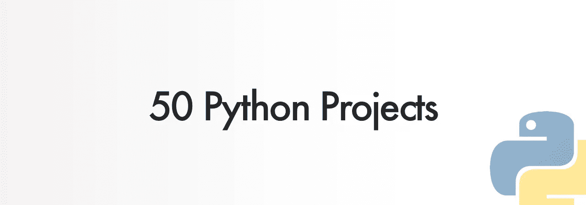

这篇文章是由一个基于问题的开源项目平台发布的。这是为 OSS 制作赏金程序最简单的方法。

任何人都可以资助 GitHub 上的任何问题，这些钱将分发给维护者和贡献者😃

IssueHunt 通过奖励项目所有者和开发者来帮助建立可持续的开源社区。

 [## 提升你的问题，增加你的快乐

### 发行 Hunt🦉⚒开放源码软件开发+奖金计划💰。IssueHunt 是一个基于问题的开源奖金平台…

issuehunt.io](https://issuehunt.io) 

# 1) [张量流模型](https://github.com/tensorflow/models)

如果你对机器学习和深度学习感兴趣，你一定听说过张量流。

TensorFlow Models 是一个开源存储库，可以找到许多与深度学习相关的库和模型。

GitHub:【https://github.com/tensorflow/models 

# 2) [Keras](https://github.com/keras-team/keras)

Keras 是一种高级神经网络 API，用 Python 编写，能够在 TensorFlow、CNTK 或 Theano 之上运行。

它的开发重点是支持快速实验。

GitHub:[https://github.com/keras-team/keras](https://github.com/keras-team/keras)

# 3) [烧瓶](https://github.com/pallets/flask)

Flask 是一个轻量级的 WSGI web 应用程序框架。

它旨在快速轻松地开始使用，并能够扩展到复杂的应用程序。

它最初是一个围绕 Werkzeug 和 Jinja 的简单包装器，现在已经成为最流行的 Python web 应用程序框架之一。

GitHub:[https://github.com/pallets/flask](https://github.com/pallets/flask)

# 4) [scikit-learn](https://github.com/scikit-learn)

scikit-learn 是一个用于机器学习的 Python 模块，构建在 SciPy 之上，根据 3 条款 BSD 许可证发布。

GitHub:[https://github.com/scikit-learn](https://github.com/scikit-learn)

# 5) [祖利普](https://github.com/zulip/zulip)

Zulip 是一个强大的开源群聊应用程序，结合了实时聊天的即时性和线程对话的生产力优势。Zulip 被开源项目、财富 500 强公司、大型标准机构和其他需要实时聊天系统的人使用，该系统允许用户每天轻松处理数百或数千条消息。Zulip 有 300 多个贡献者，每月合并 500 多个提交，它也是最大和发展最快的开源群组聊天项目。

GitHub:[https://github.com/zulip/zulip](https://github.com/zulip/zulip)

# 6) [姜戈](https://github.com/django/django)

Django 是一个高级 Python Web 框架，它鼓励快速开发和干净、实用的设计。

GitHub:【https://github.com/django/django 

# 7) [反弹](https://github.com/shobrook/rebound)

当你得到一个 bug，你想在栈溢出时搜索它，你想在编码过程中节省时间吗？Rebound 是一个命令行工具，当您遇到编译器错误时，它可以立即获取堆栈溢出结果。

对于程序员来说，这是一个非常方便的库。

GitHub:[https://github.com/shobrook/rebound](https://github.com/shobrook/rebound)

# 8) [谷歌图片下载](https://github.com/hardikvasa/google-images-download)

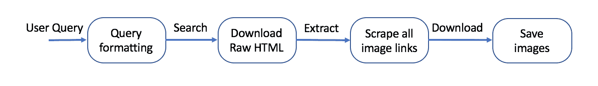

这是一个命令行 python 程序，可以在谷歌图片上搜索关键词/关键短语，还可以下载图片到你的电脑上。

您也可以从另一个 python 文件中调用该脚本。

GitHub:[https://github.com/hardikvasa/google-images-download](https://github.com/hardikvasa/google-images-download)

# 9) [YouTube-dl](https://github.com/rg3/youtube-dl)

YouTube-dl——从 youtube.com 或其他视频平台下载视频。

GitHub:[https://github.com/rg3/youtube-dl](https://github.com/rg3/youtube-dl)

# 10) [系统设计入门](https://github.com/donnemartin/system-design-primer)

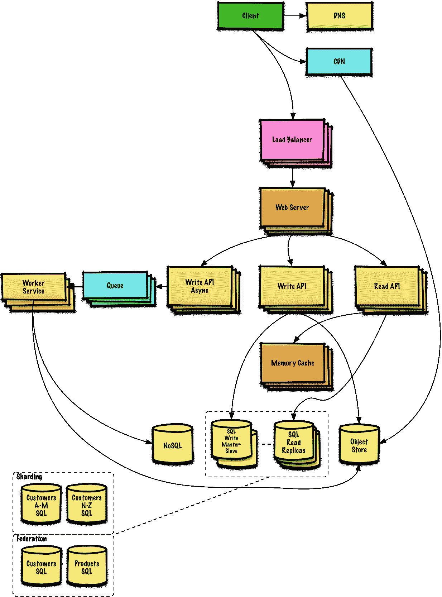

这个回购是一个有组织的资源收集，以帮助您学习如何建立系统的规模。

GitHub:[https://github.com/donnemartin/system-design-primer](https://github.com/donnemartin/system-design-primer)

# 11) [屏蔽 R-CNN](https://github.com/matterport/Mask_RCNN)

掩模 R-CNN 用于对象检测和分割。这是 Mask R-CNN 在 Python 3、Keras 和 TensorFlow 上的实现。该模型为图像中对象的每个实例生成边界框和分段掩码。它基于功能金字塔网络(FPN)和 ResNet101 主干网。

GitHub:[https://github.com/matterport/Mask_RCNN](https://github.com/matterport/Mask_RCNN)

# 12) [人脸识别](https://github.com/ageitgey/face_recognition)

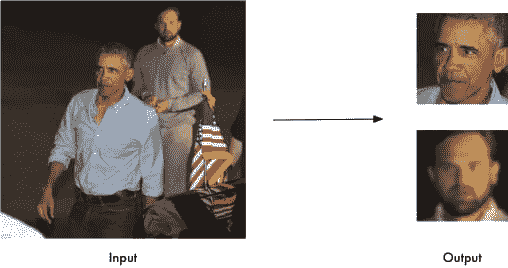

使用世界上最简单的人脸识别库，从 Python 或命令行识别和操作人脸。它还提供了一个简单的 face_recognition 命令行工具，让您可以从命令行对一个图像文件夹进行人脸识别！

GitHub:【https://github.com/ageitgey/face_recognition 

# 13) [snallygaster](https://github.com/hannob/snallygaster)

扫描 HTTP 服务器上秘密文件的工具。

GitHub:[https://github.com/hannob/snallygaster](https://github.com/hannob/snallygaster)

# 14) [Ansible](https://github.com/ansible/ansible)

Ansible 是一个非常简单的 IT 自动化系统。它处理配置管理、应用程序部署、云供应、临时任务执行和多节点编排，包括利用负载平衡器实现零停机滚动更新等琐事。

GitHub:[https://github.com/ansible/ansible](https://github.com/ansible/ansible)

# 15) [检测器](https://github.com/facebookresearch/Detectron)

Detectron 是脸书人工智能研究所的软件系统，实现了最先进的物体检测算法，包括 Mask R-CNN。它是用 Python 编写的，由 Caffe2 深度学习框架提供支持。

GitHub:[https://github.com/facebookresearch/Detectron](https://github.com/facebookresearch/Detectron)

# 16)[ascii 码](https://github.com/asciinema/asciinema)

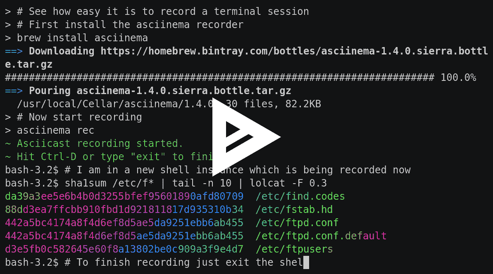

终端会话记录器，asciinema.org 的最佳伴侣。

GitHub:[https://github.com/asciinema/asciinema](https://github.com/asciinema/asciinema)

# 17) [HTTPie](https://github.com/jakubroztocil/httpie)

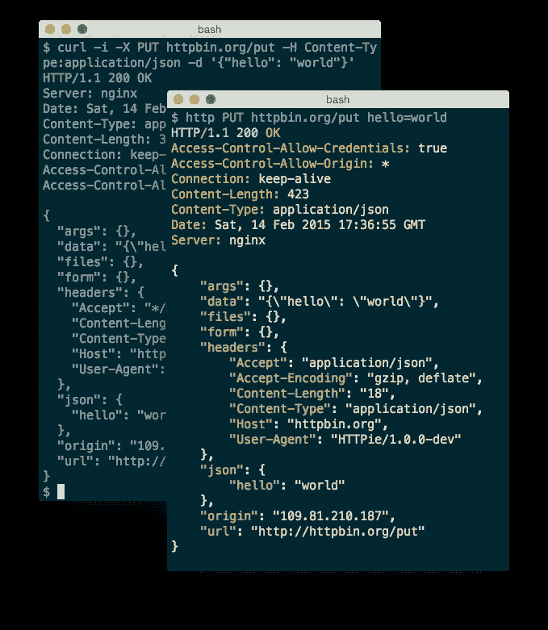

HTTPie 是一个命令行 HTTP 客户端。它的目标是使 CLI 与 web 服务的交互尽可能人性化。它提供了一个简单的 http 命令，允许使用简单自然的语法发送任意 HTTP 请求，并显示彩色输出。HTTPie 可用于测试、调试，以及通常与 HTTP 服务器的交互。

GitHub:[https://github.com/jakubroztocil/httpie](https://github.com/jakubroztocil/httpie)

# 18) [You-Get](https://github.com/soimort/you-get)

You-Get 是一个很小的命令行工具，用于从网络上下载媒体内容(视频、音频、图像),以防没有其他方便的方法。

GitHub:【https://github.com/soimort/you-get 

# 19) [哨兵](https://github.com/getsentry/sentry)

Sentry 从根本上说是一种帮助你实时监控和修复崩溃的服务。服务器是用 Python 编写的，但它包含一个完整的 API，可以在任何应用程序中用任何语言发送事件。

GitHub:[https://github.com/getsentry/sentry](https://github.com/getsentry/sentry)

# 20) [龙卷风](https://github.com/tornadoweb/tornado)

Tornado 是一个 Python web 框架和异步网络库，最初由 FriendFeed 开发。通过使用非阻塞网络 I/O，Tornado 可以扩展到数万个开放连接，非常适合长轮询、WebSockets 和其他需要每个用户长期连接的应用程序。

GitHub:[https://github.com/tornadoweb/tornado](https://github.com/tornadoweb/tornado)

# 21) [洋红色](https://github.com/tensorflow/magenta)

Magenta 是一个探索机器学习在艺术和音乐创作过程中的作用的研究项目。这主要涉及开发新的深度学习和强化学习算法，用于生成歌曲、图像、绘图和其他材料。但这也是在构建智能工具和界面方面的一次探索，允许艺术家和音乐家使用这些模型来扩展他们的过程。

GitHub:[https://github.com/tensorflow/magenta](https://github.com/tensorflow/magenta)

# 22) [零网](https://github.com/HelloZeroNet/ZeroNet)

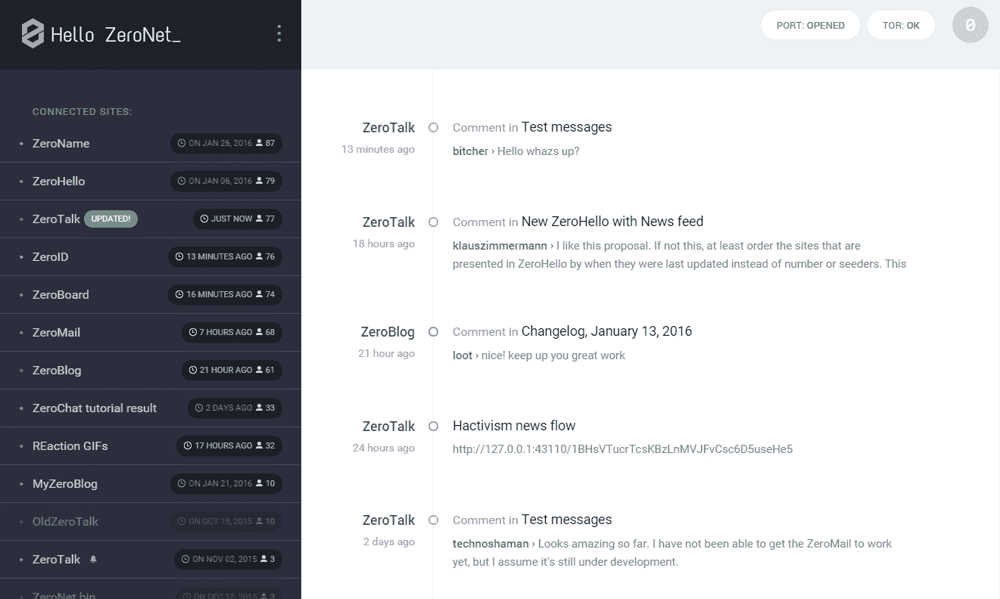

使用比特币加密和 BitTorrent 网络创建分散式网站。

GitHub:[https://github.com/HelloZeroNet/ZeroNet](https://github.com/HelloZeroNet/ZeroNet)

# 23) [健身房](https://github.com/openai/gym)

OpenAI Gym 是一个开发和比较强化学习算法的工具包。这是 gym 开源库，它让你可以访问一组标准化的环境。

GitHub:【https://github.com/openai/gym 

# 24) [熊猫](https://github.com/pandas-dev/pandas)

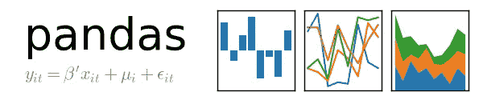

Pandas 是一个 Python 包，它提供了快速、灵活、富于表现力的数据结构，旨在使处理“关系”或“标签”数据变得既简单又直观。它旨在成为用 Python 进行实际的、真实世界的数据分析的基础高级构建块。此外，它还有一个更广泛的目标，那就是成为任何语言中最强大、最灵活的开源数据分析/操作工具。它已经在朝着这个目标前进。

GitHub:[https://github.com/pandas-dev/pandas](https://github.com/pandas-dev/pandas)

# 25) [路易吉](https://github.com/spotify/luigi)

Luigi 是一个 Python 包，可以帮助您构建批处理作业的复杂管道。它处理依赖关系解析、工作流管理、可视化、处理故障、命令行集成等等。

GitHub:[https://github.com/spotify/luigi](https://github.com/spotify/luigi)

# 26) [空间](https://github.com/explosion/spaCy)

spaCy 是 Python 和 Cython 中的高级自然语言处理库。它建立在最新研究的基础上，从第一天起就被设计用于真正的产品。spaCy 带有预先训练的统计模型和词向量，目前支持 20 多种语言的标记化。它具有世界上最快的语法分析器，用于标记，解析和命名实体识别的卷积神经网络模型，以及简单的深度学习集成。

GitHub:[https://github.com/explosion/spaCy](https://github.com/explosion/spaCy)

# 27)[theno](https://github.com/Theano/Theano)

Theano 是一个 Python 库，它允许您高效地定义、优化和评估涉及多维数组的数学表达式。它可以使用 GPU 并执行高效的符号微分。

GitHub:[https://github.com/Theano/Theano](https://github.com/Theano/Theano)

# 28) [TFlearn](https://github.com/tflearn/tflearn)

TFlearn 是一个模块化、透明的深度学习库，构建在 Tensorflow 之上。它旨在为 TensorFlow 提供一个更高级别的 API，以促进和加速实验，同时保持完全透明并与之兼容。

GitHub:【https://github.com/tflearn/tflearn 

# 29) [基维](https://github.com/kivy/kivy)

Kivy 是一个开源的跨平台 Python 框架，用于开发利用创新的多点触控用户界面的应用程序。目的是允许快速简单的交互设计和快速原型，同时使你的代码可重用和可部署。

GitHub:[https://github.com/kivy/kivy](https://github.com/kivy/kivy)

# 30) [邮件堆](https://github.com/mailpile/Mailpile)

Mailpile 是一个现代化的快速网络邮件客户端，具有用户友好的加密和隐私功能。Mailpile 的开发是由一个大型的支持者社区资助的，所有与项目相关的代码都将在 OSI 批准的自由软件许可下发布。

GitHub:[https://github.com/mailpile/Mailpile](https://github.com/mailpile/Mailpile)

# 31) [Matplotlib](https://github.com/matplotlib/matplotlib)

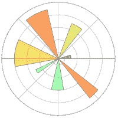

Matplotlib 是一个 Python 2D 绘图库，它以各种硬拷贝格式和跨平台的交互环境生成出版物质量的图形。Matplotlib 可用于 Python 脚本、Python 和 IPython shell、web 应用服务器和各种图形用户界面工具包。

GitHub:[https://github.com/matplotlib/matplotlib](https://github.com/matplotlib/matplotlib)

# 32) [YAPF](https://github.com/google/yapf)

YAPF 获取代码并将其重新格式化为符合样式指南的最佳格式，即使原始代码没有违反样式指南。

GitHub:[https://github.com/google/yapf](https://github.com/google/yapf)

# 33) [厨师](https://github.com/audreyr/cookiecutter)

从 cookiecutters(项目模板)创建项目的命令行实用程序，例如，从 Python 包项目模板创建 Python 包项目。

GitHub:[https://github.com/audreyr/cookiecutter](https://github.com/audreyr/cookiecutter)

# 34) [HTTP 提示](https://github.com/eliangcs/http-prompt)

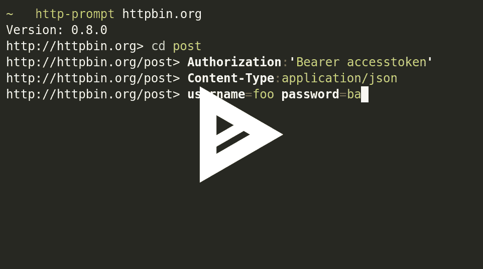

HTTP Prompt 是一个交互式命令行 HTTP 客户端，具有自动完成和语法突出显示功能，构建于 HTTPie 和 prompt_toolkit 之上。

GitHub:【https://github.com/eliangcs/http-prompt 

# 35) [速度测试-cli](https://github.com/sivel/speedtest-cli)

使用 speedtest.net 测试互联网带宽的命令行界面。

GitHub:[https://github.com/sivel/speedtest-cli](https://github.com/sivel/speedtest-cli)

# 📣发行 Hunt

这篇文章由开源项目的众筹和采购平台 IssueHunt 策划。

任何人都可以资助 GitHub 上的任何问题，这些钱将分发给维护者和贡献者。

[https://issuehunt.io/](https://issuehunt.io/)

# 36) [模式](https://github.com/clips/pattern)

Pattern 是 Python 的 web 挖掘模块。它拥有用于数据挖掘、自然语言处理、机器学习和网络分析的工具。

GitHub:[https://github.com/clips/pattern](https://github.com/clips/pattern)

# 37) [胶粘(Beta)](https://github.com/chriskiehl/Gooey)

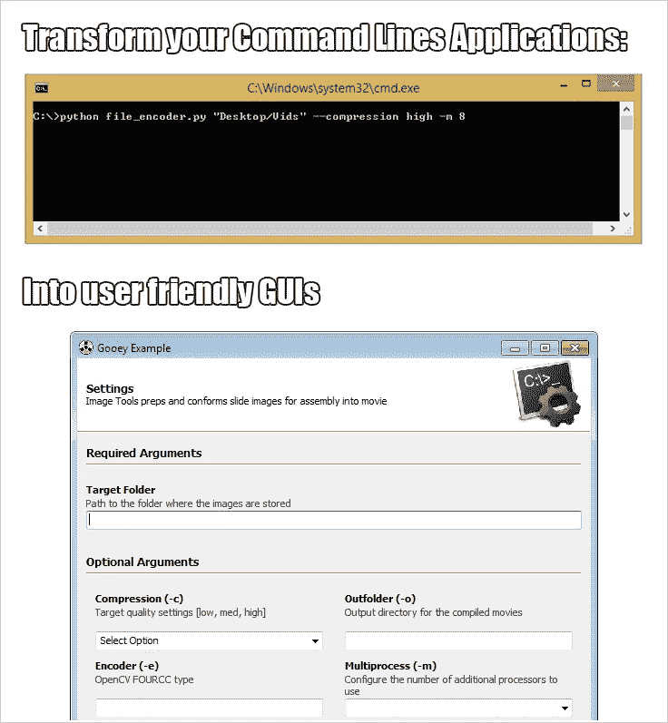

用一行代码就可以将(几乎)任何 Python 2 或 3 控制台程序变成 GUI 应用程序。

GitHub:[https://github.com/chriskiehl/Gooey](https://github.com/chriskiehl/Gooey)

# 38) [玳瑁细胞质雄性不育](https://github.com/wagtail/wagtail)

Wagtail 是一个基于 Django 的内容管理系统。它专注于用户体验，为设计者和开发者提供精确的控制。

GitHub:[https://github.com/wagtail/wagtail](https://github.com/wagtail/wagtail)

# 39) [瓶子](https://github.com/bottlepy/bottle)

Bottle 是一个快速、简单和轻量级的用于 Python 的 WSGI 微型 web 框架。它作为单个文件模块分发，除了 Python 标准库之外没有其他依赖关系。

GitHub:[https://github.com/bottlepy/bottle](https://github.com/bottlepy/bottle)

# 40) [先知(脸书)](https://github.com/facebook/prophet)

Prophet 是预测时间序列数据的过程。它基于一个加法模型，非线性趋势与每年和每周的季节性以及假期相适应。它最适用于具有至少一年历史数据的每日周期数据。Prophet 对缺失数据、趋势变化和大的异常值具有稳健性。

GitHub:【https://github.com/facebook/prophet 

# 41) [猎鹰](https://github.com/falconry/falcon)

Falcon 是一个可靠的高性能 Python web 框架，用于构建大规模的 app 后端和微服务。它鼓励 REST 架构风格，并试图在保持高效的同时做尽可能少的事情。

GitHub:[https://github.com/falconry/falcon](https://github.com/falconry/falcon)

# 42) [倍性](https://github.com/mopidy/mopidy)

Mopidy 是一个用 Python 编写的可扩展音乐服务器。Mopidy 播放来自本地磁盘、Spotify、SoundCloud、Google Play Music 等的音乐。您可以使用各种 MPD 和网络客户端从任何手机、平板电脑或电脑编辑播放列表。

GitHub:[https://github.com/mopidy/mopidy](https://github.com/mopidy/mopidy)

# 43) [拥抱](https://github.com/timothycrosley/hug)

Hug 的目标是尽可能简单地开发 Python 驱动的 API，但不会更简单。因此，它极大地简化了 Python API 开发。

GitHub:[https://github.com/timothycrosley/hug](https://github.com/timothycrosley/hug)

# 44) [症状](https://github.com/sympy/sympy)

符号数学的 Python 库。

GitHub:[https://github.com/sympy/sympy](https://github.com/sympy/sympy)

# 45) [破折号](https://github.com/plotly/dash)

Dash 是用于构建分析性 web 应用程序的 Python 框架。不需要 JavaScript。

[https://github.com/plotly/dash](https://github.com/plotly/dash)

# 46) [Visdom](https://github.com/facebookresearch/visdom)

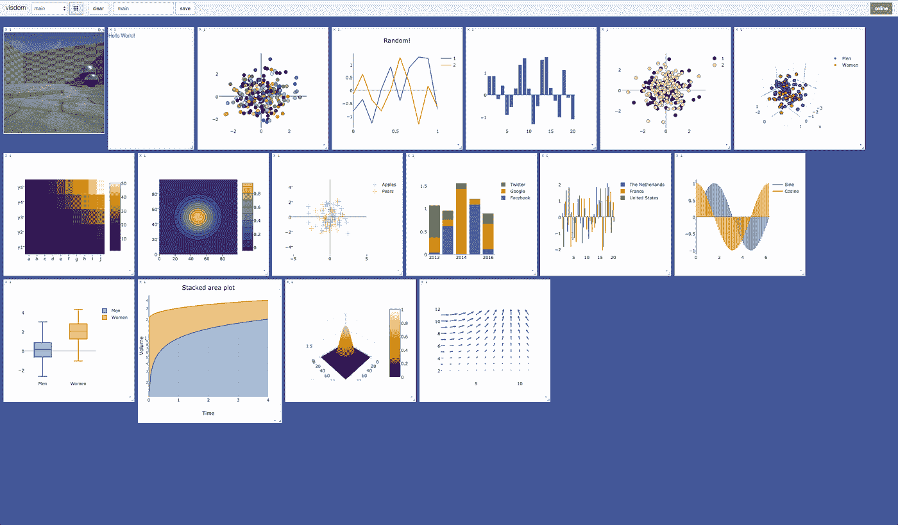

一个灵活的工具，用于创建、组织和共享实时、丰富数据的可视化。支持 Torch 和 Numpy。

GitHub:【https://github.com/facebookresearch/visdom 

# 47) [夜光](https://github.com/tryolabs/luminoth)

Luminoth 是一个用于**计算机视觉**的开源工具包。目前，我们支持对象检测，但我们的目标是更多。它是用 Python 构建的，使用 TensorFlow 和 Sonnet。

GitHub:[https://github.com/tryolabs/luminoth](https://github.com/tryolabs/luminoth)

# 48) [Pygame](https://github.com/pygame/pygame)

Pygame 是一个跨平台库，旨在使用 Python 编写多媒体软件(如游戏)变得容易。

GitHub:[https://github.com/pygame/pygame](https://github.com/pygame/pygame)

# 49) [请求](https://github.com/requests/requests)

Requests 是一个 Python 库，允许您发送 HTTP/1.1 请求、添加头、表单数据、多部分文件和带有简单 Python 字典的参数。它还允许您以同样的方式访问响应数据。

GitHub:[https://github.com/requests/requests](https://github.com/requests/requests)

# 50) [统计模型](https://github.com/statsmodels/statsmodels)

Statsmodels 是一个 Python 包，它为统计计算提供了对 scipy 的补充，包括统计模型的描述性统计、估计和推断。

GitHub:[https://github.com/statsmodels/statsmodels](https://github.com/statsmodels/statsmodels)

这篇文章由开源项目的众筹和采购平台 IssueHunt 策划。

任何人都可以资助 GitHub 上的任何问题，这些钱将分发给维护者和贡献者。

[https://issuehunt.io/](https://issuehunt.io/)

