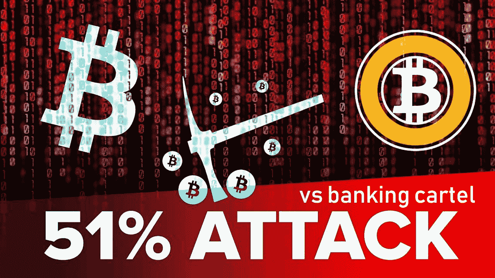

# 51%攻击 vs 银行业卡特尔

> 原文：<https://medium.com/hackernoon/51-attack-vs-banking-cartel-a135c958dc9e>

很明显，区块链是未来的技术。现在不仅仅是加密货币了。每个人都可以在区块链上创建任何分散的[应用程序](https://www.forbes.com/sites/forbestechcouncil/2018/05/07/blockchain-as-an-application-platform/#2b59f7d35576),它不隶属于任何组织，无论是商业组织还是国家组织。只有嵌入区块链的计算机算法才能控制这项技术。

发明区块链框架是为了加快和简化开发基于区块链的应用程序的过程。框架是提供通用功能的软件。开发者可以对其进行选择性的修改，以获得想要的应用。因此，事实证明，框架是一种“假人”，有助于“切割”任何最终产品。

现在还记得 2015 年，42 家最大的银行联合起来创建了一个名为 [R3 Corda](https://en.wikipedia.org/wiki/R3_(company)) 的区块链框架。后来，又有几家银行加入，加入该联盟的公司总数超过了 200 家。该项目的目的是建立一个专门针对银行、金融和保险领域的区块链框架。

据设想，这一框架将创造新的不存在的早期区块链的商业目的。正如你所看到的，任何公司都可以根据自己的需要用任何属性来制作自己的区块链。乍一看，这听起来不错，但事实上，这个银行卡特尔忽略了区块链的关键属性——分权。

由于其分散性，区块链非常容易受到“ [51%攻击](https://www.investopedia.com/terms/1/51-attack.asp)”的攻击，这意味着一些控制了网络 50%以上处理能力的攻击者将能够改变存储在区块链中的任何信息。

目前，比特币网络的速度为 3580 万塔希提/秒，来自比特大陆的高端比特币矿工的计算速度为 14 塔希提/秒，价格为 700 美元，这使得黑客入侵比特币网络的成本约为 18 亿美元。但是实际上你在任何地方都买不到这么多的矿工。生产工厂的最大数量是以千计或以万计，但你需要 250 万台设备。

此外，随着比特币越来越受欢迎，这一数额可能会增加 10 倍。所有这些都表明，比特币受到了非常强的保护，可以抵御 51%的攻击。现在有一个问题——如何保护 R3 基于 Corda 框架构建的区块链？

答案是——绝不可能。我怀疑 X 公司会投资 20 亿美元来保护自己的区块链。但是进步不会停滞不前，现在 Hyperledger、Corda 和其他网站被 Hashbon 所取代。这是新一代的区块链框架。它不是创建一个新的区块链 Hashbon，而是使用几个已经存在的可靠的区块链——比特币、莱特币、dash、monero、z cash——作为一个虚拟的区块链。

除了防止 51%的攻击之外，这种方法还提供了许多优点。尤其是 Hashbon 选择了目前佣金最少的活链。它有助于避免“隐猫效应”。还记得这样的[crypto kitties](https://qz.com/1145833/cryptokitties-is-causing-ethereum-network-congestion/)疫情是如何长时间阻碍以太坊的工作，使得新的智能合约无法上传到网络。

我想祝一家来自东欧的小而强的创业公司“ [Hashbon](https://hashbon.com/) ”在与银行业卡特尔的斗争中好运。