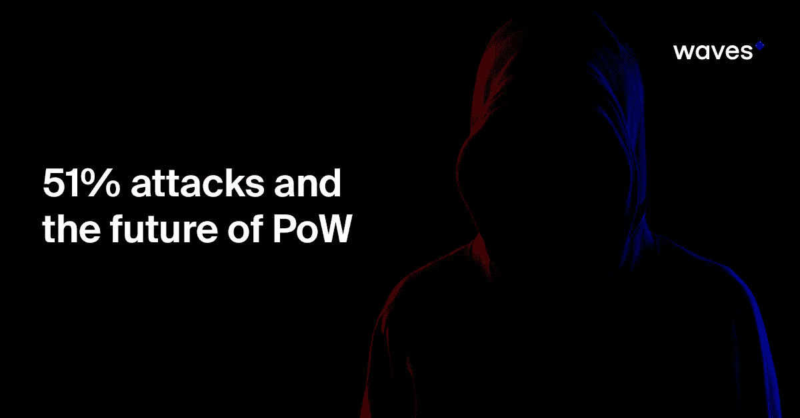
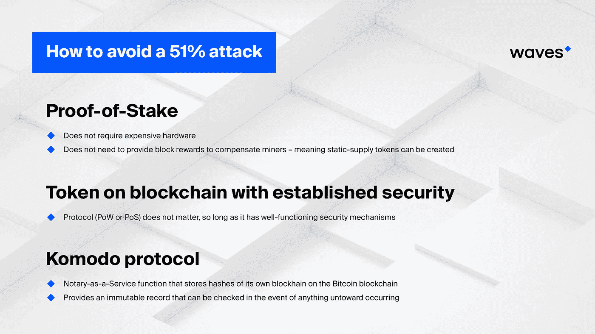

# 51%的攻击和战俘的未来

> 原文：<https://medium.com/hackernoon/51-attacks-and-the-future-of-pow-402266905bfa>

*工作验证共识的前提是攻击网络的成本太高，与其他节点合作实现相同目标更有利可图。但最近一系列 51%的攻击表明，我们可能需要重新思考 PoW 在加密生态系统中的位置。*

最近几周，对工作证明区块链进行了几次 51%的攻击，包括 Verge 和 GameCredits，但最值得注意的是在比特币黄金网络上成功执行[双重消费后，黑客带走了高达 1800 万美元的攻击。](https://www.ccn.com/bitcoin-gold-responds-to-recent-double-spend-attack/)

工作证明加密货币由执行简单但重复且计算量大的任务(“工作”)的计算机网络维护。问题是，如果一个节点拥有的计算能力超过网络其余部分的总和，它就可以改写区块链记录——让攻击者在这个过程中获利:“攻击者在加密货币交易所存款，用这些硬币交换 BTC 或另一种硬币，然后提取资金。“接下来，攻击者利用他们占主导地位的计算能力，迫使网络的其他部分接受伪造的数据块，撤销他们最初的存款，导致这些资金从交易所控制的钱包中消失。”

中本聪共识——使比特币能够作为点对点价值转移网络的工作证明系统——在[首次提出](https://bitcoin.org/bitcoin.pdf)并于 2008 年和 2009 年实施时，绝对是开创性的。比特币从未被攻破:hashrate，即网络中所有计算机的总计算能力，如此之高，以至于尝试 51%的攻击将会付出天文数字般的代价。在比特币协议发布后的几年里，许多其他证明有效的硬币也已经推出。没有一家公司有保护比特币的哈希表，但许多公司都有庞大的计算机网络来共同保护比特币。

具有讽刺意味的是，这就是问题所在。因为这些网络的优势代表了其他较小网络的弱点。

## **矿工的沉没成本意味着黑客的机会**

比特币的速度非常快，超过 3000 万次/秒(30，000，000，000，000，000 小时/秒)，并且随着更广泛的采用和更好的硬件，它还在不断上升。然而，有许多许多硬币的网络支持的数量级较低。使用不同共识算法的其他区块链也是如此。例如，比特币黄金使用 Equihash，其他几种大型硬币也是如此。这使得 BTG 成了大池子里的一条弱小的鱼。

当成本大于收益时，工作证明在保护网络方面是成功的。但拥有一个庞大的网络意味着有许多具有沉没成本的矿工:那些已经购买硬件以便从大宗奖励中获利的人，但如果看起来更有利可图，他们也可以很容易地部署到其他地方。比特币黄金就是这样。攻击者只需要将他们的 hashrate 从一个诚实采矿的区块链切换到一个虚弱到可以攻击获利的区块链。

因此，我们最近看到的一系列 51%攻击和重复花费可能会继续并加速。很简单，他们没有理由不这样做。hashrate 就在那里，如果不诚实的开采比诚实的开采更有利可图，这正是矿工们会做的。在某些情况下——就像已经发生在低散列链上的情况一样——矿工攻击网络只是为了好玩。

## **解决方案**

这个问题有许多解决方案，否则会威胁到每个使用与现有大型网络相同的 PoW 算法的新区块链。

第一个是 Proof-of-stage(PoS ),它已经在能效和吞吐量方面具有优势——正如 [Waves-NG](https://waves-ng.wavesplatform.com/) 所展示的，它支持每秒数百笔交易。股权证明已经越来越受欢迎，因为它不需要昂贵的硬件，因此不需要提供集体奖励来补偿矿工——这意味着可以创造静态供应令牌(这是大多数 ICO 投资者想要的)。

第二种选择是在已建立安全性的区块链上推出令牌，无论是 PoS 还是 PoW。以太坊(目前是 PoW)因为这个原因，以及它的大型开发者和投资者社区而被证明是受欢迎的。类似地，Waves 是一个流行的启动令牌的选项，不需要维护网络的开销。

网络遭到攻击后，GameCredits 采取的第三个选择是在更强的区块链上定期“取消”区块链——在这种情况下。这已经通过科莫多协议执行[。Komodo 运营一个公证即服务功能，在比特币区块链上存储自己区块链的哈希，提供一个不可变的记录，可以在发生任何意外时进行检查。](/@samadsajanlal/how-i-helped-save-a-billion-dollar-cryptocurrency-e60b6275767d)

因此，这些攻击的一个意想不到且受欢迎的结果可能是不同区块链的更好的互操作性，因为更多的项目在已建立的链上启动令牌，并且更多的网络使用彼此来验证他们自己的区块链的完整性。