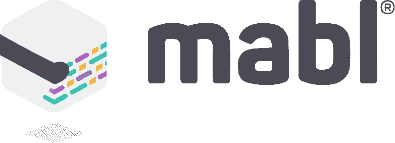

# 51 个常青科技故事

> 原文：<https://medium.com/hackernoon/51-evergreen-tech-stories-f49ca6095054>

*认识我们的每周赞助商，* [***mabl。***](http://bit.ly/2MgmJsB) *强大的测试自动化与您的交付管道相集成。* [***立即创建您的免费 mabl 帐户。***](http://bit.ly/2MgmJsB)

## 嗨，黑客，今天是周三，我厌倦了主导新闻周期、新闻提要和主页的趋势，所以本周，我们深入挖掘金库，为你策划 51 个已经并将通过时间考验的科技故事:

🐱‍💻 [**识别工程管理人员的沃伊特-坎普夫测验**](https://hackernoon.com/a-voight-kampff-test-for-identifying-engineering-managers-bb8512c70857)

🐱‍💻 [**人工智能+人类智能=我们的未来**](https://hackernoon.com/how-my-10-year-old-learned-javascript-d8782b586db7)

🐱‍💻 [**云不是数字化转型战略(除非你是亚马逊)**](https://hackernoon.com/cloud-is-not-a-digital-transformation-strategy-unless-you-are-amazon-aec1c470cf8f)

🐱‍💻 [**开发人员不测试其软件的常见借口**](https://hackernoon.com/common-excuses-why-developers-dont-test-their-software-908a465e122c)

🐱‍💻 [**超越资本主义的加密:分布式瓦莱主义的兴起**](https://hackernoon.com/crypto-beyond-capitalism-the-rise-of-distributed-valerism-7e3c1285a308)

🐱‍💻 [**数据驱动？再想想**](https://hackernoon.com/data-inspired-5c78db3999b2)

🐱‍💻 [**亲爱的 Slack，忘掉微软吧。你有更大的问题。**](https://hackernoon.com/dear-slack-get-over-microsoft-you-have-a-bigger-problem-7e2e3723c877)

🐱‍💻 [**开发人员喜欢从非开发人员同事那里听到的十一件事**](https://hackernoon.com/11-things-developers-love-hearing-from-non-developer-co-workers-ea94805cf05d)

🐱‍💻到 2027 年，每家公司都将使用区块链:下面是方法。

🐱‍💻 [**白手起家的五十家大公司**](https://hackernoon.com/50-big-companies-that-started-with-little-or-no-money-4ef1b68aac25)

🐱‍💻 [**智人对战互联网**](https://hackernoon.com/homo-sapiens-versus-the-internet-57fa096c09ab)

🐱‍💻 [**我是如何在短短七周内获得训练营结束后的软件开发工作的**](https://hackernoon.com/how-i-landed-my-post-bootcamp-software-developer-job-in-just-seven-weeks-7b213c1bb867)

🐱‍💻 [**我 10 岁的孩子如何学会 Javascript**](https://hackernoon.com/how-my-10-year-old-learned-javascript-d8782b586db7)

🐱‍💻 [**如何接受过度设计的真实面目**](https://hackernoon.com/how-to-accept-over-engineering-for-what-it-really-is-6fca9a919263)

🐱‍💻 [**我们如何通过垂直机器学习方法，在我们的时尚应用上从 0 增长到 400 万女性**](https://hackernoon.com/how-we-grew-from-0-to-4-million-women-on-our-fashion-app-with-a-vertical-machine-learning-approach-f8b7fc0a89d7)

🐱‍💻 [**我给自己做了一面智能镜子**](https://hackernoon.com/i-made-myself-a-smart-mirror-50e56966c478)

🐱‍💻 [**IoT:物联网？**](https://hackernoon.com/iot-the-internet-of-every-thing-c87be8dc0e47)

🐱‍💻 [**谷歌之后的生活:与创业生活的比较**](https://hackernoon.com/life-after-google-a-comparison-to-startup-life-831e74d5c6f8)

🐱‍💻 [**通过建一学区块链**](https://hackernoon.com/learn-blockchains-by-building-one-117428612f46)

🐱‍💻 [**见见这位向慈善机构认捐 5057 BTC(8600 万美元)的创始人**](https://hackernoon.com/meet-the-founder-who-pledged-5-057-btc-86m-to-charity-688685e922f6)

🐱‍💻 [**在休息？不要翻你的手机**](https://hackernoon.com/on-a-work-break-dont-turn-to-your-phone-952b389ad7df)

🐱‍💻 [**在指数视图上**](https://hackernoon.com/how-my-10-year-old-learned-javascript-d8782b586db7)

🐱‍💻 [**戳破泡沫:加密货币 vs .互联网**](https://hackernoon.com/how-my-10-year-old-learned-javascript-d8782b586db7)

🐱‍💻 [**你需要知道的区块链技术热门用例**](https://hackernoon.com/popular-use-cases-of-blockchain-technology-you-need-to-know-df4e1905d373)

🐱‍💻 [**稳定:设计一种价格稳定的加密货币**](https://hackernoon.com/stablecoins-designing-a-price-stable-cryptocurrency-6bf24e2689e5)

🐱‍💻 [**有效的技术领导是 100 倍的工程师**](https://hackernoon.com/the-effective-tech-lead-is-a-100x-engineer-fe49c0372a63)

🐱‍💻 [**永无止境的加密货币套利价差**](https://hackernoon.com/the-case-for-never-ending-cryptocurrency-arbitrage-spreads-788e94441d60)

🐱‍💻 [**以太坊-区块链大小已经超过 1TB，是的，这是个问题**](https://hackernoon.com/the-ethereum-blockchain-size-has-exceeded-1tb-and-yes-its-an-issue-2b650b5f4f62)

🐱‍💻[**MVP 死了。老鼠万岁。**](https://hackernoon.com/the-mvp-is-dead-long-live-the-rat-233d5d16ab02)

🐱‍💻 [**新的神经互联网来了**](https://hackernoon.com/the-new-neural-internet-is-coming-dda85b876adf)

🐱‍💻 [**《软件工程师必备时间估算指南》**](https://hackernoon.com/a-software-engineers-essential-time-estimation-guide-d7328238c510)

🐱‍💻 [**这就是谷歌将如何崩溃的**](https://hackernoon.com/how-google-collapsed-b6ffa82198ee)

🐱‍💻 [**软件工程师十大系统设计面试问题**](https://hackernoon.com/top-10-system-design-interview-questions-for-software-engineers-8561290f0444)

🐱‍💻 [**在谷歌的 GPU 上免费训练你的机器学习模型——永远**](https://hackernoon.com/train-your-machine-learning-models-on-googles-gpus-for-free-forever-a41bd309d6ad)

🐱‍💻 [**十二星座你在特色工厂工作**](https://hackernoon.com/12-signs-youre-working-in-a-feature-factory-44a5b938d6a2)

🐱‍💻 [**想成为软件开发人员？下面是如何到达那里的**](https://hackernoon.com/want-to-become-a-software-developer-heres-how-to-get-there-55f393aa443c)

🐱‍💻 [**我们对 16k 应用程序进行了逆向工程，以下是我们的发现**](https://hackernoon.com/we-reverse-engineered-16k-apps-heres-what-we-found-51bdf3b456bb)

🐱‍💻 [**密码朋克到底是什么？**](https://hackernoon.com/what-the-hell-is-a-crypto-punk-1036c6f6b19a)

🐱‍💻 [**比特币二十年后会是什么样子？**](https://hackernoon.com/what-will-bitcoin-look-like-in-twenty-years-7e75481a798c)

🐱‍💻[**React 16 中服务器端渲染的新特性**](https://hackernoon.com/whats-new-with-server-side-rendering-in-react-16-9b0d78585d67)

🐱‍💻 [**区块链下一个微软是谁？**](https://hackernoon.com/who-is-the-next-microsoft-in-blockchain-d81771539ccc)

🐱‍💻为什么我们一直使用脸书？

🐱‍💻 [**为什么大家都错过了近 500 年来最重要的发明**](https://hackernoon.com/why-everyone-missed-the-most-important-invention-in-the-last-500-years-c90b0151c169)

🐱‍💻

🐱‍💻 [**为什么高级开发人员会写愚蠢的代码，如何在一英里之外发现初级开发人员**](https://hackernoon.com/why-senior-devs-write-dumb-code-and-how-to-spot-a-junior-from-a-mile-away-27fa263b101a)

🐱‍💻 [**WTF 是空投？免费加密货币详细指南**](https://hackernoon.com/wtf-is-an-airdrop-a-detailed-guide-to-free-cryptocurrency-e70e8777dd83)

🐱‍💻 [**WTF 是区块链？**](https://hackernoon.com/wtf-is-the-blockchain-1da89ba19348)

🐱‍💻 [**WTF 是 API？互联网如何在幕后运作**](https://hackernoon.com/apis-how-the-internet-works-behind-the-scenes-690288634c32)

🐱‍💻 [**没错，这小子真的刚刚通过乱搞以太坊的智能合约删除了 3 亿美元。**](https://hackernoon.com/yes-this-kid-really-just-deleted-150-million-dollar-by-messing-around-with-ethereums-smart-2d6bb6750bb9)

🐱‍💻 [**你的脸书数据令人毛骨悚然得要命**](https://hackernoon.com/your-facebook-data-is-creepy-as-hell-319ae47117e6)

**🐱‍💻** [**你的真理 vs .他们的真理**](https://hackernoon.com/your-truth-vs-the-truth-271c1407b684) **。**

直到下一次，不要把世界的现实想当然。

亲切的问候，

大卫·斯穆克

**P.S.** *认识我们的每周赞助商，* [***mabl。***](http://bit.ly/2MgmJsB) *强大的测试自动化集成到您的交付管道中。* [***立即创建您的免费 mabl 帐户。***](http://bit.ly/2MgmJsB)

