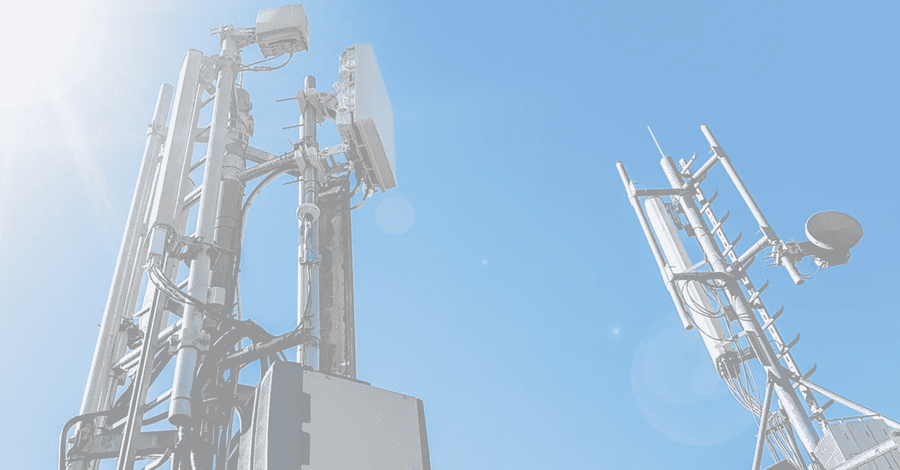
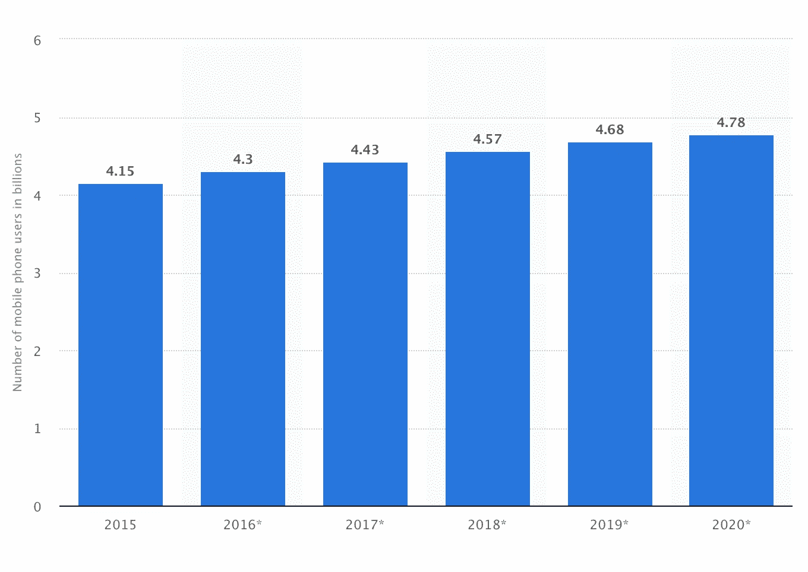
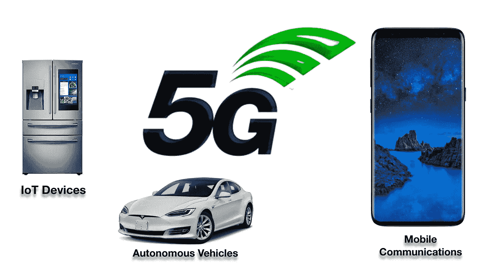
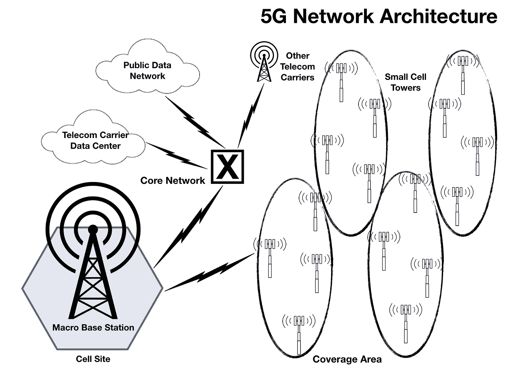
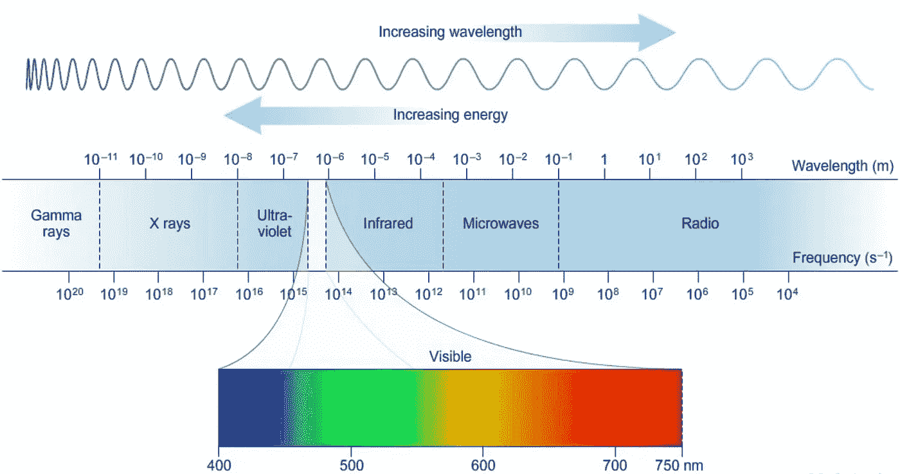
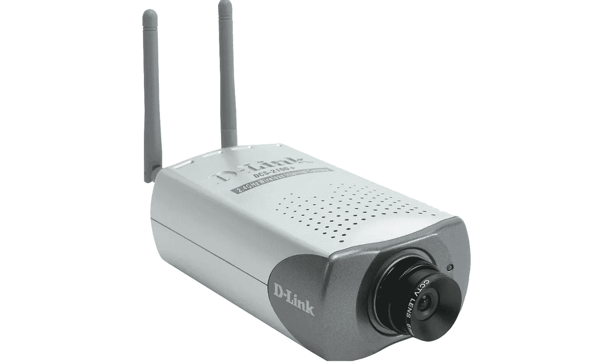
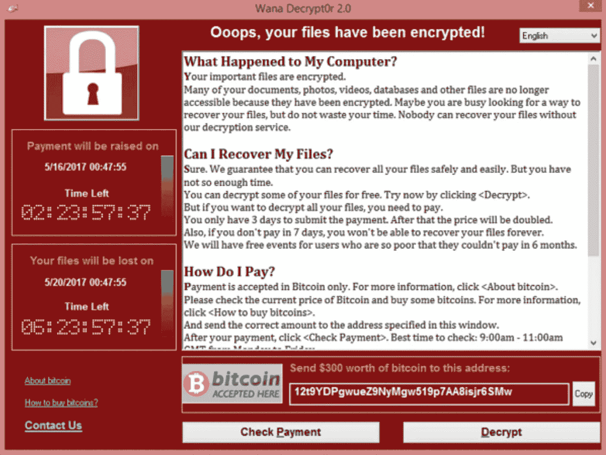
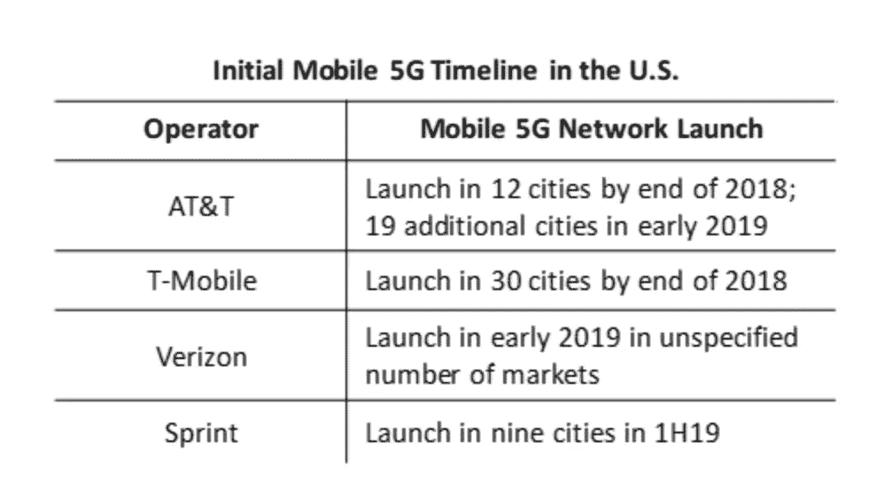

# 5G 网络可以改变我们的生活方式:是变好还是变坏？

> 原文：<https://medium.com/hackernoon/5g-networks-can-change-the-way-we-live-for-better-or-worse-ed2b3fc6b0e6>

Telecom cell towers (Source: iStockPhoto)

无线通信的进步导致了移动设备(即智能手机)的指数级增长。4G 和 LTE(长期演进)网络的部署为我们提供了更丰富的内容，从视频流到直播游戏。它对带宽造成了损害，随着需求的增长，现在需要解决这个问题。这一次，VR(虚拟现实)、AR(增强现实)和 OTT 等新型带宽密集型应用将需要它。电信行业已经制定了一个名为 5G 的新标准，以满足网络需求的增长。更高的带宽使高速数据通信成为可能，对于无线运营商来说，这听起来是一个很好的商业提议，可以扩展他们的网络，安抚用户，获得更多用户，同时产生更多收入。

这也是开发人员部署利用快速、高速、低延迟网络的应用的新机会。自动驾驶汽车、无服务器应用、自动驾驶汽车、在线游戏直播、物联网设备、时间敏感型远程医疗甚至区块链项目等新兴技术都有可能从中受益。它甚至可能取代家庭有线网络成为住宅宽带服务。

之前移动和其他计算设备的指数增长也可以处理，因为 5G 旨在提供更多带宽。就在 20 年前，我们还没有数十亿的移动用户。现在及以后，预计增长将超过 10 亿大关。到 2020 年，预计全球将有 46.8 亿移动用户。增长并不是指数级的，因为它开始变得平缓，但是你有来自前几年的大量用户。这些数据只是向我们展示了移动市场有多大，以及 5G 使用的潜力有多大。这并不表明谁将使用 5G，我将在稍后解释。

The growth in mobile users projected from 2015 to 2020 measured in billions (Source: Statista)

尽管 5G 的推出并非没有争议。一个故事总是有两个方面，当谈到 5G 时，有支持者希望上路，但也有反对者争论 5G 网络可能给公共健康和安全带来的风险。谁对谁错？在这一点上，问题多于答案。让我首先解释什么是 5G，然后讨论利弊。

## 5G 是下一代移动通信标准

无线通信行业正在引入 5G 作为当前 4G LTE 网络的继任者。 **4G** 使用 LTE 和 WiMax**向无线设备提供 100 Mbps 的峰值速度**。 **5G 峰值数据速率 20 Gbps** ，使用 eMBB(增强型移动宽带)。这提高了比特率，从而提高了速度，也降低了向移动设备传送内容的延迟。facetime 上的用户将几乎没有延迟，下载大文件将毫不费力。

随着 5G 连接速度的加快，内容访问将大幅增加，速度也将显著提高。在移动设备上观看 4K·UHD 的内容将不费吹灰之力。医生可以更清晰、更逼真地与患者进行流畅的视频会议。游戏玩家现在可以在 VR 中玩更多身临其境的视频游戏，同时聊天、流媒体和下载。同行之间更多基于云的协作。5G 还可能促进智能城市和自动驾驶汽车的崛起。这些只是 5G 投入使用后可以提供的众多好处中的一部分。

5G Networks can benefit the IoT, autonomous vehicle and mobile communications industry.

## **关于 5G，这里有 5 个需要快速了解的事情:**

## **#1 短波通信**

5G 使用所谓的“毫米波”，即短波长无线电信号。这需要在 30-300 GHz 的频谱上分配新的带宽。这增加了可用于存储更多数据和容纳更多用户的带宽。这将需要比以前的网络更短的波长，这意味着它们不能传输更长的距离。这些信号也不容易穿透墙壁，容易被湿气和树叶吸收。那么，工程师们为什么要建造一个不能远行且有重大缺陷的系统呢？这就引出了 5G 的第二个特征(下一项)。

## #2 小型基站安装

为了确保信号能够传播得更远而不衰减，将在一个区域内安装密集部署的“小蜂窝”塔来处理信号。它们将比典型的蜂窝塔小得多。这些小信号塔将被放置在距离不小于 200 英尺、不大于 1000 英尺的范围内，因此它们彼此非常接近。体积更小的优点是它们的安装位置更加灵活。仅举几个例子，它们可以放在建筑物的侧面、电线杆、公寓屋顶上。然后，小蜂窝在覆盖特定区域的 5G 网络上发送和接收数据。因此，5G 的想法是用与基站通信的低功率、高频小蜂窝取代高功率、低频塔。

## #3 波束成形信号系统

为了处理数据通信信令，将使用“波束成形”。它决定了 5G 网络中最有效的数据传输路线。波束成形实际上是将数据从小区直接发送给用户。由于信号更加集中，也减少了干扰。像其前身 4G 一样，5G 网络利用 IP 网络上的分组交换进行数据传输。

## #4 大规模 MIMO

MIMO 或“多输入多输出”允许在任何给定时刻发送和接收更多的信号。这是通过在一个小小区内安装更多的天线阵列来实现的。波束成形解决了安装这么多天线的问题。通过 MIMO，基站可以发送和接收更多信号，将 5G 网络的容量提高 22 倍，这是由布里斯托尔大学和瑞典隆德大学的工程师首次报告的。

## #5 基站的全双工功能

事实:无线提供商实际上并不使用全双工收发器。在 5G 网络中，全双工的使用将允许基站收发器使用相同的频率在同一时间发送和接收数据。过去支持全双工通信的系统必须分离频率信道，以允许两个用户同时通信，而不必轮流发送和接收。现在，通过在硅中利用高速开关的电路设计，仅使用一个频率通道是可能的。这使得天线能够在路由输入和输出信号的同时进行发射和接收。

Simplified view of the 5G Network Architecture.

理论上看起来很简单。5G 只是无线通信系统的又一次迭代，旨在提供更快的数据速度和处理更多的用户。批评家关注的问题主要有两个: ***公共卫生*** 和 ***网络安全*** 。

## 问题№1:“5G 可能对公共健康构成风险”

活动人士、研究人员和卫生专业人士都很关注 5G 使用的高频毫米波无线电信号。由于许多小细胞将被安装在人们附近，因此必须齐心协力进一步研究和评估它可能产生的影响。有医生警告说，5G 小细胞发出的辐射量可能对日常生活或暴露在这些无线电波下的人产生不可逆的影响。

这些报道令人震惊，可能会引起恐惧。我一点也不排斥它们，因为在一个项目的任何公开展示之前，总应该有一个包括公共健康和安全在内的环境影响评估。虽然大多数批评者指出 5G 可能造成的伤害，但没有明显的研究毫无疑问地积极证明无线网络增加了癌症或其他疾病。流行病学研究没有任何确凿的证据表明无线和移动设备的使用与癌症等疾病的高发病率有关。然而，我们不应忽视这些报告，因为这是监管机构进一步研究 5G 操作以及部署 5G 是否安全的机会。

讨论中的高频是 5G 使用的范围，可以高达 300 GHz。在电磁波谱中，有害无线电波的范围在伽马射线和 x 射线范围内。5G 使用的范围是频谱的微波范围。一些活动家错误地认为 5G 信号就像微波炉中使用的信号一样。虽然这是事实，5G 信号在电磁波谱的微波范围内，但小蜂窝和烤箱之间是有区别的。微波炉使用高能量从里到外烹饪食物。小蜂窝使用低能量来发送和接收无线电信号。他们对无线电波有不同的应用。

The electromagnetic spectrum showing the range of harmful radio waves (gamma rays, x-rays, ultraviolet light) and the radio waves used in telecommunications (microwave and radio).

如果你生活在像南加州这样阳光充足的地区，你已经暴露在比 5G 微波信号更多的辐射中。这是因为可见光的频率高于 5G 信号，人们更多地暴露在阳光下。人们也可能因为过度暴露在来自紫外线的阳光成分中而得病。对健康构成威胁的可见光以上的高频辐射范围是伽马射线和 x 射线，也称为“电离辐射”。长时间暴露会导致细胞损伤，也会影响 DNA，因此非常有害。这就是为什么在进行 x 光检查时，病人需要做特殊的准备，并且只需快速暴露在 x 光下。这是因为 x 射线可以穿透皮肤和骨骼，因此我们可以将它们显影为胶片上的图像，使它们成为非常有价值的医疗诊断成像系统。5G 信号不会穿透人体皮肤和骨骼。这一频率范围内的大部分辐射是以热的形式存在的，在无线电波传输过程中不会破坏或摧毁人体组织。

更严肃的学者不认为人们已经暴露在更高频率的可见光下，甚至是电视遥控器中使用的红外线下。然而，问题是，当你部署一个 5G 小蜂窝系统时，它们会不断发射无线信号，轰炸周围环境。尽管 5G 使用波束形成来集中信号传输而不是广播，但批评者仍然希望进行更多的评估和测试来验证 5G 的安全性。

一般来说，许多研究报告都没有发现无线电波对人体健康有任何全面的有害影响。FCC(联邦通信委员会)实际上根据 SAR(比吸收率)对无线电波有严格的规定。SAR 是被认为是公共安全极限的身体的某一部分所允许吸收的能量的量。FCC 规则是 SAR 水平必须等于或低于每千克 1.6w(W/kg)，该体积包含 1 克吸收最多信号的组织。对于 5G 开发商和电信运营商来说，遵守这些标准是企业运营的必要条件，以免危及公众。

世卫组织(世界卫生组织)指出:

> **“尽管进行了广泛的研究，但迄今为止没有证据表明暴露于低水平电磁场对人体健康有害”**

(资料来源:世卫组织*关于电磁场—健康影响要点 6 总结)*

在世卫组织的另一项研究中，我们仍然必须小心谨慎，继续研究无线电波的影响。

> **“考虑到非常低的暴露水平和迄今为止收集的研究结果，没有令人信服的科学证据表明基站和无线网络的微弱射频信号会对健康造成不利影响。”**

(来源:世卫组织*基站和无线技术背景介绍*)

一份关于 5G 担忧的报告可以从 Cindy Russell 博士(圣克拉拉医学协会)发表的[文章](https://issuu.com/18621/docs/bulletin_0217_web/20)中读到。

## 问题№2:“5G 有安全问题”

没有完美的系统可以 100%抵御网络安全攻击。只需将一台服务器放在公共网络上，所有用户都可以看到它，不管是好用户还是坏用户。由于 5G 旨在提供一个主干网，为家庭和企业的物联网设备带来更高的速度，因此也增加了黑客的威胁载体。这一点需要认真对待，因为更多的设备将有能力连接到高速网络。这也是黑客攻击更多设备的机会。

Internet cameras like this can lead to an invasion of privacy if not properly configured (Source: D-Link)

连接到公共网络的新物联网设备的一个问题是配置。一些用户可能只是将他们的设备放在网上，而没有对其进行适当的配置。由于用户可能没有意识到的漏洞，已经有关于物联网危险的研究。为了解决这些问题，网络安全专家总是建议用户对他们的物联网设备进行更新，并确保他们不使用简单易猜的密码。尽管有这些警告，人们仍然做粗心的事情。

更快的网络也意味着病毒和恶意软件传播的速度更快。如果网络上的用户越来越多，那么受感染的设备和系统也有可能比以前更多。这当然是最坏的情况。5G 只是应用和服务的底层。在网络上建立一个像 5G 这样的安全协议会是最终的解决方案吗？这仍有待观察，但截至目前，5G 尚未大规模运行，网络安全专家无法识别这些漏洞。

More malicious malware like “ransomware” can proliferate with more connected devices.

为了应对更快的 5G 可能带来的威胁，网络安全供应商正在提供一种新的威胁管理和网络安全设备。现在甚至有针对智能手机的安全产品，因为这些设备将与 5G 网络有最多的连接。安装在移动设备上的反病毒软件(antivirus)就像安装在桌面计算机上一样，通过监控设备上的任何恶意活动，为用户提供了一层防御。

据 Network World 报道，有报道称 5G 存在一些网络安全问题。在这篇文章的摘录中:

> **“其中一项研究——由苏黎世联邦理工学院、洛林大学/INRIA 分校和邓迪大学的科学家进行的 5G 认证正式分析——发现犯罪分子将能够拦截 5G 通信并窃取数据，因为“存在严重的安全漏洞，”该组织在他们的新闻稿中说。他们说，部分原因是“安全目标不够明确”，3GPP 标准“不够精确”。**

5G 网络运营商还必须密切关注可能对其系统发起攻击的不良行为者。小型手机信号塔甚至可以成为目标，因此它们必须以不容易受到攻击的方式安装。小单元可能有传感器和摄像头，以确保它们不会被篡改。

## 美国的 5G 试验

在美国，美国联邦通信委员会主席 Ajit Pai 一直鼓励 5G 部署。FCC 通过提供覆盖频谱，为 5G 部署铺平了道路。Ajit Pai 称之为“快速计划”或“促进美国在 5G 技术上的优势。”正如 Ajit Pai 所提到的，美国仍将寻求修改这一领域的法规:

> **“但是为了部署 5G 所需的成千上万的小蜂窝和数英里长的光纤，我们需要简化监管。”**

目前，主要电信运营商都有自己的 5G 试验计划，为 2020 年的商用做准备。已经向公众报道的一个这样的试验是在华盛顿进行的。这是威瑞森和诺基亚利用毫米波频谱的一个项目。威瑞森提供网络，诺基亚测试无线电设备。

US 5G Timeline (Source: Technology Business Research, Inc.)

## 通向更快网络的道路

我认为 5G 是我们数字比特流的一条快速流动的河流。我们现在花更多的时间在互联网上发送电子邮件，在云上合作，观看流媒体内容(如 YouTube，网飞，Hulu 等)。)和参与社交媒体。我们的大部分数据也存储在网络上，需要我们的智能手机才能访问。有了快速的网络连接，无论你在哪里，你都可以随时访问它。我们的智能手机已经成为我们的主要设备，因为它为我们提供了从任何地方访问信息的移动性。

现在回到我前面提到的数十亿用户群，它仍然需要升级才能使用。目前的移动用户群不会自动接入 5G，因为它需要升级硬件。这意味着他们仍然需要购买 5G 兼容的智能手机或移动设备来访问网络。尽管如此，智能手机厂商在这一领域仍有进一步增长的潜力。一旦 5G 推出，用户将不得不购买新的智能手机。这将再次为一个不断增长的行业创造就业机会，因为从 4G 到 5G 的过渡中采用范围扩大了。

5G 之路将面临公共健康安全和网络安全方面的挑战。它仍然需要符合各自国家的安全和操作要求。可能会有利益集团想要利用这种情况，这可能会进一步推迟任何推出。公民实际上可以表达他们的担忧，如果法官做出有利于他们的裁决，他们的担忧将导致任何部署的停止。有科学论文支持这两种观点。大多数时候，赢得科学证据或公众信任的是商业利益。在这一点上，我们可以看到好处，但看不到效果。我认为，为了更广泛地接受 5G 的部署，这些问题需要得到解决。

**There are always bumps along the road.**