# 6 个糟糕的 UI 设计例子& UI 设计师的常见错误

> 原文：<https://medium.com/hackernoon/6-bad-ui-design-examples-common-errors-of-ui-designers-e498e657b0c4>

在深入探讨之前，我们先来看看到底什么是用户界面[设计](https://hackernoon.com/tagged/design)？就像我希望在参观你的房子时受到欢迎一样，网站的每个访问者都会有这样的感觉。

简单来说，[用户界面](https://hackernoon.com/tagged/user-interface)就是网站如何与用户进行交互，包括人机交互、界面逻辑以及外观。向用户传递想法和产品的有用性将比一个网站/应用程序有多漂亮更重要。

**UI 的目的是尽可能及时优雅地将产品提供给用户。**所以，你可能在想什么样的 UI 设计才能算是好的呢？UI 设计中有哪些常见错误，如何有效避免？别担心，我会带你一个一个地看完，包括 6 个糟糕的 UI 设计例子。

# 好的和坏的界面设计的区别

在网络上有不少的 [UI 设计原则](https://www.mockplus.com/blog/post/ui-design-principle)，但是 UI 设计的顶级黄金法则将会是下面的 4E。还有，这可以作为判断是否是一个好的 UI 设计的标准:

-无错误。

-易于使用。

-很容易理解。

-对最终目标或产品有效。

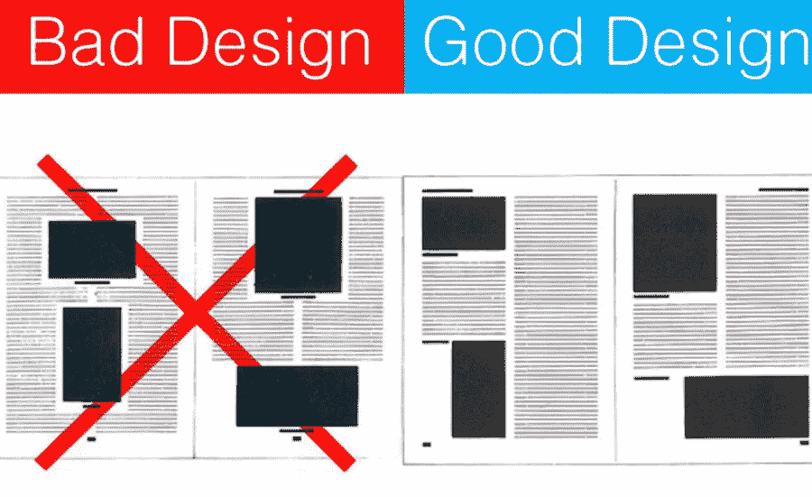

显然，好的用户界面可以让我们感觉像在家里一样，外面的一切都在正确的位置；而糟糕的 UI 会让你觉得嘴里有恶趣味，你想做的就是赶紧离开。

此外，**糟糕的 UI 设计会让用户觉得网站复杂难操作**；好的网站会指导用户如何以清晰直观的方式与网站互动，即使是他们第一次访问网站。糟糕的 UI 设计不仅完全摧毁了设计者背后的创造力，还会给用户带来误解。所有这些都会给用户带来困惑、沮丧甚至愤怒的感觉。很明显，糟糕的 UI 设计会带来糟糕的用户体验，看看 iPhone X 的凹槽你就知道了…

# 用户界面设计中常见的 6 大错误

看看坏设计的例子和好设计的反例会很有趣，最重要的是给设计师们上了一课。正如 Jared Spool 所说，“好的设计，当它做得好的时候，就会变得无形。只有当它做得不好时，我们才会注意到它”。设计师有一些常见的错误和潜在的陷阱，有时很难注意到。我给你列了一个清单。

# 1.这个设计缺乏对比

当浏览一个网站时，我们希望看到一个清晰、鲜明的对比。这可以帮助我们更好地阅读和理解那里的信息，从而知道如何进行操作。如果没有对比，网站的颜色组合和整体显示都会让我们不知所措。很难阅读下面网站的内容。

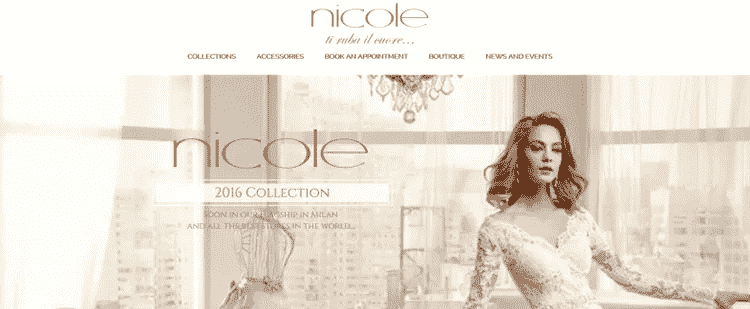

**不好:缺乏对比**

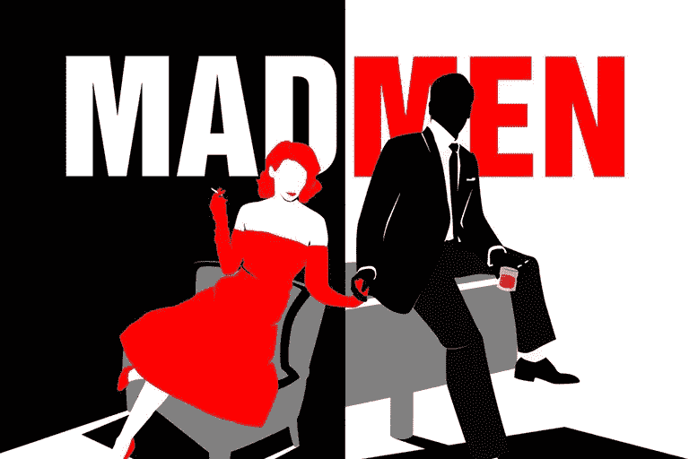

**好:设计中的对比**

# 2.非响应性设计

使用[响应式设计](https://www.smashingmagazine.com/2011/01/guidelines-for-responsive-web-design/)非常流行，因为我们发现没有理由让我们的网站不能适应给定的分辨率和设备大小。这是必须的，尤其是对于目标受众来自移动设备的购物车网站/应用程序。

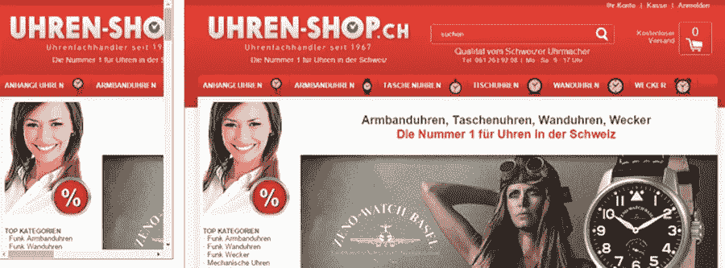

**不好:不响应的设计**

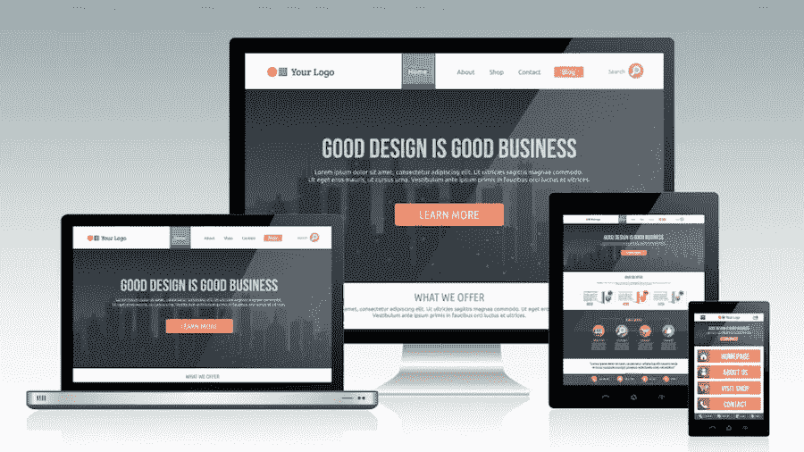

**好:响应式设计**

# 3.没有抄袭数据的用户反馈

从其他人的设计作品中获得灵感并不是一件坏事，但我们需要确保我们拥有丰富的用户数据来做出正确的决定。下面这个就是典型的坏例子。

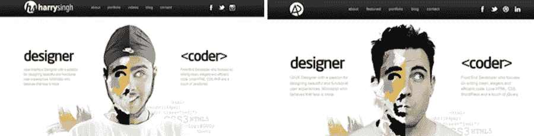

**坏消息:抄袭数据**

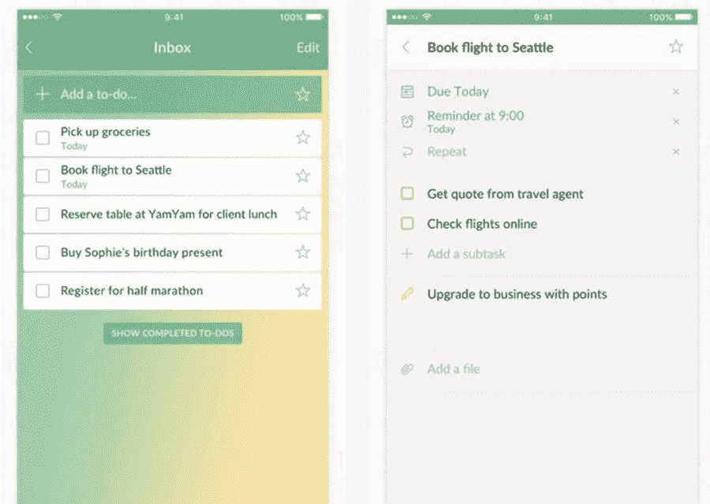

**好:完整的用户反馈系统**

# 4.Bad IA(信息架构师)

每个人都想从人群中脱颖而出，他的设计作品可以吸引别人的目光。然而，如果我们过分强调设计中的创造性，有时会适得其反。在视觉层次上保持良好的平衡可以给用户留下好的印象，并且可以向他们传递更多的信息。下面这张或多或少会给我们一种混乱无序的感觉。

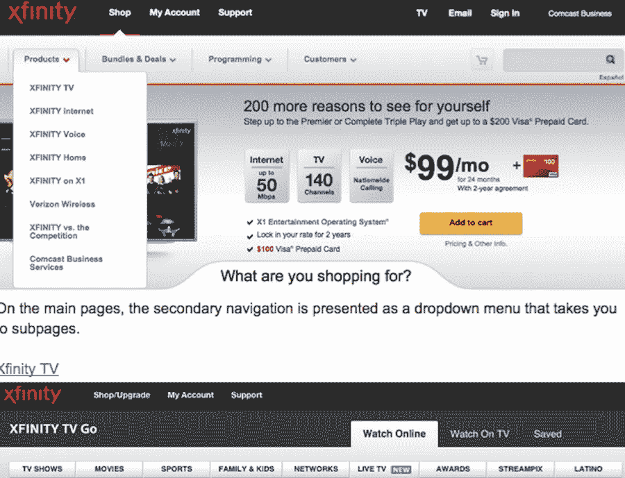

**不良:无序结构**

**好:结构良好的设计**

# 5.风格不一致

并不是说混搭风格不好，但是如果整体界面有巨大难看的视觉冲突，还是重新设计比较好。一个优秀的 UI 设计应该在风格上保持一致，这样才能让用户清楚地理解和响应给定的内容。这也有利于提高工作效率。

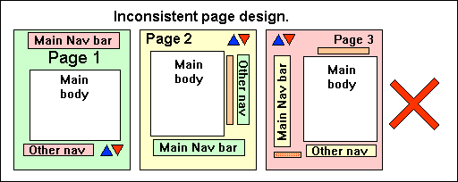

**不好:页面设计不一致**

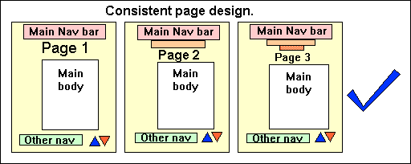

**好:一致的页面设计**

# 6.笨重缓慢的形式

有时候，我们需要通过[设计一个更好的表单](https://www.mockplus.com/blog/post/design-better-formscommon-mistakes-designers-make-and-how-to-fix-them)来收集用户的相关信息，但是缓慢而笨重的表单完全是浪费时间。最好把涉及的步骤精简一下，让表格看起来简洁明了。

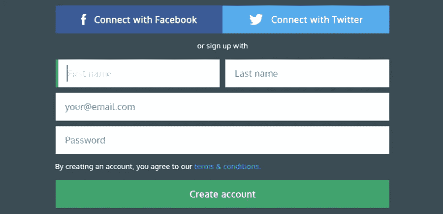

**好:好用户注册表单**

像用户注册表单或评论区这样的东西是设计中的社交互动元素。添加社交分享按钮(像脸书、Twitter、YouTube 和 LinkedIn)，或者输入电子邮件地址来注册时事通讯，不仅可以增加传播我们信息的方式，还可以增加用户保留率。我们可以从下面好好借鉴一下。

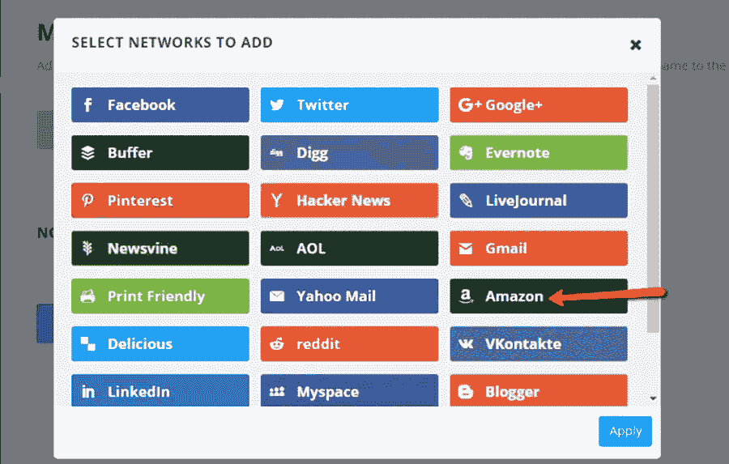

**好处:社交网站**

# 如何避免 UI 设计师最常见的错误？

一般来说，用户界面设计者会犯 5 个常见的问题:

——**限制进一步探索的可能性**。由于给定的期限和潜在的风险或许多其他因素，不少设计师无法在制定设计方案之前对创意进行广泛的探索。对于设计团队来说，需要 3-6 个月的时间来确定和完善设计方案。

**——没有以用户为中心的设计。**这是最重要但又容易被忽视的部分。所有的设计都应该面向用户。我们需要更多的数据分析和 UI 资源，以确保我们的设计理念能够被用户很好地接受和认可。

- **对目标受众了解不多**。我们应该设身处地为客户着想，而不是看个人喜好。这将有助于打破我们自身的局限，从而创造良好的卖点。

——**手艺太超前**。尤其是在设计前期，我们要高保真地把头脑中的概念画出来。然而，这并不明智。从更多不同甚至相反的方面去探索，可以帮助我们发现更多的惊喜。

- **过度利用动态效果**。老实说，几乎到处都有许多毫无意义的动态设计，它们除了给用户带来失望之外什么也做不了。最好避免装饰性的动画效果，使其优化用户体验。

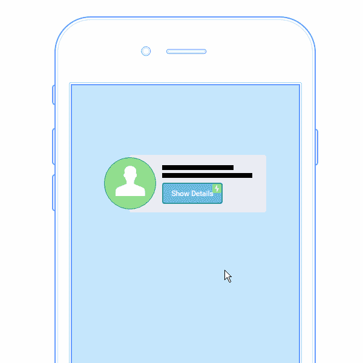

**这里有一个不好的例子:不必要的动画**

# 总结

我们可以得出一个结论，一个好的 UI 设计应该在外观上看起来很漂亮，但最重要的是有一个清晰的结构，注重用户体验，独特，简单，简洁，便于用户理解。这听起来可能很简单，对吧？但是实现起来并不容易。有时我们可以确保我们的设计想法没有问题，但是当我们开始做的时候，会有很多意想不到的事情。把它变成现实是个人能力的试金石。