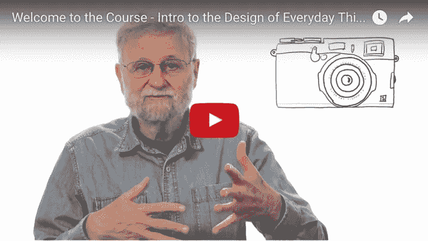
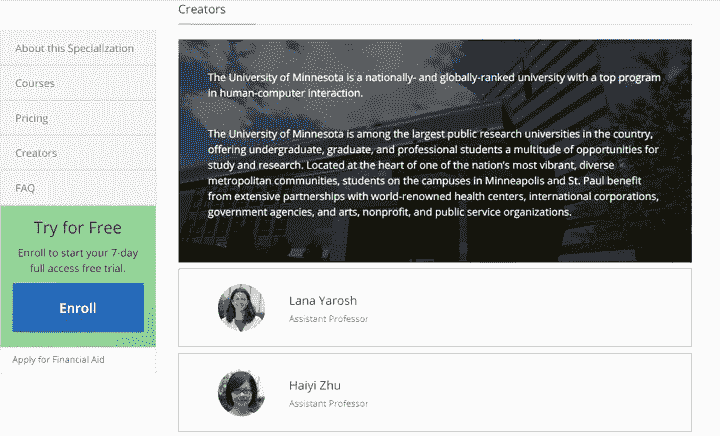

# 来自全球顶尖大学的 6 门免费 UX 设计课程

> 原文：<https://medium.com/hackernoon/6-free-ux-design-courses-from-top-universities-worldwide-39fd363f16ad>

要掌握 UX 技巧，需要行业专家的充分指导。这里有 6 门来自顶尖大学的 UX 设计课程，全部免费！

**这篇文章包括了来自世界顶尖大学的 6 门免费 UX 设计课程。**

要成为一名优秀的 UX 设计师，你需要掌握许多必要的技能。

例如，你需要掌握用户体验设计的架构(就可用性而言)和 UCD(以用户为中心的设计)技能。你需要知道如何使用基本的设计[工具](https://hackernoon.com/tagged/tools)，比如 [Axure](https://www.axure.com/) 、 [Mockplus](http://mockplus.com/) 、 [Sketch](https://www.sketchapp.com/) 等原型工具。你需要掌握网页设计和开发的整个流程。你需要有敏锐的市场眼光，时刻注意最新的行业趋势。你需要善于分析用户的行为模式，分析用户的反馈，并将其投入到产品的设计中。我们可以继续下去…

掌握这些技能需要动手实践。然而，不仅如此，它还需要行业专家的充分指导。然而， [UX 设计](https://hackernoon.com/tagged/ux-design)行业教育资源稀缺，只有少数人有机会接受专业教育。

此外，各个机构和个人提供的 **UX 设计课程**的质量和专业性也无法得到保证。大量的需求无法满足，所以我们列出了几个由顶尖大学和企业提供的免费 UX 在线课程供你参考

# 1.加州大学圣地亚哥分校— —交互设计专业

本课程共有 8 课:

*   以人为中心的设计:导论
*   设计原则:导论
*   社会计算
*   输入和交互
*   用户体验:研究和原型制作
*   信息设计
*   设计、运行和分析实验
*   交互设计顶点项目

这门 UX 设计课程在中央课堂上有 4.3/5 的高分。在这 8 堂优质课中，Scott Klemmer 教授从交互设计理论与实践、认知心理学、用户界面设计、人机交互等角度，专业而系统地讲述了如何打造一个好的用户体验设计。

在这门课程中，你将学习**如何分析和研究用户需求，如何绘制原型，用户界面设计的一些原则和设计评估的策略**。如果你能认真完成本课程要求的小测试和任务，那是最好的。

# 2.[密执安大学— —用户体验(UX)研究与设计](https://www.edx.org/micromasters/michiganx-user-experience-ux-research-and-design)

本课程共有 9 课:

*   了解用户需求
*   为人类而设计的原则
*   用户体验介绍
*   与用户一起评估设计
*   UX(用户体验)顶点
*   UX 设计:从概念到线框
*   UX 设计:从线框到原型
*   UX 研究调查
*   UX 大规模研究:分析和在线实验

这本 UX 设计课程由密歇根大学信息学院于 2016 年秋季首次由 EdX 出版。如果你想在完成这个课程后获得密歇根大学验证的“毕业证书”，你需要支付 1041 刀。如果不需要证书，可以免费参加这个课程。

本课程质量高，内容深入，同时有大量的小测验和练习题。参与频繁的小任务可以让你真正学到很多技能。

# 3.[唐·诺曼— —日常用品设计导论](https://eg.udacity.com/course/intro-to-the-design-of-everyday-things--design101)

本课程共有 4 课:

*   可用性和符号
*   概念模型和系统映像
*   评估和实施之间的差距
*   期末项目:为时间银行设计用户界面

本 UX 设计课程由 Don Norman 主讲，内容主要来自他的热门著作《日常事物的设计》的前两章。如果你真的不想看这本书，你可以选这门课。它的风格相对轻松，丰富的案例会给你启发。

这门课程将为你提供**开始认识到设计在当今世界的作用**所需的知识，并开始在你自己的生活中做出更好的设计决策。除了学习基本的设计概念，如启示和标志，你还将获得观察和应用设计原则的经验。

# 4.[佐治亚理工学院— —用户体验设计简介](https://www.coursera.org/learn/user-experience-design)

本课程包括 5 个部分:

*   用户体验设计概述
*   需求收集
*   设计替代方案
*   样机研究
*   估价

这门 UX 设计课程由佐治亚理工学院交互计算学院的资深科学家 Rosa Arriaga 博士主持。本课程的主要目标受众是那些听说过“用户体验(UX)”这个词，但却不知道或者知之甚少的人。设计是一个系统的、数据驱动的过程，这是本课程要教授的重点。

围绕这一目标，课程将从基础开始**具体讲解为什么设计是一个系统的、数据驱动的过程**，如何让技术和设计相互服务，什么样的设计能让用户满意，如何判断用户的需求是否得到满足。

# 5.[明尼苏达大学— —设计更好的用户界面](https://www.coursera.org/specializations/user-interface-design)

本课程共有 5 课:

*   UI 设计简介
*   用户研究和设计
*   原型和设计
*   评估用户界面
*   UI 设计顶点

这门 UX 设计课程帮助你系统地学习如何理解用户需求(如情景访谈和设计心理学)，常见的原型方法，如何使用科学的方法来评估和选择设计(如启发式评估和用户研究)。

# 6.[阿尔伯塔大学— —软件产品管理导论](https://www.coursera.org/learn/introduction-to-software-product-management)

本课程分为两个部分:

*   模块 1:软件产品管理——规程
*   模块 2:软件产品管理的基础

这个 UX 设计课程强调了软件产品管理的重要性和作用。它还概述了专业化及其目标、结构和期望。本课程解释了过程、需求、计划和监控在生产更好的软件中的价值。顺利完成本课程后，您将能够:

*   将软件产品管理与更好的软件产品联系起来
*   认识软件产品经理的角色
*   思考敏捷原则将如何改进你自己的项目。