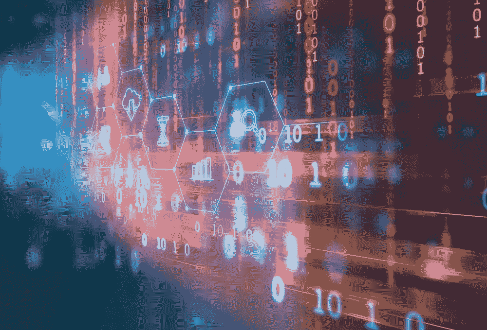

# 区块链必将颠覆 6 个行业

> 原文：<https://medium.com/hackernoon/6-industries-the-blockchain-is-bound-to-disrupt-d839926c8e61>

虽然[区块链](https://hackernoon.com/tagged/blockchain)通常被认为是进行金融交易的工具——或者存储与这些交易相关的[数据](https://hackernoon.com/tagged/data)——但它有潜力做得更多。

事实上，它已经*比*多了那么多。

这是我亲眼所见，无论是通过共同创立 [Bee Token](https://www.beetoken.com/) 还是为其他各种区块链项目提供建议。越来越多的区块链公司正在寻找方法，为他们的产品和服务提供实际的效用，为他们各自行业的进一步分散化铺平道路——从教育到短期租赁，再到公民参与。

最大的变化还在后头。

> 最终，我们将在各行业看到的是向去中心化的转变，这将极大地影响共享经济，假以时日，这将导致更广泛的破坏。

这里有六个行业将首先发生颠覆。

# **银行业**

扰乱银行系统是区块链的第一个意图。这是因为它从分散化中得到了极大的改善。在目前的形式下，该系统依赖于各种各样的中间人，他们吸走了时间和金钱，并且不可信任，即因为他们的过程缺乏透明度——没有人可以让他们负责。

区块链解决了这两个问题。

消除对交易中间人的需求就消除了对昂贵的交易费用的需求。通过将记录和财务信息存储在一个分散的分类账上，由一个集体而不是一个公司来监控和管理，整个过程变得更加值得信赖。

> 更重要的是，区块链的银行业已经被证明是有效的。现在，只是实施的问题。

但这一实现将比我们想象的更快。事实上，世界各地的大银行都在积极投资区块链驱动的项目和解决方案。他们知道，很快，以区块链为动力的竞争对手将进入这个领域，收取更低的费用，同时提供更高的可靠性。当这种情况发生时，一个更大的动力将被引入运动。

# **租赁和房地产**

另一个已经处于区块链驱动的颠覆中的行业是房屋租赁业(短期和长期)。这是因为，像银行业一样，目前租房或买房的过程效率非常低。

例如，当你在周末使用 Airbnb 租房时，Airbnb 会从每笔交易中抽取相当大的一部分。作为一个集中的程序权威，Airbnb 几乎完全控制着用户数据和整个社区。如果客人在住宿期间把主人的房子弄得乱七八糟，Airbnb 会独自决定采取何种适当的补救措施——如果有的话。

正是因为这个原因，我和我的团队建立了 Bee Token。我们看到了区块链可以改善的行业领域。例如，在 Bee Token 社区中，公司本身不要求任何交易佣金。相反，我们支持一个真正自由的主机和来宾对等网络——一个在理念上保持一致并最终自我管理、控制和维持的网络。

假以时日，将会出现更多像 Bee Token 这样的公司。

这是因为 Bee Token 支持的以区块链为动力的社区更有效地运行，并且以一种对客人*和*主人都更有利的方式运行。随着越来越多的客人和主人意识到这种更纯粹的社区更加值得信赖和经济合理，另一个转变将会发生，用户将开始要求这些增强的透明度和控制水平。

其他公司也开始进入租赁领域，包括更专注于长期租赁的 Rentberry。

# **投票系统**

区块链的主要好处之一是它保证了更高水平的程序透明度。很难想象有哪个过程比投票更重要。

将区块链纳入投票流程的好处是巨大的。

> 选举结果和信息不可改变地存储在区块链上，这样的选举将更安全，不会受到内部作弊和外部干预的威胁。

比如，俄国想要篡改选举结果会更加困难，因为篡改区块链的数据事实上是不可能的。你可以查看区块链的数据，确定每一张选票的来源。

仅仅因为这个原因，政府开始使用区块链存储和跟踪数据来进行选举只是时间问题。

想象一下这样一个世界，公众可以很容易地访问一个不可变的历史数据库，该数据库跟踪任何给定候选人曾经支持的所有政策决定。这将允许我们选举更值得信赖的个人，并更真诚地信任我们的民主进程。

# **健康**

区块链的好处不仅仅是经济或民主——区块链也有拯救生命的潜力。

区块链可以更好地让需要医疗帮助的人与能够提供帮助的人联系——无论是医疗保健提供者、药剂师还是潜在的献血者。这也将使医生更容易在病人需要时给予他们适当的帮助。

> 这是因为如果医疗文件，如病人记录，存储在区块链上，医生将更容易快速有效地访问这些数据，以确定病人需要何种治疗。

这比你想象的更重要。

例如，想象一下在自然灾害后治疗病人是什么样子。现在，如果医院的记录丢失了，病人带着未知的病史来找你，给他们所需的治疗会变得更加困难，因为你没有办法访问这些数据。但是，如果这些信息在区块链上是普遍可用的，只要你有你的病人的钥匙，你就可以访问他们的全部病史——无论你在哪里，无论情况如何。

# **教育**

从本质上说，任何通过某个机构中间人的管道连接两个实体的过程都有可能被区块链破坏。输入:学历。

未来，区块链将使世界各地的学生——无论地理位置或收入水平如何——更容易获得高质量的教育。

它将通过使通常依赖于联系学生与教育者或教育材料的机构基本过时来做到这一点。中东的学生将能够访问美国教授创作的教育内容，反之亦然。

虽然从技术上来说已经是这样了，但学生们面临的问题是获取这些资料往往过于昂贵。一个原因是，作为学费的一部分，学生被迫支付他们不需要的东西。

> 然而，如果区块链上有课程，学生将有能力只获取他们需要的东西，以获得学位，甚至只是获得最相关的知识。

但是受益的不仅仅是学生。目前报酬过低的教师可以独立于大学或机构在区块链提供服务，并在此过程中根据社区确定的这些服务的价值获得报酬。随着时间的推移，赢得高质量声誉的教师、教练、导师和内容提供商将获得更公平的报酬。

事实上，我提供建议的公司之一，[teacher](https://www.teachur.co/)，已经通过他们自己的代币解决了这些问题，由于他们在区块链以太坊提供代币，提供认证学位的费用只有 1000 美元。

# **物联网**

最后，区块链还具有更高效地连接物联网的能力。很快，电话、汽车、医疗设备——甚至冰箱——都将在区块链上连接起来，使它们能够更有效、更可预测地相互通信和协作。

例如，假设给定区域的每个温度计都连接在区块链上。在这种情况下，我们将能够更有效地预测该地区的天气，因为我们有更多的数据来帮助我们做出结论。

再想想智能汽车。现在，我们有很多智能汽车在路上行驶，假设它们都可以相互连接。如果司机可以在区块链上互相交流，我们就可以更好地管理交通。

最终，区块链将破坏所有这些行业和社会的方方面面，因为它更有效地将特定社区的人们联系起来。随着世界越来越多地转向共享经济，这种好处只会变得越来越有影响力。

这种转变已经发生——破坏将会分散。