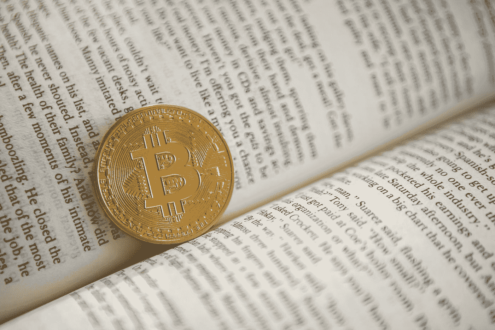

# 比特币之外的区块链的 6 种创新用途

> 原文：<https://medium.com/hackernoon/6-innovative-uses-for-blockchain-that-arent-bitcoin-268713c768d6>

Photo by [Andre Francois](https://unsplash.com/@silverhousehd?utm_source=medium&utm_medium=referral) on [Unsplash](https://unsplash.com?utm_source=medium&utm_medium=referral)

伴随着围绕比特币的大肆宣传，漫不经心的观察者往往会忽略支撑比特币的有趣的革命性技术:

***区块链*。**

人们经常说，尽管加密货币的未来不可预测，但区块链已经存在。我相信这是真的，并且它不断地被一些关键的例子所证明，区块链是如何开始改变或影响人们和/或企业更好地互动的。

# 追踪食物供应

众所周知，食物需要长途跋涉才能到达杂货店的货架上。散装产品也是如此，大多数包装商品也是如此。由于大规模的物流和机械，食品安全、环境和农业工人的福利现在比前几代人更加重要。**[**IBM Food Trust**](https://www.ibm.com/blockchain/solutions/food-trust)**使用区块链技术准确跟踪从农场到餐桌的食品**，在此过程中提高透明度，并在召回事件中更容易追踪污染。**

# **可再生能源交易所**

**有一段时间，太阳能电池板和替代能源风靡一时。有环保意识的消费者仍在寻找减少对昂贵的、对环境有害的燃料的依赖的方法。这种转变的一个缺点是，个人业主生产的可再生能源可能会超过他们的使用量。**这就是** [**布鲁克林微电网**](https://www.brooklyn.energy/about) **的用武之地。该项目运行在一个名为“能源”的区块链平台上，社区成员可以相互交换电力，为一个更可持续、更互联的未来做出贡献，这对我们所有人都更好。****

# ****外援输送****

**[**区块链可以轻松跟踪资金流动**](https://blog.goodaudience.com/how-blockchain-is-revolutionizing-foreign-aid-delivery-7674de0beb21) **，**让任何人都可以确认援助何时真正到达预期的接收者手中，而不会被窃取或挪用，从而彻底改变了发展中国家的援助交付方式。鉴于非政府组织可以看到并跟踪他们的捐款对区块链的直接影响，更强的问责制也可能使他们更容易从捐助者那里筹集资金。世界粮食计划署将区块链技术与生物识别技术相结合，以确保向居住在约旦的叙利亚难民安全、高效地提供外援。**

# **数字民主**

**投票过程是任何功能性民主的核心。然而，让投票箱免受欺诈、技术错误、[恶意攻击](https://twitter.com/RachelTobac/status/1028437783050776576)或破坏的风险是一个挑战。技术通常是容易出错的，这是由系统固有的不完美性决定的。**区块链是一种优越的方法，因为它被设计为高度透明和安全。理论上，不仅任何观察者都可以分析(公开的)区块链上的一系列交易，而且由于区块链的不变性，事件不能被抹去。区块链的实现需要正确完成，因为任何投票过程都非常重要，然而**由于区块链技术是安全、稳定和开放的，它可能是无欺诈和无错误的** [**未来数字投票**](https://www.fool.com/investing/2018/04/11/20-real-world-uses-for-blockchain-technology.aspx) **过程中的理想组件。******

# **房地产所有权和抵押**

**简而言之，区块链是一个安全、公开的账本。它的安全性源于这样一个事实，即区块链是分散的，不是在任何特定的位置运行或持有，而是通过共识进行更新。因为交易是建立在一个接一个的基础上的，欺诈几乎是不可能的。**将** [**不动产的产权转移到一个【区块链】**](https://www.thestreet.com/technology/cybersecurity/five-future-uses-for-blockchain-14589274) **会减少欺诈、盗窃或错误的可能性。一旦所有权被转让，区块链上的证据将大大减少欺诈，因为它是不可改变的和安全的。**这与需要解释的纸质或数字文档不同，纸质或数字文档存放在中央数据库中，有可能被篡改，或者可能以不同的方式被销毁或丢失。**

**一个有趣的新密码公司，从一个稍微不同的角度研究房地产，是 Block66。[**【block 66】通过利用区块链**](https://block66.io/) **彻底改变抵押贷款。**这是通过降低所有个人的准入门槛来实现的，从 A 到 Z 提高整个抵押贷款流程的效率，有效地导致整个 [32.9 万亿美元](https://block66.io/)抵押贷款行业的潜在中断。**

# **工人权利**

**跨国公司在许多不同的监管制度中依赖于劳动力。通常，工人得不到他们应得的保护，因为法律不存在或没有执行。今年早些时候，可口可乐宣布将利用其在近 30 个国家的供应链来收集 2020 年前工人状况的数据。该公司正在使用区块链来保护工人合同的数据，并打算与美国国务院共享这些数据。 [**可口可乐表示，区块链将帮助该公司增加其海外劳工政策的透明度和可核查性，这意味着恶意行为者将更难虐待可口可乐的员工。**](https://www.fool.com/investing/2018/03/24/drink-it-up-coca-cola-is-using-blockchain-to-impro.aspx)**

# **众多应用**

**区块链是一种消除信任需求的技术。由于不需要对某项活动或事件进行外部验证，该技术无需许可的特性在各行各业都有广泛的应用。**区块链技术可能会帮助我们建立一个更好、更公平的世界，*如果*我们正确利用它。****