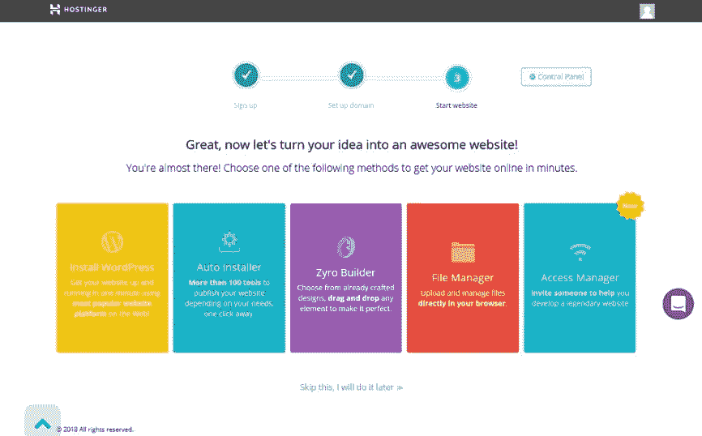
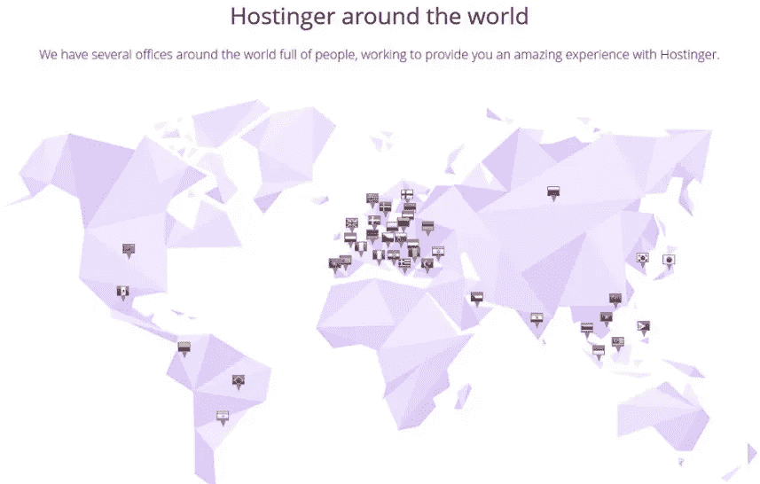

# 共享主机和 VPS 主机的 6 个主要区别

> 原文：<https://medium.com/hackernoon/6-key-differences-between-shared-and-vps-hosting-821c1d557239>

当你考虑一种类型的主机服务时，你需要决定的两个流行选项是 VPS 或共享主机。VPS 与家庭数据计划非常相似，在家庭数据计划中，责任平等地属于每个成员。VPS [托管类似于个人计划](https://hackernoon.com/4-most-important-web-hosting-trends-this-year-bfae1257e00c),虽然费用不分摊，但您可以更好地控制数据的使用。

理解 VPS 和共享主机的区别的最简单的方法是，共享主机是指你的网站和其他网站共享同一个服务器。你所使用的托管服务类型取决于许多标准，如性能要求、成本、运营规模等等。你需要根据你网站的需求来决定哪个服务器适合你。

如果你打算通过由共享主机支持的[云计算](https://hackernoon.com/drop-your-hosting-provider-with-cloudflare-warp-ba704bbd8f09)将你的业务带到成功的高度，Hostinger 是你完美的合作伙伴。该公司有一个专门的专家团队，在您前进的每一步都会陪伴您。当 Hostinger 处理服务器正常运行时间和监控的所有细节时，您可以专注于充分利用您的项目。Hostinger 以其服务为傲，如果您对该公司的虚拟主机服务不满意，您将在购买后三十天内获得退款。

通过高效的企业托管服务，该公司实现了你从卑微的起点发展壮大的梦想。任何在线业务的目标都是[将访问者](https://hackernoon.com/how-to-increase-conversion-rate-for-free-38b392bf97b7)转化为忠诚的客户，Hostinger 在这里将这一意图变为现实。

# 以下是虚拟主机和共享主机之间的六个关键区别:

# 1.服务器资源

共享 [**业务托管**](https://www.hostinger.com/business-hosting) 指的是服务器资源的共享，而不是专用托管，在专用托管中，用户接收特定于其站点需求的服务器。VPS 介于专用服务器和共享服务器之间。在 VPS 中，有许多相同的服务器充当专用硬件单元。由于网站是由网站管理员使用控制面板来管理的，所以尽管有共享服务器，你还是可以很好地定制网站的共享主机。

# 2.表演

就托管服务器而言，更高的资源转化为更高的性能。由于提供给用户的带宽，VPS 提供了更好的整体性能。在共享主机中实现的技术越好，你从中获得的性能就越多。由于现在共享主机公司使用最新的技术来确保无障碍的可用性，性能不再是一个问题。此外，共享主机比 VPN 更容易维护。

# 3.安全性

VPN 包含强大的安全功能，它还使用户能够实现某些服务，以升级到更好的安全选项。共享主机也被认为是非常安全的，但唯一的问题是它使用一个共同的服务器。如果任何一个用户犯了一个错误或者有一些技术上的困难，最终会影响到其他用户。话虽如此，但在对客户保护所涉及的财务资源和专业知识进行彻底调查后，你可以安全地继续进行共享托管。

# 4.价格

说到可负担性，共享主机作为最经济的选择之一遥遥领先。由于您共享服务器，成本明显下降，就像家庭数据计划。而在 VPN 中，你需要为个人数据计划等个性化服务支付更多费用。如果你想要一个性价比高、功能好的选择，共享主机是你通过 VPN 服务器的方式。

# 5.服务器管理

在共享主机中，共享主机有责任为用户处理硬件。在 VPN 中，你有责任管理硬件。你需要雇佣一个主机来监控自然由共享主机服务控制的方面。当用户使用共享主机时，他不需要做任何技术维护。您可以获得所有基本的管理功能，而无需增加成本或花费额外的时间。

# 6.可量测性

可伸缩性因素是共享主机和 VPN 的主要区别之一。在共享主机中，或存储能力不能达到极限，服务器空间不能超过用户需求。这是因为在这种情况下，您将开始从主机获得内部错误。另一方面，VPN 可以处理任何数量的流量。在作出决定之前，你需要考虑你的网站的规模，因为可扩展性伴随着更高的成本和维护需求。