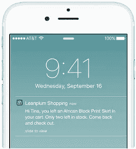
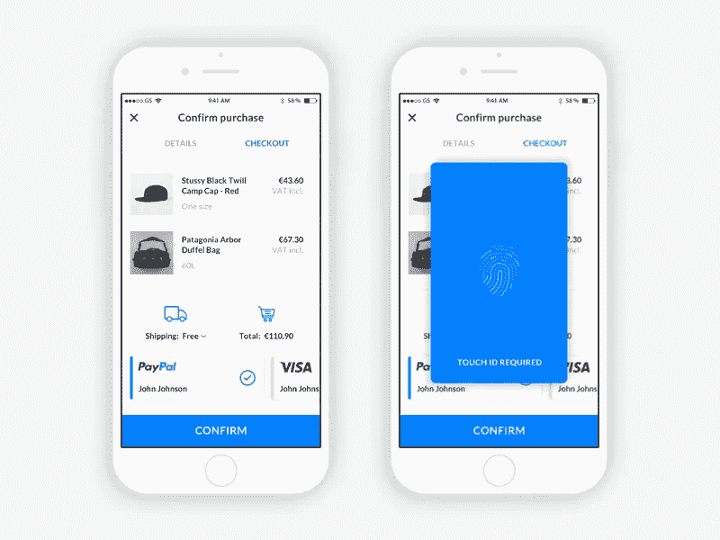

# 你的电子商务应用需要具备的 6 个黑仔特性

> 原文：<https://medium.com/hackernoon/6-killer-features-your-ecommerce-app-needs-to-have-fb85019a9f91>

电子商务应用程序是在线零售商的强大工具，可以为用户提供更有针对性的优惠、直观的界面和更简化的整体体验。但是如果你要有一个电子商务应用，你需要做好它。

提供一个用户体验很差的应用程序，会赶走那些对你的公司有足够兴趣来下载你的应用程序的人，从而主动失去你的客户——这听起来真的不是一个好主意，不是吗？

因此，如果你要有一个电子商务应用程序，你最好确保它符合标准。以下是你必须通过应用程序提供的 6 个杀手级功能:

# 1.方便的访问

一旦用户成功购买，他们的手机可能会记住商店的详细信息，这意味着他们不必再担心它了——但第一次绝对是至关重要的。让整个过程变得尴尬，你就会把人们成群结队地赶走。请记住，大多数用户不会打开你的应用程序，因为他们想要建立长期的业务关系；他们只是想买些东西然后离开。

因此，您的应用程序应该尽可能少地请求信息来开始。提供登录选项，但不要求它。让客人浏览你的商店并把东西添加到他们的购物篮中，然后要么让他们选择在结账过程中创建一个帐户，要么找到最便捷的方式来请求他们的基本信息(允许用户通过他们的谷歌、脸书或 Twitter 帐户登录是一个很好的方法)。

# 2.推送通知

[推送通知](https://www.urbanairship.com/push-notifications-explained)是一条从你的应用程序发送到移动操作系统的消息，并在顶层传递给用户(而不是只存在于应用程序内部)。如果过度使用，[推送通知可能会很烦人](http://blog.inapptics.com/push-notification-best-practices/)，但如果小心使用，当人们不直接与你的应用程序交互时，它们非常有价值。

[Image source](https://rubygarage.org/blog/benefits-of-mobile-app-for-ecommerce)

配置推送通知，以充分利用对错过(FOMO)的恐惧，通过提及定时独家新闻、有限库存商品、热门购买以及任何其他可以激励用户停止他们正在做的事情并采取相关行动的信息。FOMO 是一个巨大的电子商务推动者，因为当我们通过移动设备全天候访问互联网时，我们讨厌感觉自己错过了机会。

# 3.书签

有时你在浏览网页时，看到一个你感兴趣但不想马上看的页面，所以你把它标上书签或收藏起来，让你以后再回到这个页面。能够标记值得重游的东西是一个重要但经常被忽视的电子商务选项，尤其是考虑到用户的观点或决心可以改变得多快。

想象一下，一个用户完成了你销售漏斗的 95%,却意识到他们不太确定他们将要购买的产品是否是他们想要的。也许颜色的选择让他们犹豫了，他们想先检查他们的银行余额，或者他们想从他们知道他们正在做一个好选择的人那里得到一些保证。不管怎样，他们不情愿地取消了订单，离开了。

有了书签选项，如果他们认为这可能是他们想要的东西，他们可以马上标记产品，然后在以后的日子里充分考虑前景。您还可以将此信息绑定到推送通知系统，以便在书签产品库存有限或暂时打折时通知人们，从而激励他们采取行动。

# 4.快速结账

在 2018 年，没有人愿意拿出他们的信用卡或借记卡，手动将他们的所有详细信息输入到狭窄的移动收银台。消费者太习惯于支付便利，不愿处理这种烦恼，所以你必须在你的电子商务应用程序中实现快速支付——越快越好。

[Image source](https://dribbble.com/shots/3574262-eCommerce-App-Checkout-Fingerprint-Screen)

至少，你应该支持 PayPal、Apple Pay、Google Pay 和所有其他主要支付网关。此外，您应该允许用户存储付款和送货地址信息，这样他们只需要设置一次他们的地址细节(并提供一个快速地址查找器，以避免他们第一次必须自己添加所有细节)。

# 5.社交证明选项

[社交证明对电子商务购物有着惊人的影响力](https://www.referralcandy.com/blog/social-proof-examples/)，不仅因为它很容易实现，还因为用户没有机会亲自查看、触摸和试用产品。他们所能看到的只是产品列表，他们必须相信这些信息是准确的。表明其他人已经购买了产品并对其感到满意将极大地打消他们的疑虑。

让用户尽可能快捷方便地在你的商店中看到评论，并在购买后留下他们自己的评论。你还应该寻求对你的应用程序本身的评论，因为下载它的人越多，你的商店就越有曝光率。永远不要试图隐藏负面评论:用户不会相信一大堆热情洋溢的评论。

# 6.全面分析

对于任何类型的在线访问，分析选项都很广泛，但应用程序可以通过触摸热图提供更多信息。这就是为什么您需要安装一个全面的分析解决方案来收集尽可能多的数据，并找出改进的机会。

然后你可以看到人们使用哪些功能，哪些功能被忽略了，什么产品最受欢迎，人们何时购买，等等。手动收集这些数据会很有用，但你可以通过配置一个功能齐全的移动应用分析平台**来整理重要数据，并使其易于得出有意义的结论，从而充分利用这些数据。**

# **更新或重启**

**如果你想创建一个电子商务应用程序，确保至少包含这些功能，因为如果你不这样做，你真的会失去。如果你已经有了一个电子商务应用程序，但它的性能并不像你希望的那样，考虑一下你想如何继续:你的选择是继续使用现有的应用程序或重新开始，哪个是你的最佳选择将取决于你可用的开发资源。**

**请记住，正如电子商务商店被 Shopify(其[廉价零售网站创建者](https://www.shopify.com/online-store)是未来的标志)这样的公司高度标准化一样，自动化应用程序开发越来越可行——只要看看 Plobal Apps 或 WooCommerce 的 [Mobikul](https://store.webkul.com/woocommerce-mobile-app.html) 就知道了。如果重新开始会更便宜的话，不要花太多钱去更新一个不合适的应用。**

**你计划中的或当前的电子商务应用如何超越竞争对手？移动应用程序购买是当今电子商务世界的一个巨大组成部分，所以不要低估一个杀手级应用程序对商业的作用。投资于移动优先的方法，您将在以后获得收益。**

****关于作者:****

****Patrick Foster** 是来自 Ecommerce Tips 的作家和电子商务专家，Ecommerce Tips 是一个行业领先的电子商务博客，分享该领域的最新见解，涵盖从业务增长技巧到产品开发的所有内容。查看 Twitter @ my commerce tips 上的最新帖子。**

**如果你喜欢这篇文章，请随意点击那个按钮👏帮助其他人找到它。**

**跟随 Inapptics: [媒体](/@inapptics) | [推特](https://twitter.com/inapptics) | [脸书](https://www.facebook.com/inapptics/)**

***原载于 2018 年 6 月 29 日*[*blog.inapptics.com*](http://blog.inapptics.com/killer-features-ecommerce-app-needs/)*。***

****阅读下文:****

** [## 移动热图:可视化用户行为的最佳工具之一

### 了解什么是热图，以及它如何帮助您分析移动应用程序或网站中的用户行为。

uxplanet.org](https://uxplanet.org/mobile-heatmap-one-of-the-best-tools-to-visualize-user-behavior-f0c056d4c196)  [## 停止骚扰你的应用程序用户:4 个推送通知最佳实践

### 让我们探讨一下推送通知的最佳实践，以提高用户参与度。

uxplanet.org](https://uxplanet.org/stop-annoying-your-app-users-4-push-notification-best-practices-36c23e77e479)  [## 使用内容营销拓展移动应用的 5 个强大技巧

### 内容营销是推广移动应用的一个好方法。如果做得好，它可以为你提供长期的好处。

uxplanet.org](https://uxplanet.org/5-powerful-tips-to-grow-your-mobile-app-using-content-marketing-739c5c8ce928)**