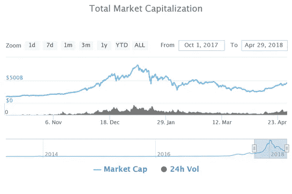

# 6 个月加密摘要

> 原文：<https://medium.com/hackernoon/6-months-crypto-recap-and-some-trading-secrets-f34ca6a84d3>

本文不是投资、购买或交易加密货币的直接建议。这是一个非常危险的市场，最好等到监管最终确定后再投入自己的资金。

在过去的六个月里，密码市场经历了很多。在这里，我将向您概述这 6 个月的情况，以及市场目前的状况。正如投资者所说，加密热潮始于去年年中。

然而，加密货币总市值的真正增长始于 2017 年 10 月下旬。那时，加密令牌的市值约为 1500 亿美元。到 10 月底，已经达到 1780 亿美元。大约 280 亿英镑的惊人增长标志着人们对加密货币的兴趣越来越大。

快进到 2017 年 12 月 21 日，加密令牌的市值达到 6400 亿美元。这为几个月前还相对不为人知的市场开创了新的先例。投资者从世界各地涌入，享受市场的高回报。

市场并没有就此止步，加密市场在 2018 年 1 月 7 日达到了 8300 亿美元的历史新高。这表明在近 3 个月内市场增长超过 400%。快速增长的部分原因是[即将到来的 ico](https://cryptopotato.com/ico-list)数量的增加。这种增长是一种新现象，世界以前从未经历过。人们在短短 3 个月内就从这种迅猛的增长中成为百万富翁。

这种增长在某种程度上是由害怕错失良机的业余投资者传播的(FOMO)。然而，这种增长是由于投资者意识到存在一个替代的、更有成效的投资市场。

市场经历了严重的调整，随着最初的兴趣热潮过去，市值损失了大量价值。然而，展望 4 月份的趋势，可以看到加密市场再次加快步伐，市值从 4 月 1 日的 2440 亿美元增加到 4 月 29 日的 4390 亿美元。

下图代表了之前关于全球加密市场资本化的讨论。市场的变化是显而易见的，可以看出，市场正在收回过去 3 个月损失的大部分资本。

密码市场的波动性为投资者提供了长期和短期的机会。著名投资者、IT 人员和商人已经在加密市场和比特币上下了赌注。

科技巨头约翰·迈克菲(John McAfee)是著名的迈克菲杀毒软件的所有者，他在 2017 年 7 月打赌比特币将在三年内达到 50 万美元的价格。他对自己的预测如此确信，以至于他发誓说，如果他输了，他会在全国电视上吃一些相当恶心的东西。

迈克菲并不是唯一一个押注比特币的人，许多其他知名人士也一直在押注比特币。作为普通的交易者，做你自己的研究，跟着感觉走。短期和长期都有买入和做空的机会。

让我们来讨论一些交易技巧，它们可能有助于进行更有利可图的交易，或者至少将损失降到最低。请注意，加密交易，就像交易股票一样，不适合胆小的人。你需要学习，获取知识，最重要的是，在交易加密资产时要有耐心。不是所有的交易都会成功。当你是交易者时，等式很简单——得比失多。

# 订单簿的使用

我相信交易者拥有的最重要的工具是他们的[订单簿](https://www.investopedia.com/terms/o/order-book.asp)，他们可以用它来下单购买他们的加密资产。给定资产的价值是根据其以前成功的交易或其供求来计算的。该信息被提供给订单簿中的交易者。

重要的是要正确地分析图表，以了解支撑和阻力区域在哪里(供给和需求)。交易者应该首先确定这些区域在哪里，并在设置止损和卖出水平之前进行分析。如果某笔交易的支撑位被打破，那么是时候止损结束交易了。

为了设置卖出水平以获取利润，我们需要分析订单簿以确定阻力区域，这里存在大量的卖出指令。为了确保有利可图的交易，我们需要比别人领先一步，在这面阻力墙下设置卖出订单。我们这样做是为了，如果需求侵蚀了供应墙，那么我们的命令已经就位，并将执行。

下一步是确定止损的位置。我们从订单簿中确定支撑点，很可能围绕这些支撑点有大量的买入订单。这就是止损应该设置的位置，理想情况下，止损应该设置在比买单低一点的位置。因为购买订单可能会耗尽供应，价格可能会再次上涨。这将作为命令的一种保护级别。

# 分析图表

交易者可以分析价格图表来识别资产的潜在变动。分析资产相对于美元或比特币的价格将有助于你确定走势的方向。这是一个有效的工具，交易者可以用来检查替代硬币的运动。

# 交易和情绪

交易者的黄金法则是在交易时不要带情绪。许多人失去了他们的资本，只是因为他们不能让交易者摆脱失去资金的恐惧。带入情绪会降低交易的理性，这个规则尤其适用于短线交易者。

为了更好地理解这一点，假设有一种情况，即加密资产可能在 3 天内损失 30%的价值。一个有正确研究的理性交易者会认为这是一个购买资产的机会，以获得即将到来的利润。然而，一个情绪化的交易者不会执行买入指令，因为害怕遭受损失。

从交易中剔除情绪的一个好策略是，你应该一直遵循计划。在你的交易达到第一个目标后，你应该卖出一半的仓位，增加止损到你最初的交易仓位。这意味着你在交易中没有损失，你还赚了钱。然后当价格触及第二个目标时，再卖出总交易的四分之一，以此类推。这样一个系统化的过程减少了遭受损失的机会，你只是在玩弄你的利润。

# 考虑你昂贵的研究时间

与传统的股票市场不同，在加密的世界里，情况瞬息万变。所以，如果你想做日内交易，你必须时刻关注市场。你必须每小时跟踪新闻和资产，以了解它们的价格变动。不是每个人都可以投入这么多时间，你必须评估你的时间表，决定你可以投入多少时间。

你的计划没有必要要求你每天定期交易，有时候做长线投资者比做日常交易者更有成效。加密市场的另一个好处是，你不需要大量的资本来投资。

这就是为什么你可以在更便宜的交易中尝试你的方法和策略，并在做更大的交易前测试它们是否有效。试错法是检查你的交易策略和保护自己免受重大损失的最好方法。

# 使不同

不管你是在处理传统市场还是秘密市场，有一条规则是不变的。也就是说，多样化非常重要，尤其是当你考虑到加密市场的波动性时。正如我们前面提到的，加密资产的总市值在 6 个月内从 1000 亿美元增长到 8000 亿美元，然后回落到 3000 亿美元。

因此，分散投资不仅可以帮助你提高利润，还可以减少损失。万一市场决定崩盘，它可能会让你免受全部损失。比特币+替代币的良好组合，如 Ripple，可能会帮助你将投资组合从全面亏损中拯救出来。

# 结论

这就是我们这次为你提供的所有提示，如果你想了解更多关于交易 altcoin 的信息，那么你可以查看这篇关于 alt coin 交易提示的[文章。本文进一步讨论了在交易加密货币时应该采用的一些策略。最后，我个人认为一个好的交易者最重要的品质是常识。](https://cryptopotato.com/8-must-read-tips-trading-bitcoin-altcoins/)

如果你很聪明，理性地思考你的交易，那么我相信你会站在市场安全的一边。睁大眼睛，竖起耳朵，永远不要停止学习。引用科林·鲍威尔的话，“*成功没有秘诀。它是准备、努力和从失败中学习的结果。”*