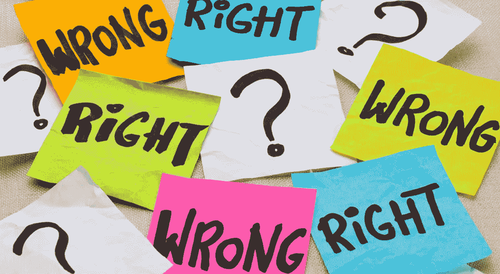

# 关于“道德”开源许可的 6 个神话

> 原文：<https://medium.com/hackernoon/6-myths-about-ethical-open-source-licenses-3bfbd042b1dc>

上周我们发布了 [Just World License](https://github.com/raisely/jwl) (JWL)，我们的道德开源许可证，并解释了[为什么需要它](https://hackernoon.com/why-we-need-an-open-source-licence-that-considers-the-misuse-of-our-code-8d19b65d425)。

每当在开源社区中提出伦理许可的想法时，总会遇到一些反对意见。在思考这些问题时，有必要思考一下 GPL (GNU 公共许可证)的早期以及在 GPL 早期提出的与伦理许可证有关的问题的相似之处。

GPL 也植根于一种强烈的意识形态观点(软件应该是免费的，就像在演讲中一样)，这也是开源软件存在并被广泛接受的一个重要原因。但是当它第一次出现的时候，这是一个非常新的和奇怪的关于软件许可的想法，并且遇到了很多阻力。

现在，让我们打破一些神话:

**1。执行不是重点**

大多数反对伦理许可的理由是这种许可是不可执行的，但是，像大多数法律文件一样，在法庭上执行并不是主要目的。试图在法庭上强制执行任何事情都是昂贵而痛苦的，也是大多数人希望避免的。

如果一家大公司不顾你的许可限制想要使用你的软件，他们可能有资源让你陷入法律文书工作中。

这与 GPL 没有什么不同。

GPL 的编写并不是为了让开发者可以将滥用开源代码的大公司告上法庭。是的，它的结构在法律上是明确的，并且有可能强制执行，但这不是作者的意图。他们创造了 GPL 来传播一种思想——软件及其源代码应该自由共享的思想。

道德许可证的目的是一样的:传播软件应该用来改善世界的理念，作为开发者，我们可以对如何使用我们的代码负责。

**2。伦理上的*可以定义*吗**

世界并不像我们经常被引导去相信的那样灰暗。

JWL 防止人们使用正版软件(除其他外)让我们的孩子生活在一个比我们发现的更糟糕的环境中，剥削奴隶劳动，宣扬种族主义，或黑客行为心理学，让人们浪费生命点击广告。

这些不完全是[手推车的问题](https://www.youtube.com/watch?v=-N_RZJUAQY4)。

**3。什么是道德的是主观的**

没错，但这有什么错呢？

你听说过一个成功商人的故事吗？他大脑中处理情感的部分受到了损伤。他无法发挥作用，他的事业也一落千丈——没有了他头脑中的情感部分，他无法辨别什么是重要的，也无法权衡不同行动的可能结果。

一旦我们从主观上确立了什么对我们来说是重要的，那么*就有可能对这些事情进行理性的伦理论证。例如，你可能会借鉴[康德伦理学](https://en.wikipedia.org/wiki/Kantian_ethics)(不要做你不希望社会上其他人做的事情)，或者[功利主义](https://en.wikipedia.org/wiki/Utilitarianism)(做能给大多数人带来最大幸福的事情)。*

我们现在已经很好地研究了科学，气候变化是由燃烧化石燃料引起的，几乎肯定会导致数百万人流离失所、受到伤害和死亡。从事故意造成这种痛苦的活动是正确的吗？从康德的观点来看，这是不道德的。也很难说这样的未来会给大多数人带来最多的幸福，所以它也没有通过功利主义的测试。

所以现在我们有了一个框架，我们可以用它来决定哪些不道德的行为要从道德许可证中排除。

**4。伦理许可证*是*可执行的**

IBM 是这么认为的。

JSLint 的故事被认为是道德许可证有多愚蠢的典型代表。该图书馆的许可证包括“软件应用于好的方面，而不是坏的方面”这一条款，该条款被认为是毫无意义和不可执行的，因为它是如此的模糊。然而，IBM 非常害怕法律纠纷的可能性，所以他们请求 JSLint 作者明确允许他们使用 JSLint 做坏事。

对于大多数公司来说，害怕被发现或被揭发以及强制执行的*可能性*就足够了，即使是那些做坏事的公司，决定不值得冒这个险，去寻找其他代码。

(这就是为什么写一份非常具体和清晰的道德许可证非常重要，这样好的演员就不必害怕强制执行)。

**5。我们的立法者不会来拯救我们**

一些反对者指出，任何不好的东西都是非法的，所以道德许可证是毫无意义的。

提示立法者询问马克·扎克伯格关于通过 WhatsApp 发送电子邮件的强制性视频。

我们喜欢称政治家为“领导者”，但他们实际上是追随者。在应对道德挑战方面，我们的立法者是行动最慢的，更不用说技术了。我的意思是，现在是 2018 年，我们的货架上仍然有由[真正的奴隶](http://slaveryfootprint.org/)制造的产品。

再说一遍，这就是我们使用许可证的原因——向社会的其他领域传播关于什么应该被社会接受的思想，直到它变得足够正常而被立法。

**6。我必须检查哪些许可证可以/不可以用于我的工作**

嗯，这就是重点。

如果一家公司打算使用信息时代最强大的工具之一来造成社会危害，那么道德许可证就意味着不方便，并会拖累他们的生产力。

有些自由和开放源码软件许可证也是如此。今天一些公司正在使用像[许可证检查器](https://www.npmjs.com/package/license-checker)这样的工具来避免 GPL 代码，因为他们不想被迫分享他们的改进。

GPL 的支持者可能会说，这是你做他们认为是反社会行为的代价。伦理许可证也一样。

如果你同意反社会行为是有代价的，那么实际上识别在一个从奴役或赌博中获益的公司中使用代码的社会危害方面要比拒绝重新分享你对开源代码库的修改容易得多。

所以，如果你考虑使用一个强制人们分享的许可证，为什么不考虑一个强制人们关心的许可证呢？除了损害我们所有人的公司的赞助，我们还有什么可失去的呢？

阅读一下《公正的世界许可证》( Just World License )( T7 ),让我们知道是否有其他关于伦理许可证的神话我们应该打破。