# 为非技术用户设计区块链应用的 6 个原则

> 原文：<https://medium.com/hackernoon/6-principles-for-designing-dapps-for-regular-people-from-a-consensus-18-hackathon-winner-134cdb881cc1>

## 使用 Consensus '18 hackathon 获奖 dApps 之一的案例研究

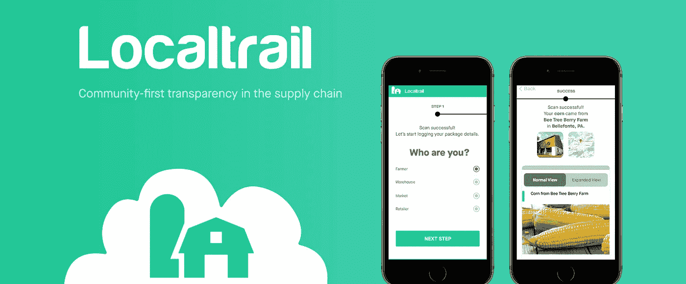

本月早些时候，在纽约举行的 2018 年 CoinDesk Consensus Hackathon 上，我的团队注册建立了一个供应链[区块链](https://hackernoon.com/tagged/blockchain)应用程序，以跟踪纽约从农场到餐馆的农产品。当我问现场的当地可持续发展工作者用户是谁时，她告诉我，一些需要使用该应用程序的农民是*“70 岁，不检查他们的电子邮件，不会使用当前的 Excel 电子表格系统”*。

我惊呆了。我们怎么能为一个 70 岁的农民开发一个区块链应用程序，他甚至连微软 Office 都不会用？

像这样的挑战只会越来越普遍，因为世界上至少 80%的人不知道区块链是什么。不幸的是，今天普通人使用的 [dApps](https://www.coindesk.com/information/what-is-a-decentralized-application-dapp/) (在区块链上有一些数据或逻辑的应用程序)有糟糕的用户体验。除了少数几家拥有数千万美元的机构支持和数十名支持人员之外，这些 dApps 包括设计不良的金字塔计划、赌场游戏、山寨游戏，当然还有以太养虾场。

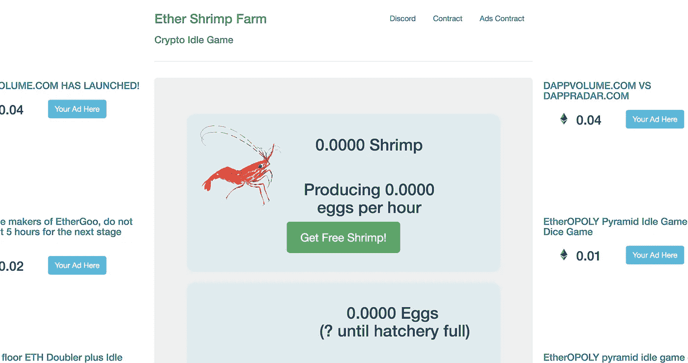

I didn’t handpick this dApp just to prove my point — according to dappradar.com, this is legitimately one of the most popular dApps today. Yikes.

我们的 dApp 在共识黑客马拉松中尝试了这一点，并为我们的解决方案赢得了部门第一名。**在本文中，我将分享为非技术用户设计 dApp 的 6 个关键原则，使用我们的 hackathon dApp 背后的流程作为案例研究。如果你对戴普斯、区块链、UX 或设计感兴趣，这篇文章是给你的。**

# 黑客马拉松上下文

在进入[设计](https://hackernoon.com/tagged/design)原则之前，我将在这里浏览一下我们项目的基础。

*   **挑战** —我们解决的 CoinDesk 挑战:

> 使用区块链技术，创建一个原型，使 GrowNYC 食品供应链具有可跟踪性和透明度，从农场到仓库，到零售店，再到消费者。

*   **团队** —我们的团队由 1 名前端开发人员(Rachel)、2 名后端开发人员(Saif、Piers)和一名跨两者并处理二维码识别(Paco)的开发人员组成。我是 UX 的设计师，也收集用户和数据模型需求。
*   **约束**——我们在周六中午左右开始黑客攻击，提交文件的截止日期是周日下午 1 点。因此，我们只有 24 小时来构思、设计和构建解决方案。
*   **技术** —我们用 React Native 构建了一个移动应用程序，让供应链的每个成员(农民、仓库工人等。)将用于输入和验证包裹数据。我们构建了 Hyperledger 运行时引擎，并使用 JavaScript 和 Hyperledger Composer 本地语言构建逻辑和数据模型。

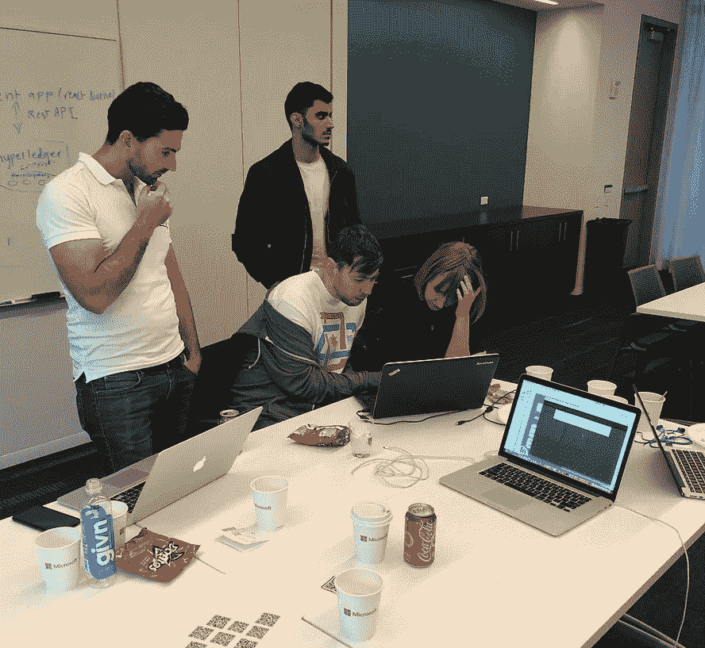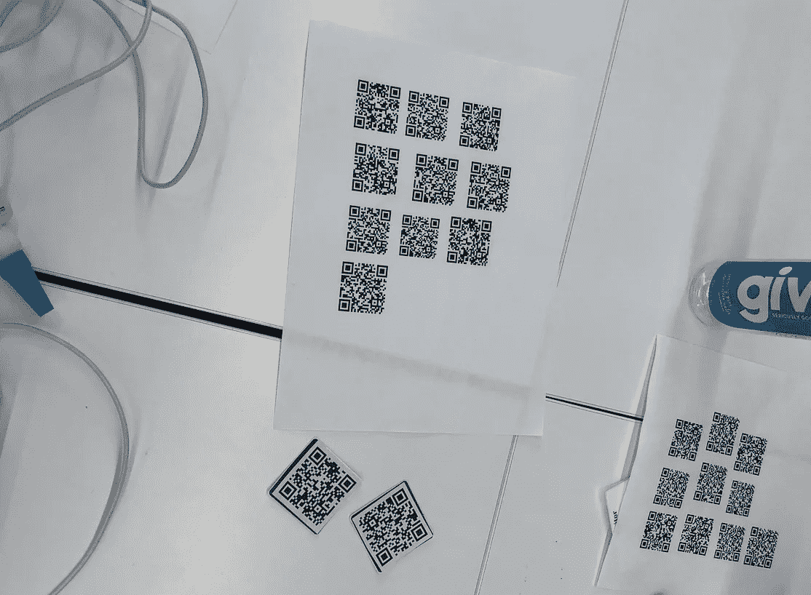

Hard at work deploying our local blockchain (left). Printing out and testing multiple QR codes (right).

# 1.使用用户角色将问题框在人的周围，而不是区块链

Excuse the handwriting…

根据我收集到的关于技术素养较低的用户的信息，我快速开发了需要使用该解决方案的用户角色。[用户角色](https://www.usability.gov/how-to-and-tools/methods/personas.html)并不意味着是真实的人，而是真实用户的人性化近似，以使他们的问题更加具体:

*   *温斯顿*，70 岁的农民**，**怀特**，**美国海军退伍军人，使用一部旧的安卓手机，需要他的孙子来管理他的电子邮件
*   29 岁的越南移民张(Truong)是一名仓库工人，也是三个孩子的父亲，他刚刚开始上夜校学习他有限的英语
*   20 岁的 Katrina 是纽约市立大学的学生，也是 Greenmarket 的实习生，她管理着一部分农贸市场，主修电影研究
*   克里斯托瓦尔，37 岁，墨西哥裔美国人，是当地一家餐馆的副厨师，负责在早上从当地市场购买当天的农产品
*   丹尼斯是一名 42 岁的兼职花匠，也是两个孩子的母亲，她带着家人在餐厅用餐，她是非洲裔美国人，刚刚从密西西比搬到纽约

这可能看起来有点松散，但是使这些假想的用户人性化的细节有助于你在开发过程的不同点上自我检查。

*天然气价格和 GWEI？一个 70 岁的农民会在乎这些吗？*

*解释哈希并显示完整时间戳？对于一个 42 岁的疲惫母亲来说，也许这是不必要的，她只想知道她的苹果派是从哪里来的。*

使用人物角色来确保你是在为你的终端用户而不是为你自己开发产品。

# **2。尽可能简化复杂的数据输入**

在建立了我们的角色之后，我们为我们的应用拼凑了用户旅程。下图解释了用户如何按时间顺序使用 Localtrail。一包食物从它生长的农场一直追踪到它被消费的零售点。

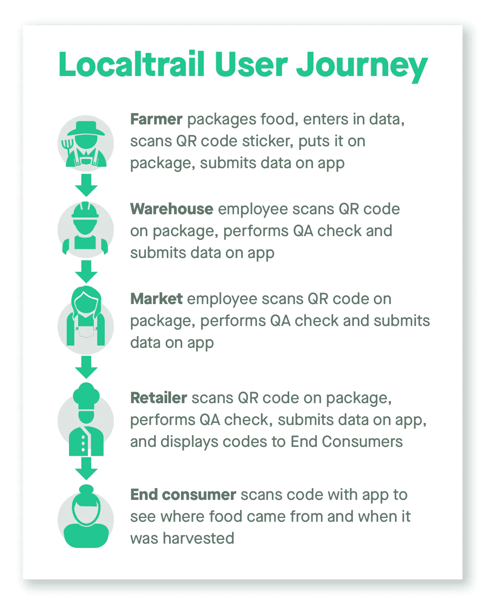

A walkthrough of how various stakeholders in the process use the Localtrail app for a given package

希克斯定律是一个简单的概念:摆在用户面前的选择越多，他们做决定的时间就越长。当我们的用户包括 70 岁的农民或压力过大的母亲时，降低数据输入和管理的复杂性对应用的生存至关重要。这适用于所有应用程序，但在处理区块链、**和**数据时，这些风险甚至更高**。这里有三个有用的策略:**

## **仅收集最少的可行数据**

在我们的数据模型中，我们倾向于简单而不是详细——对于每个包装，我们优先考虑尽可能少的数据点进行无信任验证，如食品类型、食品数量和数量指标。添加额外的必填字段通常会增加表单的废弃率，所以像购买信息这样的无关数据不需要放在区块链上。如果您使用的是公共区块链，并且受到 gas 的影响，那么严格控制哪些数据被推送到区块链就变得更加重要。

## 基于上下文设计流程

对于复杂的用户流，需要考虑以下几点:

1.  **设备:** [人们更喜欢更大的屏幕](http://www.scielo.org.co/scielo.php?script=sci_arttext&pid=S0012-73532015000500026)来处理复杂的任务和数据输入，但是考虑到移动代码扫描和数据输入的需要，我们被限制在移动设备上。[移动网站的跳出率是桌面的两倍，参与度是桌面的三分之一](https://www.appticles.com/blog/2016/03/mobile-vs-desktop-13-essential-user-behaviors/)，所以你需要努力保持他们的注意力。
2.  **数据类型:**如果你在问一系列是或否的问题，或者用户只需要选择一个答案，那么将这些问题一次可视化就很好了。但是当你混合自由形式的文本框、下拉菜单和日历弹出窗口时——打破流程，让用户易于管理。
3.  **每个包裹的数据字段数量 X 每天的包裹:**农民必须为每个包裹输入 7 个不同的数据点，当然。但是，由于一些农场运输的农产品数量，我们还不得不每天将这个数字增加几十倍。

## 展示明确的进度，让用户参与进来

你的大脑在完成一项任务后会产生多巴胺——用分数或等级来游戏化体验是让[用户再次光顾](https://blog.trello.com/the-psychology-of-checklists-why-setting-small-goals-motivates-us-to-accomplish-bigger-things)的经典策略，尤其是在处理像数据输入这样无聊的任务时。尤其是对于与区块链相关的数据，流程中的一个小挫折就可能导致用户离开，转而处理当天他们必须做的数百件其他事情中的一件。正因为如此，为用户提供像*“我在这个过程中走了多远？”这样的问题的可视化答案是至关重要的*和*“我说完了吗，还是还有更多？”*

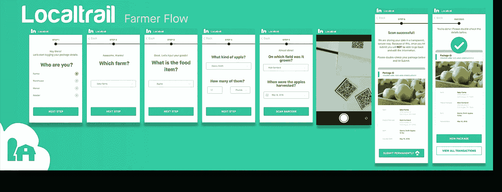

The farmer flow is broken up into smaller chunks, making a complex process very simple

**考虑到上述情况，我们选择了上面的流程，它有更多的步骤，每个步骤的复杂性更低。一个长长的滚动屏幕可能更节省时间，但我想象温斯顿在他农场的阳光直射下眯着眼看着他的屏幕，他的拇指在他的低端 Android 上滚动，敲击错误的表格字段。所以我们选择了一个方向，有许多简单的屏幕，一个接一个，只要求在区块链上发布最少的可行数据。**

我们还选择了一个可视化的时间线，向用户传达这个过程中有离散的步骤，在这个过程中，他们可以后退或继续前进。这里的一个灵感来自于 Intuit 的 TurboTax 应用程序，它可以很好地将不可能完成的复杂报税任务分割成许多小块。

# 3.尽可能地将区块链抽象化

这里有一个清单。不要帮农夫温斯顿干活，还有 2。可能会让他困惑到放弃这个应用的程度:

*   *他的区块链交易的散列，完整的字符串还是被截断的*
*   *他的参会地址*
*   *包含其交易的块 ID(如果在 mainnet 上)*
*   *etherscan . io 链接到正在挖掘其事务的块(如果这是在 mainnet 上)*
*   *知道他的交易数据存储在区块链上*
*   他的区块链供应商是 Hyperledger

坦率地说，对于农民或仓库工人来说，知道他们的交易被过账到区块链根本不重要。对于一个建立在中央服务器上的供应链应用程序，我们能解释一下服务器冗余或 AWS Lambda 在 farmer 流程中的细微差别吗？

收集“最小可行数据”的早期原则同样适用于显示数据的*——我们应该只显示特定问题空间和用户所需的最小区块链数据。区块链数据吓到了大多数人。这就是我们从农民流中删除数据的原因。*

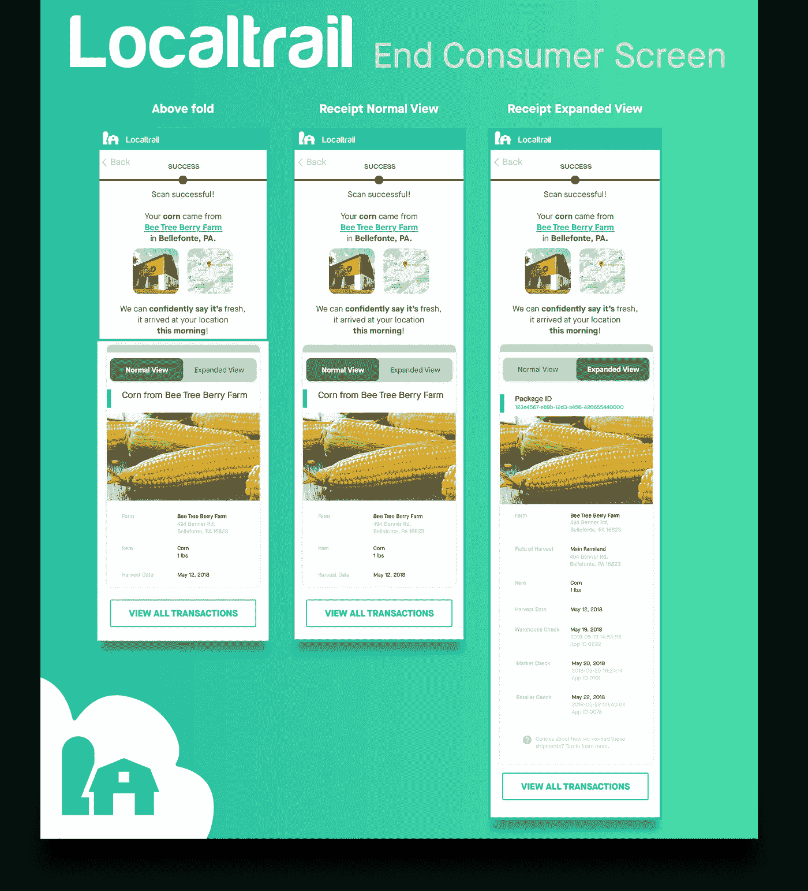

我们也可以将这一概念应用到终端消费者体验中，在餐馆等场所，人们通过扫描二维码来查看他们的食物来自哪里。以下是我对数据进行优先排序的方式:

*   **在折叠上方**——显示农场，它的位置，以及食物的新鲜程度(给定收获日期)。这可能是 85%的人——这些食客很忙，看到食物是新鲜的，来自真正的当地农场就足够了。
*   **收据的普通视图** —农场地址和确切收获日期等附加细节。极少数人，也许是 10%的消费者，可能属于这一类。部分出于无聊或好奇，他们会查看额外的数据，然后继续他们的生活。
*   **收据的扩展视图** —以前的信息加上实际的收获地(有时与农场本身不同)，QA 各个步骤的时间戳，以及一个工具提示，该提示解释了区块链是如何集成到产品中的。极少数狂热分子(也许 5%)会足够关心这包食物经历的详细旅程。

随着信息变得与用户越来越不相关，给消费者体验增加了更多的摩擦，我们重视他们的时间，但如果他们想这样做，我们会提供一个选项来查看更多信息。**我们并没有通过增加查看数据的难度来剥夺用户的控制权，而是尊重他们忙碌的生活。**

# 4.处理不可逆转的行为时要透明

当用户将要做出具有持久影响的永久决策时，清晰和透明需要融入到设计中。对于 Localtrail 来说，这些用户是否知道他们的交易被发布到区块链并不重要，但重要的是让他们知道**提交或验证包裹数据是不可逆的**。

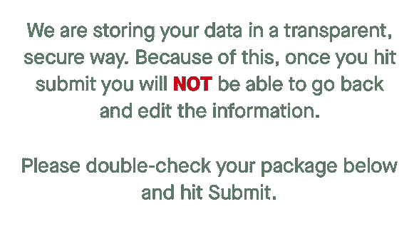

Convey security without conveying blockchain

为了让大家理解这一点，我们添加了一份精心制作的副本，强调提交数据是最终决定，一旦发布就不能编辑。我们将技术原因抽象为我们以“透明、安全的方式”存储他们的数据，并融入了 2018 年用户熟悉的锁和云这两个概念，以传达他们数据存储的不变性。

# 5.当用户的数据发布到区块链时，不要让他们停下来

对于农民来说，包数据是正在追加到区块链还是已经完成追加并不重要。流程中的每一步都需要正确类型的数据才能前进，我们的应用程序是建立在许可的区块链(无天然气)上的，因此提交的交易不可能失败。即使在公共区块链上，在提交交易后，你可以通过通知和小模式提供静默更新，而用户做其他事情。

Instead of a loading screen while the data is appended to the blockchain, we provide Winston immediate actions to take, designed with priority in mind

真正重要的是*清楚他们的下一步行动应该是什么*。大多数 dApps 缺乏用户可以继续前进的交易后保证，这对于不太懂技术的用户来说可能是可怕的。我们提供了一组按优先顺序排列的按钮:一个优先级较高的“新包”按钮(可能是农民的下一个动作)，和一个优先级较低的透明“查看所有交易”按钮。

我们设计这款应用是为了帮助温斯顿专注于他最重要的任务，而不是增加不必要的认知负荷。

# **6。将区块链从您的名字和品牌中移除**

我们选择 Localtrail 这个名字和口号*供应链中的社区优先透明*是有意的*。*大多数启用区块链的公司名称中都有 *block* 、 *chain* 、 *bit 或 eth* 字样。如果您的用户是开发人员或企业，这可能没问题，但对于普通消费者来说，最好专注于您正在解决的实际问题。

我们希望加强对用户及其当地社区问题的关注。即使在标志中，你也看不到任何链条或立方体——我们的是一个农场，社区供应链的起源**。** [吴佳](https://twitter.com/OhJia)向我展示了一个现有的供应链解决方案，[出处](https://www.provenance.org)——采用了类似的方法。

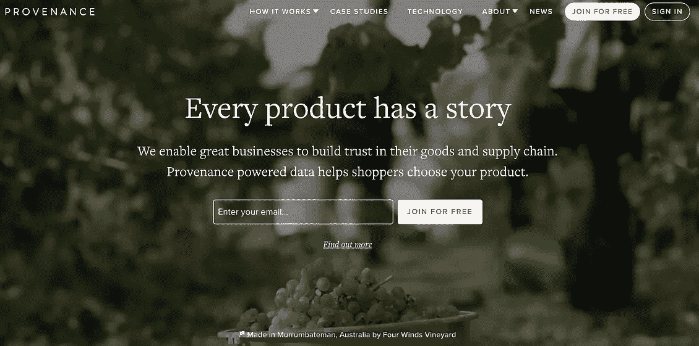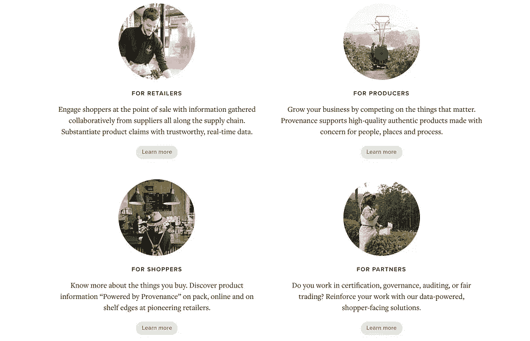

Provenance.org’s landing page — nary a mention of blockchain in sight!

在你点击“技术”之前，你不会在网站的任何地方看到提到区块链。他们的*“每件产品都有一个故事”*标语侧重于传达他们的使命和他们为客户提供的价值。应该这样做。

# 最后的想法

## dApps 仍然是应用，应用需要是可用的

在区块链社区中，简化用户体验的传统 UX 信条和给予用户完全控制权和透明度的去中心化精神之间存在明显的矛盾。在我看来，这种紧张不应该存在。

哈希和 Merkle 树证明可能会给银行或企业级数据存储中的 dApps 注入信心。但是，如果我们谈论面向消费者的 dApps，其中大多数甚至所有用户都不知道区块链是什么— *我们必须能够放弃尽可能积极地证明不信任的欲望*。如果只有 1%的用户理解数据的含义，那么所有这些数据对任何人都没有帮助。

最成功的创业公司坚持不懈地专注于[与他们的用户](http://startupclass.samaltman.com/courses/lec07/)联系和[制造人们想要的东西](https://www.youtube.com/watch?v=IhNnkPsdohY)。这不会因为一些代码或数据存在于区块链上而改变。只有我们提供出色的用户体验，我们才能实现区块链的主流采用。

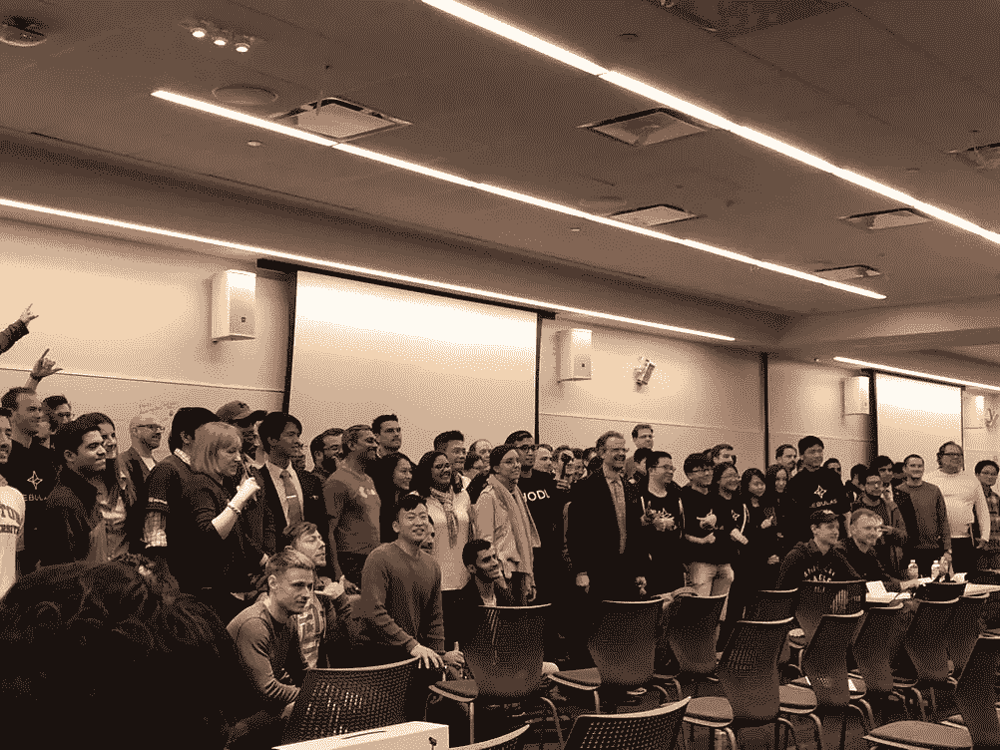

All of the Consensus 2018 hackathon participants (left). Our awesome team (right).

## 如果你喜欢我的想法，请鼓掌，留下评论，通过电子邮件(*kevin0kim@gmail.com*)或[推特](https://twitter.com/kevin0kim))联系我——我正努力变得更积极。我的下一篇文章将以这篇文章为基础，从用户体验的角度分析现有的流行 dApps。

*感谢* [*赛亚裙岩崎*](/@sayaiwasaki) *、萨拉索丁、* [*伊兰基德曼*](https://elankiderman.com/) *、* [*博仁*](https://twitter.com/Bosefina) *、维贾伊梅农、* [*查鲁詹吉德*](https://twitter.com/Levanche)*[*丹托运*](http://danshipper.com/) *感谢我的牛逼队友瑞秋，帕科，赛义夫，皮尔斯。感谢*[*Beltran*](https://medium.com/u/3d9d3a22b291?source=post_page-----134cdb881cc1--------------------------------)*和* [*萨拉·贝克米尔斯*](https://medium.com/u/411ecbe2a483?source=post_page-----134cdb881cc1--------------------------------) *用伟大的作品影响了我。**