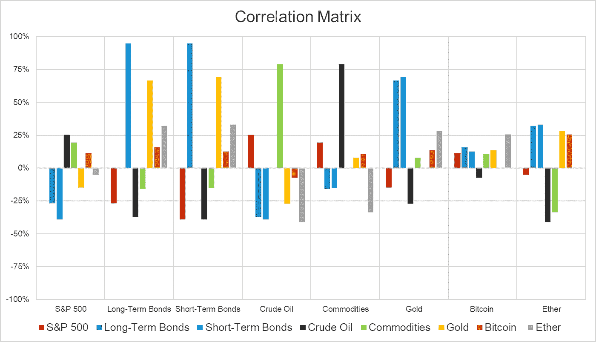
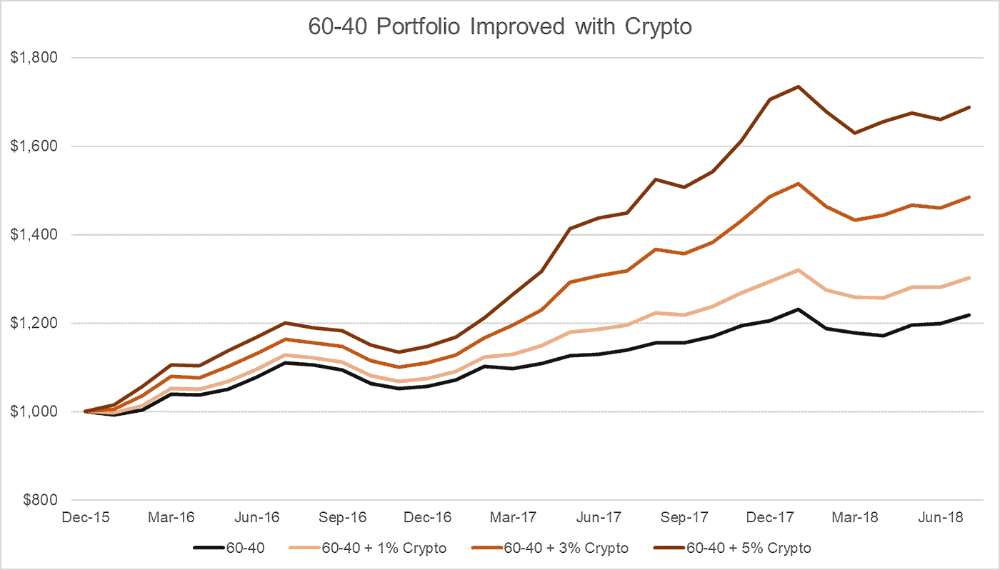
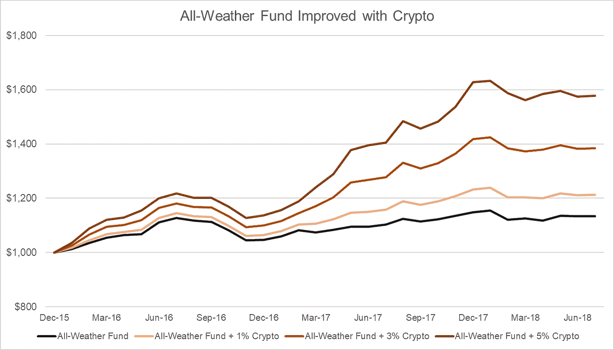
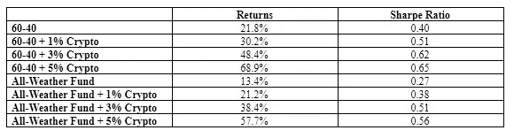
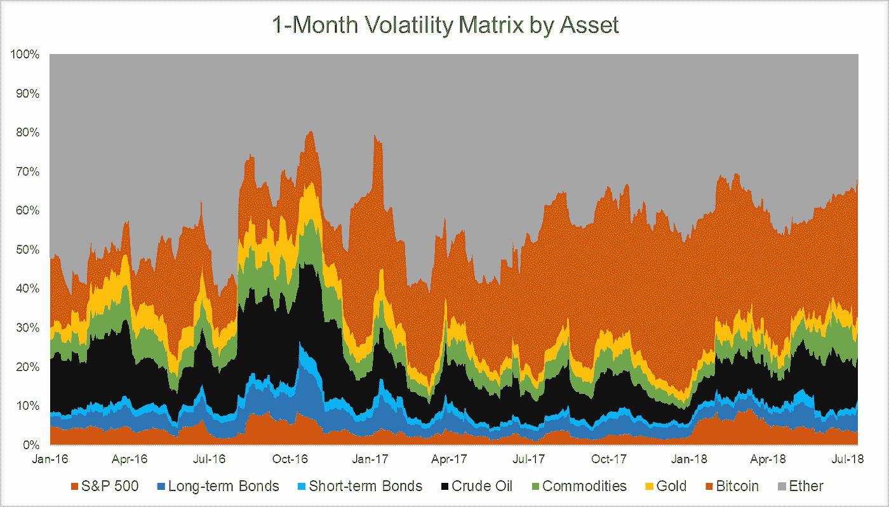
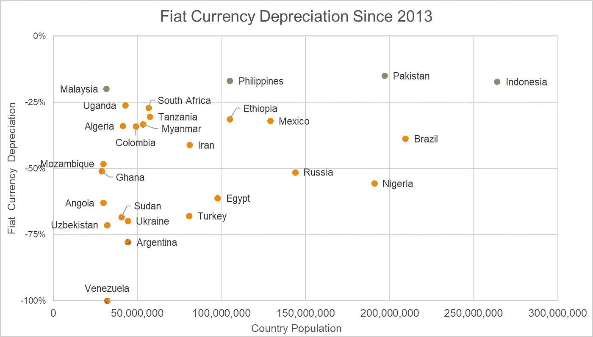
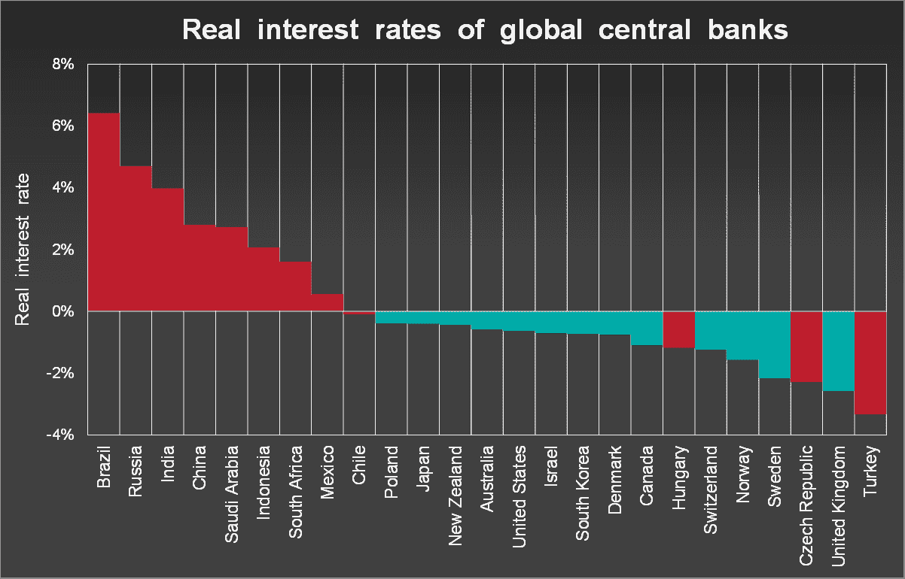
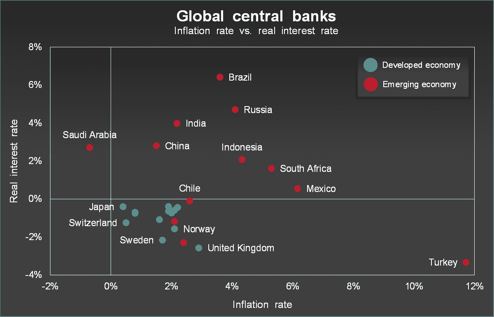

# 加密货币存在的 6 个原因

> 原文：<https://medium.com/hackernoon/6-reasons-why-crypto-is-here-to-stay-ec9bd62c096>

对于加密货币市场来说，这几周是艰难的几周，因为价格下降到了 2017 年秋季之前的水平，这个令人难忘的冬天是加密世界永远不会忘记的。目前，旁观者、投资者、HODL 人以及介于两者之间的所有人都在担心加密货币的未来。但是不要害怕！

加密货币绝对不会有任何发展，事实上，我们有充分的理由认为加密货币市场将是一项令人难以置信的长期投资。

以下是尽管市场最近有所下滑，但 crypto 前景光明的 6 个原因:

**1。非相关收益**

加密货币相对于传统资产的一个主要优势是，当与这些资产类别相关时，它具有明显的非相关回报。从下面的关联矩阵可以看出，与列出的其他资产类别相比，比特币和以太的关联率相对较低(接近 0%)。对于任何倾向于处理传统资产类别的投资者或交易者来说，这是一个非常有价值的特征。

**2。非常适合投资组合**

由于加密货币和其他资产类别的低相关性，加密是投资组合分配的理想选择，无论是资产管理公司、散户投资者还是交易商。这种低相关性使得传统资产类别的熊市不会对整体投资组合产生太大影响，因为加密货币在这些时期可以发挥更大的作用。一些最常见和最成功的投资组合可以从加入加密货币中受益匪浅。

如下图所示，60-40 投资组合(60%股票+ 40%债券)和雷伊·达里奥支持的全天候基金(30%股票+ 40%长期债券+ 15%短期债券+ 7.5%商品+ 7.5%黄金)通过使用加密货币获得了巨大的价值，即使它们只包含少量金额。

在下表中，您可以看到，通过在 60–40 岁和全天候投资组合中加入加密货币，随着更多的加密货币加入基金，回报会直接增加。此外，夏普比率以类似的方式增加。

【2016 年 1 月至 2018 年 8 月的回报率和夏普比率

**3。高波动性**

虽然那些缺乏经验或行动缓慢的人可能会将高波动性视为负面因素，但那些有投资和交易经验的人知道，如果利用高波动性，高波动性会为难以置信的回报敞开大门。它让拥有数据和技术的交易者能够在停滞甚至下跌的市场中交易，并从中获得可观的回报。

从下面的波动矩阵可以看出，比特币和以太是目前波动最大的资产。

**4。难以置信的创新潜力**

因为高波动性为潜在的巨额利润打开了大门，它也为大量创新打开了大门，以试图利用这一点。如果用户使用加密货币进行交易，任何加密货币交易工具或平台都可以为用户提供超额回报，特别是如果该工具使用人工智能和机器学习，那么它可能会取得巨大成功。

许多人一直密切关注的一个这样的项目是 RoninAi T1，这是一个即将推出的 SaaS 工具。他们似乎致力于抓住加密市场的波动性，通过分析 100 多个影响加密货币价格的因素，让他们的用户获得高额利润。

**5。独立于国家货币**

在我们生活的动荡的国际制裁世界中，法定货币一直在贬值的国家的大部分公民迫切需要一种可用的货币，这种货币与他们的政府在世界舞台上采取行动和避免制裁的能力无关。

最近，由于美国实施了一系列额外的制裁，土耳其里拉在一夜之间下跌了 20%。在此期间，土耳其加密货币交易所的使用量大幅飙升，因为土耳其公民认识到，将他们的里拉投入加密货币将有助于他们避免里拉即将下跌。

匿名性、易于转换为加密以及将资金转移到海外的能力相结合，使得加密货币成为任何国家公民非常有吸引力的替代选择和安全阀，尤其是下图中的那些人。

根据这一数据，全球约 30%的人口生活在过去 5 年经历了显著货币贬值的国家。由于中央银行在这些时期无法稳定其国家的货币，我们无疑会看到未来当特定国家的经济遭受损失时，人们会越来越依赖加密货币。

**6。其他投资机会继续失去吸引力**

目前，尤其是对散户投资者而言，全球经济并没有提供太多有吸引力的投资机会。正如彼得·博罗维赫(Peter Borovykh)在他的著作《金融中的区块链应用》(block chain Applications in Finance)中提到的那样，经通胀调整的全球利率对投资者非常没有吸引力。

大多数发达国家的债券经通货膨胀调整后的回报率为中性或负值，而发展中国家的政府债券回报率较高。这些发展中国家没有足够发达的资本市场来为外国散户投资者提供广泛的投资机会。这给许多投资者留下了一个疑问:

“我如何创造财富？”

加密货币无疑是这个问题的主要答案之一，这在很大程度上是因为它易于访问，以及上面提到的许多原因。展望未来，加密市场可能最近受到了一点打击，但相信它会继续沿着这条路走下去违背了上面列出的所有具体原因，这是一种我肯定会避开的恐惧。