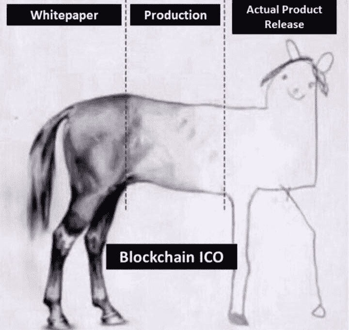

# 你的 ICO 不能筹集超过 300 万美元的 6 个理由

> 原文：<https://medium.com/hackernoon/6-reasons-why-your-ico-wont-raise-more-than-3m-acffd852d640>

我们都听说过公司如何筹集数百万甚至数十亿美元来建立下一个最热门公司的故事。与传统风险投资相比，许多传统科技公司都将 ico 视为为下一个扩张阶段筹集资金的替代选择。这是因为创始人不再需要放弃他们创业公司的股份来筹集资金，而且很容易筹集到运营公司所需的资金。

由于风险投资行业是受 ico 影响最大的行业，我们已经看到越来越多的风险投资和对冲基金开始建立自己的加密货币投资部门。

尽管自去年以来，ico 的数量和筹集的金额都有所增加([自今年年初至 4 月](https://www.coindesk.com/6-3-billion-2018-ico-funding-already-outpaced-2017/)筹集了 63 亿美元，相比之下[在 2017 年](https://cointelegraph.com/news/icos-raised-4-bln-in-2017-what-2018-has-in-store)筹集了 40 亿美元)，但许多公司发现他们不再能够在筹资过程中达到硬上限，甚至无法筹集足够的资金来达到项目软上限。这可能是因为几个原因，下面我会更多的解释这些原因。

## 1.不健全的表征组学

来源:Unsplash 上的思想目录

以太坊区块链上有超过 [700 枚代币，其中大部分](https://etherscan.io/tokens)[几乎一文不值。](https://cointelegraph.com/news/new-study-says-80-percent-of-icos-conducted-in-2017-were-scams)

代币组学是代币销售参与者考虑的一个重要因素。一般来说，投资者喜欢既有投机价值又有实用价值的项目。这种价值通常来自于构建一个应用程序或生态系统，它将利用令牌，否则现有的菲亚特或点系统无法做到这一点。

许多公司被轻松获得数百万现金的故事所吸引，完全忽视了他们的代币的效用，或者说他们的项目不需要存在于区块链。他们的代币没有价值，完全不做任何事情，或者不能解决现有系统不能解决的足够引人注目的问题——这对您的项目形成了一种威慑。

你的投资者是在寻找下一个“月亮”的人，除非你的项目能够实现这一点，否则他们不会放弃他们的钱。其中大部分来自潜在的投机价值，比如与大品牌的潜在或现有合作伙伴关系，这些大品牌也将在他们的平台上利用你的代币或项目，或者拥有合适的顾问和团队成员来建立一个成功的项目。

## 2.没人知道你的项目

资料来源:Unsplash 上的 Zachrie Friesen

营销在任何类型的业务中都是一个重要的方面，并且许多加密空间都被看似无限的营销预算所困扰。构建一个突出的项目在任何领域都是困难的，在加密领域更是如此。

在早期获得资金是非常困难的，尤其是当没有人认识你的时候。加密领域的大部分广告都是由有影响力的人做的，他们通常受到奖金的激励(通常是购买大额代币时的额外代币)，然后以资金池的形式重新营销给他们的团队。这些有影响力的人在投资了一笔可观的金额后，会从这些奖金中抽取一部分作为费用，并将其余部分分配到他们的资金池中。

影响者的早期采用是非常重要的，因为它会培养对项目的投资兴趣。由于他们自己的金钱和声誉受到威胁，他们更倾向于通过向他们的社区推销你或让其他有影响力的人和社区参与进来，来帮助你的项目成功筹集资金。

## 影响者的早期采用是非常重要的，因为它会培养对项目的投资兴趣。由于他们自己的金钱和声誉受到威胁，他们更倾向于通过向他们的社区推销你或让其他有影响力的人和社区参与进来，来帮助你的项目成功筹集资金。

## 3.你的团队/顾问糟透了

来源:Unsplash 上的 Charles Deluvio

任何团队的成功都是由项目背后的参与者决定的，没有一个足够有经验的团队，或者有一个声誉受损的队友可能会降低项目的合法性。区块链的大部分空间是非常年轻和新的，社区非常小，一个骗局项目的坏名声会持续很长时间。

## 4.没有产品

一年前，你可以就你的想法写一份白皮书，推出一个 ICO，投资者就会向你砸钱。如今，通过 ico 筹集资金变得越来越困难，因为投资者变得越来越精明，在决定投资一个项目之前会研究更多的细节。

ICO 通常会在最初网站的设计和制作上投入大量资金，以吸引投资者，并花数月时间来发布一款实际产品，或者干脆完全忽略该产品。

许多空间实际上没有一个工作产品，这是驱使投资者远离你的代币发行的关键问题之一。

## 5.悲观的市场状况

来源:Unsplash 上的 Mark Basarab

当市场状况不好时，投资者不太可能投资，因为他们会更加谨慎地保护自己的初始投资。许多筹集大量资金的 ico 都是在市场行情很好的情况下进行的，当市场大幅下滑时，它会影响不同 ico 的融资额，因为投资者可能会将过去 ico 的利润再投资到最近的 ico。

随着他们最近的 ico 在交易所的公开市场上表现不佳，用户根本没有资本再投资于其他项目。

## 6.您的硬上限太高或太低/无上限 ICOs

来源:Unsplash 上的 Kate Joie

投资者总是担心，如果你的 ICO 卖不出去，或者你的市值太高，投资者就会缺乏购买后 ICO 的需求。ICO 后需求来自未能参与您的 ICO 的投资者，或者已经在您的 ICO 期间购买并希望购买更多代币的投资者。这推动了市场需求，缺乏需求对任何 ICO 项目来说都是一个巨大的危险信号，因为有人必须从你的投资者那里购买代币。如果你的市值太高，或者如果你拥有一个无上限的 ICO(没有明显的硬上限——这些项目在 2017 年非常受欢迎，但我们最近没有看到很多，例如 Telegram 的 ICO)，投资者担心的是缺乏需求，因为每个想要你的令牌的人都已经有了你的令牌，并且这些令牌的供应远大于需求。

另一个问题是，你是否能筹集到足够的资金在可信的交易所上市。据最近报道，币安交易所上市的股票超过 500 万美元，而中国其他交易所的上市股票超过 6 位数。

## 结论

与去年相比，ICO 已经发展成为一个完全不同的领域。项目不再能够仅仅从一份简单的白皮书中获得天文数字，投资者对他们的投资更加谨慎和精明。监管机构正以 KYC/反洗钱框架的形式进行打压，甚至在中国直接禁止 ico。

当我们为 switch EO 进行 800 万美元的 ICO 时，很明显，区块链公司现在需要的不仅仅是大肆宣传，而是成功的代币销售。如今，Switcheo 是 NEO 和区块链以太坊的分散式交易所，拥有超过 25000 名用户。

ICO 景观的未来很大程度上取决于这些项目可能给现有的区块链生态系统带来什么，而不仅仅是下一个 10，000 shitcoins 的创造。随着投资者在这个领域受到的教育越来越多，推出 ico 的项目也应该考虑它们可能给这个领域带来的贡献，而不仅仅是作为一种融资工具。